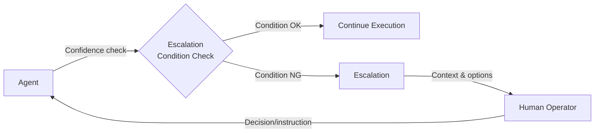

# #51 Agent-to-Human Escalation

!!! abstract "TL;DR"
    Provide a mechanism for the agent to hand off tasks to humans when it detects low confidence, insufficient permissions, or policy violations.

<!-- BEGIN:GEN:meta -->

Metadata (machine-readable) — #51 Agent-to-Human Escalation

| Field | Value |
|------|-----|
| **ID** | 51 |
| **Category** | 11-ux — UI/UX & Human Collaboration |
| **Forces** | `[F2]`, `[F4]` |
| **Dials** | — |
| **Tradeoffs** | — |
| **Related Patterns** | #31, #49, #57 |
| **When to Use** | Support/legal/medical domains, escalation is better than guessing when uncertain, expert judgment required |
| **When Not to Use** | Offline batch with no humans available; confidence always high (low complexity) |
| **Element Technologies** | Confidence score/self-assess, Slack/Teams/email notifications, structured context handoff, SLA response monitor |

<!-- END:GEN:meta -->

## Overview

A customer support agent was unsure about a refund policy decision but sent an incorrect response anyway, escalating into a customer dispute -- when the agent "doesn't know," handing off to a human is far safer than forcing an answer.

Agents cannot autonomously complete every task. Low confidence in judgment, lacking required permissions, policy-prohibited automatic execution -- continuing forcefully in these situations only amplifies errors. This pattern defines escalation conditions for the agent, and when conditions are met, hands off the task context, progress, and reasoning to a human.

!!! info "Position in decision-making"
    - **Driving force**: `[F2]` Failure Cost, `[F4]` Latency Budget
    - **Decision flow**: [Decision Flow](../../decisions/decision-flow.md)

## Design

Escalation conditions are defined as follows:

- **Confidence threshold**: Model output score or self-assessment falls below threshold
- **Insufficient permissions**: Required tool permissions are not bound to the session
- **Policy violation**: [#30 Policy-as-Code Guardrail](../06-reliability/30-policy-as-code-guardrail.md) blocks execution
- **Retry limit**: Failure count for the same step reaches the limit

At escalation, the task context, execution history, and the agent's candidate decisions with reasoning are passed to the human in structured form. The human either makes a decision and returns it to the agent, or takes over the task directly.

## Problems Solved

When an agent continues despite "not knowing," incorrect decisions accumulate as side effects `[F2]`. On the other hand, requiring human approval for everything stalls processing `[F4]`. By properly designing escalation conditions, you can balance the efficiency of autonomous execution with the safety of human judgment.

## When to Use / When Not to Use

- **When to Use**: Customer support, legal review, medical assistants, and other domains where misjudgment has significant impact and human final judgment is needed.
- **When Not to Use**: Fully autonomous batch processing where human intervention is unavailable. Asynchronous processing where escalation targets cannot respond in real-time (switch to queue-based approval flow in such cases).

## Element Technologies

- Confidence estimation: LLM self-assessment, calibrated probability estimation
- Notifications: Slack / Teams / email notifications, [#49 Agent Workbench](49-agent-workbench.md) approval panel
- Context handoff: Execution trace + structured handoff of candidate decisions
- SLA management: Response time monitoring after escalation, timeout fallback

## Tuning (Dials)

- **Escalation threshold (low vs. high)** — Too low sends nearly everything to humans, defeating the purpose of automation vs. too high increases misjudgments / Deciding factors `[F2]` `[F4]` / Guideline: Start low and gradually raise based on track record using [#57 Autonomy Ladder](../06-reliability/57-autonomy-ladder.md). → [Tuning Dials](../../decisions/tuning-dials.md)

## Related Patterns

- [#31 Human Approval Checkpoint](../06-reliability/31-human-approval-checkpoint.md) — Approval gate before high-risk operations (this pattern covers broader escalation conditions)
- [#49 Agent Workbench](49-agent-workbench.md) — Dashboard providing the escalation UI
- [#57 Autonomy Ladder](../06-reliability/57-autonomy-ladder.md) — Automatically adjust escalation thresholds based on track record

## References

- Human-in-the-loop patterns in general
