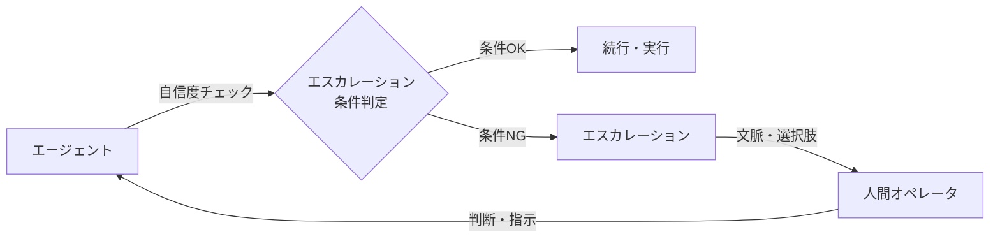

# #51 Agent-to-Human Escalation｜人間へのエスカレーション

!!! abstract "一言"
    エージェントが自信不足・権限不足・ポリシー違反を検知した場合に、タスクを人間に引き継ぐ仕組みを提供する。

<!-- BEGIN:GEN:meta -->

メタデータ（機械可読） — #51 Agent-to-Human Escalation｜人間へのエスカレーション

| 項目 | 値 |
|------|-----|
| **ID** | 51 |
| **カテゴリ** | 11-ux — UI/UX・人間協調 |
| **フォース** | `[F2]`, `[F4]` |
| **ダイヤル** | — |
| **二者択一** | — |
| **関連パターン** | #31, #49, #57 |
| **向き** | サポート/法務/医療ドメイン、不確実→エスカレーションが推測より良い、専門家判断が必要 |
| **不向き** | オフラインバッチで人間不在; 信頼度が常に高い（低複雑度） |
| **要素技術** | 信頼度スコア/self-assess, Slack/Teams/email通知, 構造化コンテキスト引継ぎ, SLA応答モニター |

<!-- END:GEN:meta -->

## 概要

カスタマーサポートのエージェントが、返金ポリシーの判断に迷ったまま誤った回答を送ってしまい、顧客とのトラブルに発展した――「分からない」ときに無理に答えるより、人間に引き継ぐほうがはるかに安全である。

エージェントがすべてのタスクを自律的に完了できるわけではない。判断の確信度が低い、必要な権限を持たない、ポリシーで自動実行が禁じられている――こうした状況で無理に続行すると、誤りが拡大してしまう。本パターンでは、エージェントにエスカレーション条件を定義し、条件に該当した場合にタスクの文脈・進捗・判断根拠を人間に引き継ぐ。

!!! info "意思決定上の位置づけ"
    - **必要にするフォース**: `[F2]` 失敗コスト・`[F4]` レイテンシ予算
    - **意思決定の進め方**: [意思決定の進め方](../../decisions/decision-flow.md)

## 設計

エスカレーション条件は以下のように定義する:

- **確信度閾値**: モデルの出力スコアやセルフアセスメントが閾値を下回る
- **権限不足**: 必要なツール権限がセッションにバインドされていない
- **ポリシー違反**: [#30 Policy-as-Code Guardrail](../06-reliability/30-policy-as-code-guardrail.md) が実行をブロック
- **再試行上限**: 同一ステップの失敗回数が上限に達した

エスカレーション時には、タスクの文脈・これまでの実行履歴・エージェントの判断候補と根拠を構造化して人間に渡す。人間は判断を下してエージェントに返すか、タスクを自ら引き取る。

## 解決する課題

エージェントが「分からない」まま続行すると、誤った判断が副作用として蓄積してしまう `[F2]`。一方で、すべてを人間承認にすると処理が滞る `[F4]`。エスカレーション条件を適切に設計することで、自律実行の効率と人間判断の安全性を両立できる。

## 向き / 不向き

- **向き**: カスタマーサポート、法務レビュー、医療アシスタントなど、誤判断の影響が大きく人間の最終判断が必要なドメイン。
- **不向き**: 完全自律バッチ処理で人間が介入できない環境。エスカレーション先の人間がリアルタイムに対応できない非同期処理（この場合はキュー型の承認フローに変更する）。

## 要素技術

- 確信度推定: LLMのセルフアセスメント、校正された確率推定
- 通知: Slack / Teams / メール通知、[#49 Agent Workbench](49-agent-workbench.md) の承認パネル
- 文脈引き継ぎ: 実行トレース + 判断候補の構造化ハンドオフ
- SLA管理: エスカレーション後の応答時間監視、タイムアウト時のフォールバック

## 調整（程度）

- **エスカレーション閾値（低 ↔ 高）** — 低すぎるとほぼ全件が人間に回り自動化の意味がなくなる ⇔ 高すぎると誤判断が増える / 決め手 `[F2]``[F4]` / 目安: 初期は低めに設定し、実績に基づき [#57 Autonomy Ladder](../06-reliability/57-autonomy-ladder.md) で段階的に引き上げる。→ [程度ダイヤル](../../decisions/tuning-dials.md)

## 関連パターン

- [#31 Human Approval Checkpoint](../06-reliability/31-human-approval-checkpoint.md) — 高リスク操作前の承認ゲート（本パターンはより広い条件でのエスカレーション）
- [#49 Agent Workbench](49-agent-workbench.md) — エスカレーションのUIを提供するダッシュボード
- [#57 Autonomy Ladder](../06-reliability/57-autonomy-ladder.md) — 実績に応じてエスカレーション閾値を自動調整

## 参考

- Human-in-the-loop パターン全般
