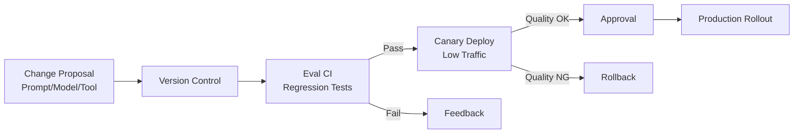

# #53 Agent Change Management

!!! abstract "TL;DR"
    Subject agent prompt, model, tool, and policy changes to CI/canary processes with equal or greater rigor than conventional software.

<!-- BEGIN:GEN:meta -->

Metadata (machine-readable) — #53 Agent Change Management

| Field | Value |
|------|-----|
| **ID** | 53 |
| **Category** | 12-governance — Organization, Governance & Lifecycle |
| **Forces** | `[F8]`, `[F9]` |
| **Dials** | — |
| **Tradeoffs** | — |
| **Related Patterns** | #34, #36, #52, #33 |
| **When to Use** | Production agent operations, multi-person development, regulatory change logs required |
| **When Not to Use** | Fast-iteration prototyping; solo developer PoC |
| **Element Technologies** | Git (prompt/policy/config), Eval CI/CD regression, Shadow/Canary staged rollout, PR approval flow |

<!-- END:GEN:meta -->

## Overview

A team member changed one line in a prompt and the production agent suddenly started returning strange responses -- but with no change history, no one can determine who changed what and when. In the agent world, such "invisible changes" being the root cause of incidents is not unusual.

Traditional software validates code changes through CI/CD, but agent "behavior" can change dramatically from a single prompt line change. Model version updates, tool additions or removals, policy modifications -- all carry impact equal to or greater than code changes. This pattern establishes a change management process where all such changes are version-controlled and must pass evaluation suites, canary deployment, and approval flows before being applied to production.

!!! info "Position in decision-making"
    - **Driving force**: `[F8]` Accountability & Regulation, `[F9]` Provider Reliability
    - **Decision flow**: [Decision Flow](../../decisions/decision-flow.md)

## Design

Management methods per change target:

- **Prompts**: Git-managed, diff review, regression detection with evaluation suites
- **Models**: Version pinning, evaluation run before switching, staged rollout with [#36 Shadow / Canary Deployment](../07-observability/36-shadow-canary-deployment.md)
- **Tools**: PR-based management for additions, removals, and permission changes; impact scope confirmed via registry
- **Policies / Constitution**: Including changes to [#52 Agent Constitution](52-agent-constitution.md)

## Problems Solved

Agent behavioral changes are non-deterministic -- "same prompt, different model, different results" -- making it difficult to predict the impact of changes in advance `[F9]`. Operating without change management and directly editing prompts makes tracking production incident causes difficult and creates auditing challenges `[F8]`.

## When to Use / When Not to Use

- **When to Use**: All production agents. Especially in regulated industries and cases where agent decisions have financial or legal impact. Teams with multiple people developing and maintaining agents.
- **When Not to Use**: During the experimental phase where fast iteration is desired, this can become a hindrance. However, adoption should be considered as production approaches.

## Element Technologies

- Version control: Git (prompts, policies, configuration), [#33 Version Pinning](../07-observability/33-version-pinning.md)
- Evaluation: Automated regression testing with [#34 Evaluation CI/CD](../07-observability/34-evaluation-ci-cd.md)
- Deployment: Staged rollout with [#36 Shadow / Canary Deployment](../07-observability/36-shadow-canary-deployment.md)
- Approval flow: GitHub PR / Slack approval / change management board

## Related Patterns

- [#34 Evaluation CI/CD](../07-observability/34-evaluation-ci-cd.md) — Automated evaluation pipeline per change
- [#36 Shadow / Canary Deployment](../07-observability/36-shadow-canary-deployment.md) — Limit change risk with staged deployment
- [#52 Agent Constitution](52-agent-constitution.md) — Behavioral principle changes are also subject to change management
- [#33 Prompt/Model/Tool Version Pinning](../07-observability/33-version-pinning.md) — Clearly pin versions before and after changes

## References

- ITIL Change Management process
- DevOps / GitOps change management practices
