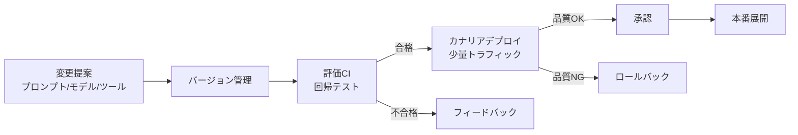

# #53 Agent Change Management｜エージェント変更管理

!!! abstract "一言"
    エージェントのプロンプト・モデル・ツール・ポリシーの変更を、通常のソフトウェアと同等以上の厳格さでCI/カナリア対象にする。

## 概要

従来のソフトウェアはコード変更をCI/CDで検証するが、エージェントの「挙動」はプロンプト1行の変更で激変し得る。モデルバージョンのアップデート、ツールの追加・削除、ポリシーの修正――いずれもコード変更と同等以上のインパクトを持つ。本パターンはこれらの変更をすべてバージョン管理し、評価スイートの実行・カナリアデプロイ・承認フローを経てから本番適用する変更管理プロセスを構築する。

## 設計

変更対象ごとの管理方法:

- **プロンプト**: Git管理、差分レビュー、評価スイートで回帰検知
- **モデル**: バージョンピン留め、切り替え前に評価実行、[#36 Shadow / Canary Deployment](../07-observability/36-shadow-canary-deployment.md) で段階投入
- **ツール**: 追加・削除・権限変更をPRベースで管理、影響範囲をレジストリで確認
- **ポリシー / Constitution**: [#52 Agent Constitution](52-agent-constitution.md) の変更を含む

## 解決する課題

エージェントの挙動変更は非決定論的であり、「同じプロンプトでもモデルが変われば結果が変わる」ため、変更の影響を事前に予測しにくい `[F9]`。変更管理なしにプロンプトを直接編集する運用は、本番障害の原因追跡を困難にし、監査対応でも問題になる `[F8]`。

## 向き / 不向き

- **向き**: 本番運用中のエージェント全般。特に規制産業や、エージェントの判断が金銭・法的影響を持つケース。複数人がエージェントを開発・保守するチーム。
- **不向き**: 実験フェーズで素早くイテレーションしたい段階（ただし、本番に近づくにつれ導入すべき）。

## 要素技術

- バージョン管理: Git（プロンプト・ポリシー・設定）、[#33 Version Pinning](../07-observability/33-version-pinning.md)
- 評価: [#34 Evaluation CI/CD](../07-observability/34-evaluation-ci-cd.md) で自動回帰テスト
- デプロイ: [#36 Shadow / Canary Deployment](../07-observability/36-shadow-canary-deployment.md) で段階投入
- 承認フロー: GitHub PR / Slack承認 / 変更管理ボード

## 関連パターン

- [#34 Evaluation CI/CD](../07-observability/34-evaluation-ci-cd.md) — 変更ごとの自動評価パイプライン
- [#36 Shadow / Canary Deployment](../07-observability/36-shadow-canary-deployment.md) — 段階的デプロイで変更リスクを限定
- [#52 Agent Constitution](52-agent-constitution.md) — 行動原則の変更も変更管理の対象
- [#33 Prompt/Model/Tool Version Pinning](../07-observability/33-version-pinning.md) — 変更前後のバージョンを明確に固定

## 参考

- ITIL Change Management プロセス
- DevOps / GitOps の変更管理プラクティス
