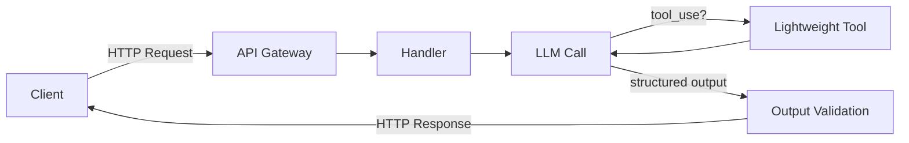

# Synchronous Edge Agent｜同期エッジ

## 一言で（TL;DR）

単発のLLM呼び出しと、必要に応じた軽量ツール1〜2回を**1つの同期HTTPリクエスト内で完結**させる。状態はインコンテキストのみ、チェックポイントもキューも不要。分類・抽出・単純Q&Aなど「数秒で終わる確実な処理」に最適な、最もシンプルな実行パターン。迷ったらまずここから始める。

## 解決する問題

エージェントアーキテクチャの議論はすぐに非同期キュー・チェックポイント・オーケストレータへと進みがちだが、実際のユースケースの多くは「LLM1回＋軽いツール」で済む。こうした軽量タスクに重い実行基盤を持ち込むと、運用コスト・デプロイ複雑性・デバッグ難度が不必要に跳ね上がる。

一方、LLMには[レイテンシのばらつきが大きい（F12）](../../concepts/design-forces.md)という特性がある。同期で返す以上、裾の重い応答時間を制御しなければクライアント側のタイムアウトやUX劣化を招く。本パターンは「同期で収まる範囲に処理を限定し、収まらないケースは別パターンに倒す」ことでこの力学に対処する。

## 選定条件（When to use / When NOT）

- **使う条件**
    - 処理が概ね5〜10秒以内に終わる（ユーザー対面）、またはAPI連携で30秒以内に収まる。
    - LLM呼び出しは1回、ツール呼び出しは0〜2回の軽量処理。
    - 途中再開や人間承認が不要。
    - 状態をリクエスト間で引き継ぐ必要がない（ステートレスまたはセッション変数で足りる）。
    - 典型例：テキスト分類、情報抽出、単純なQ&A、要約、構造化出力生成。
- **使わない条件（＝代替に倒す）**
    - 処理が30秒を超えうる、または所要時間が読めない → [A2 耐久非同期](a2-durable-async-agent.md)。
    - 「短ければ同期、長ければ非同期」の二峰分布 → [A3 同期ファサード](a3-sync-facade-async-core.md)。
    - 複数ツールの多段呼び出しや計画・反省ループが必要 → [B1 決定論シェル](../b-orchestration/b1-deterministic-shell.md) と組み合わせるか、A2に移行。
    - 不可逆な副作用（決済・データ削除等）を伴う → 承認ゲートが必要で同期に収まらない場合が多い。

## 駆動変数とチューニング（程度）

| 目盛り | 効かなすぎ ⇔ 効きすぎ | 決め方 `[駆動変数]` | 目安（出発点） |
|---|---|---|---|
| タイムアウト | 短すぎて正常応答も切る ⇔ 長すぎてクライアントが固まる | ユーザー対面の待機耐性。`[latency_budget]` が短いほど厳しく `[latency_budget]` | 対面5–10秒、API連携15–30秒。p99で判定 |
| モデル選択 | 軽量すぎて品質不足 ⇔ 高性能すぎてレイテンシ超過 | 同期枠に収まる最大品質。`[latency_budget]` | 分類・抽出は軽量モデル、生成はミッド〜フラグシップ |
| ストリーミング有無 | なし：体感遅い ⇔ あり：実装複雑 | ユーザー対面で応答が長文になるか `[latency_budget]` | 対面かつ生成100トークン超はストリーミング推奨 |
| 出力検証の深さ | なし：壊れた出力がそのまま返る ⇔ 厳密：レイテンシ加算 | 下流が構造化データを期待するか `[latency_budget]` | JSON Schemaなど軽量検証は常にON。意味検証は余裕があれば |

値は定数でなく `[latency_budget]` の関数。予算が厳しいほどモデルを軽く・検証を簡素にし、緩いほど品質側に寄せる。

## 相反における立ち位置（相反）

- **[F-1 同期 vs 非同期](../../forks/index.md) → 同期**。処理が待機耐性（対面5–10秒、API30秒）に収まることが前提。収まらない場合は非同期側（[A2](a2-durable-async-agent.md)）に倒す。判定基準は `[latency_budget]` とLLMのp99レイテンシの比較。
- **[F-14 インコンテキスト状態 vs 外部ステートストア](../../forks/index.md) → インコンテキスト**。リクエスト完了で状態を破棄して構わない。再開・共有・監査のために状態を残す必要があれば外部化（[A2](a2-durable-async-agent.md)）へ移行する。

## 構造



処理はすべて1つのHTTPリクエスト-レスポンスサイクル内で完結する。外部キューもチェックポイントストアも登場しない。

## 実装メモ

最小実装の骨格（疑似コード）：

```python
@app.post("/classify")
async def classify(req: ClassifyRequest):
    # 1. タイムアウト付きでLLM呼び出し
    with timeout(seconds=config.llm_timeout):  # latency_budget から設定
        result = await llm.chat(
            model=config.model,  # latency_budget に応じて選択
            messages=[system_prompt, user_message(req.text)],
            response_format=ClassifyResponse,  # 構造化出力
        )
    # 2. 軽量検証
    validated = validate_output(result)
    return validated
```

落とし穴：

- **タイムアウトはLLM呼び出し単位で設定する**。HTTPサーバ全体のタイムアウトだけでは不十分。LLM呼び出しがハングするとワーカースレッドを占有し続ける。[A6 適応タイムアウト](a6-adaptive-timeout-retry.md) の考え方を適用し、p95/p99の実測値に基づいてタイムアウトを設定する。
- **リトライは0〜1回に限る**。同期枠内でリトライを重ねるとクライアントが先にタイムアウトする。リトライが必要な頻度が高いなら、そもそも非同期化を検討する。
- **ストリーミングと構造化出力の併用**に注意。SSEでトークンを流しつつJSON Schemaを強制する場合、パース完了まで検証できない。部分表示と最終検証を分離する設計が要る。
- **コールドスタート**。サーバーレス環境ではコールドスタートが `[latency_budget]` を食う。Provisioned Concurrency やウォームアップで対処するか、常駐プロセスで運用する。

## 効かせる力学（forces）

- **F12（レイテンシばらつき）**：タイムアウト・モデル選択・ストリーミングの3つで裾を切る。p99が同期枠を超えるなら本パターンの適用外と判定し、[A2](a2-durable-async-agent.md) や [A3](a3-sync-facade-async-core.md) に倒す。

## 関連・代替

- 関連
    - [A6 適応タイムアウト・リトライ](a6-adaptive-timeout-retry.md)：タイムアウト値の動的調整を本パターンに適用する。
    - [B1 決定論シェル](../b-orchestration/b1-deterministic-shell.md)：同期エッジの中でも「LLMは判断、制御フローはコード」の原則を適用できる。
    - [E4 検証済み構造化出力](../e-safety-hitl/e4-verified-structured-output.md)：出力検証を軽量に保ちつつ信頼性を上げる。
- 代替
    - [A2 耐久非同期](a2-durable-async-agent.md)：処理が長時間、再開が必要、または所要時間が読めない場合。
    - [A3 同期ファサード](a3-sync-facade-async-core.md)：レイテンシ分布が二峰性で、短い方は同期・長い方は非同期にしたい場合。

## コーディングエージェント向け指示（machine-actionable）

このパターンを人間に提案するなら、同時に以下を提案/確認する：

- [ ] `[latency_budget]` を明確にし、LLMのp99レイテンシが同期枠に収まることを確認したか
- [ ] タイムアウト値を `[latency_budget]` から導き、**理由を添えて**提示したか
- [ ] レイテンシ分布が二峰性でないか確認し、二峰性なら [A3 同期ファサード](a3-sync-facade-async-core.md) を代案として示したか
- [ ] 構造化出力が必要なら [E4 検証済み構造化出力](../e-safety-hitl/e4-verified-structured-output.md) を併置したか
- [ ] 不可逆な副作用がないことを確認したか（あれば本パターンの適用外を検討）
- [ ] 将来の処理拡張で同期枠を超える可能性がないか確認し、あれば [A2](a2-durable-async-agent.md) への移行パスを示したか
