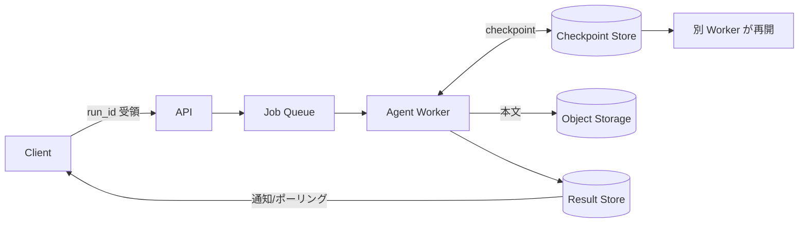

# Durable Async Agent｜耐久非同期セッション

!!! success "このページは模範（status: stable）"
    新しいパターンを書くときの粒度・構成の参考にしてください。様式は [テンプレート](../_template.md)、品質基準は `CLAUDE.md` §3.3 を参照してください。

## 一言で（TL;DR）

長時間・多ステップのエージェント実行を、HTTP同期の中で完結させず**ジョブとして外部化**します。実行状態を節目ごとに永続化（チェックポイント）し、プロセスやプロバイダが落ちても**別ワーカーが最後のチェックポイントから再開**できるようにします。

## 解決する問題

エージェント実行は[1リクエストが長く（F1）](../../concepts/design-forces.md)、[プロバイダ可用性が不安定（F7）](../../concepts/design-forces.md)で、[同入力でも結果が変わります（F15）](../../concepts/design-forces.md)。素朴に同期リクエスト内で回すと、(1) タイムアウトやワーカー再起動で**全部やり直し**、(2) [人間承認（F17）](../../concepts/design-forces.md)の待ちでスレッド/コネクションを占有、(3) 途中状態が揮発して監査もデバッグも不能、という問題が発生します。状態を実行プロセスの外に出し再開可能にすることで、これらの問題を解消します。

## 選定条件（When to use / When NOT）

- **使う条件**
    - 処理が30秒を超えうる、または所要時間が読めません。
    - 途中失敗から**再開**したい場合です（`[reversibility]` が低くやり直しが高コスト）。
    - 実行中に**人間承認**が挟まります（承認待ちが分〜時間）。
    - ツール呼び出しが多段、または複数SaaSを跨ぎます。
    - 後から実行を参照・監査する必要があります（`[accountability]` が高い）。
- **使わない条件（＝代替に倒す）**
    - 数秒で終わり再開も不要な場合 → [A1 同期エッジ](a1-sync-edge-agent.md) で十分です（インコンテキスト状態で足ります。[F-14](../../forks/index.md)）。
    - 「短ければ同期で返したい」UX要件がある場合 → 入口は [A3 同期ファサード](a3-sync-facade-async-core.md) にし、その非同期コアとして本パターンを使います。

## 駆動変数とチューニング（程度）

| 目盛り | 効かなすぎ ⇔ 効きすぎ | 決め方 `[駆動変数]` | 目安（出発点） |
|---|---|---|---|
| チェックポイント頻度 | クラッシュで作業消失 ⇔ I/O過多・コスト | **副作用の直前は必須**＋意味あるステップ後 `[reversibility]` | 各ツール実行後・各LLM応答後・承認ノード前 |
| 状態の保存粒度 | 再開に必要な情報不足 ⇔ 全トークン保存で肥大 | 「再開に要る最小集合」＋本文は参照(uri)で外出し `[accountability]` | 下の状態スキーマ参照 |
| ジョブ保持期間 | 監査・再開不能 ⇔ ストレージ肥大 | ホット短期・コールド規制要件まで（[G1](../g-observability-ops/g1-tiered-observability.md)と整合）`[accountability]` | 実行メタ30日／生データ90日〜 |
| 再開リトライ上限 | 一過性障害で諦める ⇔ 暴走・無限再開 | 予算（[A7](a7-deadline-budget-cascade.md)）で律速 `[latency_budget]` | 再開2–3回、超過で人間へ |

値はいずれも定数でなく駆動変数の関数です。`[reversibility]` が高ければチェックポイントは粗くて構いません。

## 相反における立ち位置（相反）

- **[F-1 同期 vs 非同期](../../forks/index.md) → 非同期**。所要時間が待機耐性を超える、あるいは再開・承認が要るためです。即応UXも要るなら [A3](a3-sync-facade-async-core.md) を被せてください。
- **[F-14 インコンテキスト状態 vs 外部ステートストア](../../forks/index.md) → 外部化**。プロセス障害から独立に再開するための必須条件です。

## 構造



## 実装メモ

チェックポイントの最小状態を以下に示します（本文は uri で外出し、ホット層はメタのみ — [G1](../g-observability-ops/g1-tiered-observability.md)と同じ思想です）：

```json
{
  "run_id": "...",
  "tenant_id": "...",
  "agent_version": "...",
  "model": "...",
  "current_step": "tool_execution",
  "status": "running",
  "messages_uri": "s3://.../messages.json",
  "tool_results_uri": "s3://.../tools.json",
  "plan": [],
  "pending_approval": null,
  "cost_so_far": 1.23,
  "token_so_far": 25000,
  "seed": 42,
  "updated_at": "2026-05-29T12:00:00Z"
}
```

落とし穴：

- **LLM呼び出し中にDBトランザクションを開かないでください**（[F1](../f-data-integrity/f1-short-tx-long-session.md)）。チェックポイント書込は短い独立トランザクションで行います。
- 再開時は副作用ツールを**冪等キー**で保護します（[C4](../c-tools-security/c4-idempotent-command-envelope.md)）。そうしないと再開が二重実行を生みます。
- 承認待ち（[E1](../e-safety-hitl/e1-risk-based-approval.md)）の間はワーカーを占有せず、状態だけ残して解放してください。
- 実行をイベント列で残すと再開・監査・評価が容易になります（[F2](../f-data-integrity/f2-event-sourced-replayable.md)）。

LangGraph のチェックポイント（HITL・メモリ・タイムトラベル・障害復旧）が実装基盤として相性が良いです。

## 効かせる力学（forces）

- **F1（長時間）**：実行をジョブ化し、同期境界の外で進めます。
- **F7（不安定）**：障害から状態を起点に別ワーカーで再開します。
- **F15（再現性低）**：seed・version・メッセージを保存しリプレイ可能にします。
- **F17（人間協働）**：承認待ちの長時間滞留に状態保持で耐えます。

## 関連・代替

- 関連：[A3](a3-sync-facade-async-core.md), [A6](a6-adaptive-timeout-retry.md), [A7](a7-deadline-budget-cascade.md), [F1](../f-data-integrity/f1-short-tx-long-session.md), [F2](../f-data-integrity/f2-event-sourced-replayable.md), [G1](../g-observability-ops/g1-tiered-observability.md), [E1](../e-safety-hitl/e1-risk-based-approval.md)。
- 代替：[A1](a1-sync-edge-agent.md)（短時間・再開不要なら）。

## コーディングエージェント向け指示（machine-actionable）

このパターンを人間に提案するなら、同時に以下を提案/確認してください：

- [ ] 状態の外部化先（Checkpoint / Object / Result Store）を具体化したか
- [ ] チェックポイント頻度を `[reversibility]` から決め**理由を添えて**提示したか
- [ ] 副作用ツールに [C4 冪等キー](../c-tools-security/c4-idempotent-command-envelope.md) を併置したか
- [ ] 即応UXが要るなら [A3 同期ファサード](a3-sync-facade-async-core.md) の選択肢を示したか
- [ ] [G1 二層観測](../g-observability-ops/g1-tiered-observability.md)・[G2 トレース](../g-observability-ops/g2-end-to-end-tracing.md) を併置したか
- [ ] 承認が入るなら [E1](../e-safety-hitl/e1-risk-based-approval.md) と承認待ち中のワーカー解放方針を示したか
