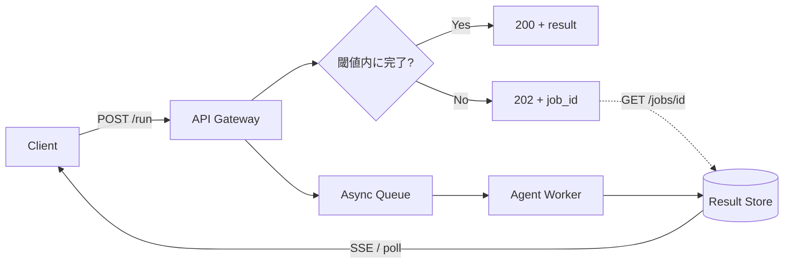

# Sync Facade over Async Core｜非同期コアの同期ファサード

## 一言で（TL;DR）

内部は**常に非同期パイプライン**で処理し、外向きAPIは閾値時間内に完了すれば同期レスポンスを返し、超過すればジョブIDを返して非同期に昇格する。呼び出し側はレイテンシの二峰性を意識せず統一エンドポイントを叩ける。

## 解決する問題

エージェント処理は[所要時間が長く（F1）](../../concepts/design-forces.md)、かつ[レイテンシのばらつきが大きい（F12）](../../concepts/design-forces.md)。キャッシュヒットや軽量タスクなら数百ミリ秒で返せるが、複雑な推論やツール連鎖を伴うと数十秒以上に伸びる。さらに[プロバイダ可用性の揺れ（F7）](../../concepts/design-forces.md)がテールレイテンシを増幅する。

この二峰分布に対して「常に同期」か「常に非同期」の二択を取ると問題が起きる。常に同期ならタイムアウトやコネクション占有が発生し、常に非同期なら数百ミリ秒で返せるケースでも呼び出し側にポーリングを強制する。本パターンは内部を非同期に統一しつつ、外向きインタフェースを閾値で自動切替することで、**速いときは速く返し、遅いときは壊さない**という両立を実現する。

## 選定条件（When to use / When NOT）

- **使う条件**
    - 処理時間の分布が二峰的（高速完了と長時間完了が混在する）。
    - 呼び出し側が同期APIを期待する既存クライアントを含む。
    - `[latency_budget]` がリクエストごとに大きく異なるユースケース（チャットUI＋バッチ等）。
- **使わない条件（＝代替に倒す）**
    - 処理が常に数秒以内で完了し、非同期昇格が実質発生しない → [A1 同期エッジ](a1-sync-edge-agent.md) で十分。
    - 処理が常に30秒超で、同期で返せるケースがほぼ無い → 最初から [A2 耐久非同期](a2-durable-async-agent.md) にし、UIにはジョブIDを即返す方が単純。
    - クライアントがWebSocket/SSEで常時接続する前提 → [A4 ストリーミング](a4-streaming-progressive-commit.md) のみで足り、ファサードの切替が不要。

## 駆動変数とチューニング（程度）

| 目盛り | 効かなすぎ ⇔ 効きすぎ | 決め方 `[駆動変数]` | 目安（出発点） |
|---|---|---|---|
| 同期待機閾値 | 閾値が短すぎ：ほぼ全件が非同期昇格しファサードの意味なし ⇔ 長すぎ：コネクション占有・タイムアウト | 観測P95を基準に、`[latency_budget]` が厳しいほど短く設定 | Web API 5-10秒 / 内部RPC 30秒 / Webhook 60秒 |
| ポーリング間隔 / 通知方式 | 間隔が長い：完了に気づくまでの遅延 ⇔ 短すぎ：ポーリング負荷 | `[latency_budget]` が短いほどプッシュ寄りに | SSE/WebSocket推奨、フォールバックとしてポーリング3-5秒 |
| 非同期昇格時のリトライ | リトライなし：一過性障害で失敗 ⇔ 過多：暴走コスト | [A6](a6-adaptive-timeout-retry.md)と連動 `[latency_budget]` | 2-3回、指数バックオフ |

値は定数でなく駆動変数の関数。`[latency_budget]` が厳しい（短い）ほど同期待機閾値を下げ、早めに非同期へ昇格させてクライアントを解放する。

## 相反における立ち位置（相反）

- **[F-1 同期 vs 非同期](../../forks/index.md) → ハイブリッド**。処理時間が待機耐性を超えるか否かを実行時に判定し、同一エンドポイントで自動切替する。これがA3の本質であり、[A1](a1-sync-edge-agent.md)（常に同期）と[A2](a2-durable-async-agent.md)（常に非同期）の中間に位置する。
- **[F-13 プッシュ vs プル](../../forks/index.md) → ハイブリッド**。同期応答はプッシュ（即座に結果を返す）、非同期昇格後の進捗通知はSSE/Webhookでプッシュしつつ、ポーリングもフォールバックとして残す。

## 構造



## 実装メモ

ファサード層の擬似コード（同期待機閾値で分岐）：

```python
async def run_agent(request):
    job = await enqueue(request)          # 内部は常にキュー経由
    try:
        result = await asyncio.wait_for(
            job.result_future(),
            timeout=SYNC_THRESHOLD_SEC,   # 駆動変数から導出
        )
        return JSONResponse(result, status_code=200)
    except asyncio.TimeoutError:
        return JSONResponse(
            {"job_id": job.id, "poll": f"/jobs/{job.id}"},
            status_code=202,
        )
```

落とし穴：

- **閾値を静的に決めない**。P95/P99の推移を[G2 トレース](../g-observability-ops/g2-end-to-end-tracing.md)で観測し、適応的に調整する仕組みを入れておく。
- **202応答のクライアント対応を忘れる**。OpenAPI仕様に202レスポンススキーマを明示し、SDK生成時にジョブIDハンドリングが漏れないようにする。
- 同期待機中にワーカーが落ちた場合、ファサードは202に切り替えてジョブIDを返す必要がある。**ワーカー障害と単なるタイムアウトを区別**し、障害時は即座に昇格する。
- 非同期コアは[A2](a2-durable-async-agent.md)のチェックポイント・再開機構をそのまま活用する。ファサードは薄いアダプタに留め、ビジネスロジックを持たない。

## 効かせる力学（forces）

- **F1（長時間）**：長くなるリクエストを非同期に逃がし、同期境界のタイムアウトを回避する。
- **F12（レイテンシばらつき）**：二峰分布をファサード層で吸収し、呼び出し側にはfast-path/slow-pathの統一インタフェースを提供する。
- **F7（可用性不安定）**：プロバイダ遅延時に同期待機で詰まらず202に昇格するため、ゲートウェイのコネクション枯渇を防ぐ。

## 関連・代替

- 関連：[A1](a1-sync-edge-agent.md)（同期fast-pathの実体）、[A2](a2-durable-async-agent.md)（非同期コアの実体 -- A3のバックエンド）、[A4](a4-streaming-progressive-commit.md)（進捗をストリーミングで返す通知チャネル）、[A6](a6-adaptive-timeout-retry.md)（タイムアウト・リトライの実装）、[G2](../g-observability-ops/g2-end-to-end-tracing.md)（同期→非同期昇格をトレースで追跡）。
- 代替：[A1](a1-sync-edge-agent.md)（常に短時間なら同期だけでよい）、[A2](a2-durable-async-agent.md)（常に長時間なら最初から非同期でよい）。

## コーディングエージェント向け指示（machine-actionable）

このパターンを人間に提案するなら、同時に以下を提案/確認する：

- [ ] 同期待機閾値を `[latency_budget]` から導き、**なぜその値か**を添えて提示したか
- [ ] 非同期コアとして [A2 耐久非同期](a2-durable-async-agent.md) を併置し、チェックポイント方針を決めたか
- [ ] 非同期昇格後の通知方式（SSE / Webhook / ポーリング）を [F-13](../../forks/index.md) の判定基準に沿って選んだか
- [ ] 202応答のスキーマをAPI仕様に明示し、クライアントSDKの対応を確認したか
- [ ] [G2 トレース](../g-observability-ops/g2-end-to-end-tracing.md) で同期完了率・昇格率・P95を可視化する計画を含めたか
- [ ] 処理が常に短い/常に長いなら、A3でなく [A1](a1-sync-edge-agent.md) / [A2](a2-durable-async-agent.md) に倒す判断を示したか
