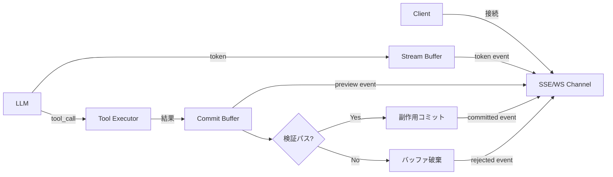

# Streaming with Progressive Commit｜進捗ストリーミング＋遅延コミット

## 一言で（TL;DR）

生成中のトークンやツール実行結果をSSE/WebSocketでクライアントへストリーミングしつつ、副作用（外部APIへの書き込み、DB更新など）は検証が完了するまでバッファに留めて確定しません。「見せる」と「実行する」を分離することで、体感レイテンシの短縮と副作用の安全性を両立します。

## 解決する問題

エージェントの応答は[レイテンシのばらつきが大きく（F12）](../../concepts/design-forces.md)、全トークンが生成されるまでユーザーを待たせると体感が悪化します。一方で、エージェントは[ツール呼び出しで副作用を持つ（F8）](../../concepts/design-forces.md)ため、生成途中でツール実行結果を逐次コミットしてしまうと、最終的にガードレール検証で棄却されたり後段のステップで矛盾が判明したときにロールバックが必要になります。

このパターンが無い場合、2つの悪い選択肢しか残りません。(1) 全生成が完了してからまとめて応答する（体感レイテンシが長い）、(2) 生成と同時に副作用を確定する（途中棄却時の巻き戻しコストが高い）。本パターンはストリーミングと遅延コミットを組み合わせ、この二律背反を解消します。

## 選定条件（When to use / When NOT）

- **使う条件**
    - ユーザー向けUIがあり、`[latency_budget]` が厳しく first-token-time の短縮が体験に直結します。
    - エージェントがツール呼び出しで外部への書き込み副作用を持ち、`[failure_cost]` が中〜高で誤った副作用の取消しが困難です。
    - 生成結果に対してガードレール検証（[E3](../e-safety-hitl/e3-guardrail-sandwich.md)）やドライラン（[C3](../c-tools-security/c3-dry-run-commit.md)）を挟みたい場合です。

- **使わない条件（＝代替に倒す）**
    - 処理が常に数秒以内で、ストリーミングの恩恵がほぼ無い場合は、[A1 同期エッジ](a1-sync-edge-agent.md) で十分です。
    - クライアントがSSE/WebSocketに対応できない場合（バッチ連携、レガシーシステム等）は、[A3 同期ファサード](a3-sync-facade-async-core.md) で非同期昇格し、完了通知で結果を渡す方が単純です。
    - 副作用が無い場合（読取専用の質問応答など）は遅延コミット部分が不要であり、単純なトークンストリーミングで足ります。

## 駆動変数とチューニング（程度）

| 目盛り | 効かなすぎ ⇔ 効きすぎ | 決め方 `[駆動変数]` | 目安（出発点） |
|---|---|---|---|
| ストリーミング粒度 | 粒度が粗い：体感改善が弱い ⇔ 細かすぎ：ネットワーク・描画負荷 | `[latency_budget]` が短いほど細粒度に | トークン単位（チャットUI）/ チャンク単位（API連携） |
| コミットバッファ深さ | 浅い：検証前にコミットされるリスク ⇔ 深い：メモリ消費・遅延増大 | `[failure_cost]` が高いほど深く取り、全ステップ完了まで保留 | 単一ツール呼び出し単位（低リスク）/ 全ステップ完了後（高リスク） |
| 検証タイムアウト | 短い：検証不十分でコミット ⇔ 長い：ユーザー待機が長くなる | `[latency_budget]` と `[failure_cost]` のバランス | 概ね 3-10 秒。`[failure_cost]` が高い領域ほど長めに許容 |
| ストリーミング中断閾値 | 閾値が甘い：危険な出力が流れ続ける ⇔ 厳しい：正常な出力まで中断 | `[failure_cost]` が高いほど閾値を厳しくする | ガードレールが「ブロック」判定したら即中断 |

## 相反における立ち位置（相反）

- **[F-13 プッシュ vs プル](../../forks/index.md) → プッシュ**。リアルタイムで生成進捗をクライアントに届ける必要があるため、SSE/WebSocketによるプッシュを採用します。`[latency_budget]` が厳しいほどプッシュの価値が高くなります。ポーリングでは first-token-time の体感改善が得られません。
- 本パターンは副作用の「見せる」と「確定する」を分離するため、暗黙的に **[F-9 インライン検証 vs 事後検証](../../forks/index.md) → インライン** 側に立ちます。ストリーミング中にガードレールを走らせ、コミット前に検証を完了させる設計です。

## 構造



## 実装メモ

SSEによるストリーミングと遅延コミットの最小構造を示します。

```python
async def stream_with_progressive_commit(request, send_event):
    commit_buffer = []

    async for chunk in llm.stream(request.prompt):
        if chunk.type == "token":
            await send_event("token", chunk.text)     # 即座にストリーム
        elif chunk.type == "tool_call":
            result = await tool_executor.dry_run(chunk)  # ドライラン
            commit_buffer.append((chunk, result))
            await send_event("preview", {
                "tool": chunk.name,
                "result": result.preview,
                "status": "pending_commit",
            })

    # 全生成完了後に検証 → コミット
    for call, result in commit_buffer:
        if await guardrail.validate(call, result):
            await tool_executor.commit(call)
            await send_event("committed", {"tool": call.name})
        else:
            await send_event("rejected", {
                "tool": call.name,
                "reason": result.rejection_reason,
            })
```

SSEイベント設計の例を以下に示します。

```
event: token
data: {"text": "注文を確認します。"}

event: preview
data: {"tool": "create_order", "result": {"order_id": "tmp-123"}, "status": "pending_commit"}

event: committed
data: {"tool": "create_order", "order_id": "ord-456"}
```

落とし穴についても確認しておきましょう。

- **クライアント側の状態管理**について、`preview` と `committed` / `rejected` を区別しないと、ユーザーに未確定の結果を確定済みとして表示してしまいます。UIには「確認中」の中間状態を必ず設けてください。
- **コミットバッファのメモリ**について、長時間のマルチステップエージェントではバッファが肥大化します。ステップ単位でチェックポイントを切り、確定済みバッファを解放するようにします。
- **接続断時のバッファ処理**について、SSE接続が切れてもコミットバッファは残ります。再接続時にバッファ状態を復元するか、タイムアウトで破棄するかのポリシーを決めておく必要があります。タイムアウトの目安は [A6](a6-adaptive-timeout-retry.md) と連動させます。
- **ストリーミング中のガードレール**について、全生成完了を待たず、トークンストリーム中にもリアルタイムでガードレール（[E3](../e-safety-hitl/e3-guardrail-sandwich.md)）を走らせることで、危険な出力を早期に中断できます。ただしトークン単位の判定は偽陽性が増えるため、文単位・段落単位での判定が実用的です。

## 効かせる力学（forces）

- **F12（レイテンシばらつき）**：トークン単位のストリーミングにより、全体の処理時間に関わらず first-token-time を短縮し、レイテンシの裾の重さをユーザー体験上は吸収します。
- **F8（ツール副作用）**：副作用をコミットバッファに蓄積し、検証完了後にまとめて確定することで、生成途中の棄却・再試行時に不要な副作用が残りません。ドライラン（[C3](../c-tools-security/c3-dry-run-commit.md)）との組み合わせで安全性を高められます。

## 関連・代替

- 関連：[A1](a1-sync-edge-agent.md)（副作用がなく短時間ならストリーミング不要で同期完結できます）、[A3](a3-sync-facade-async-core.md)（非同期昇格後の通知チャネルとして本パターンのストリーミングを利用します）、[A6](a6-adaptive-timeout-retry.md)（トークン間タイムアウトによるストール検知に使います）、[C3](../c-tools-security/c3-dry-run-commit.md)（ドライラン→コミットの二相実行を本パターンのコミットバッファと組み合わせます）、[E3](../e-safety-hitl/e3-guardrail-sandwich.md)（ストリーミング中のリアルタイムガードレールとして利用します）。
- 代替：[A3](a3-sync-facade-async-core.md)（SSE/WebSocket非対応のクライアントには非同期昇格＋完了通知で代替できます）。

## コーディングエージェント向け指示（machine-actionable）

このパターンを人間に提案するなら、同時に以下を提案/確認してください。

- [ ] ストリーミング粒度（トークン / チャンク）を `[latency_budget]` から導き、**なぜその粒度か**を添えて提示したか
- [ ] コミットバッファの深さを `[failure_cost]` から導き、ツール単位かセッション単位かを明示したか
- [ ] ストリーミング中のガードレールとして [E3 ガードレールサンドイッチ](../e-safety-hitl/e3-guardrail-sandwich.md) を併置する提案をしたか
- [ ] ツール副作用のドライランとして [C3 ドライラン→コミット](../c-tools-security/c3-dry-run-commit.md) を併置する提案をしたか
- [ ] クライアントUIに `preview` / `committed` / `rejected` の中間状態表示を設計に含めたか
- [ ] 接続断時のコミットバッファ処理ポリシー（タイムアウト破棄 / 再接続復元）を決めたか
- [ ] クライアントがSSE/WebSocket非対応なら [A3 同期ファサード](a3-sync-facade-async-core.md) への切替を提案したか
