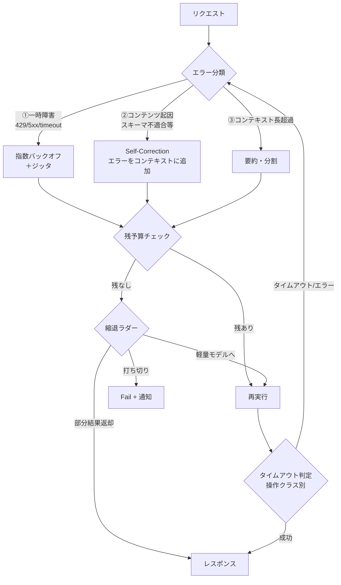

# Adaptive Timeout & Budget-Bounded Retry｜適応タイムアウト＋予算律速リトライ

## 一言で（TL;DR）

操作クラス（ツール呼び出し・LLM推論・セッション全体）ごとにタイムアウトを分け、リトライは固定回数でなく**残りトークン予算**で打ち切ります。エラーを3種に分類し、種類に応じて「即リトライ」「self-correction」「分割」を切り替えることで、暴走と過少リトライの両方を防ぎます。

## 解決する問題

エージェント実行は[1リクエストが長く（F1）](../../concepts/design-forces.md)、[プロバイダ可用性が不安定（F7）](../../concepts/design-forces.md)で、[レイテンシのばらつきが大きい（F12）](../../concepts/design-forces.md)です。固定タイムアウト・固定回数リトライの従来手法では次の問題が生じます。

1. **タイムアウトの不適切さ** — ツール呼び出し（数秒）とLLM推論（数十秒〜分）を同じ閾値で括ると、前者は待ちすぎ、後者は早すぎで切れてしまいます。
2. **リトライ暴走** — 固定3回リトライでも、1回あたり数千トークンを消費するLLMリトライは予算を突き破りえます。逆に安価なネットワーク再送は3回では足りない場合があります。
3. **エラー種別の無視** — 429と「スキーマ不適合」を同じリトライで処理しても、後者は同じプロンプトを送り直しても直りません。

本パターンはタイムアウトを操作クラス別に設定し、リトライの上限を回数でなく**消費トークン予算**で制御し、エラー分類に応じた戦略を切り替えることでこれらを解決します。

## 選定条件（When to use / When NOT）

- **使う条件**
    - エージェントがLLM呼び出し・ツール呼び出し・外部API呼び出しなど**レイテンシ特性の異なる操作**を組み合わせています。
    - リトライ1回あたりのコストが無視できません（LLM推論を含みます）。
    - ネットワーク一時障害とコンテンツ起因エラーの両方が発生しえます。
- **使わない条件**
    - 全操作が同一特性（例：同期エッジで単発LLM呼び出しのみ）で、固定タイムアウトで十分な場合は、個別のリトライポリシーを設定しなくても構いません。
    - リトライ自体が禁止される環境（非冪等な書込のみで冪等キーが導入不能）では、リトライせず即エスカレーションとします。

本パターンは特定の代替に倒すものではなく、ほぼすべてのエージェント実行パターンの**横断的関心事**として適用されます。

## 駆動変数とチューニング（程度）

| 目盛り | 効かなすぎ ⇔ 効きすぎ | 決め方 `[駆動変数]` | 目安（出発点） |
|---|---|---|---|
| ツール呼び出しタイムアウト | 一時障害で即死 ⇔ ハングしたツールに長時間拘束 | 観測P99 × 安全係数（概ね1.5–2.0）`[latency_budget]` | 10–30秒 |
| LLM推論タイムアウト | 長い推論が途中で切れる ⇔ 無応答プロバイダに長時間拘束 | ストリーミング時はトークン間タイムアウトが有効 `[latency_budget]` | 全体60–120秒、トークン間5–15秒 |
| セッション全体タイムアウト | 複雑タスクが完遂できない ⇔ 暴走エージェントが無制限に走る | [A7](a7-deadline-budget-cascade.md) の deadline で律速 `[latency_budget]` | 分〜数十分（タスクによる） |
| ネットワークリトライ回数 | 一過性障害で即失敗 ⇔ 障害中に大量キュー | 指数バックオフ＋ジッタ。上限超でサーキットブレーカを開く `[failure_cost]` | 2–4回 |
| 自己修正リトライ予算 | 修正可能なエラーで即諦め ⇔ トークン浪費 | **回数でなく残トークン予算で判定**。`[cost_sensitivity]` が高いほど予算を絞る | 1–3回、かつ総予算の概ね20–30%を上限 |

値はいずれも定数でなく駆動変数の関数です。`[failure_cost]` が高い非冪等書込では、ネットワークリトライ自体を冪等キー（[C4](../c-tools-security/c4-idempotent-command-envelope.md)）無しで行いません。

## 相反における立ち位置（相反）

- **[F-12 Fail-fast vs 縮退継続](../../forks/index.md) → hybrid（段階的縮退ラダー）**。最初はリトライで回復を試み、予算を一定割合消費したら縮退（軽量モデルへのフォールバック、部分結果返却）に移行し、予算が尽きたら fail-fast で停止します。`[cost_sensitivity]` が高いほど縮退への移行を早め、`[failure_cost]` が高いほど fail-fast 側に寄せます。

## 構造



## 実装メモ

エラー分類と対応戦略の最小定義を示します。

```python
ERROR_CLASS = {
    "transient":  {"codes": [429, 500, 502, 503, 504, "timeout"],
                   "strategy": "backoff_retry"},
    "content":    {"codes": ["schema_violation", "low_quality", "refusal"],
                   "strategy": "self_correction"},
    "context":    {"codes": ["context_length_exceeded"],
                   "strategy": "summarize_split"},
}

TIMEOUT_BY_LAYER = {
    "tool_call":     {"total_s": 30,  "per_token_s": None},
    "llm_inference": {"total_s": 120, "per_token_s": 10},
    "session":       {"total_s": 1800, "per_token_s": None},
}
```

予算律速リトライの考え方を以下に示します。

```python
def should_retry(consumed_tokens, budget_tokens, error_class):
    if error_class == "transient":
        return consumed_tokens < budget_tokens * 0.9   # ネットワーク系は安い
    if error_class == "content":
        return consumed_tokens < budget_tokens * 0.7   # self-correctionは高い
    return False  # context超過は別戦略
```

落とし穴についても確認しておきましょう。

- **Retry-After ヘッダを尊重する** — 429応答の Retry-After を無視して自前バックオフだけで攻めると、プロバイダ側でさらに絞られます。
- **非冪等書込のリトライは冪等キー必須** — [C4](../c-tools-security/c4-idempotent-command-envelope.md) 無しのリトライは二重実行を招きます。`[failure_cost]` が高い操作では冪等キーが無ければリトライ自体を禁止してください。
- **self-correction でエラー文をそのまま詰めすぎない** — コンテキストが膨張し③に遷移します。エラー要約を概ね200トークン以内に切り詰めてください。
- **サーキットブレーカとの連携** — ネットワークリトライ上限を超えたら [G5](../g-observability-ops/g5-circuit-breaker-degradation.md) でサーキットを開き、一定時間リクエストを遮断して下流を守ります。
- **ストリーミング時のタイムアウト** — 全体タイムアウトよりトークン間タイムアウトが優れています。最初の1トークンまでの待ち時間と、トークン間の無応答時間を分けて監視します。

## 効かせる力学（forces）

- **F1（長時間）** — 操作クラス別タイムアウトにより、長い推論は待ちつつ短い操作のハングは早期検出します。
- **F7（不安定）** — エラー分類＋指数バックオフで一時障害を吸収し、上限超でサーキットブレーカへ移行して連鎖障害を防ぎます。
- **F12（ばらつき）** — 観測P99ベースの適応タイムアウトと、ストリーミングではトークン間タイムアウトにより、ばらつきに追従します。

## 関連・代替

- [A2 耐久非同期](a2-durable-async-agent.md) — 長時間ジョブの再開リトライの基盤です。本パターンは1ステップ内のリトライ、A2はセッション粒度の再開を扱います。
- [A3 同期ファサード](a3-sync-facade-async-core.md) — 同期境界のタイムアウト閾値を本パターンで決定します。
- [A7 予算カスケード](a7-deadline-budget-cascade.md) — セッション全体の deadline/budget を本パターンのリトライ上限枠として伝播します。
- [C4 冪等キー](../c-tools-security/c4-idempotent-command-envelope.md) — 非冪等書込のリトライ安全性を担保します。本パターンと組でなければリトライが二重実行を招きます。
- [G1 二層観測](../g-observability-ops/g1-tiered-observability.md) — リトライ回数・タイムアウト発生率・予算消費量の観測に使います。閾値チューニングのフィードバックループを構成します。
- [G5 サーキットブレーカ](../g-observability-ops/g5-circuit-breaker-degradation.md) — ネットワークリトライ上限超のエスカレーション先です。

本パターンは横断的関心事であり、特定の代替パターンに倒すものではありません。

## コーディングエージェント向け指示（machine-actionable）

このパターンを人間に提案するなら、同時に以下を提案/確認してください。

- [ ] 操作クラス（ツール/LLM/セッション）ごとのタイムアウト値を `[latency_budget]` の観測P99から導き、**理由を添えて**提示したか
- [ ] リトライ予算上限をトークン数で設定し、`[cost_sensitivity]` との関係を説明したか
- [ ] エラー分類（一時障害/コンテンツ起因/コンテキスト超過）に応じた戦略を定義したか
- [ ] 非冪等書込がある場合、[C4 冪等キー](../c-tools-security/c4-idempotent-command-envelope.md) を併置したか
- [ ] [G1 二層観測](../g-observability-ops/g1-tiered-observability.md) でリトライ率・タイムアウト率を計測する方針を示したか
- [ ] [G5 サーキットブレーカ](../g-observability-ops/g5-circuit-breaker-degradation.md) との連携（リトライ上限超の挙動）を定義したか
- [ ] [A7 予算カスケード](a7-deadline-budget-cascade.md) でセッション全体の deadline/budget を本パターンの上限枠として渡す設計になっているか
