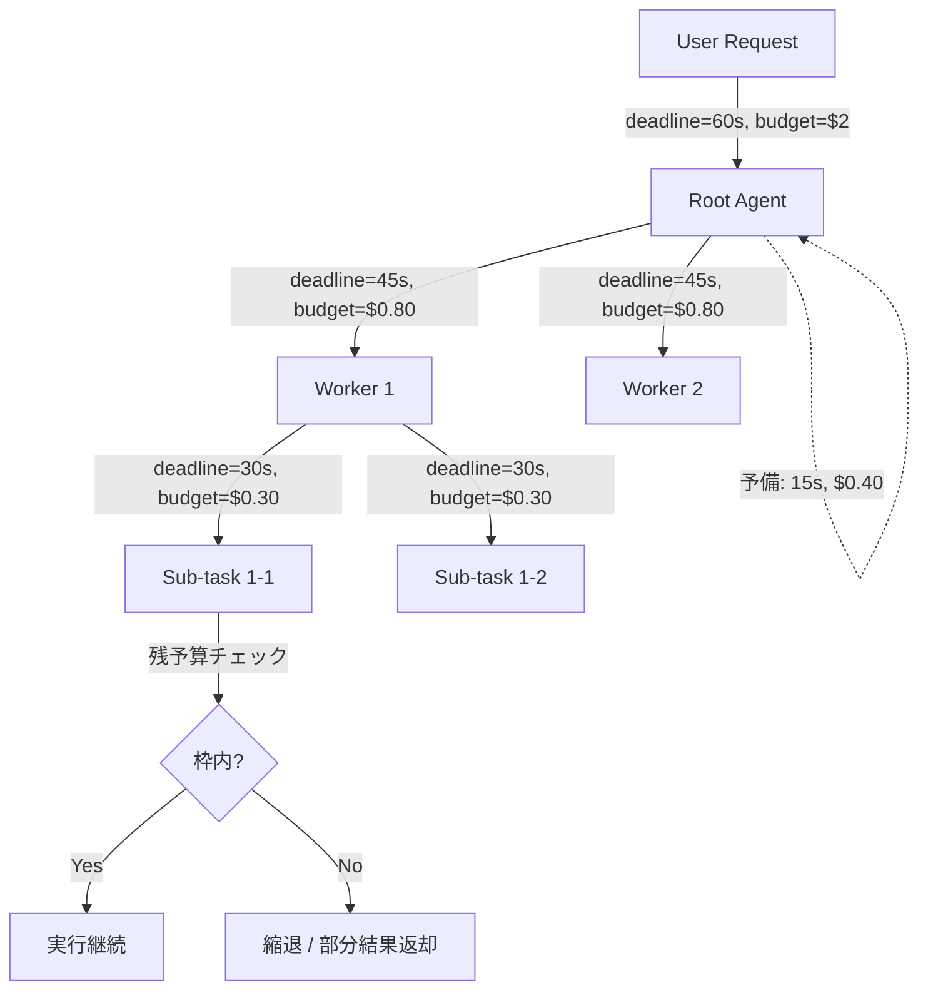

# Deadline & Budget Cascade｜期限・予算のカスケード伝播

## 一言で（TL;DR）

呼出ツリーのルート（ユーザーリクエスト受付時点）で **deadline（期限）** と **budget（トークン・コスト・ステップ数の上限）** を設定し、子タスクへ呼び出しを委譲するたびに**残り枠を差し引いて伝播**する。どの末端ノードでも「今の自分に残された時間・コスト」を知っており、枠を使い切る前に縮退・中断・部分結果返却に切り替えられるようにする。

## 解決する問題

エージェントの呼出ツリーが深くなると、各ノードは自分がどれだけのリソースを消費してよいか知らない。[1リクエストが高コスト（F2）](../../concepts/design-forces.md)なLLM呼び出しが再帰的に積み重なり、気づけばコストが数十ドルに膨れる「請求事故」が起きる。さらに[自己ループ（F13）](../../concepts/design-forces.md)する計画-反省サイクルでは、改善の見込みが薄くても無限にリトライを繰り返しうる。

根本原因は「全体の予算と期限がローカルな判断に伝わっていない」こと。各ノードにグローバルな制約を局所的に参照可能な形で渡せば、ノード自身が打ち切り判断できる。

## 選定条件（When to use / When NOT）

- **使う条件**
    - エージェントが**サブタスクを再帰的に生成**する、またはオーケストレータが複数ワーカーに並列委譲する。
    - 1リクエストのコストが予測困難で、上限を置かないと**請求事故**が起きうる（`[cost_sensitivity]` が中以上）。
    - タスク完了までの所要時間にSLAや期待値がある（`[request_value]` に応じた投資上限がある）。
    - [B3 自律ループ](../b-orchestration/b3-agentic-loop-budget.md)や[B5 Supervisor-Worker](../b-orchestration/b5-supervisor-worker.md)を採用しており、ガバナンスの一環として予算制御が必要。
- **使わない条件**
    - 呼出ツリーが1段で完結し、タイムアウトだけで十分 → [A6 適応タイムアウト](a6-adaptive-timeout-retry.md)単体で事足りる。
    - バッチジョブなど時間制約がなく、コストも固定的 → 予算伝播のオーバーヘッドが不要。単純なステップ上限で済む。

## 駆動変数とチューニング（程度）

| 目盛り | 効かなすぎ ⇔ 効きすぎ | 決め方 `[駆動変数]` | 目安（出発点） |
|---|---|---|---|
| コスト上限（USD） | 暴走・請求事故 ⇔ 有用な作業を途中で切る | 1リクエストの価値の数%以下を出発点とする `[request_value]` `[cost_sensitivity]` | 対話系 $0.05–0.50 / 調査系 $1–5 / 高価値タスク $10– |
| ステップ上限（max_steps） | ループ暴走 ⇔ 複雑タスクが解けない | タスク種別で層別。`[cost_sensitivity]` が高いほど下げる | 対話系 5–10 / 調査系 20–50 |
| deadline（秒） | タイムアウト事故 ⇔ 低品質な打ち切り | SLAから逆算し伝播マージンを引く `[request_value]` | ルート30–300s、子ノードは残りの70–80%を渡す |
| 子タスクへの分配比率 | 一部の子が独占 ⇔ 全子が枯渇して縮退 | 子タスクの重要度と予測コストで按分 `[cost_sensitivity]` | 均等割り or 重要度加重。予備枠10–20%を親に残す |

値はいずれも定数でなく駆動変数の関数。`[cost_sensitivity]` が高い環境ほど上限を厳しく、`[request_value]` が高いタスクほど枠を広くとる。

## 相反における立ち位置（相反）

本パターンは特定のフォークに依存しない汎用ガバナンス機構であり、同期/非同期どちらの実行モデルでも適用できる。ただし以下の傾向がある：

- 非同期実行（[A2](a2-durable-async-agent.md)）では deadline が長くなるため、コスト予算の方がバインディング制約になりやすい。
- 同期実行（[A1](a1-sync-edge-agent.md)）では deadline が支配的な制約になりやすい。

## 構造



各ノードは呼び出し前に `remaining = parent_budget - self_consumed - margin` を計算し、子に渡す。子は渡された枠を超えない。

## 実装メモ

予算コンテキストの最小構造：

```python
@dataclass
class BudgetContext:
    deadline_at: datetime          # 絶対時刻（相対秒でなく）
    max_cost_usd: float            # 残りコスト上限
    max_steps: int                 # 残りステップ上限
    max_tokens: int                # 残りトークン上限
    depth: int                     # 現在の呼出深さ
    max_depth: int                 # 呼出深さ上限

    def remaining_seconds(self) -> float:
        return max(0, (self.deadline_at - datetime.utcnow()).total_seconds())

    def child_budget(self, fraction: float, margin_sec: float = 2.0) -> "BudgetContext":
        """子タスクに渡す予算を生成。fraction は 0.0–1.0。"""
        return BudgetContext(
            deadline_at=self.deadline_at - timedelta(seconds=margin_sec),
            max_cost_usd=self.max_cost_usd * fraction,
            max_steps=int(self.max_steps * fraction),
            max_tokens=int(self.max_tokens * fraction),
            depth=self.depth + 1,
            max_depth=self.max_depth,
        )

    def is_exhausted(self) -> bool:
        return (self.remaining_seconds() <= 0
                or self.max_cost_usd <= 0
                or self.max_steps <= 0)
```

落とし穴：

- **deadline は絶対時刻で渡す**。相対秒を渡すと伝播のたびにズレが蓄積する。gRPC の `grpc-timeout` ヘッダと同じ設計原則。
- **予備枠（margin）を親に残す**。子の結果を集約・フォーマットする時間とコストが要る。目安はルート予算の10–20%。
- **枯渇時の振る舞いを事前に決める**。「部分結果を返す」「人間にエスカレーション」「縮退モデルに切替」の3択を設計時に選ぶ。場当たり的にタイムアウト例外を投げるだけでは UX が崩壊する。
- **並列子タスクの合算**に注意。並列実行ではコストは各子の合算だが、deadline は最も遅い子で決まる。

## 効かせる力学（forces）

- **F2（高コスト）**：トークン・コストの上限を末端まで伝播し、請求事故を構造的に防ぐ。
- **F13（自己ループ）**：ステップ上限とコスト上限の二重制約でループ暴走を封じる。回数だけでなくコストで律速する点が、単純な `max_iterations` より堅牢。

## 関連・代替

- [A2 耐久非同期](a2-durable-async-agent.md)：チェックポイントに `cost_so_far` を記録し、再開時に残予算を復元する。A7 が予算フレームを供給する。
- [A6 適応タイムアウト](a6-adaptive-timeout-retry.md)：個別操作のタイムアウトとリトライ予算は A6 が担い、全体枠の伝播は A7 が担う。A6 は A7 の「残り deadline」内でタイムアウトを設定する。
- [B3 自律ループ](../b-orchestration/b3-agentic-loop-budget.md)：ループガバナンスの予算制約として A7 が必須。
- [B5 Supervisor-Worker](../b-orchestration/b5-supervisor-worker.md)：Supervisor が子 Worker に予算を按分する際の分割ロジックが A7 の中核。
- [G1 二層観測](../g-observability-ops/g1-tiered-observability.md)：予算消費率のメトリクス（consumed/limit 比）を観測し、閾値超過でアラートを飛ばす。

代替パターンは特にない。予算伝播はタイムアウト（A6）やループ上限（B3）と補完関係にあり、置き換えるものではなく併用するもの。

## コーディングエージェント向け指示（machine-actionable）

このパターンを人間に提案するなら、同時に以下を提案/確認する：

- [ ] ルートの予算値（deadline / cost / steps）を `[request_value]` と `[cost_sensitivity]` から導き、**根拠を添えて**提示したか
- [ ] 枯渇時の振る舞い（部分結果返却 / 人間エスカレーション / 縮退モデル切替）を設計に含めたか
- [ ] [B3 自律ループ](../b-orchestration/b3-agentic-loop-budget.md)または [B5 Supervisor-Worker](../b-orchestration/b5-supervisor-worker.md)を使うなら、子タスクへの分配比率を示したか
- [ ] [A6 適応タイムアウト](a6-adaptive-timeout-retry.md)と組み合わせ、個別操作のリトライが全体予算を食い潰さない設計にしたか
- [ ] [G1 二層観測](../g-observability-ops/g1-tiered-observability.md)で予算消費率の可視化・アラートを併置したか
- [ ] deadline を絶対時刻で伝播する設計にしたか（相対秒の累積ズレ防止）
