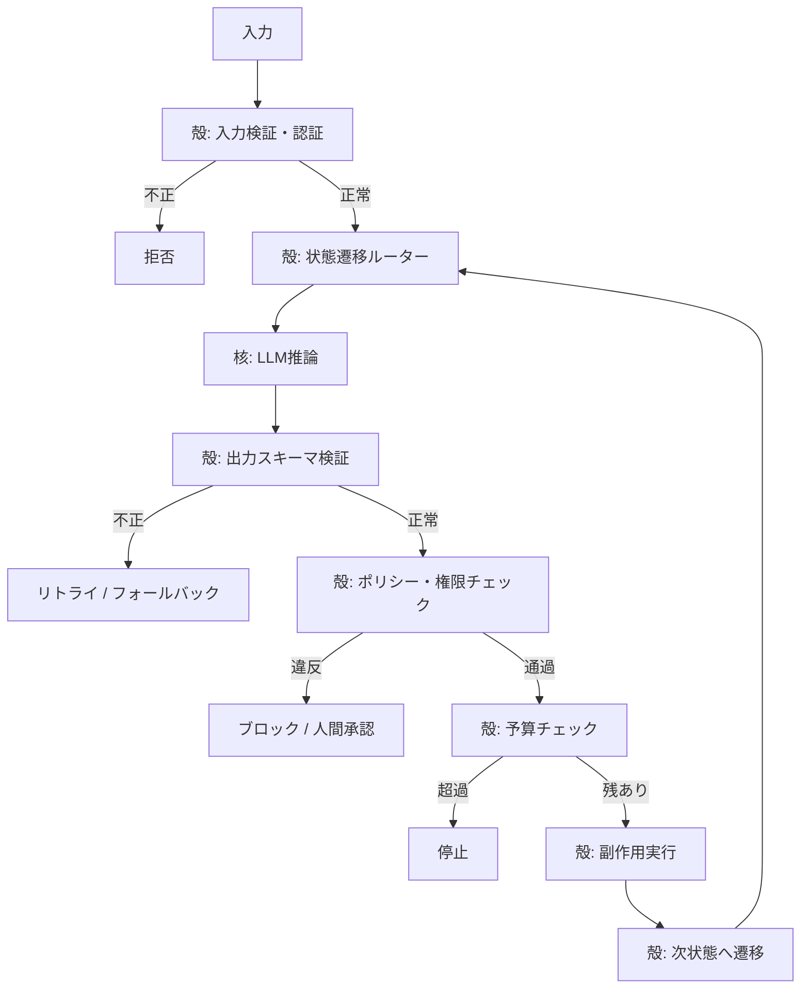

# Deterministic Shell, Probabilistic Core｜決定論的な殻・確率的な核

## 一言で（TL;DR）

状態遷移・入出力検証・権限チェック・予算管理など**決定論的に記述できるすべての制御**を通常のコードで実装し、LLM には「どの選択肢を選ぶか」「自由形式の入力をどう解釈するか」といった**曖昧さの解消だけ**を委ねます。エージェントシステム設計の最も基礎的な分離原則です。

## 解決する問題

LLM は[確率的であり同じ入力でも出力が変わります（F3）](../../concepts/design-forces.md)。状態遷移や権限判定まで LLM に任せると、(1) 禁止操作をすり抜ける、(2) 予算を超過する、(3) 不正な状態遷移が起きる、(4) テストで再現できない、といった障害が確率的に発生し、原因特定も困難になります。さらに[監査対象となるシステム（F16）](../../concepts/design-forces.md)では、判断の根拠がプロンプトの中に埋もれていると、ポリシー違反の検出も事後検証も困難です。

決定論的に解ける部分をコードに押し出すことで、確率的な層の表面積を最小化し、テスト容易性・監査性・安全性を確保します。

## 選定条件（When to use / When NOT）

- **使う条件**
    - システムに明示的なビジネスルール・権限・予算制約があります。
    - `[failure_cost]` が中〜高で、不正な状態遷移や権限違反が実害を生みます。
    - `[accountability]` が高く、「なぜその操作が許可されたか」をコードレベルで説明する必要があります。
    - ほとんどのエージェントシステムに適用すべき**デフォルト原則**です。迷ったら適用してください。
- **使わない条件（＝代替に倒す）**
    - `[task_variability]` が極めて高く、事前に経路を列挙できない探索的タスク（研究補助、オープンエンドなコード生成など） → [B3 予算付き自律ループ](b3-agentic-loop-budget.md) に倒し、予算と安全弁で律速します。
    - プロトタイプ段階で制約が未確定 → まず自律ループで動かし、制約が明確になった時点で殻に切り出します。

## 駆動変数とチューニング（程度）

| 目盛り | 効かなすぎ ⇔ 効きすぎ | 決め方 `[駆動変数]` | 目安（出発点） |
|---|---|---|---|
| 殻の範囲（どこまでコードで制御するか） | LLMが禁止操作を実行 ⇔ 柔軟性喪失・開発速度低下 | `[failure_cost]` が高い経路ほど殻を厚く、低い経路は核に委ねてよい | 副作用のある操作・金銭移動・権限変更は必ず殻 |
| 検証の厳格さ | 不正出力が後段に流れる ⇔ 正常出力も棄却しリトライ過多 | `[failure_cost]` × `[accountability]` の積で決める | 構造化出力（[E4](../e-safety-hitl/e4-verified-structured-output.md)）でスキーマ検証＋ビジネスルール検証 |
| 状態遷移の粒度 | 大きすぎて部分再開不能 ⇔ 細かすぎてオーバーヘッド | `[task_variability]` が低いほど細かく刻める | 副作用境界ごとに1状態 |
| ポリシーの外部化度 | ハードコードで変更にデプロイ必要 ⇔ ポリシーエンジン運用コスト | `[accountability]` が高く頻繁に変わるならポリシーエンジン（[E2](../e-safety-hitl/e2-policy-as-code.md)）へ | 規制要件があれば外部化、なければコード内で十分 |

## 相反における立ち位置（相反）

- **[F-4 ワークフロー vs エージェント](../../forks/index.md) → ワークフロー寄り**。制御フローをコードで固定する本パターンはワークフロー側の原則です。ただし核の内部では LLM が自由に推論して構いません。`[task_variability]` が高まり経路列挙が困難になったら [B3](b3-agentic-loop-budget.md) へ移行する判断点が訪れます。
- **[F-11 LLM推論 vs コード委譲](../../forks/index.md) → コード側**。決定論的に解ける処理（検証・計算・ルール適用）はコードで書きます。LLM に委ねるのは自然言語解釈・分類・要約など非決定論的な判断のみです。

## 構造



殻（灰色の箇所）はすべて通常のコードであり、ユニットテストで100%カバーできます。核は LLM 呼び出し1回分だけです。

## 実装メモ

殻の最小構造（擬似コード）：

```python
def agent_step(state: State, user_input: str) -> State:
    # 殻: 入力検証
    validated = validate_input(user_input, state.schema)

    # 殻: 権限チェック
    assert_permission(state.user, state.current_action)

    # 核: LLMに曖昧な判断だけ委ねる
    llm_output = llm.generate(
        prompt=build_prompt(state, validated),
        response_format=ActionSchema,  # 構造化出力で型を強制
    )

    # 殻: 出力検証
    action = parse_and_validate(llm_output, ActionSchema)

    # 殻: ポリシー適用
    check_policy(action, state.policies)

    # 殻: 予算確認
    state.budget.deduct(action.estimated_cost)

    # 殻: 副作用実行（冪等キー付き）
    result = execute_with_idempotency(action)

    # 殻: 状態遷移
    return state.transition(action.next_state, result)
```

落とし穴：

- **検証をプロンプトだけに頼らないでください**。「JSONで返して」と指示しても破る場合があります。構造化出力（[E4](../e-safety-hitl/e4-verified-structured-output.md)）でスキーマを強制し、さらにビジネスルールをコードで検証します。
- **殻と核の境界を明確なインターフェースにしてください**。核への入力と核からの出力を型定義し、殻のテストを核のモックで書けるようにします。
- **殻の中で LLM を呼ばないでください**。殻にLLM呼び出しが混入すると分離が崩れます。判断が必要な箇所は核に切り出します。
- **状態遷移図を先に書いてください**。殻の設計は状態機械設計そのものであり、コードより先に遷移図を確定させると実装がぶれません。

## 効かせる力学（forces）

- **F3（確率的）**：確率的な層を核に閉じ込め、殻は決定論的にテスト・検証可能にします。核の出力は必ず殻の検証を通るため、確率的な逸脱がシステム全体に波及しません。
- **F16（監査対象）**：権限チェック・ポリシー適用・予算管理がコードで明示されているため、監査時に「なぜこの操作が許可されたか」をコードパスとログから説明できます。

## 関連・代替

- [B2 ワークフロー骨格](b2-workflow-backbone.md)：本パターンの具体化です。殻をDAGとして定義し、各ノードに核を配置します。
- [B3 予算付き自律ループ](b3-agentic-loop-budget.md)：`[task_variability]` が高く経路列挙が不能なときの代替です。予算と安全弁で制御します。
- [B4 計画-実行-検証](b4-planner-executor-verifier.md)：計画フェーズと検証フェーズが殻、実行フェーズが核という三相構成です。
- [E2 Policy-as-Code](../e-safety-hitl/e2-policy-as-code.md)：殻のポリシー部分を外部エンジンに切り出し、デプロイなしでルール変更を可能にします。
- [E4 構造化出力](../e-safety-hitl/e4-verified-structured-output.md)：核の出力を型で縛り、殻がスキーマ検証で捕まえます。本パターンの実装に不可欠です。
- [C1 ツールゲートウェイ](../c-tools-security/c1-tool-gateway-mcp-broker.md)：殻がツール呼び出しの許可・拒否を制御します。

## コーディングエージェント向け指示（machine-actionable）

このパターンを人間に提案するなら、同時に以下を提案/確認してください：

- [ ] 殻の範囲を `[failure_cost]` から導き、**どの操作を殻に含めるか**を一覧で示したか
- [ ] 核の出力に [E4 構造化出力](../e-safety-hitl/e4-verified-structured-output.md) を併置し、スキーマ検証を設計したか
- [ ] `[accountability]` が高いなら [E2 Policy-as-Code](../e-safety-hitl/e2-policy-as-code.md) でポリシー外部化を提案したか
- [ ] 副作用のある操作に [C1 ツールゲートウェイ](../c-tools-security/c1-tool-gateway-mcp-broker.md) を併置したか
- [ ] `[task_variability]` が高い部分は [B3](b3-agentic-loop-budget.md) との使い分けを説明したか
- [ ] 目盛り（上表）の値を `[駆動変数]` から導き、**理由を添えて**提示したか
- [ ] 殻と核の境界を型定義（入力/出力スキーマ）として具体化したか
