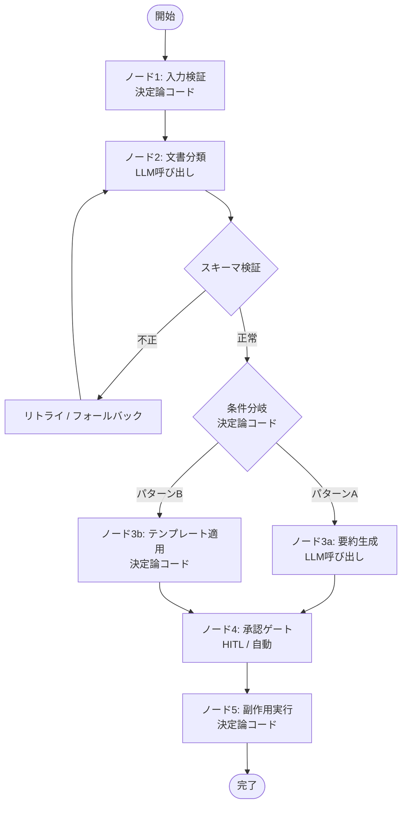

# Workflow Backbone with Agentic Nodes｜骨格固定・ノード単位で自律度選定

## 一言で（TL;DR）

業務フロー全体の制御をDAGまたはステートマシンとしてコードで固定し、各ノードの**内部実装だけ**を「決定論コード／単発LLM呼び出し／ミニエージェント」のいずれかに差し替え可能にします。骨格がテスト可能かつ監査可能なまま、必要なノードにだけ確率的な柔軟性を持たせられます。

## 解決する問題

エージェントに業務フロー全体を自律的に遂行させると、3つの力学が同時に噴出します。

- [F3（確率的）](../../concepts/design-forces.md)：LLM はステップ順序を飛ばしたり、不要なステップを挿入したりします。冪等性の保証が困難になります。
- [F10（出力がスキーマに従わない）](../../concepts/design-forces.md)：あるノードの出力が次のノードの期待する型を満たさないと、後段が連鎖的に失敗します。
- [F13（自己ループ）](../../concepts/design-forces.md)：LLM が「もう少し調べよう」と自己判断でループし、コスト・時間を消費し続けます。

骨格を固定しておけば、フロー自体はユニットテストで検証でき、確率的な振る舞いは各ノード内部に閉じ込められます。Airflow や Temporal のステップ定義と同じ発想をエージェントワークフローに適用したものです。

## 選定条件（When to use / When NOT）

- **使う条件**
    - 業務手順が概ね定型であり、主要ステップとその順序を事前に列挙できます（`[task_variability]` 低〜中）。
    - `[failure_cost]` が中〜高で、ステップの飛ばしや順序逆転が実害を生みます（例：審査前に送金、契約前に納品）。
    - 各ステップの入出力型を定義でき、ステップ間の契約（スキーマ）が明確です。
    - 部分的に LLM の柔軟性が必要なステップ（要約、分類、自由形式の応答生成など）があります。
- **使わない条件（＝代替に倒す）**
    - `[task_variability]` が高く、ステップ自体を LLM が発見・生成する必要がある場合（探索的コード生成、研究補助など） → [B3 予算付き自律ループ](b3-agentic-loop-budget.md) に倒します。
    - 全ステップが決定論的に実装でき、LLM を呼ぶノードが一つもない場合 → 通常のワークフローエンジン（Airflow, Temporal）で十分であり、本パターンを持ち出す必要はありません。
    - フローが1ステップしかない場合 → [B1 決定論的な殻](b1-deterministic-shell.md) の原則を直接適用すれば足ります。

## 駆動変数とチューニング（程度）

| 目盛り | 効かなすぎ ⇔ 効きすぎ | 決め方 `[駆動変数]` | 目安（出発点） |
|---|---|---|---|
| ノード粒度（1ノードの責務範囲） | 粗すぎてノード内が複雑化・テスト困難 ⇔ 細かすぎてDAG管理コスト増大 | `[failure_cost]` が高い境界ほど分割して検証を挟む | 副作用の有無を境界にする。概ね5〜15ノードが管理しやすい |
| 各ノードの自律度（コード/LLM/ミニエージェント） | 全コードで柔軟性不足 ⇔ 全LLMで再現性崩壊 | `[task_variability]` が高いノードほどLLMに委ねる | デフォルトはコード。曖昧な入力を扱うノードだけLLMにする |
| ノード間スキーマ検証の厳格さ | 不正データが後段に伝播 ⇔ 正常出力も棄却されリトライ過多 | `[failure_cost]` が高い後段ほどスキーマを厳格にする | 全ノード間でJSON Schemaまたは型定義による検証を入れる |
| ノード内ループ上限 | 1回で足りず品質低下 ⇔ 無制限でコスト爆発 | `[failure_cost]` × コスト感度で決める | LLMノードは概ね3回以内のリトライ上限を設定する |

## 相反における立ち位置（相反）

- **[F-4 ワークフロー vs エージェント](../../forks/index.md) → ワークフロー側**。本パターンはフォーク F-4 のハイブリッド戦略「決定論骨格＋確率論ノード」そのものです。骨格がワークフロー、ノード内部がエージェントとなります。`[task_variability]` が低いノードは決定論コードで、高いノードだけ LLM/ミニエージェントで実装します。全ノードで `[task_variability]` が高くなったら [B3](b3-agentic-loop-budget.md) への移行を検討してください。
- **[F-5 Plan-then-Execute vs ReAct](../../forks/index.md) → 計画先行**。DAG 定義が計画に相当し、実行時にはその計画から逸脱しません。環境が静的で手順を事前確定できるユースケースに適しています。動的に計画を変えたい場合は [B4 計画-実行-検証](b4-planner-executor-verifier.md) のパターンで DAG 自体を LLM が生成・修正する構成も考えられます。

## 構造



骨格（矢印と分岐条件）は通常のコードで定義・テストされます。各ノードの内部実装だけが差し替え可能です。

## 実装メモ

骨格の最小構成（擬似コード）：

```python
from dataclasses import dataclass
from enum import Enum
from typing import Any, Callable

class NodeType(Enum):
    CODE = "code"
    LLM = "llm"

@dataclass
class Node:
    name: str
    node_type: NodeType
    execute: Callable[[dict], dict]
    output_schema: dict  # JSON Schema
    max_retries: int = 3

@dataclass
class Edge:
    source: str
    target: str
    condition: Callable[[dict], bool] | None = None

class WorkflowBackbone:
    def __init__(self, nodes: list[Node], edges: list[Edge]):
        self.nodes = {n.name: n for n in nodes}
        self.edges = edges
        self._validate_dag()

    def run(self, initial_input: dict) -> dict:
        current = self._find_start()
        context = initial_input
        while current:
            node = self.nodes[current]
            for attempt in range(node.max_retries):
                result = node.execute(context)
                if validate_schema(result, node.output_schema):
                    break
            else:
                raise RetryExhaustedError(node.name)
            context = {**context, **result}
            current = self._next(current, context)
        return context
```

落とし穴：

- **ノード間の依存を暗黙にしないでください**。ノードが `context` から読むキーを明示的に宣言し、DAG定義時に依存関係を静的検証できるようにします。暗黙の依存は実行時まで発覚しません。
- **LLMノードの出力をそのまま次ノードに渡さないでください**。必ずスキーマ検証を挟みます。検証なしで渡すと [F10](../../concepts/design-forces.md) により後段が壊れます。
- **ノード内リトライとワークフロー全体のリトライを区別してください**。ノード内リトライは LLM の出力形式修正（3回程度）、ワークフローリトライは外部障害からの再開（チェックポイントから）です。混同するとリトライが二重に走ります。
- **長時間ワークフローはチェックポイントを取ってください**。副作用を伴うノードの完了後に状態を永続化し、障害時に途中から再開できるようにします（[A2 耐久非同期](../a-execution/a2-durable-async-agent.md) と組み合わせます）。

## 効かせる力学（forces）

- **F3（確率的→冪等性）**：骨格が決定論的なので、同一入力に対して同じノード順序で実行されます。確率的な振る舞いはノード内部に局所化され、ノード単位でのリプレイ・リトライが可能になります。
- **F10（出力がスキーマに従わない）**：ノード間にスキーマ検証を挟むことで、不正な出力が後段に伝播しません。不正出力はノード内リトライで吸収するか、フォールバックに切り替えます。
- **F13（自己ループ→ループ上限）**：LLM がフロー全体を制御しないため、「もう少し調べよう」という自己判断でのループが発生しません。ループが必要な場合もノード内リトライ上限として明示的に制御されます。

## 関連・代替

- [B1 決定論的な殻](b1-deterministic-shell.md)：本パターンの上位原則です。B2 は B1 の「殻＝DAG骨格、核＝各ノード」という具体化にあたります。
- [B3 予算付き自律ループ](b3-agentic-loop-budget.md)：`[task_variability]` が高くステップを事前列挙できないときの代替です。B2 の個々のノード内部を B3 的なミニループで実装する折衷もあります。
- [B4 計画-実行-検証](b4-planner-executor-verifier.md)：DAG 自体を LLM が動的に生成・修正する構成です。B2 より柔軟ですが制御の保証が弱まります。
- [A2 耐久非同期](../a-execution/a2-durable-async-agent.md)：長時間ワークフローでのチェックポイント・再開に必要です。B2 の各ノード完了をチェックポイントとして利用します。
- [E1 リスクベース承認](../e-safety-hitl/e1-risk-based-approval.md)：不可逆な副作用を持つノードの手前に承認ゲートを挟みます。DAG上の特定エッジに承認条件を付与する形で統合します。

## コーディングエージェント向け指示（machine-actionable）

このパターンを人間に提案するなら、同時に以下を提案/確認してください：

- [ ] 業務フローを洗い出し、DAGとして表現できるか（ステップと順序を列挙できるか）を確認したか
- [ ] 各ノードの自律度（コード/LLM/ミニエージェント）を `[task_variability]` から導き、**理由を添えて**提示したか
- [ ] ノード間のスキーマ（入出力の型定義）を設計し、検証方法を提案したか
- [ ] 不可逆な副作用を持つノードに [E1 リスクベース承認](../e-safety-hitl/e1-risk-based-approval.md) を併置したか
- [ ] 長時間ワークフローなら [A2 耐久非同期](../a-execution/a2-durable-async-agent.md) によるチェックポイントを提案したか
- [ ] `[task_variability]` が高いノードが大半を占める場合、[B3](b3-agentic-loop-budget.md) への移行を選択肢として提示したか
- [ ] 目盛り（上表）の値を `[駆動変数]` から導き、**理由を添えて**提示したか
