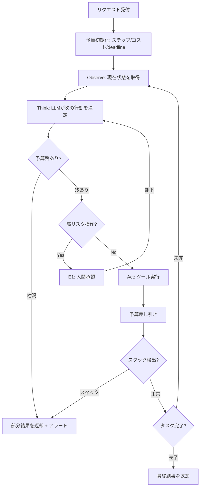

# Agentic Loop with Budget｜予算付き自律ループ

## 一言で（TL;DR）

LLM が「観察→思考→行動」を自律的に繰り返す ReAct 型ループを構成しつつ、ステップ数・トークンコスト・経過時間の予算で上限を設け、タスク完了・予算枯渇・スタック検出のいずれかでループを終了させます。手順が事前に列挙できないタスクに適用し、自律性を予算で律速します。

## 解決する問題

手順が毎回変わるタスク（調査、デバッグ、オープンエンドな生成など）では、制御フローをコードで事前定義できません。LLM に次の行動を選ばせる自律ループが必要になりますが、制約なしに回すと二つの力学が暴走します。

[自己ループ（F13）](../../concepts/design-forces.md)：計画→実行→反省の再帰で「もう少し改善できる」と無限に回り続けます。完了判断を LLM 自身に委ねると、終了条件が曖昧になり打ち切れません。

[高コスト（F2）](../../concepts/design-forces.md)：ループ1周ごとにトークンが消費されます。ツール呼び出しが連鎖すると、気づけばコストが想定の数十倍に達し「請求事故」を引き起こします。

予算という外部制約を設けることで、LLM の自律性を維持しつつ、全体のコスト・時間・ステップを確定的に制御できます。

## 選定条件（When to use / When NOT）

- **使う条件**
    - `[task_variability]` が高く、処理手順を事前に DAG やステートマシンとして列挙できません。
    - タスクに「ツールを使って情報を集め、判断し、次の行動を決める」反復が必要です。
    - 完了条件が成果物の品質で判定されます（ステップ数が不定）。
- **使わない条件（＝代替に倒す）**
    - `[task_variability]` が低く、手順を固定できる場合 → [B2 ワークフロー骨格](b2-workflow-backbone.md) に倒します。決定論的な制御のほうがテスト容易・コスト予測可能です。
    - `[failure_cost]` が極めて高く、LLM に行動選択を委ねること自体がリスクとなる場合 → [B1 決定論的殻](b1-deterministic-shell.md) で制御フローを固定し、LLM は判断だけに閉じ込めます。
    - タスクが大きすぎて単一ループでは収まらない場合 → [B4 計画-実行-検証](b4-planner-executor-verifier.md) で計画を立ててからサブタスクごとにループを回します。

## 駆動変数とチューニング（程度）

| 目盛り | 効かなすぎ ⇔ 効きすぎ | 決め方 `[駆動変数]` | 目安（出発点） |
|---|---|---|---|
| 最大ステップ数 | タスク未完で打ち切り ⇔ 無駄なループでコスト浪費 | `[task_variability]` が高いほど余裕を持たせる。`[cost_sensitivity]` が高いほど絞る | 単純タスク 5–10、複雑タスク 15–30。概ね 50 を超えるなら分割を検討 |
| コスト上限（トークン/金額） | 途中で強制終了し成果物なし ⇔ 請求事故 | `[cost_sensitivity]` から逆算。1リクエストの許容コストを [A7](../a-execution/a7-deadline-budget-cascade.md) で上流から受け取る | リクエスト価値の概ね 10–30% を上限の出発点にする |
| 時間上限（deadline） | ユーザー体験劣化 ⇔ 時間切れで中途半端な結果 | SLA・ユーザー待機耐性から逆算 `[cost_sensitivity]` | 対話型は 30–120 秒、バッチ型は分〜時間単位 |
| スタック検出閾値 | 過敏で正常な探索を中断 ⇔ 同じ行動を何周も繰り返す | `[cost_sensitivity]` が高いほど敏感にする | 同一ツール＋同一引数が 2–3 回連続で出たらスタックと判定 |

## 相反における立ち位置（相反）

- **[F-4 ワークフロー vs エージェント](../../forks/index.md) → エージェント側**。制御フローを LLM に委ねる本パターンはエージェント側の典型です。ただし予算という「殻」で包むことで [B1 決定論的殻](b1-deterministic-shell.md) の原則を部分的に適用しています。`[task_variability]` が低下し手順が安定してきたら、[B2 ワークフロー骨格](b2-workflow-backbone.md) への移行を検討してください。

## 構造



## 実装メモ

ループの最小構造（擬似コード）：

```python
def agentic_loop(task: str, budget: Budget) -> Result:
    history: list[Message] = [system_prompt(), user_message(task)]
    
    for step in range(budget.max_steps):
        if budget.deadline_exceeded():
            return partial_result(history, reason="deadline")
        
        # Think: LLMが次の行動を選択
        response = llm.generate(
            messages=history,
            tools=available_tools,
            max_tokens=budget.remaining_tokens(),
        )
        budget.deduct_tokens(response.usage)
        
        if response.is_final_answer():
            return Result(answer=response.content, steps=step + 1)
        
        # スタック検出
        if is_stuck(response.tool_call, history):
            return partial_result(history, reason="stuck")
        
        # Act: ツール実行（高リスクなら承認ゲート）
        if is_high_risk(response.tool_call):
            await request_approval(response.tool_call)
        
        observation = execute_tool(response.tool_call)
        history.append(response)
        history.append(tool_result(observation))
    
    return partial_result(history, reason="max_steps")
```

落とし穴：

- **予算を LLM に伝えてください**。残りステップ数やコストをシステムプロンプトに含め、LLM 自身が「あと3ステップだから要約に入ろう」と判断できるようにします。ただし予算の強制終了はコード側で行い、LLM の自己申告に頼らないでください。
- **部分結果を必ず返してください**。予算枯渇で空を返すと成果がゼロになります。途中経過の要約や「ここまで分かったこと」を返却するフォールバックを実装します。
- **コンテキスト肥大に注意してください**。ループが進むと履歴が膨れ、[F11](../../concepts/design-forces.md) のコンテキスト長コストが効いてきます。一定ステップごとに履歴を要約圧縮するか、[D2 コンテキスト予算](../d-memory-context/d2-context-budget-allocator.md) を併用します。
- **予算は [A7 カスケード](../a-execution/a7-deadline-budget-cascade.md) で受け取ってください**。上流から渡された残り予算をループの初期値にします。ハードコードしないでください。

## マルチエージェント構成（Supervisor-Worker）

単一の自律ループでは対処しきれない場合、Supervisor-Worker 構成に拡張できます。ただしデフォルトは単一エージェントであり、マルチ化は利益が調整コストを上回る場合にのみ行います。

### 分割の判断基準

以下のいずれかに該当する場合、マルチエージェント化を検討します：

- **コンテキスト分離が必要**：異なる専門領域のツール定義やドキュメントを1つのコンテキストに詰め込むとトークンが膨張し、推論精度が下がります。
- **ツール権限のスコープ化**：Worker ごとに最小権限のツールセットを付与し、プロンプトインジェクションの被害範囲を限定したい場合です。
- **並列実行による高速化**：独立したサブタスクを並列に処理し、`[latency_budget]` を節約します。

### Supervisor の責務

Supervisor はタスク分解・予算配分・結果集約の3つを担います。各 Worker への予算は [A7 期限・予算カスケード](../a-execution/a7-deadline-budget-cascade.md) で全体予算から按分し、Supervisor 自身に予備（概ね 20%）を確保します。Worker の結果が品質不足であれば再指示または別 Worker へのフォールバックを行います。

### Worker の設計

各 Worker は独立したコンテキストウィンドウで動作し、自身の専門領域に必要な情報だけを受け取ります。Worker 間の通信は Supervisor 経由で明示的に行い、Worker 同士の直接通信は避けてください。Worker 内部は本パターン（予算付き自律ループ）で構成し、Worker 単位のステップ上限・コスト上限を設定します。

### デフォルトは単一エージェント

`[task_variability]` が高くても、専門性の軸が明確に2つ以上に分かれない限り、シングルエージェントにツールを追加する方が単純です。Worker 数の目安は 2-5 で、それ以上に増やす場合は調整コストの増大を慎重に評価してください。マルチ化の詳細は本セクションの Supervisor-Worker 構成を参照します。

## 効かせる力学（forces）

- **F13（自己ループ）**：ステップ上限とスタック検出により、計画-反省の無限再帰を確定的に打ち切ります。LLM が「もう一回試せば改善できる」と判断しても、予算が尽きればコード側で強制終了します。
- **F2（高コスト）**：トークン・金額の予算上限により、1リクエストあたりのコストに天井を設けます。予算残高を毎ステップ差し引くことで、累積コストの予測と制御が可能になります。

## 関連・代替

- [A7 期限・予算カスケード](../a-execution/a7-deadline-budget-cascade.md)：本パターンのループに渡す予算の源泉です。呼出ツリーの上流から残り枠を伝播する仕組みで、B3 を使うなら A7 は必須です。
- [B1 決定論的殻](b1-deterministic-shell.md)：予算チェック・スタック検出・承認ゲートは「殻」として決定論的に実装します。ループ全体が自律的でも、その外殻は B1 の原則に従います。
- [B2 ワークフロー骨格](b2-workflow-backbone.md)：`[task_variability]` が低い場合の代替です。手順を DAG で固定できるなら B2 のほうがコスト予測・テスト容易性で優れています。
- [B4 計画-実行-検証](b4-planner-executor-verifier.md)：大きなタスクではまず計画を立て、サブタスクごとに B3 ループを回す構成が有効です。
- [E1 リスクベース承認](../e-safety-hitl/e1-risk-based-approval.md)：ループ中の高リスク操作（課金・削除・外部送信など）に対する承認ゲートです。自律ループでも不可逆操作は人間が承認します。段階的自律性（Autonomy Ladder）により、ループの自律度を段階的に上げる設計も可能です。

## コーディングエージェント向け指示（machine-actionable）

このパターンを人間に提案するなら、同時に以下を提案/確認してください：

- [ ] [A7 期限・予算カスケード](../a-execution/a7-deadline-budget-cascade.md) を併置し、予算の源泉と伝播方法を設計したか
- [ ] 最大ステップ数・コスト上限・deadline の各値を `[task_variability]` と `[cost_sensitivity]` から導き、**理由を添えて**提示したか
- [ ] 予算枯渇時の部分結果返却ロジックを設計したか（空応答は不可）
- [ ] 不可逆な副作用があるなら [E1 リスクベース承認](../e-safety-hitl/e1-risk-based-approval.md) を併置したか
- [ ] ループの自律度を [E1 リスクベース承認](../e-safety-hitl/e1-risk-based-approval.md) の段階的自律性（Autonomy Ladder）で段階設計したか
- [ ] `[task_variability]` が低い経路を特定し、その部分は [B2 ワークフロー骨格](b2-workflow-backbone.md) に切り出す判断を示したか
- [ ] スタック検出の基準（同一行動の繰り返し回数）を明示したか
- [ ] コンテキスト肥大への対策（履歴要約・圧縮）を検討したか
