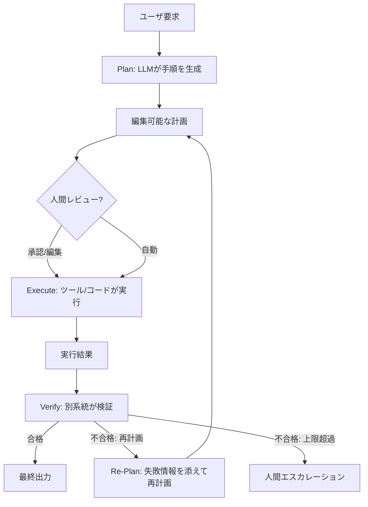

# Planner-Executor-Verifier｜計画・実行・検証の分離

## 一言で（TL;DR）

タスクを「計画（Plan）」「実行（Execute）」「検証（Verify）」の三相に分離する。計画は LLM が生成するが人間が編集可能な中間成果物とし、実行はツールやコードが担い、検証は生成系統とは別の系統で結果を判定する。相ごとに信頼境界を設けることで、ハルシネーションの波及を防ぎつつ複雑タスクの制御性を確保する。

## 解決する問題

LLM に「考えて・やって・確認して」を一気通貫で任せると、三つの力学が複合的に問題を生む。

まず、[1リクエストのコストが高い（F2）](../../concepts/design-forces.md)ため、試行錯誤的に実行してから結果を見て方針を変えるアプローチはトークンを浪費する。計画を先に立てれば、不要な実行を事前に刈り込める。

次に、[ハルシネーション（F4）](../../concepts/design-forces.md)は計画段階と検証段階の双方で発生しうる。計画を生成した同じ LLM が自分の出力を検証すると、同じバイアスで「正しい」と判定しやすい。生成と検証を別系統にすることで、この自己確証バイアスを断ち切る。

さらに、[自己ループ（F13）](../../concepts/design-forces.md)では、エージェントが計画なしに ReAct 的に行動すると、試行が際限なく連鎖するリスクがある。計画を先に確定させ、各ステップの完了条件を明示することでループに上限と終了基準を与える。

## 選定条件（When to use / When NOT）

- **使う条件**
    - タスクが複数ステップで構成され、実行前に手順の妥当性を人間またはシステムが確認できると価値がある。
    - `[failure_cost]` が中〜高で、誤った実行をやり直すコスト（金銭・データ破壊・信頼毀損）が大きい。
    - 実行結果を計画時の期待と照合できる検証基準が定義可能。
    - 計画が「人間に見せて承認を取る」中間成果物として機能する場面（デプロイ手順、データ移行計画など）。
- **使わない条件（＝代替に倒す）**
    - `[task_variability]` が極めて高く、環境が実行中に急激に変わるため計画が即座に陳腐化する → [B3 予算付き自律ループ](b3-agentic-loop-budget.md) で逐次的に適応する方が効率的。
    - タスクが1〜2ステップで完結し、計画・検証の分離がオーバーヘッドになる → 単純なワークフロー（[B2](b2-workflow-backbone.md)）で十分。
    - レイテンシ予算が極端に短く（数秒以内）、三相の往復が許容されない。

## 駆動変数とチューニング（程度）

| 目盛り | 効かなすぎ ⇔ 効きすぎ | 決め方 `[駆動変数]` | 目安（出発点） |
|---|---|---|---|
| 計画の粒度 | 粗すぎて実行が曖昧 ⇔ 細かすぎて計画生成コスト過多 | `[task_variability]` が高いほど粗くし再計画で補う | 1ステップ＝1ツール呼び出し程度。5〜15ステップが実用的上限 |
| 検証の厳格さ | 誤結果が後段に流れる ⇔ 正常結果も棄却しリトライ過多 | `[failure_cost]` が高い領域ほど厳格にする | 決定論的チェック（スキーマ・値域）を基本とし、高コスト経路のみ LLM Judge を追加 |
| 再計画の許可頻度 | 計画破綻に対応できない ⇔ 計画が形骸化しReActと変わらない | `[task_variability]` が高いほど再計画を許容。ただし再計画回数に上限を設ける | 最大2〜3回。超過したらフォールバックまたは人間エスカレーション |
| 人間承認の挿入点 | 承認なしで不可逆操作を実行 ⇔ 承認過多でスループット低下 | `[failure_cost]` × 不可逆性で決める | 不可逆な副作用の直前。読み取り専用ステップは自動実行 |

## 相反における立ち位置（相反）

- **[F-5 Plan-then-Execute vs ReAct](../../forks/index.md) → 計画先行側**。本パターンは計画を明示的な中間成果物として生成し、実行前に確定させる。環境が比較的静的で、計画の大部分が実行時にも有効であることが前提。`[task_variability]` が高まり、ステップの半数以上で再計画が必要になるなら ReAct（[B3](b3-agentic-loop-budget.md)）への移行を検討する。ハイブリッドとして「計画先行＋逸脱時のみ再計画」が実用的な折衷点。
- **[F-10 生成と検証を同一 vs 別系統](../../forks/index.md) → 別系統側**。検証フェーズは計画・実行を担った LLM とは別の系統で行う。理想は決定論的チェック（コード）だが、意味的な正しさの判定が必要なら別モデルや別プロンプトの LLM Judge（[B6](b6-critic-judge-sampling.md)）を使う。`[failure_cost]` が低い場合は同一 LLM の自己反省で一次検証し、高い場合のみ別系統を併用する段階的アプローチも取れる。

## 構造



計画は構造化データ（JSON/YAML）として生成し、人間とシステムの双方が読み書き可能にする。検証系統は Planner の LLM とは独立させる。

## 実装メモ

計画を構造化データとして扱う最小実装：

```python
from pydantic import BaseModel

class Step(BaseModel):
    id: int
    action: str          # ツール名
    params: dict         # ツール引数
    expected: str        # 期待される結果（検証基準）
    is_reversible: bool  # 可逆かどうか

class Plan(BaseModel):
    goal: str
    steps: list[Step]
    max_replans: int = 2

def plan(goal: str) -> Plan:
    """Planner LLM が構造化出力で計画を生成"""
    return planner_llm.generate(
        prompt=f"以下の目標を達成する手順を生成せよ: {goal}",
        response_format=Plan,
    )

def execute(plan: Plan) -> list[dict]:
    """各ステップを順次実行。不可逆ステップ前に承認を挟める"""
    results = []
    for step in plan.steps:
        if not step.is_reversible:
            require_human_approval(step)
        result = tool_registry.call(step.action, step.params)
        results.append({"step_id": step.id, "result": result})
    return results

def verify(plan: Plan, results: list[dict]) -> bool:
    """別系統で検証。決定論的チェック＋必要に応じてLLM Judge"""
    for step, result in zip(plan.steps, results):
        # 決定論的チェック
        if not deterministic_check(step.expected, result["result"]):
            return False
    # 高コスト経路は意味的検証を追加
    return judge_llm.evaluate(plan, results)
```

落とし穴：

- **計画が自然言語だけだと実行不能になる**。計画はツール名・引数・期待結果を含む構造化データとして生成する。自然言語の「説明」フィールドは人間向けに添えるが、実行には使わない。
- **再計画ループに上限を設けないと無限ループになる**。`max_replans` を設定し、超過したら人間にエスカレーションする。
- **検証が Planner と同じ LLM だと自己確証バイアスが入る**。別モデル、別プロンプト、または決定論的チェックを優先する。
- **部分実行の巻き戻しを考慮する**。計画の途中で検証に失敗した場合、実行済みステップの補償アクション（[F1 短TX長セッション](../f-data-integrity/f1-short-tx-long-session.md)）を計画に含めておく。

## 効かせる力学（forces）

- **F2（高コスト）**：計画を先に立てることで、不要なツール呼び出しや LLM 推論を事前に排除し、トークン消費を抑制する。計画の生成コストは、試行錯誤的な実行の総コストより概ね小さい。
- **F4（ハルシネーション）**：検証フェーズを生成系統と分離することで、Planner のハルシネーションを独立した系統で検出できる。計画段階のハルシネーション（存在しないツールを呼ぶ、不可能な手順を含む）も、計画の構造化検証で実行前に捕捉できる。
- **F13（自己ループ）**：計画がループの「地図」となり、各ステップに完了条件を持たせることで、目的なく巡回するループを防止する。再計画の上限を設けることでメタレベルのループも制御する。

## 関連・代替

- [B1 決定論的な殻](b1-deterministic-shell.md)：B1 の殻＝本パターンの計画相＋検証相、核＝実行相と対応する。B1 は汎用原則、B4 はその三相構成としての具体化。
- [B2 ワークフロー骨格](b2-workflow-backbone.md)：ワークフローの各ノードに計画・実行・検証を配置する設計。定型的な計画はワークフローとして固定し、動的な部分だけ Planner に委ねる。
- [B3 予算付き自律ループ](b3-agentic-loop-budget.md)：**代替**。環境が動的で計画が即座に陳腐化する場合、逐次適応する ReAct ループに予算上限を設ける方が効率的。
- [B6 Critic/Judge](b6-critic-judge-sampling.md)：検証フェーズの実装手段。決定論的チェックで不十分な意味的検証に LLM Judge を使う場合の設計指針。
- [C3 ドライラン](../c-tools-security/c3-dry-run-commit.md)：計画を「ドライランの結果」として人間に提示し、承認後に本実行する設計と相性が良い。
- [E1 リスクベース承認](../e-safety-hitl/e1-risk-based-approval.md)：計画内の不可逆ステップに対して、リスクに応じた承認レベルを設定する。

## コーディングエージェント向け指示（machine-actionable）

このパターンを人間に提案するなら、同時に以下を提案/確認する：

- [ ] 計画の出力形式を構造化データ（JSON/YAML）として設計し、ツール名・引数・期待結果・可逆性フラグを含めたか
- [ ] 検証フェーズに別系統を用意したか。`[failure_cost]` が高い場合は [B6 Critic/Judge](b6-critic-judge-sampling.md) の併置を検討したか
- [ ] 再計画の上限回数を `[task_variability]` から導き、超過時のエスカレーション先を定めたか
- [ ] 不可逆なステップに [E1 リスクベース承認](../e-safety-hitl/e1-risk-based-approval.md) を併置し、承認フローを設計したか
- [ ] 計画を人間に提示する UI/API を設計したか。[C3 ドライラン](../c-tools-security/c3-dry-run-commit.md) との統合を検討したか
- [ ] 目盛り（上表）の値を `[駆動変数]` から導き、**理由を添えて**提示したか
- [ ] 部分実行失敗時の補償アクションを計画に含める設計を検討したか
