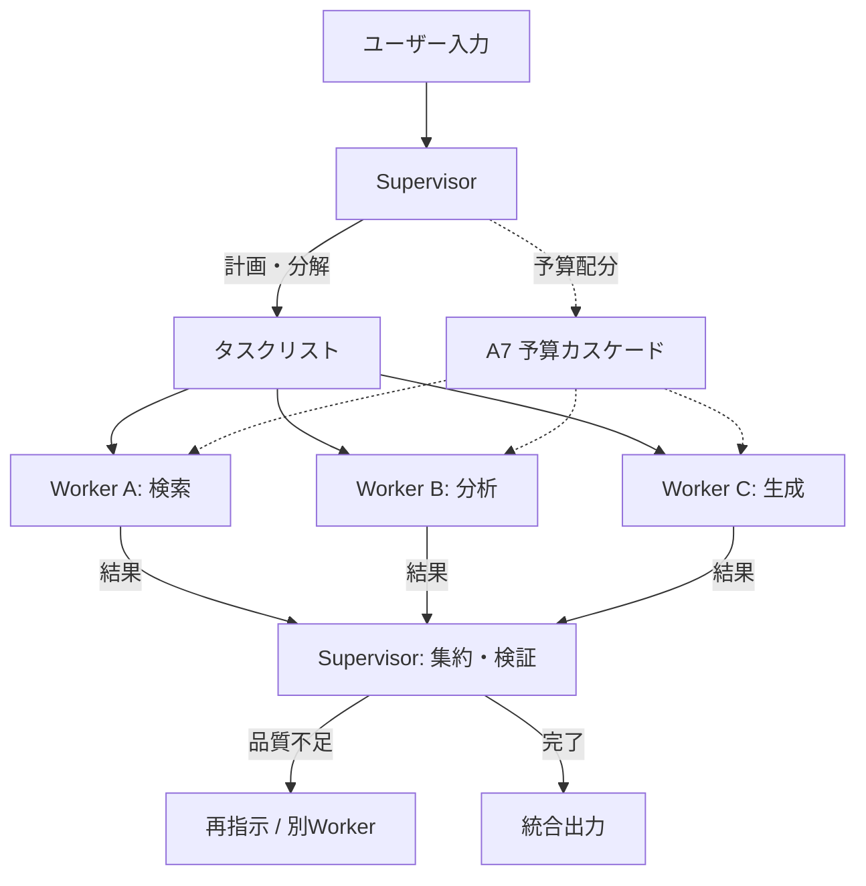

# Supervisor-Worker｜中央オーケストレーション

## 一言で（TL;DR）

中央の Supervisor がタスクを分解・分配し、専門化された Worker がそれぞれ独立コンテキストで実行します。結果を Supervisor が集約・検証する、マルチエージェント構成の最も基本的な中央集権パターンです。

## 解決する問題

単一エージェントに多種多様なタスクを処理させると、3つの問題が顕在化します。

第一に、[コンテキストで状態を跨ぐ（F6）](../../concepts/design-forces.md)ことの限界があります。異なる専門領域のツール定義・参照ドキュメント・中間結果をすべて1つのコンテキストウィンドウに詰め込むと、トークンが膨張し推論精度が下がります。Supervisor-Worker ではコンテキストを Worker ごとに分離し、各 Worker には自分の専門領域の情報だけを渡します。

第二に、[自己ループの暴走リスク（F13）](../../concepts/design-forces.md)があります。単一エージェントが多段タスクをループで回すと、ループの深さ・広さの双方が制御しにくくなります。Supervisor が計画と進捗を一元管理することで、全体のステップ上限・タイムアウト・予算を構造的に制御できます。

第三に、[再現性の低さ（F15）](../../concepts/design-forces.md)があります。どの Worker がどの入力でどの出力を返したかを Supervisor が記録することで、実行全体のトレースを構造化でき、障害時の再実行や部分リトライが可能になります。

## 選定条件（When to use / When NOT）

- **使う条件**
    - `[task_variability]` が高く、1つのリクエストに対して複数の専門性（検索・計算・コード生成・要約など）が必要な場合。
    - Worker 間のコンテキストを分離したい場合（ツール権限を分けたい、プロンプトインジェクション面を限定したいなど）。
    - Worker の一部を並列実行して `[latency_budget]` を節約したい場合。
    - Worker ごとにモデル・コスト・ツールセットを最適化して `[cost_sensitivity]` に対処したい場合。
- **使わない条件（＝代替に倒す）**
    - タスクが単一領域で完結し、専門性の分離が不要な場合 → [B3 予算付き自律ループ](b3-agentic-loop-budget.md) のシングルエージェントで足ります。
    - Worker 間の密な相互作用（議論・交渉・投票）が必要な場合 → コレオグラフィ型やディベート型を検討してください。
    - Worker 数が2以下で、分離のオーバーヘッドが利益を上回る場合 → シングルエージェントにツールを追加する方が単純です。

## 駆動変数とチューニング（程度）

| 目盛り | 効かなすぎ ⇔ 効きすぎ | 決め方 `[駆動変数]` | 目安（出発点） |
|---|---|---|---|
| Worker 数 | 1つに詰め込みすぎて精度低下 ⇔ 分割しすぎて調整コスト増大 | `[task_variability]` が高く専門性の軸が明確に分かれるほど増やす | 概ね 2〜5。専門性の軸が不明確なら増やさない |
| Worker あたりの予算（トークン/ステップ/時間） | 足りずに途中打切り ⇔ 1 Worker が全体予算を食い潰す | `[cost_sensitivity]` が高いほど厳しく絞り、[A7 予算カスケード](../a-execution/a7-deadline-budget-cascade.md) で分配 | 全体予算の 1/N を上限とし、Supervisor に予備を残す |
| Supervisor の計画粒度 | 粗すぎて Worker が迷走 ⇔ 細かすぎて Supervisor のトークン消費過大 | `[task_variability]` が高いほど粗い指示にし Worker の裁量を残す | タスク名・期待出力形式・制約を含む1段落程度 |
| Worker のモデル選択 | 全員最上位モデルでコスト過大 ⇔ 軽量すぎて品質不足 | `[cost_sensitivity]` と各 Worker の要求精度で決める。[B7 モデルルーター](b7-model-router-adaptive-effort.md) を参照 | Supervisor は高性能、定型 Worker は軽量モデル |
| コンテキスト共有の範囲 | 完全分離で必要な文脈が届かない ⇔ 共有しすぎてコンテキスト膨張 | `[cost_sensitivity]` と Worker 間依存度で判断 | Supervisor が各 Worker に必要最小限のサブセットを渡す |

## 相反における立ち位置（相反）

- **[F-2 シングル vs マルチエージェント](../../forks/index.md) → マルチ側**。本パターンはマルチエージェントの典型形です。`[task_variability]` が低く1エージェントで収まるなら [B3](b3-agentic-loop-budget.md) で十分であり、マルチ化は過剰です。マルチ化の判断基準は「専門性の軸が2つ以上あり、コンテキスト分離の利益が調整コストを上回るか」です。
- **[F-3 オーケストレーション vs コレオグラフィ](../../forks/index.md) → オーケストレーション側**。Supervisor が全 Worker の投入・順序・集約を制御する中央集権構造です。`[accountability]` が高い業務系ではオーケストレーションが監査しやすくなります。Worker 間が疎結合で独立にイベント駆動できる場合はコレオグラフィを検討しますが、実行全体の可視性は下がります。

## 構造



Supervisor はタスク分解後、Worker を並列または直列に起動します。各 Worker は独立したコンテキストウィンドウで動作し、結果を構造化された形式で返します。Supervisor は結果を集約し、品質が不十分であれば再指示またはフォールバックを行います。

## 実装メモ

Supervisor-Worker の最小構造（擬似コード）：

```python
class Task(BaseModel):
    id: str
    description: str
    worker_type: str          # どの Worker に割り当てるか
    expected_output: str      # 期待する出力形式
    budget: Budget            # トークン/ステップ/時間の上限

class WorkerResult(BaseModel):
    task_id: str
    status: Literal["success", "failure", "partial"]
    output: Any
    tokens_used: int

def supervisor_run(user_input: str, total_budget: Budget) -> str:
    # 1. 計画: タスク分解
    tasks = supervisor_llm.plan(user_input, response_format=list[Task])

    # 2. 予算配分（A7）
    distribute_budget(tasks, total_budget, reserve_ratio=0.2)

    # 3. Worker 実行（並列可能なものは並列）
    results: list[WorkerResult] = []
    for batch in topological_sort(tasks):
        batch_results = parallel_execute(
            [workers[t.worker_type].run(t) for t in batch]
        )
        results.extend(batch_results)

    # 4. 集約・検証
    final = supervisor_llm.aggregate(user_input, results)
    return final
```

落とし穴：

- **Worker の障害伝播を設計してください**。1 Worker の失敗が全体をブロックしないよう、タイムアウトと部分結果での縮退を用意します。Worker が失敗したタスクについて Supervisor が「スキップして先に進む」か「再試行する」か「別 Worker に回す」かを判断できるようにしておきます。
- **Supervisor 自身のコンテキスト膨張に注意してください**。Worker 数が増えると Supervisor が受け取る結果の総量も増えます。Worker の出力は要約やスキーマ化で圧縮し、Supervisor には判断に必要な情報だけ返すようにします。
- **Worker 間の暗黙の依存を避けてください**。Worker A の結果を Worker B が必要とする場合、Supervisor が明示的に受け渡します。Worker 同士が直接通信するとオーケストレーションの利点（可視性・制御）が失われます。
- **Worker のツール権限を最小化してください**。各 Worker には必要なツールだけを付与し、Supervisor のツールセットとは分離します。これによりプロンプトインジェクションの被害範囲を Worker 単位に限定できます。

## 効かせる力学（forces）

- **F6（コンテキスト/メモリで状態を跨ぐ）**：Worker ごとにコンテキストを分離し、各 Worker は自分の専門領域に必要な情報だけを持ちます。共有が必要な情報は Supervisor が明示的に受け渡すため、コンテキストの境界が明確になります。
- **F13（自己ループ）**：各 Worker のループ上限は Worker 単位で設定でき、Supervisor は全体のステップ数・時間・トークンを一元管理します。Worker が暴走しても Supervisor がタイムアウトで打ち切れます。
- **F15（再現性が低い）**：Supervisor がどのタスクをどの Worker に割り当て、各 Worker がどの入出力を返したかを構造的に記録できます。[G2 全ホップ分散トレース](../g-observability-ops/g2-end-to-end-tracing.md) と併用すれば、障害の原因 Worker を特定し、そこだけ再実行できます。

## 関連・代替

- [A7 予算カスケード](../a-execution/a7-deadline-budget-cascade.md)：Supervisor が Worker に予算を分配する仕組みです。本パターンと組み合わせて全体の予算超過を防ぎます。
- [B1 決定論的な殻](b1-deterministic-shell.md)：Supervisor の計画・分配・集約ロジックを殻として決定論的に実装し、LLM推論は Worker 内の核に閉じ込める構成が有効です。
- [B3 予算付き自律ループ](b3-agentic-loop-budget.md)：各 Worker の内部構造として自律ループを使います。また、マルチエージェント化が不要なときの代替になります。
- [B4 計画-実行-検証](b4-planner-executor-verifier.md)：Supervisor の計画フェーズを独立させた構成です。計画の品質が重要なとき併用します。
- [B7 モデルルーター](b7-model-router-adaptive-effort.md)：Worker ごとに最適なモデルを選択する戦略です。`[cost_sensitivity]` が高いとき重要になります。
- [G2 全ホップ分散トレース](../g-observability-ops/g2-end-to-end-tracing.md)：Supervisor → Worker の全通信をトレースし、障害の原因 Worker を特定します。マルチエージェント構成では必須に近いです。
- **代替**: [B3 予算付き自律ループ](b3-agentic-loop-budget.md) — タスクが単一領域で完結し、コンテキスト分離の利益がないときはシングルエージェントで十分です。

## コーディングエージェント向け指示（machine-actionable）

このパターンを人間に提案するなら、同時に以下を提案/確認してください：

- [ ] Worker の専門性の軸を列挙し、**なぜ分離が必要か**を `[task_variability]` から説明したか
- [ ] [A7 予算カスケード](../a-execution/a7-deadline-budget-cascade.md) で Worker への予算配分を設計し、`[cost_sensitivity]` に基づく根拠を示したか
- [ ] Worker ごとのモデル選択を [B7 モデルルーター](b7-model-router-adaptive-effort.md) で検討したか
- [ ] [G2 全ホップ分散トレース](../g-observability-ops/g2-end-to-end-tracing.md) で Supervisor-Worker 間の通信トレースを設計したか
- [ ] Supervisor の計画ロジックを [B1 決定論的な殻](b1-deterministic-shell.md) で殻に寄せるか判断したか
- [ ] Worker の障害時の縮退戦略（スキップ/再試行/代替 Worker）を定義したか
- [ ] 目盛り（上表）の値を `[駆動変数]` から導き、**理由を添えて**提示したか
- [ ] シングルエージェント（[B3](b3-agentic-loop-budget.md)）で足りないかを先に検討し、マルチ化の根拠を示したか
