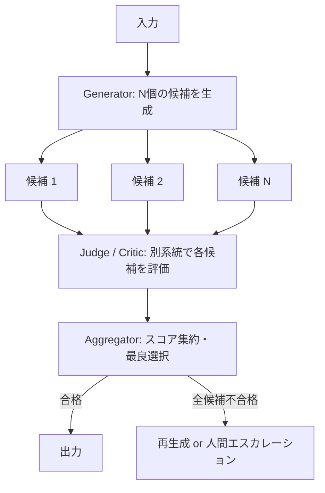

# Critic/Judge & Sampling-Aggregation｜独立検証と多数決

## 一言で（TL;DR）

生成と検証を別の系統（別モデル・別プロンプト・決定論的コード）で行い、高リスクな判断では N 個の候補を生成して最良を選ぶことで、確率的出力の信頼性を構造的に高める。

## 解決する問題

LLM は[確率的に出力が揺れ（F3）](../../concepts/design-forces.md)、[事実と異なる内容をもっともらしく生成する（F4）](../../concepts/design-forces.md)。生成と検証を同一のモデル・プロンプトに任せると、生成時のバイアスが検証にも引き継がれ、誤りを見逃す「自己確認バイアス」が生じる。たとえば法律文書のドラフトを生成した LLM に「この文書は正しいか」と尋ねても、自分の生成物に対して肯定的に評価しやすい。

本パターンは 2 つの相補的手法を組み合わせてこの問題に対処する。

1. **Critic/Judge（独立検証）** --- 生成系とは別のモデル、別のプロンプト、あるいは決定論的なコードで出力を検証する。系統を分離することで自己確認バイアスを断ち切る。
2. **Sampling-Aggregation（多数決）** --- 同じ入力から N 個の候補を生成し、スコアリングや多数決で最良を選ぶ。確率的なばらつきを逆手に取り、外れ値を排除する。

両者を組み合わせると「N 個生成し、各候補を Judge が評価し、最高スコアを採用する」という構成になる。コストは N 倍になるため、`[request_value]` と `[failure_cost]` が高い経路に限定して適用する。

## 選定条件（When to use / When NOT）

- **使う条件**
    - `[failure_cost]` が中〜高で、誤った出力がそのまま下流に流れると実害がある（契約書生成、医療要約、金融レポートなど）。
    - `[request_value]` が高く、1 回の生成に追加コストをかける経済合理性がある。
    - 生成物の品質を客観的に評価できる基準（正確性、一貫性、スキーマ適合など）が存在する。
- **使わない条件（＝代替に倒す）**
    - `[failure_cost]` が低く、多少の誤りが許容されるカジュアルな対話 → 単一生成＋[E3 ガードレール](../e-safety-hitl/e3-guardrail-sandwich.md)で十分。
    - レイテンシ予算が極めて厳しい（数百ミリ秒以内）場合 → N 回生成の直列/並列コストが許容できない。単一生成＋決定論的検証に絞る。
    - 評価基準が主観的で定量化困難（創作文章の「面白さ」など）→ Judge の信頼性が低く、コストに見合わない可能性がある。

## 駆動変数とチューニング（程度）

| 目盛り | 効かなすぎ ⇔ 効きすぎ | 決め方 `[駆動変数]` | 目安（出発点） |
|---|---|---|---|
| Best-of-N の N | 誤り見逃し ⇔ コスト・レイテンシ爆発 | `[request_value]` が高いほど N を増やす | 通常 N=1（検証のみ）、高リスク経路で N=3〜5。N>5 は収穫逓減が顕著（概ね N=3 で誤り率が 1/3〜1/5 に低下するとの報告あり） |
| 生成時の temperature | 候補が均質で多様性なし ⇔ 品質下限が下がる | `[request_value]` × タスク特性 | 構造化出力: 0〜0.3、対話・要約: 0.5〜0.7、創作・ブレスト: 0.8 以上 |
| Judge の独立性 | 自己確認バイアス残存 ⇔ 運用コスト増大 | `[failure_cost]` が高いほど独立性を上げる | 低リスク: 同モデル別プロンプト、中リスク: 別モデル、高リスク: 決定論コード＋別モデルの二重検証 |
| 集約方式 | 単純多数決で微妙な品質差を見逃す ⇔ 複雑な重み付けで運用困難 | `[failure_cost]` の性質（正確性重視 vs 一貫性重視） | 事実性重視: スコアリング（Judge が 0〜1 で採点）、一貫性重視: 多数決（合意率を確認） |

## 相反における立ち位置（相反）

- **[F-10 生成と検証を同一 vs 別系統](../../forks/index.md) → 別系統（separate）**。本パターンの本質は生成と検証の系統分離にある。`[failure_cost]` が高い領域では、Judge を生成系とは異なるモデルまたは決定論的コードで構成し、バイアスの独立性を確保する。`[failure_cost]` が低い場合は同一モデルの別プロンプトによる self-reflection でも一定の効果がある（ただし完全な独立性は得られない）。

## 構造



N=1（Critic/Judge のみ）の場合は Generator → Judge → 合否判定というシンプルな直列構成になる。

## 実装メモ

Judge の最小実装（擬似コード）：

```python
def generate_and_judge(prompt: str, n: int = 1) -> str:
    # 候補生成（並列化推奨）
    candidates = [
        generator_llm.generate(prompt, temperature=0.7)
        for _ in range(n)
    ]

    # Judge による評価（生成系と別モデル or 別プロンプト）
    scored = []
    for candidate in candidates:
        score = judge_llm.generate(
            prompt=f"以下の出力を正確性・完全性の観点で0-10で採点し、"
                   f"理由を述べよ。\n\n{candidate}",
            response_format=JudgeSchema,  # {"score": int, "reason": str}
        )
        scored.append((candidate, score))

    # 最高スコアを選択（閾値チェック付き）
    best = max(scored, key=lambda x: x[1].score)
    if best[1].score < THRESHOLD:
        raise EscalationRequired(best[1].reason)
    return best[0]
```

落とし穴：

- **Judge が Generator と同じバイアスを持つ場合がある**。同じモデル・同じ知識で評価すると、同じ種類の誤りを見逃す。可能であれば異なるモデルファミリを使うか、決定論的チェック（正規表現、データベース照合、計算検証）を Judge の一部に組み込む。
- **N を増やしてもコストは線形に増える**。N=3 と N=5 の品質差は N=1 と N=3 の差より小さいことが多い。まず N=3 から始めて評価する。
- **Judge のプロンプトに評価基準を明示する**。「正しいか」だけでは Judge も曖昧な判断をする。事実性、論理的整合性、スキーマ適合など具体的な評価軸とルーブリックを与える。
- **全候補が不合格のケースを設計する**。Judge が全候補を棄却した場合のフォールバック（人間エスカレーション、別モデルでの再生成など）を決めておく。

## 効かせる力学（forces）

- **F3（確率的）**：複数候補の生成と多数決により、単一生成の確率的揺れを統計的に平滑化する。N 個の独立試行の最良を選ぶことで、期待品質が単一生成を上回る。
- **F4（ハルシネーション）**：生成系とは独立した Judge がハルシネーションを検出する。特に事実照合やスキーマ検証を決定論的コードで実装した Judge は、LLM 単体では検出困難なハルシネーションを捕捉できる。

## 関連・代替

- [B1 決定論的な殻](b1-deterministic-shell.md)：殻の検証ロジックに本パターンの Judge を組み込む。殻が決定論的検証を担い、Judge が意味的検証を補完する構成が強力。
- [B4 計画-実行-検証](b4-planner-executor-verifier.md)：検証フェーズを本パターンの Judge で実装できる。計画の妥当性評価にも Critic を適用可能。
- [E3 ガードレール](../e-safety-hitl/e3-guardrail-sandwich.md)：入出力の安全性検証。本パターンの Judge が品質を評価し、ガードレールが安全性を検証するという役割分担。
- [E4 構造化出力](../e-safety-hitl/e4-verified-structured-output.md)：Judge の出力（スコア、理由）を構造化することで、集約ロジックを決定論的に実装できる。
- [G4 評価ハーネス](../g-observability-ops/g4-eval-harness.md)：本番投入前に Judge の精度を評価するためのテスト基盤。Judge 自体の信頼性を定量評価するために併用する。

## コーディングエージェント向け指示（machine-actionable）

このパターンを人間に提案するなら、同時に以下を提案/確認する：

- [ ] `[failure_cost]` の水準から Judge の独立性レベル（同モデル別プロンプト / 別モデル / 決定論コード）を導き、**理由を添えて**提示したか
- [ ] `[request_value]` から Best-of-N の N を決定し、コスト増（N 倍）が経済合理的であることを確認したか
- [ ] Judge の評価基準（ルーブリック）を具体的に定義したか。曖昧な「正しいか」ではなく、測定可能な軸を列挙したか
- [ ] 全候補不合格時のフォールバック（人間エスカレーション / 再生成上限）を設計したか
- [ ] Judge の出力に [E4 構造化出力](../e-safety-hitl/e4-verified-structured-output.md) を適用し、スコア集約を決定論的に実装する設計にしたか
- [ ] [G4 評価ハーネス](../g-observability-ops/g4-eval-harness.md) で Judge 自体の精度（偽陽性率・偽陰性率）を測定する計画を立てたか
- [ ] 目盛り（上表）の値を `[駆動変数]` から導き、**理由を添えて**提示したか
