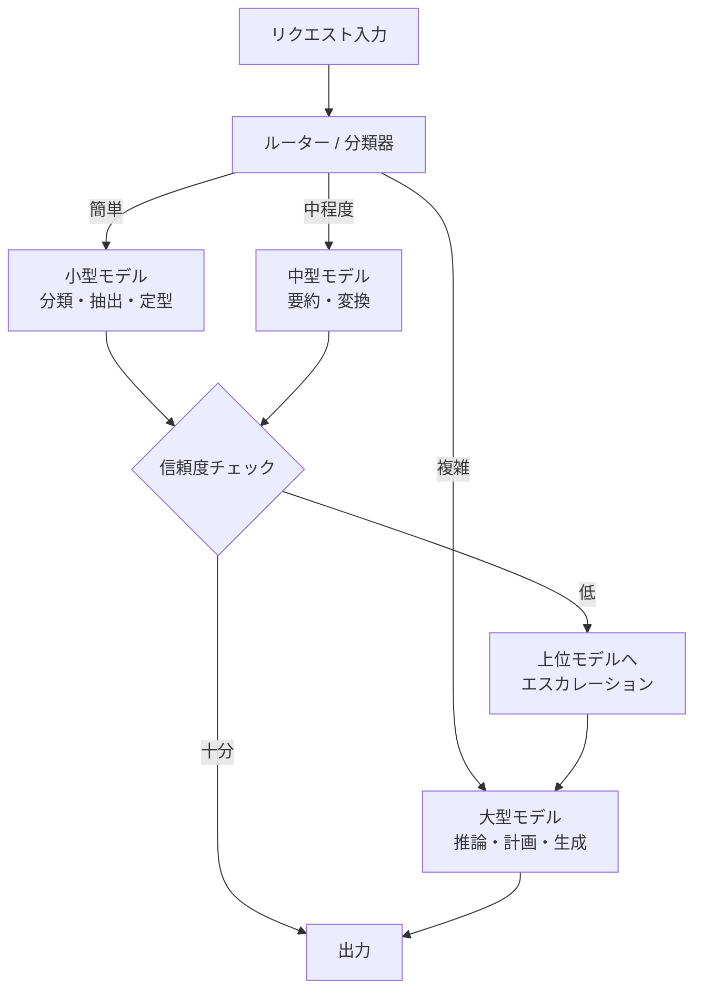

# Model Router & Adaptive Effort｜モデル段階化と適応的努力配分

## 一言で（TL;DR）

タスクの難易度・種別・リスクに応じて呼び出すモデルを動的に選択し、まず軽量モデルで試行、信頼度が低ければ上位モデルへエスカレーションすることで、品質を落とさずにコストとレイテンシを最適化します。

## 解決する問題

すべてのリクエストを最高性能モデルで処理すると[1リクエストあたりのコストが累積し（F2）](../../concepts/design-forces.md)、月間予算を容易に超過します。一方、すべてを軽量モデルに寄せると複雑な推論や計画タスクで品質が崩壊します。また、モデルごとに[レイテンシ分布が異なり（F12）](../../concepts/design-forces.md)、大型モデルは裾の重い応答遅延を示すため、単純なタスクにまで大型モデルを使うとシステム全体のレイテンシが不必要に悪化します。

モデル段階化がなければ、「コストか品質か」の二者択一に陥り、タスク特性に応じた合理的な計算資源配分ができません。

## 選定条件（When to use / When NOT）

- **使う条件**
    - タスクの種類が多岐にわたり、分類/抽出のような定型処理と、推論/計画のような高度処理が混在している場合。
    - `[cost_sensitivity]` が中〜高で、月間コスト上限が明確に存在する場合。
    - トラフィックが十分にあり、ルーティングの分類コスト（ルーター自身の推論コストまたはヒューリスティック実装コスト）を回収できる場合。
- **使わない条件（＝代替に倒す）**
    - すべてのリクエストが同程度の難易度（例：定型分類のみ）で、モデルを分ける意味がない場合 → 単一モデルで [B1 決定論的な殻](b1-deterministic-shell.md) を適用します。
    - `[request_value]` が全件で極めて高く、品質を1%でも落とすリスクが許容できない場合 → 常に最高性能モデルを使い、[D6 セマンティックキャッシュ](../d-memory-context/d6-semantic-cache-nocache-zones.md) でコスト削減を図ります。
    - リクエスト量が少なく（月数百件以下）、ルーティング機構の開発・運用コストが節約額を上回る場合。

## 駆動変数とチューニング（程度）

| 目盛り | 効かなすぎ ⇔ 効きすぎ | 決め方 `[駆動変数]` | 目安（出発点） |
|---|---|---|---|
| モデル階層数 | 1層=コスト最適化なし ⇔ 多層=ルーティング複雑・遅延増 | `[cost_sensitivity]` が高いほど層を増やす価値がある | 2〜3層（小型・中型・大型）が運用しやすい出発点 |
| エスカレーション閾値（信頼度） | 低すぎ=何でも上位に昇格しコスト増 ⇔ 高すぎ=品質不足を見逃す | `[request_value]` が高い経路ほど閾値を下げて早めにエスカレーション | 信頼度スコア 0.7〜0.85 を出発点に、ドメインごとの評価で調整 |
| ルーター方式 | ヒューリスティック=粗い分類 ⇔ LLMルーター=高精度だがコスト | `[cost_sensitivity]` が極めて高いならヒューリスティック（入力長・キーワード）で十分 | まずルールベース、精度不足ならメタ分類器を追加 |
| キャッシュ併用度 | キャッシュなし=同一クエリを毎回課金 ⇔ 過剰=陳腐化リスク | `[cost_sensitivity]` が高く同一パターンが多いなら積極活用 | [D6](../d-memory-context/d6-semantic-cache-nocache-zones.md) と組み合わせ、TTL は用途に応じて設定 |

## 相反における立ち位置（相反）

- **[F-8 単一プロバイダ vs マルチプロバイダ](../../forks/index.md) → ハイブリッド**。モデル段階化は本質的にマルチモデルであり、異なるプロバイダのモデルを組み合わせることでコスト最適化の幅が広がります。ただし抽象化層（共通インターフェース）を介して差替可能にしておくことが前提です。`[provider_trust]` が低い環境ではフォールバック先としても機能します（[G5](../g-observability-ops/g5-circuit-breaker-degradation.md) と連携）。

## 構造



## 実装メモ

ルーティングの最小構造（擬似コード）：

```python
TIERS = {
    "small":  {"model": "claude-haiku", "max_tokens": 1024},
    "medium": {"model": "claude-sonnet", "max_tokens": 4096},
    "large":  {"model": "claude-opus", "max_tokens": 8192},
}

def classify_task(request: Request) -> str:
    """ヒューリスティック分類。LLMルーターに昇格も可。"""
    if request.task_type in ("classify", "extract", "tag"):
        return "small"
    if request.input_tokens > 8000 or request.task_type in ("reason", "plan"):
        return "large"
    return "medium"

def route_and_execute(request: Request) -> Response:
    tier = classify_task(request)
    response = call_model(TIERS[tier], request)

    # エスカレーション: 信頼度が閾値未満なら上位へ
    if tier != "large" and response.confidence < ESCALATION_THRESHOLD:
        response = call_model(TIERS["large"], request)

    return response
```

落とし穴：

- **ルーター自身のコストを無視しないでください**。LLM をルーターに使うと、分類コストだけで軽量モデル1回分に匹敵する場合があります。トラフィックが少ないうちはルールベースで始めます。
- **信頼度の定義を明確にしてください**。構造化出力のパースエラー率、回答の拒否率、内部ログ確率など、測定可能な指標に落とし込みます。「なんとなく自信がない」では運用できません。
- **エスカレーション無限ループを防いでください**。上位モデルでも信頼度が低い場合の打ち切り条件を設定します。最上位で失敗したら人間エスカレーションまたはエラー返却とします。
- **モデル更新時のドリフトに備えてください**。プロバイダのモデルバージョンが変わると分類精度やコスト比が変動します。定期的にルーティング比率とコストを監視し、閾値を再調整します。

## 効かせる力学（forces）

- **F2（高コスト）**：タスク難易度に応じてモデルを選択することで、簡単なタスクに高コストモデルを使う無駄を排除します。実運用では全リクエストの概ね60〜80%が小型・中型モデルで処理でき、コストを大幅に削減できることが多いです（実測値はドメインに依存します）。
- **F12（レイテンシばらつき）**：小型モデルは応答時間が短く分散も小さいです。大半のリクエストを小型で処理することで、システム全体の P95 レイテンシを改善します。上位モデルへのエスカレーションはレイテンシ増加を伴うため、[A7 予算カスケード](../a-execution/a7-deadline-budget-cascade.md) と組み合わせて全体の時間予算を管理します。

## 関連・代替

- [A6 適応タイムアウト・リトライ](../a-execution/a6-adaptive-timeout-retry.md)：リトライ時に上位モデルではなくあえて下位モデルにダウングレードする戦略と組み合わせられます（コスト制約下でのリトライ）。
- [A7 予算カスケード](../a-execution/a7-deadline-budget-cascade.md)：エスカレーションを含む全体の時間・コスト予算を管理する枠組みです。B7 の各層が A7 の予算内で動作します。
- [B1 決定論的な殻](b1-deterministic-shell.md)：殻がルーティング判定を担います。モデル選択ロジック自体は決定論的に実装し、殻に置きます。
- [B5 Supervisor-Worker](b5-supervisor-worker.md)：Worker ごとに最適なモデルを割り当てます。Supervisor が B7 のルーター役を兼ねることもあります。
- [D6 セマンティックキャッシュ](../d-memory-context/d6-semantic-cache-nocache-zones.md)：ルーティングの前段でキャッシュヒットすればモデル呼び出し自体を省略できます。コスト最適化の組み合わせとして有効です。
- [G5 サーキットブレーカ](../g-observability-ops/g5-circuit-breaker-degradation.md)：特定モデル/プロバイダの障害時に、サーキットブレーカが自動的に別モデルへフォールバックします。B7 の階層構造がフォールバック経路を自然に提供します。

## コーディングエージェント向け指示（machine-actionable）

このパターンを人間に提案するなら、同時に以下を提案/確認してください：

- [ ] タスク種別の分類基準を定義し、各カテゴリにどのモデル層を割り当てるかを表で示したか
- [ ] エスカレーション閾値を `[request_value]` から導き、**高価値リクエストでは閾値を下げる理由**を説明したか
- [ ] `[cost_sensitivity]` が高いなら [D6 セマンティックキャッシュ](../d-memory-context/d6-semantic-cache-nocache-zones.md) との併用を提案したか
- [ ] プロバイダ障害時のフォールバックとして [G5 サーキットブレーカ](../g-observability-ops/g5-circuit-breaker-degradation.md) を併置したか
- [ ] ルーティング判定を [B1 決定論的な殻](b1-deterministic-shell.md) に配置し、LLM に委ねていないか確認したか
- [ ] モデル層ごとのコスト・レイテンシ見積もりを示し、月間コスト削減の試算を添えたか
- [ ] 目盛り（上表）の値を `[駆動変数]` から導き、**理由を添えて**提示したか
