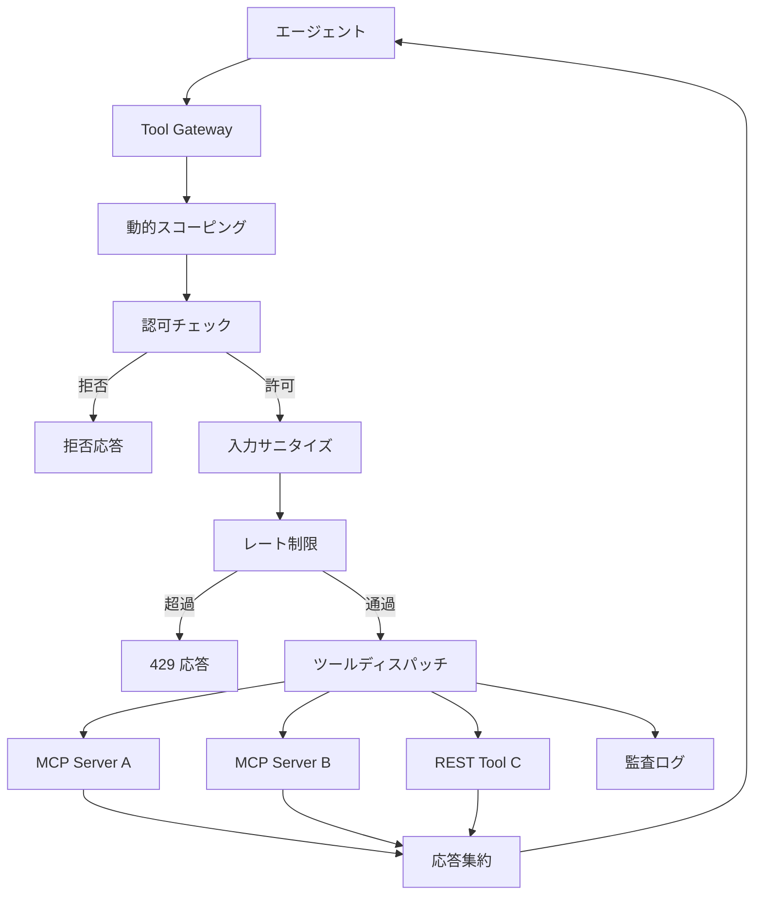

# Tool Gateway / MCP Broker｜ツールゲートウェイ・MCP仲介

## 一言で（TL;DR）

エージェントから外部ツール・MCP サーバへのすべての呼び出しを単一のゲートウェイ層に集約し、認可・レート制限・入力サニタイズ・監査ログ・動的ツールスコーピングを一元管理する。ツールの追加・削除がエージェント本体のコード変更なしに行える「チョークポイント」を作るパターン。

## 解決する問題

エージェントが複数の外部ツールや MCP サーバを直接呼び出す構成では、以下の問題が分散して発生する。

[ツール/MCP で副作用を持つ（F8）](../../concepts/design-forces.md)特性により、各ツールが独立にデータ変更・送信・決済などを実行し、呼び出し順序や二重実行の制御が各所に散らばる。[プロンプトインジェクション（F14）](../../concepts/design-forces.md)により、悪意ある入力がツール引数に混入してもツール側で弾けず、権限昇格や意図しない操作につながる。[監査対象（F16）](../../concepts/design-forces.md)の観点では、呼び出しログが各ツールに分散していると「いつ・誰の権限で・なぜこのツールが呼ばれたか」を後から追跡するコストが跳ね上がる。

単一ゲートウェイを挟むことで、認可・入力検証・レート制限・ログ取得をツールごとに個別実装する必要がなくなり、セキュリティポリシーの一貫性と監査の網羅性を確保する。

## 選定条件（When to use / When NOT）

- **使う条件**
    - エージェントが呼び出し可能なツールが複数あり、少なくとも一つは副作用を持つ（書き込み・送信・課金など）。
    - `[input_trust]` が低い：ユーザ入力や外部データがツール引数に含まれうるため、サニタイズの一元化が必要。
    - `[accountability]` が中〜高：後から「どのツールが、どの引数で、誰の権限で呼ばれたか」を説明する義務がある。
    - MCP サーバを複数接続しており、それぞれの認可・バージョン管理を統一したい。
- **使わない条件（＝代替に倒す）**
    - ツールが1つだけ、かつ読み取り専用 → ゲートウェイのオーバーヘッドが見合わない。直接呼び出しで十分。
    - すべてのツールが社内かつ信頼済みで、`[input_trust]` が高く `[accountability]` も低い実験環境 → ゲートウェイは後回しにし、まずプロトタイプを優先する。

## 駆動変数とチューニング（程度）

| 目盛り | 効かなすぎ ⇔ 効きすぎ | 決め方 `[駆動変数]` | 目安（出発点） |
|---|---|---|---|
| 同時露出ツール数 | 仕事ができない ⇔ LLM が選択ミス・幻ツール呼び出し | 文脈に応じて動的スコーピングで必要分だけ露出 `[input_trust]` | 同時露出は概ね 10〜20 以下。超過時はルーティング層で分割 |
| 認可粒度 | 粗すぎて権限昇格を許す ⇔ 細かすぎて運用負荷・遅延増 | `[accountability]` が高いほど細粒度（ツール×操作×リソース単位） | 副作用ツールは操作単位で認可。読取ツールはカテゴリ単位でよい |
| レート制限 | 暴走ループでコスト爆発 ⇔ 正当な連続呼び出しをブロック | `[input_trust]` が低いほど厳格に。コスト感度も加味 | 書込系は概ね 5〜20 req/min/session。読取系は緩めに 60〜120 |
| 入力サニタイズ深度 | インジェクションを素通し ⇔ 正当な入力を過剰拒否 | `[input_trust]` が低いほど深く。スキーマ検証＋値域チェック＋パターン除外 | 全ツールでスキーマ検証は必須。外部入力が混ざるツールのみパターン除外を追加 |
| 監査ログ粒度 | 障害・不正時に再現できない ⇔ ストレージコスト爆発 | `[accountability]` が高いほど全量に近づける | 書込系は全量。読取系は標本（1〜10%）または成功は要約のみ |

## 相反における立ち位置（相反）

- **[F-15 読取専用 vs 書込可能](../../forks/index.md) → ハイブリッド**。ゲートウェイは読取と書込の両方を通すが、ポリシーの厳しさを非対称にする。読取は [C2 Read-Free / Write-Gated](c2-read-free-write-gated.md) の原則に従い比較的自由に、書込はゲートで認可・承認・dry-run を挟む。この非対称制御を一元的に実現するのがゲートウェイの役割であり、`[input_trust]` が低いほど読取側にもサニタイズを強化する。

## 構造



ゲートウェイが単一の通過点（チョークポイント）となり、エージェントは個々の MCP サーバやツール API の存在を意識しない。ツールの追加・削除はゲートウェイの設定変更だけで完結する。

## 実装メモ

ゲートウェイのポリシー定義（概念例）：

```yaml
tools:
  - name: "db_query"
    type: read
    auth: category    # カテゴリ単位認可
    rate_limit: 120/min
    sanitize: schema_only
    log: sample_10pct

  - name: "send_email"
    type: write
    auth: per_operation  # 操作単位認可
    rate_limit: 5/min
    sanitize: schema + pattern_block
    log: full
    requires_approval: true  # HITL承認

  - name: "payment_execute"
    type: write
    auth: per_resource   # リソース単位認可
    rate_limit: 3/min
    sanitize: schema + pattern_block + value_range
    log: full
    requires_approval: true
    idempotency_key: required
```

動的スコーピングの最小実装（擬似コード）：

```python
def resolve_tools(context: TaskContext) -> list[ToolSpec]:
    """タスク種別・ユーザ権限・会話フェーズに応じて露出ツールを絞る"""
    all_tools = registry.get_all()
    scoped = [t for t in all_tools if t.matches(context.task_type)]
    permitted = [t for t in scoped if authz.check(context.user, t)]
    if len(permitted) > MAX_EXPOSED:
        # ルーティング層で分割し、メタツール経由で段階的に露出
        return group_into_routers(permitted)
    return permitted
```

落とし穴：

- **ゲートウェイ自体が単一障害点になる**。ヘルスチェックと縮退モード（読取のみ許可など）を設計しておく。
- **MCP サーバ間でスキーマが不統一**。ゲートウェイ層でツール名・引数名の正規化を行い、エージェント側に一貫したインターフェースを提供する。
- **認可とサニタイズをプロンプトで行わない**。「このツールは使わないで」とプロンプトに書いてもインジェクションで迂回される。認可はコードで強制する（[B1 決定論的な殻](../b-orchestration/b1-deterministic-shell.md)の原則）。
- **レート制限はセッション単位とグローバル単位の二層で設ける**。セッション単位だけでは大量セッション攻撃を防げない。

## 効かせる力学（forces）

- **F8（ツール/MCP 副作用）**：副作用を持つツール呼び出しがすべてゲートウェイを通過するため、認可漏れ・二重実行・未記録の操作が構造的に排除される。冪等キーの強制（[C4](c4-idempotent-command-envelope.md)）もゲートウェイ層で一元適用できる。
- **F14（プロンプトインジェクション）**：入力サニタイズと認可をコードで強制し、インジェクションによる権限昇格を防ぐ。動的スコーピングにより、そもそも危険なツールが LLM の選択肢に入らない状態を作れる。
- **F16（監査対象）**：全呼び出しがゲートウェイを通るため、「いつ・誰の権限で・どの引数で」を単一ログストアに記録できる。トレースID を付与して [G2 トレース](../g-observability-ops/g2-end-to-end-tracing.md) と接続すればエンドツーエンドの監査証跡になる。

## 関連・代替

- [B1 決定論的な殻](../b-orchestration/b1-deterministic-shell.md)：殻がゲートウェイ経由でツール呼び出しを制御する。ゲートウェイは殻の一部として機能する。
- [C2 Read-Free / Write-Gated](c2-read-free-write-gated.md)：ゲートウェイ内部のポリシーとして読取自由・書込ゲートを実現する。本パターンの具体的なポリシー戦略。
- [C5 Capability Lease](c5-capability-lease.md)：ゲートウェイが発行する短命トークンで権限の有効期間を制限する。長時間セッションでの権限拡散を防ぐ。
- [C6 Confused Deputy 防御](c6-confused-deputy-defense.md)：ゲートウェイがリクエスト元の権限を伝搬し、ツールがエージェントの権限ではなくユーザの権限で動作するようにする。
- [E2 Policy-as-Code](../e-safety-hitl/e2-policy-as-code.md)：ゲートウェイの認可ルールを OPA/Cedar 等のポリシーエンジンに外部化し、デプロイなしでルール変更可能にする。`[accountability]` が高い場合に併用を推奨。
- [G2 構造化トレース](../g-observability-ops/g2-end-to-end-tracing.md)：ゲートウェイが発行するトレースIDと接続し、ツール呼び出しをエンドツーエンドで追跡可能にする。

## コーディングエージェント向け指示（machine-actionable）

このパターンを人間に提案するなら、同時に以下を提案/確認する：

- [ ] `[input_trust]` の水準を確認し、動的スコーピングの同時露出ツール数と入力サニタイズ深度を**理由を添えて**提示したか
- [ ] `[accountability]` の水準を確認し、認可粒度と監査ログ粒度を導出したか
- [ ] 書込ツールがあるなら [C2 Read-Free / Write-Gated](c2-read-free-write-gated.md) のポリシー分離を併せて提案したか
- [ ] 長時間セッションがあるなら [C5 Capability Lease](c5-capability-lease.md) で短命権限の発行を検討したか
- [ ] ユーザ権限の伝搬が必要なら [C6 Confused Deputy 防御](c6-confused-deputy-defense.md) を併置したか
- [ ] `[accountability]` が高いなら [E2 Policy-as-Code](../e-safety-hitl/e2-policy-as-code.md) でポリシー外部化を提案したか
- [ ] [G2 構造化トレース](../g-observability-ops/g2-end-to-end-tracing.md) との接続を設計し、トレースID の付与方針を示したか
- [ ] 目盛り（上表）の値を `[駆動変数]` から導き、**理由を添えて**提示したか
- [ ] ゲートウェイの可用性設計（縮退モード・ヘルスチェック）を検討したか
