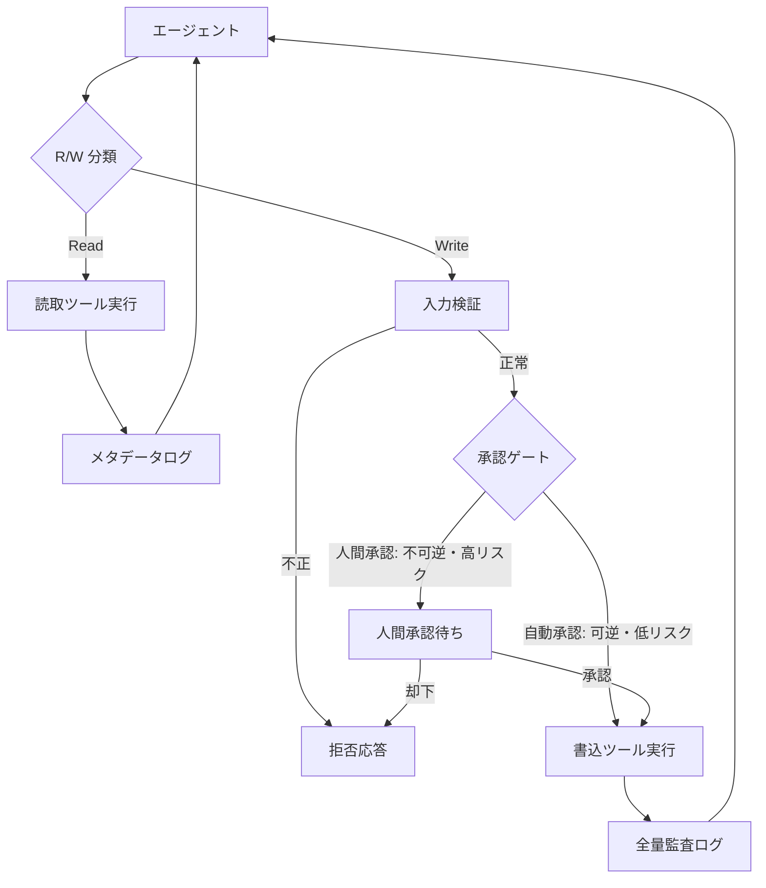

# Read-Free / Write-Gated｜読取自由・書込ゲート

## 一言で（TL;DR）

エージェントのツール呼び出しを「読取（検索・取得・参照）」と「書込（作成・更新・削除・送信）」に二分し、読取は自由に許可する一方、書込にだけ認可・検証・承認・監査のゲートを設ける非対称アクセス制御です。承認疲れを劇的に減らしつつ、副作用の安全性を維持します。

## 解決する問題

エージェントのツール呼び出しには副作用を伴うものと伴わないものが混在します。[ツール/MCP で副作用を持つ（F8）](../../concepts/design-forces.md)特性に対して、すべてのツール呼び出しを一律に承認・検証の対象にすると、人間は大量の承認リクエストに晒されます。実際の運用では読取操作が呼び出しの大半を占めるため、読取にまで承認を求めると承認疲れ（approval fatigue）が発生し、肝心の書込操作の承認が形骸化してしまいます。

一方、すべてを自由に許可すれば、副作用のある書込操作で取り返しのつかない変更を実行するリスクが残ります。本パターンは「読取は副作用がないから自由でよい」「書込は副作用があるから制御する」という非対称性を明示的に設計に組み込み、安全性と生産性のバランスを取ります。

## 選定条件（When to use / When NOT）

- **使う条件**
    - エージェントが呼び出すツールに読取と書込が混在しており、読取が多数を占めます。
    - `[reversibility]` が低い書込操作（メール送信、決済実行、本番DB変更など）が含まれます。
    - 承認疲れを防ぎたい場合です。すべてのツール呼び出しにゲートを設けると人間のレビュー帯域を超えてしまいます。
    - [C1 Tool Gateway](c1-tool-gateway-mcp-broker.md) と組み合わせて、ゲートウェイ内部のポリシー戦略として採用できます。

- **使わない条件（＝代替に倒す）**
    - 読取操作自体が機密データへのアクセスを含む（個人情報検索、機密文書閲覧など）場合は、読取にも認可が必要です。Read-Free ではなく全操作をゲート対象とし、[C1 Tool Gateway](c1-tool-gateway-mcp-broker.md) のフル認可で管理します。
    - `[reversibility]` が高く `[failure_cost]` も低い実験環境の場合です。書込もゲートなしで許可して開発速度を優先し、本番移行時に本パターンを導入します。
    - ツールが読取専用で書込操作がそもそも存在しない場合です。ゲートの実装自体が不要になります。

## 駆動変数とチューニング（程度）

| 目盛り | 効かなすぎ ⇔ 効きすぎ | 決め方 `[駆動変数]` | 目安（出発点） |
|---|---|---|---|
| 書込ゲートの厳格度 | ゲートなしで誤操作が素通り ⇔ 軽微な書込にも多段承認で遅延 | `[reversibility]` が低いほどゲートを厳格に。可逆な書込（下書き保存など）は緩めてよい | 不可逆操作は人間承認必須、可逆操作はポリシー検証のみ |
| 書込の検証深度 | スキーマだけで危険な値を素通し ⇔ 過剰な検証で正当な書込を拒否 | `[failure_cost]` が高いほど値域・整合性まで検証を深くする | 低リスク：スキーマ検証のみ。高リスク：スキーマ＋値域＋ビジネスルール検証 |
| 監査ログの粒度 | 書込ログ不在で事後追跡不能 ⇔ 全読取もフルログでストレージ圧迫 | `[failure_cost]` が高いほど書込の全量記録。読取は標本で十分なことが多い | 書込は全量記録。読取はメタデータのみ、または 1〜10% 標本 |
| R/W 分類の見直し頻度 | 分類が陳腐化して新ツールが未分類のまま通過 ⇔ 頻繁な変更で運用コスト増 | ツール追加のペースに応じて。新ツール追加時に必ず分類を行うプロセスを設ける | 新ツール登録時に分類を必須化。四半期ごとに全ツールを棚卸し |

## 相反における立ち位置（相反）

- **[F-15 読取専用 vs 書込可能](../../forks/index.md) → ハイブリッド**。完全な読取専用エージェントは安全ですが実用性に欠け、完全な書込自由は危険すぎます。本パターンは折衷として「読取は自由、書込はゲート」に倒します。この分類自体は決定論的に（プロンプトではなくコードで）行い、[B1 決定論的な殻](../b-orchestration/b1-deterministic-shell.md)の原則に従います。`[reversibility]` が低い領域ほどゲートを厳格に、`[failure_cost]` が高い領域ほど検証を多重にします。

## 構造



R/W 分類はツール定義時に静的に付与されます（ツール登録メタデータの `type: read | write`）。分類はコードで強制し、LLM の判断に委ねません。

## 実装メモ

ツール定義での R/W 分類（概念例）：

```yaml
tools:
  # 読取：自由に実行可能
  - name: search_documents
    type: read
    gate: none
  - name: get_user_profile
    type: read
    gate: none

  # 書込（低リスク・可逆）：ポリシー検証のみ
  - name: save_draft
    type: write
    gate: auto          # ポリシー検証のみ、人間承認不要
    reversible: true

  # 書込（高リスク・不可逆）：人間承認必須
  - name: send_email
    type: write
    gate: human_approval
    reversible: false
  - name: execute_payment
    type: write
    gate: human_approval
    reversible: false
    requires_dry_run: true  # C3 dry-run を前段で必須化
```

R/W 判定の最小実装（擬似コード）：

```python
def dispatch_tool(call: ToolCall, context: SessionContext):
    tool_def = registry.get(call.tool_name)

    if tool_def.type == "read":
        result = execute(call)
        log_metadata(call, result)  # 読取はメタデータのみ
        return result

    # 書込パス：検証 → ゲート → 実行 → 監査
    validate_input(call, tool_def.schema)

    if tool_def.gate == "human_approval":
        approval = request_human_approval(call, context)
        if not approval.granted:
            return RejectedResponse(approval.reason)

    result = execute(call)
    audit_log_full(call, result, context)  # 書込は全量記録
    return result
```

落とし穴：

- **R/W 分類を LLM に任せてはいけません**。ツールの読取/書込はツール定義時に静的に決めます。LLM が「これは読取だ」と判断して書込ツールをゲートなしで呼び出す経路は、インジェクション耐性を破壊します。
- **「読取だが副作用がある」操作に注意してください**。外部 API の呼び出し回数がカウントされる場合や、閲覧履歴が記録される場合など、名目上は読取でも副作用を持つ操作があります。このようなケースは書込に分類するか、レート制限を設けます。
- **書込ゲートの粒度を一律にしないでください**。可逆な書込（下書き保存）と不可逆な書込（メール送信）を同じ厳格度にすると、可逆な操作の承認疲れが不可逆な操作の承認を形骸化させます。`[reversibility]` に基づいてゲートの厳格度を段階化します。

## 効かせる力学（forces）

- **F8（ツール/MCP 副作用）**：副作用を「ある（書込）」と「ない（読取）」に明示的に二分し、副作用がある操作だけに検証・承認・監査を集中させます。これにより副作用の安全制御コストを最小化しつつ、承認疲れによる形骸化を防ぎます。

## 関連・代替

- [B1 決定論的な殻](../b-orchestration/b1-deterministic-shell.md)：殻が R/W 分類とゲート判定を担います。分類をコードで強制する構造的な基盤です。
- [C1 Tool Gateway / MCP Broker](c1-tool-gateway-mcp-broker.md)：ゲートウェイ内部のポリシー戦略として本パターンを適用します。ゲートウェイが R/W 分類とゲート制御の実行基盤になります。
- [C3 Dry-run & Commit](c3-dry-run-commit.md)：書込ゲートの具体的な実装手段です。不可逆な書込操作では dry-run で差分を提示してから実行します。
- [C1 Tool Gateway / MCP Broker](c1-tool-gateway-mcp-broker.md)：ゲートウェイの短命権限リース機能で書込権限を短命リースとして発行し、有効期間を限定します。長時間セッションで書込権限が拡散するのを防ぎます。
- [E1 リスクベース承認](../e-safety-hitl/e1-risk-based-approval.md)：書込ゲートにおける承認判定の詳細戦略です。リスクスコアに応じて自動承認・人間承認を振り分けます。

## コーディングエージェント向け指示（machine-actionable）

このパターンを人間に提案するなら、同時に以下を提案/確認します：

- [ ] 対象システムのツール一覧を洗い出し、各ツールを read / write に分類したか
- [ ] 「読取だが副作用がある」操作を特定し、write に再分類またはレート制限を設けたか
- [ ] `[reversibility]` の水準からゲートの厳格度（自動承認 / 人間承認）を導出し、**理由を添えて**提示したか
- [ ] `[failure_cost]` の水準から書込の検証深度を導出し、**理由を添えて**提示したか
- [ ] R/W 分類をコードで強制する構成を設計し、[B1 決定論的な殻](../b-orchestration/b1-deterministic-shell.md) との統合を示したか
- [ ] 不可逆な書込には [C3 Dry-run & Commit](c3-dry-run-commit.md) の前段挿入を提案したか
- [ ] [C1 Tool Gateway](c1-tool-gateway-mcp-broker.md) をゲートの実行基盤として併用する構成を示したか
- [ ] 長時間セッションなら [C1 Tool Gateway](c1-tool-gateway-mcp-broker.md) の短命権限リース機能で書込権限の有効期間を限定したか
- [ ] 目盛り（上表）の値を `[駆動変数]` から導き、**理由を添えて**提示したか
