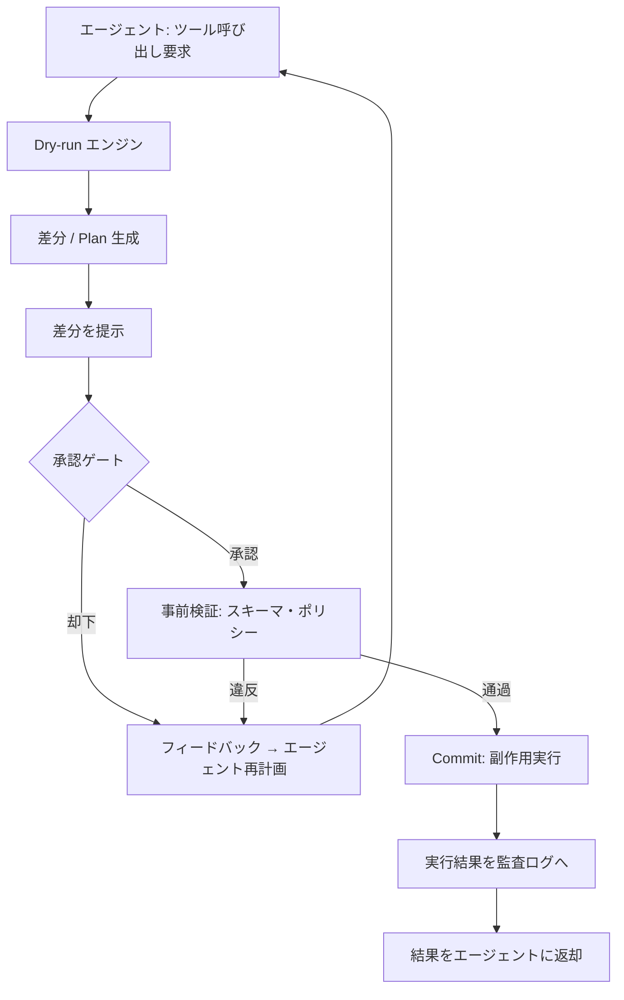

# Dry-run & Commit / Plan-then-Apply｜差分提示してから実行

## 一言で（TL;DR）

副作用を伴う操作を一気に実行せず、まず「何が変わるか」の差分（plan）を生成して提示し、人間またはバリデータの承認を得てから実際に適用（commit/apply）する。Terraform の `plan → apply`、データベースのマイグレーション・プレビュー、Git の `diff → commit` と同じ二相プロトコルをエージェントのツール呼び出しに適用するパターン。

## 解決する問題

LLM は[ハルシネーションにより意図しないパラメータを生成する場合がある（F4）](../../concepts/design-forces.md)。さらに[ツール呼び出しは副作用を伴い（F8）](../../concepts/design-forces.md)、一度実行すると取り消せない操作も多い。この2つが掛け合わさると、エージェントがハルシネーションしたパラメータで不可逆な副作用を実行し、ロールバック不能な障害を引き起こすリスクが生まれる。

dry-run なしで直接実行するシステムでは、人間が「エージェントが何をしようとしているか」を事前に確認する手段がなく、問題は事後にしか検出できない。本パターンは実行前に計画を可視化する層を挟むことで、ハルシネーションや誤パラメータを副作用の発生前に捕捉する。

## 選定条件（When to use / When NOT）

- **使う条件**
    - `[reversibility]` が低い操作（データ削除、外部API書き込み、課金処理、インフラ変更など）をエージェントが実行する。
    - `[failure_cost]` が中〜高で、誤操作が金銭的・法的・運用的な実害を生む。
    - ユーザーまたは自動バリデータが差分を評価できるだけの `[latency_budget]` がある（概ね数秒〜数分の待機が許容される）。
- **使わない条件（＝代替に倒す）**
    - すべての操作が読み取り専用 → [C2 Read-Free / Write-Gated](c2-read-free-write-gated.md) の Read-Free 層だけで十分。dry-run は不要。
    - `[reversibility]` が高く `[failure_cost]` も低い操作（チャット応答生成、ログ出力など） → 二相のオーバーヘッドが利益を上回る。直接実行してよい。
    - レイテンシ制約が極めて厳しく承認待ちが許容されない → [C4 冪等コマンド](c4-idempotent-command-envelope.md) で安全に自動実行し、事後に監査する方式を検討する。

判定の目安として、`[reversibility]` が低いか `[failure_cost]` が高い場合のいずれかに該当すれば、本パターンの適用を検討すべきである。両方に該当する場合は必須と見なしてよい。

## 駆動変数とチューニング（程度）

| 目盛り | 効かなすぎ ⇔ 効きすぎ | 決め方 `[駆動変数]` | 目安（出発点） |
|---|---|---|---|
| dry-run 対象の範囲 | 不可逆操作が素通り ⇔ 読取操作にも承認を求めUX劣化 | `[reversibility]` が低い操作だけを対象にする | 書込・削除・外部API変更・課金系を対象。読取は対象外 |
| 差分の粒度 | 粗すぎて判断不能 ⇔ 細かすぎて認知負荷過大 | `[failure_cost]` が高いほど詳細な差分を提示 | 変更前後の値、影響行数、ロールバック手順の3点を含める |
| 承認方式 | 自動承認で意味なし ⇔ 全件人間レビューでボトルネック | `[failure_cost]` × `[reversibility]` で層別化 | 高リスク=人間承認、中リスク=ポリシー自動検証、低リスク=自動承認 |
| plan の有効期限（TTL） | 長すぎて状態乖離 ⇔ 短すぎて承認前に期限切れ | `[latency_budget]` と外部状態の変化速度で決める | 概ね5〜30分。状態変化が速い環境ほど短く |

## 相反における立ち位置（相反）

- **[F-15 読取専用 vs 書込可能](../../forks/index.md) → hybrid（計画は読取、実行は承認後の書込）**。本パターンは F-15 のハイブリッド戦略を具体化したものである。dry-run フェーズではシステムを一切変更せず読取のみで差分を計算し、commit フェーズでのみ書込を行う。`[reversibility]` が低いほど dry-run の網羅性を上げ、`[failure_cost]` が高いほど承認ゲートを厳格にする。

## 構造



## 実装メモ

dry-run / commit の最小実装（擬似コード）:

```python
def execute_tool(agent_request: ToolRequest) -> ToolResult:
    # Phase 1: Dry-run（副作用なし）
    plan = dry_run(agent_request)
    # plan には変更前後の値、影響範囲、ロールバック手順を含む

    # Phase 2: 承認
    approval = request_approval(
        plan=plan,
        ttl=timedelta(minutes=15),
        mode=select_approval_mode(agent_request.risk_level),
    )
    if not approval.granted:
        return ToolResult(status="rejected", reason=approval.reason)

    # Phase 3: Commit（plan が TTL 内かつ前提条件が変わっていないか確認）
    if plan.is_expired():
        return ToolResult(status="expired", reason="Plan TTL exceeded, re-plan required")
    if not plan.preconditions_still_hold():
        return ToolResult(status="stale", reason="State changed since plan creation")

    result = commit(plan)
    audit_log.record(plan=plan, result=result, approval=approval)
    return result
```

落とし穴:

- **plan と commit の間に状態が変わる問題（TOCTOU）**。plan 生成時の前提条件を commit 時に再検証する。Terraform が `plan` ファイルにステートハッシュを埋め込むのと同じ発想。前提条件が崩れたら plan を再生成する。
- **dry-run が完全でない場合がある**。外部APIが dry-run モードを提供していない場合は、パラメータ検証とシミュレーションで代替する。この場合、差分の「推定」であることを明示する。
- **plan の肥大化**。大量の変更を1つの plan にまとめると、レビューが困難になる。操作単位を適度に分割し、1つの plan が概ね10件以下の変更に収まるようにする。
- **承認のバイパス防止**。commit エンドポイントが plan ID なしで呼べてしまうと、dry-run を迂回できる。commit は必ず有効な plan ID と承認トークンを要求する設計にする。

## 効かせる力学（forces）

- **F4（ハルシネーション）**: LLM が生成したパラメータを直接実行せず、まず差分として可視化する。ハルシネーションによる異常値（存在しないリソースID、桁違いの金額など）を承認者またはバリデータが副作用の発生前に検出できる。
- **F8（ツール副作用）**: 副作用の実行を承認後の commit フェーズに限定することで、意図しない変更のリスクを大幅に低減する。plan が却下された場合は副作用がゼロのまま再計画に戻る。

## 関連・代替

- [B1 決定論的な殻](../b-orchestration/b1-deterministic-shell.md): 殻が dry-run / commit の判定ロジック（どの操作に dry-run を要求するか）を担う。本パターンは殻の中の副作用管理に特化した具体化。
- [C2 Read-Free / Write-Gated](c2-read-free-write-gated.md): 読取と書込の権限分離。本パターンは Write-Gated の「ゲート」を「差分提示→承認」という二相プロトコルとして実装したもの。
- [C4 冪等コマンド](c4-idempotent-command-envelope.md): commit フェーズでの安全網。承認後の実行が冪等キー付きであれば、ネットワーク障害時のリトライでも重複実行を防げる。
- [E1 リスクベース承認](../e-safety-hitl/e1-risk-based-approval.md): 承認ゲートのリスクレベル判定ロジック。本パターンの承認方式を「全件人間」から「リスクに応じた段階的承認」に洗練する。
- [G2 エンドツーエンドトレース](../g-observability-ops/g2-end-to-end-tracing.md): plan 生成・承認・commit の各フェーズをトレーススパンとして記録し、事後監査を可能にする。

## コーディングエージェント向け指示（machine-actionable）

このパターンを人間に提案するなら、同時に以下を提案/確認する：

- [ ] dry-run 対象の操作一覧を `[reversibility]` から導き、**なぜその操作を対象にするか**を理由付きで示したか
- [ ] 承認方式（人間 / ポリシー自動 / 自動）を `[failure_cost]` のレベル別に設計したか
- [ ] plan の TTL を `[latency_budget]` から導き、TOCTOU 対策（前提条件の再検証）を設計に含めたか
- [ ] commit エンドポイントの直接呼び出し防止（plan ID + 承認トークン必須）を設計したか
- [ ] 不可逆な副作用があるなら [E1 リスクベース承認](../e-safety-hitl/e1-risk-based-approval.md) を併置したか
- [ ] commit の冪等性を [C4 冪等コマンド](c4-idempotent-command-envelope.md) で担保する設計を含めたか
- [ ] dry-run / 承認 / commit の各フェーズを [G2 トレース](../g-observability-ops/g2-end-to-end-tracing.md) で記録する設計を含めたか
- [ ] 目盛り（上表）の値を `[駆動変数]` から導き、**理由を添えて**提示したか
