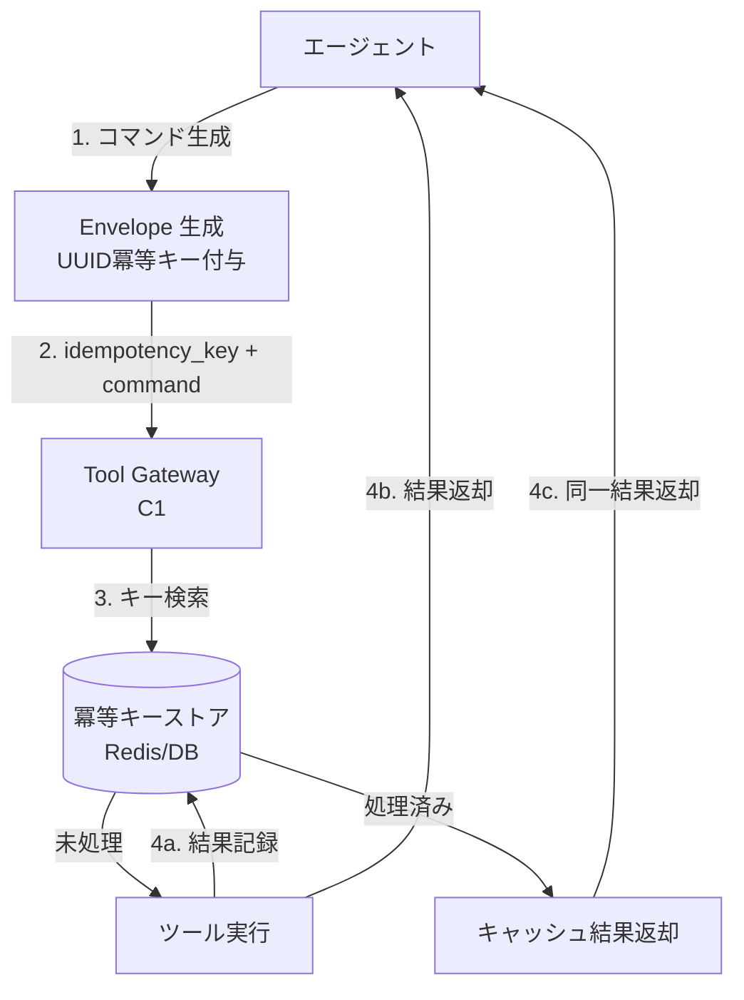

# Idempotent Command Envelope｜冪等コマンド包装

## 一言で（TL;DR）

エージェントが発行する全副作用コマンドに UUID ベースの冪等キー（idempotency key）を付与し、受け手側が「処理済みなら結果をキャッシュ返却、未処理なら実行して結果を記録」するパターン。確率的な再試行（F3）やツール副作用（F8）に対し、二重実行を構造的に排除する。

## 解決する問題

AIエージェントは[確率的に動作し（F3）](../../concepts/design-forces.md)、LLMの応答途絶やプロバイダ障害で同じステップを再実行することがある。また[ツール呼び出しは副作用を持ち（F8）](../../concepts/design-forces.md)、決済・データ更新・外部API呼び出しなどの書込操作が含まれる。この二つが組み合わさると、次の問題が生じる。

1. **リトライによる二重実行** — ネットワークタイムアウト後にリトライしたが、実は先行リクエストは到達済みで、決済が2回走る。
2. **チェックポイント再開時の重複** — [A2 耐久非同期](../a-execution/a2-durable-async-agent.md) でセッションを中間地点から再開した際、既に完了したステップが再度実行される。
3. **サーガ補償の不整合** — [C8 サーガ](c8-saga-compensation.md) の補償ステップが二重発火し、返金が重複する。

従来のWebサービスでも冪等性は重要だが、エージェントでは「同じ意図のリクエストを複数回生成する確率」が人間操作より格段に高い。モデルの出力揺らぎ、ストリーミング途絶、コンテキスト再構成による同一ツール呼び出しの再生成が日常的に起きるため、冪等キーは任意のベストプラクティスではなく**構造的必須要件**になる。

## 選定条件（When to use / When NOT）

- **使う条件**
    - エージェントが書込操作（決済、DB更新、メール送信、外部API呼び出し等）を行い、リトライや再開が発生しうる。
    - `[reversibility]` が低い（やり直しが困難な操作を含む）。
    - [A6 適応リトライ](../a-execution/a6-adaptive-timeout-retry.md) を採用しており、リトライ時の安全性保証が必要。
- **使わない条件**
    - 全操作が**読取専用**（参照クエリ、検索、分類のみ）で副作用がない → 冪等キーのオーバーヘッドは不要。
    - 下流システムが**自然冪等**（upsert、PUT with ETag など）で、追加の包装なしに安全 → キーの付与は冗長だが、監査目的で残す判断もある。
    - レイテンシ予算が極めて厳しく、キー検証のラウンドトリップが許容できない → ただしこのケースでは副作用操作自体を同期経路から外すべき。

## 駆動変数とチューニング（程度）

| 目盛り | 効かなすぎ ⇔ 効きすぎ | 決め方 `[駆動変数]` | 目安（出発点） |
|---|---|---|---|
| 冪等キー適用範囲 | 一部の書込だけ → 二重実行リスク残存 ⇔ 読取にも付与 → 無駄なストア肥大 | `[reversibility]` が低い操作ほど必須。高い操作は省略可 | 全 write 操作に付与。read は対象外 |
| キー結果保持期間（TTL） | 短すぎ → 遅延リトライで二重実行 ⇔ 長すぎ → ストレージ肥大 | セッション最大時間 × 安全係数。`[reversibility]` が低いほど長く保持 | 概ね 24–72 時間。サーガ補償がある場合はサーガ TTL に合わせる |
| キー粒度 | 粗すぎ（セッション単位） → 別操作が衝突 ⇔ 細かすぎ（サブ操作単位） → 管理コスト増 | ツール呼び出し1回を1キーが基本。`[reversibility]` が極低の操作は引数ハッシュも含め厳密に | ツール呼び出し単位。1 tool_call_id = 1 idempotency_key |

## 相反における立ち位置（相反）

- **[F-15 読取専用 vs 書込可能エージェント](../../forks/index.md) → hybrid**。読取は自由に許可しつつ、書込操作を冪等キーで包むことで安全に書込を開放する。`[reversibility]` が低いほど冪等キーの厳密性（キー生成ルール、TTL、ストア耐久性）を上げる。完全に読取専用で済むなら本パターンは不要だが、書込が必要になった瞬間に導入する。

## 構造



## 実装メモ

冪等コマンド包装の最小構造：

```json
{
  "idempotency_key": "550e8400-e29b-41d4-a716-446655440000",
  "tool": "payment.charge",
  "args": {"customer_id": "cust_123", "amount": 5000, "currency": "JPY"},
  "created_at": "2025-01-15T10:30:00Z",
  "session_id": "sess_abc",
  "step_index": 3
}
```

キーストアの処理フロー（擬似コード）：

```python
def execute_with_idempotency(envelope):
    key = envelope["idempotency_key"]

    # アトミックに「処理中」をマーク（SETNX相当）
    acquired = store.set_if_absent(key, {"status": "in_progress"}, ttl=TTL)

    if not acquired:
        existing = store.get(key)
        if existing["status"] == "completed":
            return existing["result"]        # キャッシュ返却
        if existing["status"] == "in_progress":
            raise RetryLater()               # 先行リクエスト実行中

    try:
        result = tool_gateway.execute(envelope["tool"], envelope["args"])
        store.update(key, {"status": "completed", "result": result})
        return result
    except Exception as e:
        store.delete(key)                    # 失敗時はキーを解放しリトライ可能に
        raise
```

落とし穴：

- **キーの生成タイミング** — キーはエージェントがコマンドを「意図した時点」で生成し、リトライ時は同じキーを再利用する。リトライごとに新しい UUID を振ると冪等性が崩壊する。ツール呼び出しフレームワーク側で `tool_call_id` をそのまま冪等キーに使うのが最も自然。
- **in_progress のタイムアウト** — 先行リクエストがクラッシュすると `in_progress` のまま残り、リトライが永久にブロックされる。ロック TTL（概ね 30–60 秒）を設け、超過したら解放する。
- **部分実行の扱い** — 複数の副作用を持つ複合操作では、途中で失敗するとキーの状態が不整合になる。複合操作は [C3 dry-run & commit](c3-dry-run-commit.md) で分割し、各ステップに個別の冪等キーを付与する。
- **ストアの耐久性** — 冪等キーストアがインメモリのみだと、プロセス再起動で消失しリトライ安全性が崩れる。`[reversibility]` が低い操作のキーは Redis の永続化か RDB に保存する。
- **レスポンスの一貫性** — キャッシュ返却時の HTTP ステータスは初回と同一にする。201 で作成したリソースを 2 回目も 201 で返すか 200 で返すかはAPIの慣習に従うが、レスポンスボディは同一であるべき。

## 効かせる力学（forces）

- **F3（確率的）** — LLMの出力揺らぎやストリーミング途絶で同一コマンドが再生成されても、冪等キーにより結果が安定する。「同じ意図」が複数回発火しうるエージェント特有の不確実性を吸収する。
- **F8（ツール副作用）** — 決済・データ更新などの不可逆な副作用を持つツール呼び出しに対し、リトライ・再開時の二重実行を構造的に防止する。[C1 ツールゲートウェイ](c1-tool-gateway-mcp-broker.md) で冪等キーの検証を一元化すると、個別ツール側の実装負荷が下がる。

## 関連・代替

- [A2 耐久非同期](../a-execution/a2-durable-async-agent.md) — チェックポイントからの再開時に、完了済みステップの二重実行を防ぐ。本パターンが A2 の再開安全性の基盤となる。
- [A6 適応リトライ](../a-execution/a6-adaptive-timeout-retry.md) — リトライ戦略を定義するパターン。非冪等書込のリトライには本パターンの冪等キーが前提条件。
- [C1 ツールゲートウェイ](c1-tool-gateway-mcp-broker.md) — 全ツール呼び出しの入口で冪等キー検証を一元的に行う。本パターンの実装レイヤとして最適。
- [C3 dry-run & commit](c3-dry-run-commit.md) — commit フェーズで冪等キーを付与し、承認済み操作の二重実行を防ぐ。
- [C8 サーガ補償](c8-saga-compensation.md) — サーガの各ステップ（実行・補償とも）に冪等キーを付与し、補償の二重発火を防止する。
- [F1 短トランザクション長セッション](../f-data-integrity/f1-short-tx-long-session.md) — 短トランザクション内で冪等キーのチェックと書込をアトミックに実行し、TOCTOU 問題を防ぐ。

## コーディングエージェント向け指示（machine-actionable）

このパターンを人間に提案するなら、同時に以下を提案/確認する：

- [ ] 全書込操作（ツール呼び出し）に冪等キーを付与する設計になっているか。`[reversibility]` が低い操作を洗い出したか
- [ ] 冪等キーストアの耐久性を `[reversibility]` に応じて選定したか（低 → RDB/永続化Redis、高 → インメモリ可）
- [ ] キー TTL をセッション最大時間に基づいて設定し、**理由を添えて**提示したか
- [ ] [A6 適応リトライ](../a-execution/a6-adaptive-timeout-retry.md) と組み合わせ、リトライ時に冪等キーを再利用する設計になっているか
- [ ] [C1 ツールゲートウェイ](c1-tool-gateway-mcp-broker.md) で冪等キー検証を一元化する構成を提案したか
- [ ] [C8 サーガ補償](c8-saga-compensation.md) を採用する場合、補償ステップにも冪等キーを付与しているか
- [ ] 不可逆な副作用がある場合、[C3 dry-run & commit](c3-dry-run-commit.md) との併用を検討したか
- [ ] 目盛り（上表）の値を `[reversibility]` から導き、**理由を添えて**提示したか
