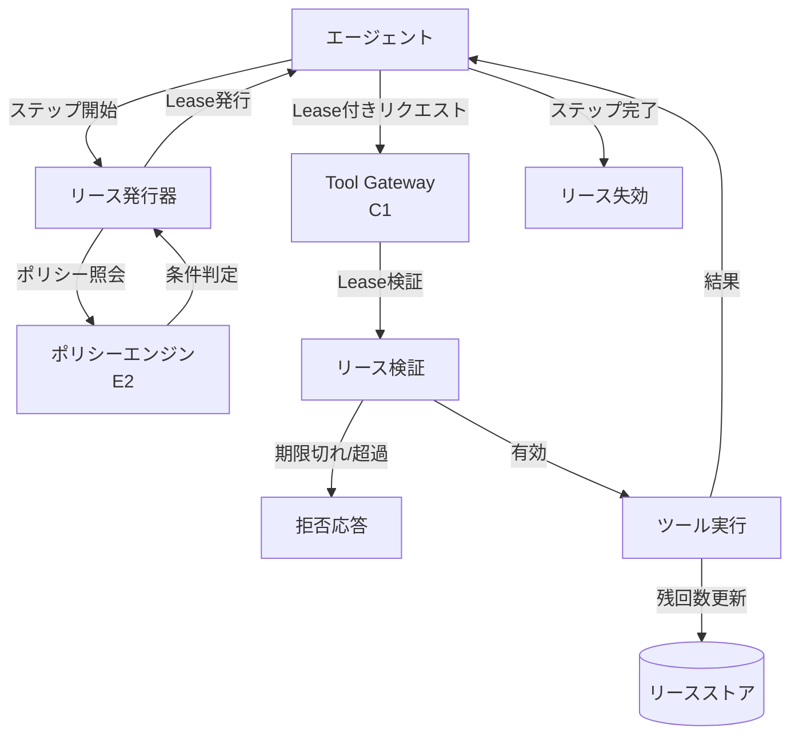

# Capability Lease｜短命権限チケット

## 一言で（TL;DR）

エージェントにツール実行権限を恒久的に与えるのではなく、短い有効期限・限定スコープ・呼び出し回数上限を持つ「リース（lease）」として発行し、期限切れで自動失効させます。OAuth のスコープ付きトークンに似た仕組みをエージェントのステップ単位・アクション単位に適用することで、長時間セッションにおける権限の蓄積・拡散を構造的に防ぎます。

## 解決する問題

エージェントセッションが長時間化すると、初期に付与されたツール権限がそのまま残り続けます。[ツール/MCP で副作用を持つ（F8）](../../concepts/design-forces.md)特性により、セッション後半で文脈が変わっても書き込み・決済・送信などの権限が有効なままとなり、意図しない操作が実行される危険があります。[プロンプトインジェクション（F14）](../../concepts/design-forces.md)に対しても、恒久トークンは格好の標的になります。注入された命令がセッション中盤以降に実行される場合、初期に付与された広い権限がそのまま悪用されてしまいます。

リースを導入することで、各ステップに必要最小限の権限だけを短命トークンで渡し、不要になれば自動失効させることができます。万が一インジェクションが成功しても、そのトークンが有効な間・スコープ内でしか被害が発生しません。

## 選定条件（When to use / When NOT）

- **使う条件**
    - エージェントセッションが複数ステップにわたり、ステップごとに必要なツールや権限が異なります。
    - `[input_trust]` が低い：外部ユーザ入力や未検証の文書が会話に含まれるため、権限の有効期間を限定する必要があります。
    - 副作用を持つツール（書き込み・送信・決済）が含まれ、恒久権限では被害範囲が大きくなります。
    - セッション時間が概ね数分を超え、途中でコンテキストが変化しうる場合です。
- **使わない条件（＝代替に倒す）**
    - セッションが単発のリクエスト・レスポンスで完結し、権限の蓄積が起きない場合 → リースのオーバーヘッドが見合いません。直接認可で十分です。
    - すべてのツールが読み取り専用で副作用がない場合 → [C2 Read-Free / Write-Gated](c2-read-free-write-gated.md) の読取自由ポリシーで足ります。
    - `[input_trust]` が十分に高い社内ツール・閉じた環境の場合 → セッション単位の固定権限で許容できることが多いです。

## 駆動変数とチューニング（程度）

| 目盛り | 効かなすぎ ⇔ 効きすぎ | 決め方 `[駆動変数]` | 目安（出発点） |
|---|---|---|---|
| TTL（有効期間） | 長すぎて権限が残留 ⇔ 短すぎて正当な操作が期限切れ | `[input_trust]` が低いほど短く。ステップの平均所要時間の 1.5〜3 倍が目安 | 読取系 60〜300 秒、書込系 30〜120 秒 |
| スコープ幅 | 広すぎて最小権限を逸脱 ⇔ 狭すぎてツール切替のたびに再発行 | `[input_trust]` が低いほど狭く。ステップが必要とするツール＋リソース単位 | 1リースに含めるツールは概ね 1〜3。リソースID まで絞れる場合は絞る |
| max_invocations（呼び出し回数上限） | 制限なしで暴走ループ ⇔ 厳しすぎてリトライが失敗 | `[input_trust]` が低いほど少なく。ループ上限と整合させる | 書込系は 1〜3 回、読取系は 5〜20 回 |
| 更新（renewal）ポリシー | 無制限更新で実質恒久 ⇔ 更新不可で長いタスクが中断 | `[input_trust]` と `[failure_cost]` のバランス。更新時に再検証を挟む | 更新は最大 2〜3 回。更新ごとにポリシー再評価を推奨 |

## 相反における立ち位置（相反）

- **[F-15 読取専用 vs 書込可能](../../forks/index.md) → ハイブリッド**。リースは読取と書込の両方に適用できますが、書込リースにはより厳しい TTL・狭いスコープ・少ない呼び出し回数を設定し、読取リースは比較的緩めます。この非対称性が [C2 Read-Free / Write-Gated](c2-read-free-write-gated.md) の原則と整合します。`[input_trust]` が極めて低い場合は読取リースにもスコープ制限を適用します。

## 構造



リース発行器がポリシーエンジン（[E2](../e-safety-hitl/e2-policy-as-code.md)）に問い合わせてスコープ・TTL・回数上限を決定し、ツールゲートウェイ（[C1](c1-tool-gateway-mcp-broker.md)）がリクエストごとにリースの有効性を検証します。ステップ完了時またはTTL到達時にリースは自動失効します。

## 実装メモ

リースの最小データ構造は以下のとおりです。

```json
{
  "lease_id": "lease-abc123",
  "issued_at": "2025-01-15T10:30:00Z",
  "expires_at": "2025-01-15T10:32:00Z",
  "issued_for_step": "step-007",
  "principal": "user:alice",
  "tools": ["send_email"],
  "scope": {
    "resource_pattern": "email:draft:*",
    "allowed_actions": ["send"]
  },
  "max_invocations": 1,
  "remaining_invocations": 1,
  "renewal_count": 0,
  "max_renewals": 2
}
```

ゲートウェイでの検証（擬似コード）は以下のとおりです。

```python
def validate_lease(lease: Lease, request: ToolRequest) -> bool:
    if datetime.utcnow() > lease.expires_at:
        raise LeaseExpired(lease.lease_id)
    if lease.remaining_invocations <= 0:
        raise InvocationLimitReached(lease.lease_id)
    if request.tool not in lease.tools:
        raise ToolNotInScope(request.tool, lease.lease_id)
    if not lease.scope.matches(request.resource):
        raise ResourceNotInScope(request.resource, lease.lease_id)
    lease.remaining_invocations -= 1
    return True
```

落とし穴は以下のとおりです。

- **リースストアの一貫性**。分散環境では残回数のデクリメントに競合が起きます。書込リースの `max_invocations` が 1 の場合は CAS（Compare-and-Swap）またはアトミック操作で排他してください。
- **時刻同期**。TTL 判定はサーバ時刻に依存するため、ノード間の時刻ずれが許容 TTL より大きいとリースが想定外に有効・無効になります。NTP 同期を前提とし、ずれの許容幅を TTL の 5% 以内に抑えます。
- **リース漏れ**。ステップが異常終了してリース失効処理が走らないと、TTL まで権限が残ります。TTL を十分短くしておくことで被害を自動限定する設計にします。明示的な revoke は「あればベター」の位置づけです。
- **更新時のポリシー再評価**。リース更新時にポリシーエンジンを再度呼ぶことで、セッション中にポリシーが変更された場合にも追従できます。

## 効かせる力学（forces）

- **F8（ツール/MCP 副作用）**：副作用を持つ操作の権限が TTL と呼び出し回数で自動的に制限されるため、暴走ループや二重実行による被害を時間的・回数的に封じ込めます。ステップ完了時のリース失効により、不要な権限が残りません。
- **F14（プロンプトインジェクション）**：インジェクションが成功しても、リースの有効期間・スコープ・回数の範囲でしかツールを呼べません。恒久トークンに比べて攻撃の窓と被害範囲が大幅に狭まります。さらにリースにはプリンシパル（元のユーザ）が記録されるため、[C6 Confused Deputy 防御](c6-confused-deputy-defense.md)との組み合わせで「誰の権限で」の追跡が容易になります。

## 関連・代替

- [C1 Tool Gateway / MCP Broker](c1-tool-gateway-mcp-broker.md)：ゲートウェイがリースの検証を担います。リースはゲートウェイの認可メカニズムの一部として機能します。
- [C2 Read-Free / Write-Gated](c2-read-free-write-gated.md)：書込ゲートの具体的な実装手段としてリースを使います。書込リースの TTL・回数を読取より厳しくします。
- [C6 Confused Deputy 防御](c6-confused-deputy-defense.md)：リースにプリンシパル情報を含めることで、ツール側がリクエスト元の権限を正しく識別できます。
- [E1 リスクベース承認](../e-safety-hitl/e1-risk-based-approval.md)：高リスクのリース発行に人間の承認を要求します。`[input_trust]` が低く副作用が大きいツールのリース発行時に併用を推奨します。
- [E2 Policy-as-Code](../e-safety-hitl/e2-policy-as-code.md)：リースの発行条件（TTL・スコープ・回数上限）をポリシーエンジンに外部化し、コード変更なしで調整可能にします。

## コーディングエージェント向け指示（machine-actionable）

このパターンを人間に提案するなら、同時に以下を提案/確認してください。

- [ ] `[input_trust]` の水準を確認し、TTL・スコープ幅・max_invocations を**理由を添えて**提示したか
- [ ] 書込ツールと読取ツールでリースの厳しさを非対称にし、[C2 Read-Free / Write-Gated](c2-read-free-write-gated.md) と整合させたか
- [ ] [C1 Tool Gateway / MCP Broker](c1-tool-gateway-mcp-broker.md) がリース検証のチョークポイントとして機能する設計を示したか
- [ ] 高リスクなツール（決済・削除）のリース発行に [E1 リスクベース承認](../e-safety-hitl/e1-risk-based-approval.md) を併置したか
- [ ] リース条件を [E2 Policy-as-Code](../e-safety-hitl/e2-policy-as-code.md) で外部化する必要性を検討したか
- [ ] リースにプリンシパル情報を含め、[C6 Confused Deputy 防御](c6-confused-deputy-defense.md) と接続したか
- [ ] リース更新（renewal）ポリシーを定め、更新時のポリシー再評価を組み込んだか
- [ ] 目盛り（上表）の値を `[駆動変数]` から導き、**理由を添えて**提示したか
