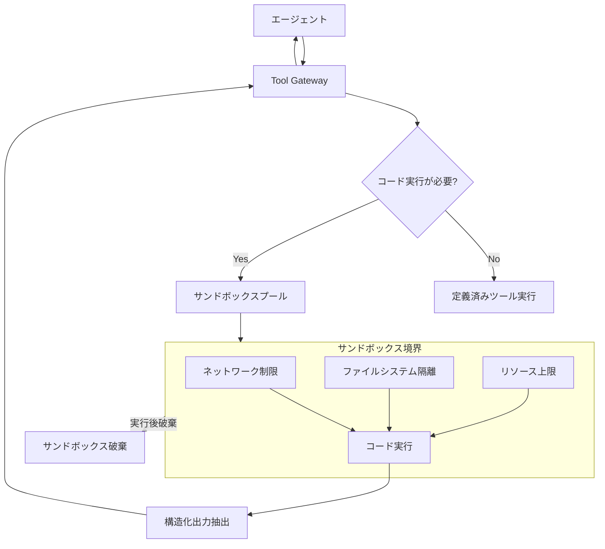

# Sandboxed Execution｜隔離実行

## 一言で（TL;DR）

LLM が生成したコードやツール呼び出しを、コンテナ・VM・WASM・gVisor などの隔離環境で実行し、ホストシステムや他テナントへの影響を構造的に遮断します。ネットワーク制限・ファイルシステム隔離・リソース上限（CPU/メモリ/時間）を組み合わせ、データ流出・ラテラルムーブメント・リソース枯渇を防ぎます。

## 解決する問題

LLM はコード生成やツール呼び出しを通じて副作用を持ちますが、生成されるコードの正しさは確率的であり、また[プロンプトインジェクション（F14）](../../concepts/design-forces.md)によって悪意あるコードが注入される可能性があります。生成コードをホスト環境で直接実行すると、以下のリスクが生じます。

- **データ流出（exfiltration）**：ファイルシステムや環境変数から秘匿情報を読み取り、外部に送信します。
- **ラテラルムーブメント**：ホストのネットワークアクセスを悪用して内部サービスや他テナントの環境へ侵入します。
- **リソース枯渇**：無限ループや大量メモリ確保でホスト全体のサービスを停止させます。
- **永続的な汚染**：ファイルの書き換えやパッケージのインストールでホスト環境を不可逆に変更します。

隔離環境はこれらの攻撃面をカーネル・ハイパーバイザ・ランタイムのレベルで遮断し、被害を「そのサンドボックス内」に限定します。

## 選定条件（When to use / When NOT）

- **使う条件**
    - エージェントが LLM 生成コード（Python/Shell/SQL 等）を実行する機能を持っています。
    - `[input_trust]` が低い：エンドユーザ入力やクロールした外部データがプロンプトに含まれ、生成コードが汚染されうる場合です。
    - マルチテナント環境で、テナント間の影響遮断が必要です。
    - 実行するコードが任意の外部ライブラリやシステムコールを使う可能性があります。
- **使わない条件（＝代替に倒す）**
    - ツール呼び出しが事前定義済みの API コールのみで、任意コード実行を許可しない場合 → [C1 ツールゲートウェイ](c1-tool-gateway-mcp-broker.md)のスキーマ検証で十分です。
    - `[input_trust]` が高く（社内専用・管理者のみ利用）、実行コードが定型テンプレートから生成される場合 → オーバーヘッドが見合いません。ただし本番環境では念のため軽量隔離を推奨します。
    - レイテンシ予算が極めて厳しい（数十ミリ秒以内）で、コンテナ起動コストが許容できない場合 → WASM 等の軽量ランタイムを検討するか、サンドボックスのプリウォーム戦略で対応します。

## 駆動変数とチューニング（程度）

| 目盛り | 効かなすぎ ⇔ 効きすぎ | 決め方 `[駆動変数]` | 目安（出発点） |
|---|---|---|---|
| 隔離強度 | 攻撃が貫通する ⇔ 起動コスト・運用負荷増大 | `[input_trust]` が低いほど強い隔離（プロセス → gVisor → コンテナ → VM） | 外部入力ありはコンテナ以上。社内限定ならプロセス＋seccomp でも可 |
| ネットワーク制限 | データ流出を許す ⇔ 正当な外部 API 呼び出しを遮断 | `[input_trust]` が低いほど制限を厳しく。必要な宛先のみ許可リストで開放 | デフォルト deny。必要な API エンドポイントのみ許可リストで穴を開ける |
| リソース上限（CPU/メモリ/時間） | リソース枯渇を許す ⇔ 正当な重い処理を打ち切る | `[input_trust]` が低いほど厳格に。タスク特性に応じて調整 | CPU: 1〜2コア、メモリ: 256MB〜1GB、時間: 30〜120秒が出発点 |
| ファイルシステム可視範囲 | 秘匿情報が読まれる ⇔ 必要なデータにアクセスできない | `[input_trust]` に応じて最小限の読取専用マウントのみ | 作業ディレクトリのみ読み書き可。入力データは読取専用でマウント |
| サンドボックスの寿命 | 状態が残り汚染が蓄積 ⇔ 毎回初期化でコスト増 | `[input_trust]` が低いほど短命。実行ごとに破棄が安全 | 1リクエスト=1サンドボックスが基本。プリウォームプールで起動コストを緩和 |

## 相反における立ち位置（相反）

- **[F-15 読取専用 vs 書込可能](../../forks/index.md) → ハイブリッド**。サンドボックス内部ではコード実行に必要な書込を許可しますが、外部への影響はサンドボックスの境界で遮断します。「サンドボックス内は書込可能、サンドボックス外は読取専用」という二層構造で、`[input_trust]` が低いほどサンドボックスの境界を厳格に（VM レベルまで）引き上げます。サンドボックスからの出力は結果のみを構造化して取り出し、ホスト環境への副作用はゲートウェイ（[C1](c1-tool-gateway-mcp-broker.md)）経由で制御します。

## 構造



## 実装メモ

サンドボックス設定の概念例（Docker ベース）は以下のとおりです。

```yaml
sandbox:
  runtime: docker  # docker | gvisor | firecracker | wasm
  image: "sandbox-python:3.12-slim"
  resource_limits:
    cpu: "1.0"
    memory: "512m"
    timeout_sec: 60
    max_processes: 32
    max_open_files: 256
  network:
    mode: none  # none | allowlist
    allowlist: []  # 必要時のみ ["api.example.com:443"]
  filesystem:
    read_only_mounts:
      - host: "/data/input"
        container: "/input"
    writable_dir: "/workspace"  # tmpfs, 容量制限付き
    no_mount:
      - "/var/run/docker.sock"
      - "/etc/shadow"
  lifecycle:
    reuse: false  # true ならプリウォーム、false なら毎回破棄
    pool_size: 5  # プリウォーム時の待機数
```

出力抽出の最小実装（擬似コード）は以下のとおりです。

```python
def execute_in_sandbox(code: str, input_data: dict) -> SandboxResult:
    sb = sandbox_pool.acquire()
    try:
        sb.write_file("/workspace/input.json", json.dumps(input_data))
        exit_code, stdout, stderr = sb.run(
            cmd=["python", "/workspace/main.py"],
            timeout=sb.config.timeout_sec,
        )
        output = sb.read_file("/workspace/output.json")
        return SandboxResult(
            exit_code=exit_code,
            output=json.loads(output) if output else None,
            stdout=stdout[:MAX_LOG_SIZE],  # ログサイズも制限
            stderr=stderr[:MAX_LOG_SIZE],
        )
    finally:
        sb.destroy()  # 状態を残さない
```

落とし穴は以下のとおりです。

- **コンテナ起動のレイテンシ**。コールドスタートで数百ミリ秒〜数秒かかります。プリウォームプール（事前に起動済みのコンテナを待機させる）で緩和できますが、プール管理の複雑さとリソースコストが増えます。
- **Docker ソケットのマウント禁止**。コンテナ内から Docker ソケットにアクセスできると、ホスト上に任意のコンテナを起動できてしまい隔離が無意味になります。
- **出力経由の攻撃**。サンドボックスの出力（stdout/ファイル）にインジェクションペイロードを仕込み、後続の LLM 呼び出しで実行させる攻撃があります。出力もサニタイズするか、サイズ制限を設けてください。
- **サンドボックス内のネットワーク許可リスト管理**。許可リストが広すぎるとデータ流出を防げません。DNS リバインディングにも注意し、IP レベルでの制御を併用してください。
- **マルチテナントでの資源の公平性**。テナントごとにサンドボックスの同時数・リソース上限を設定し、一テナントの暴走が他テナントに波及しないようにします。

## 効かせる力学（forces）

- **F14（プロンプトインジェクション）**：インジェクションによって悪意あるコードが生成されても、サンドボックスの境界（ネットワーク遮断・ファイルシステム隔離・リソース上限）により被害がサンドボックス内に限定されます。ホストへの到達や他テナントへの影響を構造的に防ぎます。

## 関連・代替

- [C1 ツールゲートウェイ](c1-tool-gateway-mcp-broker.md)：ゲートウェイ経由でサンドボックスへのルーティングを行います。コード実行が必要かどうかの振り分け、サンドボックスからの出力の監査ログ記録をゲートウェイが担います。
- [C5 Capability Lease](c5-capability-lease.md)：サンドボックス内で外部 API を呼び出す必要がある場合、短命トークンで権限の範囲と有効期間を制限します。サンドボックスの寿命と合わせてリースを設定します。
- [C6 Confused Deputy 防御](c6-confused-deputy-defense.md)：サンドボックス内のコードがインジェクションで汚染されていても、隔離によりホスト環境の権限を行使できません。サンドボックスは Confused Deputy 攻撃の被害を物理的に限定する層として機能します。
- [E2 Policy-as-Code](../e-safety-hitl/e2-policy-as-code.md)：サンドボックスの起動条件（どのタスク種別でどの隔離強度を適用するか）をポリシーエンジンで定義し、コードとしてバージョン管理します。
- [A7 期限・予算カスケード](../a-execution/a7-deadline-budget-cascade.md)：サンドボックス内にも予算（CPU 時間・メモリ・実行時間）を伝播させ、全体の予算管理と整合させます。サンドボックスのリソース上限は予算コントローラの一部として機能します。

## コーディングエージェント向け指示（machine-actionable）

このパターンを人間に提案するなら、同時に以下を提案/確認してください。

- [ ] `[input_trust]` の水準を確認し、隔離強度（プロセス/gVisor/コンテナ/VM）を**理由を添えて**提示したか
- [ ] ネットワーク制限のデフォルトを deny にし、許可リストの必要性を確認したか
- [ ] リソース上限（CPU/メモリ/時間）をタスク特性から導出し、目安値を提示したか
- [ ] サンドボックスの寿命戦略（毎回破棄 vs プリウォーム）をレイテンシ要件と `[input_trust]` から決定したか
- [ ] [C1 ツールゲートウェイ](c1-tool-gateway-mcp-broker.md)経由でサンドボックスへルーティングする構成を提案したか
- [ ] サンドボックス内で外部 API アクセスが必要なら [C5 Capability Lease](c5-capability-lease.md) で短命トークンを発行する設計を併せて提案したか
- [ ] [A7 期限・予算カスケード](../a-execution/a7-deadline-budget-cascade.md)との連携（リソース上限の整合）を検討したか
- [ ] 出力経由のインジェクション対策（サイズ制限・サニタイズ）を検討したか
- [ ] マルチテナント環境なら、テナント間のリソース公平性設計を提示したか
- [ ] 目盛り（上表）の値を `[駆動変数]` から導き、**理由を添えて**提示したか
