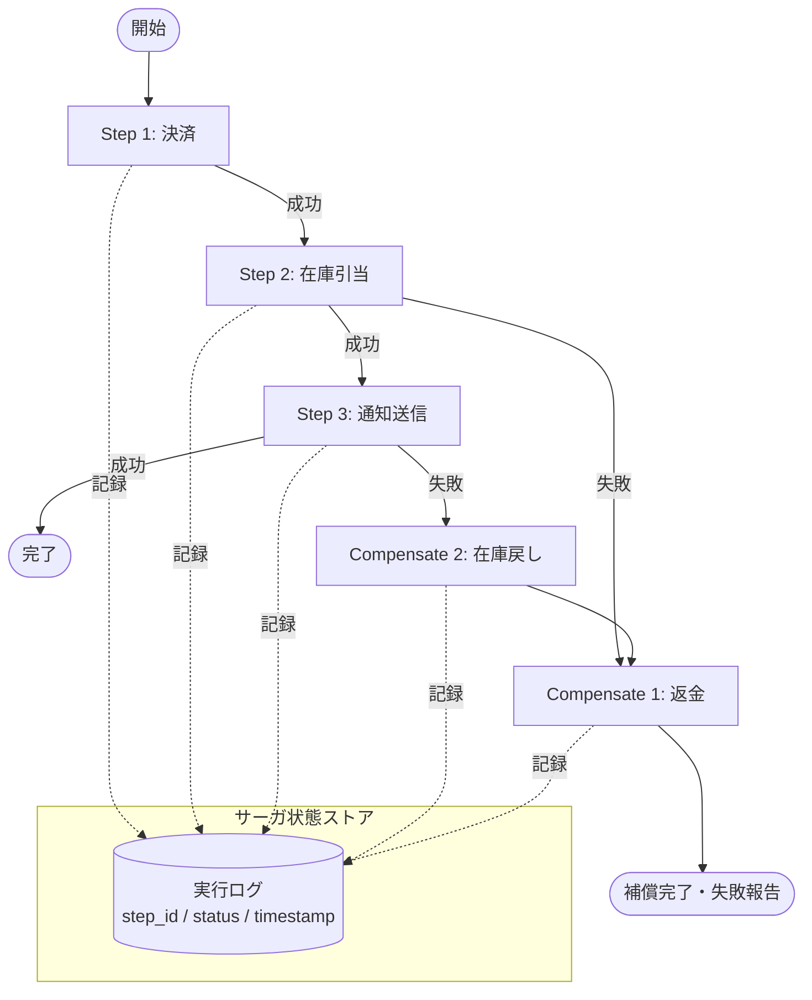

# Saga / Compensation｜補償トランザクション

## 一言で（TL;DR）

エージェントが複数の外部システム（決済・在庫・通知など）を跨いで副作用を実行するワークフローにおいて、途中のステップが失敗した場合に、完了済みステップの補償操作（返金・在庫戻し・通知取消など）を逆順に実行して整合性を回復する。マイクロサービスのサーガパターンを、確率的に失敗しうるエージェントワークフローに適用したもの。

## 解決する問題

エージェントが複数の外部サービスに対して副作用を持つ操作を順次実行する場合、途中で障害が発生するとシステム間の状態が不整合になる。たとえば「決済成功 → 在庫引当失敗」の状態で放置すると、代金だけ徴収され商品が発送されない。

従来のデータベーストランザクション（ACID）は単一データストア内でしか機能しない。複数の外部APIを跨ぐ操作にはアトミックなロールバック機構がなく、各システムに対して明示的な「取消操作」を設計する必要がある。

AIエージェント固有の事情がこの問題を悪化させる。[確率的な動作（F3）](../../concepts/design-forces.md)により、LLMの出力揺らぎやプロバイダ障害でステップが予期せず失敗する頻度が従来のシステムより高い。さらに[ツール副作用（F8）](../../concepts/design-forces.md)はエージェントの自律的判断で発生するため、失敗パスの設計が漏れやすい。サーガによる補償設計を明示的に行わなければ、部分実行状態の検出すら困難になる。

## 選定条件（When to use / When NOT）

- **使う条件**
    - エージェントが 2 つ以上の外部システムに対して副作用を持つ操作を順次実行し、途中失敗時に整合性の回復が必要。
    - 各ステップに対応する補償操作（逆操作）が定義可能。決済 → 返金、在庫引当 → 在庫戻し、通知送信 → 取消通知など。
    - `[reversibility]` が低い（やり直しが困難な操作が含まれる）ため、放置すると業務上の損害が生じる。
- **使わない条件**
    - 全操作が単一データストア内で完結する → ACID トランザクションで十分。サーガのオーバーヘッドは不要。
    - 副作用が 1 ステップのみ → 単純なリトライと[C4 冪等コマンド包装](c4-idempotent-command-envelope.md)で十分。
    - 補償操作が定義できない（物理的な不可逆操作：薬剤投与、メール送信後の既読など） → サーガでは回復できない。[E1 リスクベース承認](../e-safety-hitl/e1-risk-based-approval.md)で実行前に人間が承認する設計に倒す。
    - 結果整合性が許容されず、全ステップの即時整合性が必須 → 二相コミット（2PC）等を検討するが、外部API相手では現実的でないことが多い。

## 駆動変数とチューニング（程度）

| 目盛り | 効かなすぎ ⇔ 効きすぎ | 決め方 `[駆動変数]` | 目安（出発点） |
|---|---|---|---|
| サーガ粒度 | 粗すぎ（全体を1ステップ扱い） → 部分補償不能 ⇔ 細かすぎ → 補償の組合せ爆発・管理コスト増 | 外部システム境界で分割が基本。`[reversibility]` が低いステップほど細分化して個別に補償可能にする | 外部APIコール 1 回 = 1 サーガステップ |
| 補償タイムアウト | 短すぎ → 一時障害で補償失敗 ⇔ 長すぎ → 不整合状態が長期間残存 | `[reversibility]` が低いほど粘り強くリトライし確実に補償する | 概ね 5–15 分。指数バックオフで最大 3–5 回リトライ |
| サーガ状態の保持期間 | 短すぎ → 遅延障害発覚時に補償不能 ⇔ 長すぎ → ストレージ肥大 | 業務上の取消可能期間に合わせる。`[reversibility]` が低いほど長く保持 | 概ね 7–30 日。決済サーガは決済プロバイダの返金期限に合わせる |

## 相反における立ち位置（相反）

- **[F-15 読取専用 vs 書込可能エージェント](../../forks/index.md) → hybrid**。サーガが必要になるのは書込可能エージェントに限る。ただし「書込は許可するが、必ずサーガとして管理し、失敗時に補償で回復する」という条件付き書込開放であり、完全な自由書込ではない。`[reversibility]` が低い操作を含むワークフローほどサーガ管理を厳格にし、各ステップに[C4 冪等コマンド包装](c4-idempotent-command-envelope.md)を付与する。

## 構造



## 実装メモ

サーガステップの最小定義：

```python
@dataclass
class SagaStep:
    name: str
    execute: Callable[..., Any]       # 前進操作
    compensate: Callable[..., Any]    # 補償操作（逆操作）
    idempotency_key: str              # C4 冪等キー

saga_steps = [
    SagaStep("payment",    charge_customer, refund_customer,    key_1),
    SagaStep("inventory",  reserve_stock,   release_stock,      key_2),
    SagaStep("notification", send_email,    send_cancel_email,  key_3),
]
```

サーガオーケストレータの基本ロジック：

```python
def run_saga(steps: list[SagaStep], saga_id: str, store):
    completed = []
    for step in steps:
        store.record(saga_id, step.name, "started")
        try:
            result = execute_idempotent(step.execute, step.idempotency_key)
            store.record(saga_id, step.name, "completed", result)
            completed.append(step)
        except Exception as e:
            store.record(saga_id, step.name, "failed", str(e))
            # 逆順に補償
            for comp_step in reversed(completed):
                store.record(saga_id, f"compensate_{comp_step.name}", "started")
                execute_idempotent(comp_step.compensate, f"comp_{comp_step.idempotency_key}")
                store.record(saga_id, f"compensate_{comp_step.name}", "completed")
            raise SagaAborted(saga_id, step.name, e)
```

落とし穴：

- **補償の失敗** — 補償操作自体が失敗する場合がある（外部APIの一時障害など）。補償には指数バックオフ付きリトライを適用し、最終的に失敗したら人間にエスカレーションする。補償は「最大努力」であり、100% の成功は保証できない。
- **補償にも冪等キーが必要** — 補償操作が二重発火すると返金が重複する。[C4 冪等コマンド包装](c4-idempotent-command-envelope.md)を補償ステップにも適用する。
- **並行実行のセマンティクス** — ステップを並列実行する場合、失敗時にどの範囲を補償するかが複雑になる。まず直列で始め、パフォーマンス要件が厳しい場合にのみ並列化を検討する。
- **部分完了の検出** — プロセスクラッシュでサーガが中断した場合、再起動時にサーガ状態ストアから未完了サーガを検出し、補償を再開する仕組みが必要。[A2 耐久非同期](../a-execution/a2-durable-async-agent.md)のチェックポイント機構と連携すると実装しやすい。
- **タイミングの問題** — 「決済成功、在庫引当が数秒遅延して失敗、返金処理」の間に顧客が二重注文する可能性がある。サーガ実行中はセッション単位でロックするか、UIに「処理中」状態を表示して重複操作を防ぐ。

## 効かせる力学（forces）

- **F3（確率的）** — LLMの応答途絶やプロバイダ障害による予期しないステップ失敗が、従来システムより高頻度で起こる。サーガは「失敗は日常」という前提で設計されており、確率的な動作に対する構造的な回復手段を提供する。
- **F8（ツール副作用）** — 複数のツール呼び出しが外部システムに副作用を残す。DB トランザクションのようなアトミックなロールバックが使えない環境で、明示的な補償操作により整合性を回復する。サーガ状態ストアに各ステップの実行結果を記録することで、どこまで実行されたかの可視性も確保する。

## 関連・代替

- [A2 耐久非同期](../a-execution/a2-durable-async-agent.md) — サーガ状態の永続化にチェックポイント機構を活用する。プロセスクラッシュ後の再開時に未完了サーガを検出・補償再開する基盤。
- [C3 dry-run & commit](c3-dry-run-commit.md) — サーガの前段として、各ステップを実行前に dry-run で差分を確認し、計画全体の妥当性を事前検証する。
- [C4 冪等コマンド包装](c4-idempotent-command-envelope.md) — サーガの各ステップ（前進・補償とも）に冪等キーを付与し、リトライ時の二重実行を防止する。サーガの安全性の前提条件。
- [F1 短トランザクション長セッション](../f-data-integrity/f1-short-tx-long-session.md) — サーガの各ステップは短トランザクションで実行し、サーガ全体はセッションとして長期管理する。
- [F2 イベントソーシング](../f-data-integrity/f2-event-sourced-replayable.md) — サーガの各ステップをイベントとして記録し、状態の再構成・監査・リプレイを可能にする。
- [E1 リスクベース承認](../e-safety-hitl/e1-risk-based-approval.md) — `[reversibility]` が極めて低いステップ（高額決済、契約締結など）では、サーガの該当ステップ前に人間の承認を挿入する。

## コーディングエージェント向け指示（machine-actionable）

- [ ] 外部副作用を持つステップを洗い出し、各ステップに補償操作（逆操作）が定義されているか確認したか
- [ ] 補償操作が定義できないステップがある場合、[E1 リスクベース承認](../e-safety-hitl/e1-risk-based-approval.md)で事前承認を挿入する設計を提案したか
- [ ] 各ステップ（前進・補償とも）に[C4 冪等コマンド包装](c4-idempotent-command-envelope.md)を適用しているか
- [ ] サーガ状態ストアの永続化方式を選定し、[A2 耐久非同期](../a-execution/a2-durable-async-agent.md)との連携を設計したか
- [ ] 補償失敗時のエスカレーション先（人間・運用チーム）を定義したか
- [ ] 目盛り（上表）の値を `[reversibility]` から導き、**理由を添えて**提示したか
- [ ] サーガの各ステップを[F2 イベントソーシング](../f-data-integrity/f2-event-sourced-replayable.md)で記録し、監査・リプレイ可能な設計にしたか
