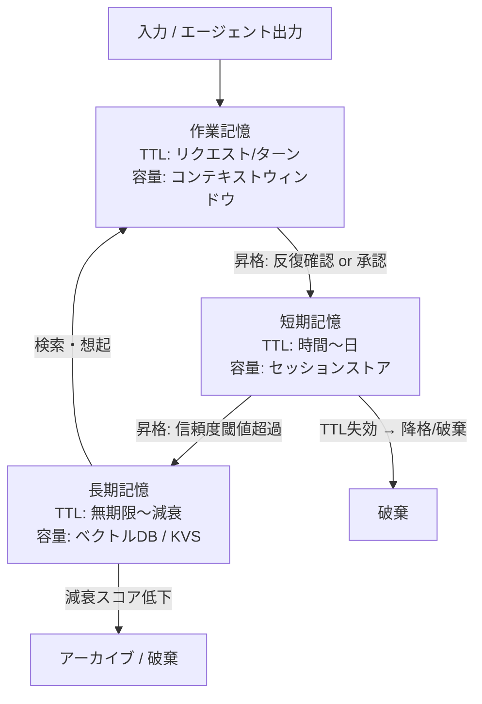

# Tiered Memory｜階層化メモリ

## 一言で（TL;DR）

エージェントのメモリを**作業記憶（Working）・短期記憶（Short-term）・長期記憶（Long-term）**の3層に分離し、層ごとにTTL・容量上限・書込ポリシー・信頼度を定める。層間の昇格（promotion）と降格（demotion）を明示的に制御することで、コンテキストウィンドウの枯渇と記憶汚染の両方を防ぐ。

## 解決する問題

エージェントが複数ターンにまたがるタスクを扱うとき、すべての情報をコンテキストウィンドウに詰め込む「フラット記憶」では2つの問題が同時に起きる。

第一に、[コンテキスト/メモリで状態を跨ぐ（F6）](../../concepts/design-forces.md)という特性上、会話履歴・ユーザー属性・中間結果・外部知識が混在するとウィンドウが溢れ、古い情報から押し出されて文脈が断絶する。第二に、LLMが生成した推測や中間的な判断をそのまま永続化すると、[ハルシネーション（F4）](../../concepts/design-forces.md)が長期記憶に定着し、以降のすべてのセッションを汚染する。

階層化メモリは「何をどの寿命で保持し、何を捨てるか」を構造的に決めることで、コンテキスト効率と記憶の信頼性を両立させる。

## 選定条件（When to use / When NOT）

- **使う条件**
    - エージェントが複数セッションにわたって情報を引き継ぐ必要がある（ユーザープロファイル、過去の意思決定、蓄積された知識）。
    - 1セッション内でも中間結果の量がコンテキストウィンドウの概ね30%を超える見込みがある。
    - 記憶の「鮮度」と「確度」が混在する（確定事実と推測の区別が必要）。
    - `[failure_cost]` が中〜高で、誤った記憶が後続タスクに波及すると影響が大きい。
- **使わない条件（＝代替に倒す）**
    - 1ショットで完結し、セッション間の引継ぎが不要 → 作業記憶のみで十分（メモリ階層化は不要）。
    - コンテキストウィンドウに全情報が収まり、セッション状態もトークン数も問題にならない → [D2 コンテキスト予算配分](d2-context-budget-allocator.md) の範囲で対処する。
    - メモリの書込制御だけが課題で、階層分離は不要 → [D3 メモリ書込ゲート](d3-memory-write-gate.md) を単独で適用する。

## 駆動変数とチューニング（程度）

| 目盛り | 効かなすぎ ⇔ 効きすぎ | 決め方 `[駆動変数]` | 目安（出発点） |
|---|---|---|---|
| 層数 | 少なすぎ：粒度不足で全部長期に入る ⇔ 多すぎ：昇格/降格ルールが爆発 | ユースケースの時間スケールの種類数 `[failure_cost]` | 3層（作業/短期/長期）が出発点。共有メモリが要れば4層目 |
| 短期→長期の昇格閾値 | 低すぎ：推測が長期に混入 ⇔ 高すぎ：有用な記憶が消失 | 誤記憶の影響度。`[failure_cost]` が高いほど閾値を上げる | 同一事実が2回以上確認された、またはユーザー承認済み |
| 短期のTTL | 短すぎ：セッション中に記憶喪失 ⇔ 長すぎ：古い文脈が邪魔 | セッションの典型的な継続時間 `[failure_cost]` | 対話セッション：数時間〜1日。バッチ：タスク完了まで |
| 長期の容量上限 | 小さすぎ：知識が蓄積されない ⇔ 大きすぎ：検索精度低下・コスト増 | 検索品質とストレージコストの均衡 `[failure_cost]` | ユーザー単位で概ね数百〜数千エントリ。定期的に [D4 減衰・版管理](d4-memory-decay-versioned-truth.md) で整理 |

値は定数でなく `[failure_cost]` の関数。失敗コストが高い領域ほど昇格閾値を厳しくし、短期TTLを長めにとって安全側に寄せる。

## 相反における立ち位置（相反）

**[F-16 自動メモリ vs 承認型メモリ](../../forks/index.md) → hybrid**。3層それぞれで書込ポリシーを変える。

- **作業記憶**：完全自動。エージェントの推論中間物を自由に読み書きする。コンテキストリセットで消える前提なのでリスクが低い。
- **短期記憶**：自動書込だが、信頼度タグを付与する。ユーザー発話由来は高信頼、LLM推測由来は低信頼とマークする。
- **長期記憶**：`[failure_cost]` が高い場合は承認型に倒す。低リスクな嗜好情報（表示言語の好みなど）は自動、重要な事実（住所・契約情報など）はユーザー承認を経て昇格させる。

判定基準は `[failure_cost]`。失敗コストが低ければ長期も自動寄り、高ければ承認寄りにする。詳細な書込制御は [D3 メモリ書込ゲート](d3-memory-write-gate.md) を参照。

## 構造



作業記憶はコンテキストウィンドウそのもの。短期記憶はRedisやセッションDBに格納し、TTL付きで自動失効する。長期記憶はベクトルDBやKVSに永続化し、[D4 減衰・版管理](d4-memory-decay-versioned-truth.md) で鮮度を管理する。

## 実装メモ

最小実装の骨格（疑似コード）：

```python
class TieredMemory:
    def __init__(self, user_id: str):
        self.working = {}                    # dict: ターン内の中間状態
        self.short_term = SessionStore(      # Redis等。TTL付き
            user_id=user_id,
            ttl=timedelta(hours=4),          # failure_cost に応じて調整
        )
        self.long_term = VectorStore(        # ベクトルDB
            namespace=user_id,
            max_entries=1000,
        )

    def recall(self, query: str, budget: int) -> list[Memory]:
        """コンテキスト予算内で3層から想起する"""
        results = []
        results += self.working.get_relevant(query)
        results += self.short_term.search(query, limit=budget // 2)
        results += self.long_term.search(query, limit=budget // 2)
        return rank_by_relevance_and_trust(results, budget)

    def promote(self, memory: Memory):
        """短期→長期への昇格。信頼度と承認状態を検査する"""
        if memory.trust_score < PROMOTE_THRESHOLD:
            return  # 閾値未満は昇格しない
        if memory.requires_approval and not memory.approved:
            queue_for_approval(memory)
            return
        self.long_term.upsert(memory)
```

落とし穴：

- **作業記憶と短期記憶の境界が曖昧になりがち**。作業記憶は「コンテキストウィンドウがリセットされたら消える」、短期記憶は「明示的にストアに書いたもの」と機械的に区別する。LLMの内部状態に頼らず、外部ストアへの書込を境界線にする。
- **長期記憶の検索ノイズ**。エントリ数が増えると無関係な記憶がコンテキストに混入し、ハルシネーションの原因になる。検索結果には信頼度スコアでフィルタをかけ、[D2 コンテキスト予算配分](d2-context-budget-allocator.md) で注入量を制御する。
- **マルチエージェント環境での記憶分離**。[B5 Supervisor-Worker](../b-orchestration/b5-supervisor-worker.md) 構成では、各Workerの作業記憶は分離し、短期・長期はSupervisorが一元管理する設計が安全。Workerが直接長期記憶に書き込むと整合性が崩れる。

## 効かせる力学（forces）

- **F4（ハルシネーション）**：層ごとに信頼度を管理し、LLM推測を長期記憶に直接書き込ませない。昇格には反復確認や承認を要求することで、幻覚の永続化を防ぐ。
- **F6（コンテキスト/メモリで状態を跨ぐ）**：3層に分けることで、短命な中間結果と長命な知識を分離する。作業記憶の揮発性を受け入れつつ、必要な情報は短期・長期に退避させてセッション間の連続性を確保する。

## 関連・代替

- 関連
    - [D2 コンテキスト予算配分](d2-context-budget-allocator.md)：各層から想起した記憶をコンテキストウィンドウにどれだけ注入するかを制御する。階層化メモリの「出口」を管理する補完パターン。
    - [D3 メモリ書込ゲート](d3-memory-write-gate.md)：短期→長期の昇格時にフィルタ・PII検査・承認を挟む。本パターンの昇格ポリシーの実装手段。
    - [D4 減衰・版管理](d4-memory-decay-versioned-truth.md)：長期記憶の鮮度管理。古くなった記憶の減衰・上書き・バージョン管理を担う。
    - [D6 セマンティックキャッシュ](d6-semantic-cache-nocache-zones.md)：頻出クエリへの応答を短期層でキャッシュし、LLM呼び出しを削減する。
    - [B5 Supervisor-Worker](../b-orchestration/b5-supervisor-worker.md)：マルチエージェント構成でのメモリ共有/分離の境界設計。

## コーディングエージェント向け指示（machine-actionable）

このパターンを人間に提案するなら、同時に以下を提案/確認する：

- [ ] `[failure_cost]` を評価し、昇格閾値と長期記憶の書込ポリシー（自動/承認）を導出したか
- [ ] 短期記憶のTTLをセッション特性から導き、**理由を添えて**提示したか
- [ ] 長期記憶への書込がある場合、[D3 メモリ書込ゲート](d3-memory-write-gate.md) を併置したか
- [ ] 長期記憶の容量上限と減衰ポリシーを定め、[D4 減衰・版管理](d4-memory-decay-versioned-truth.md) を併せて提案したか
- [ ] コンテキストウィンドウへの注入量を [D2 コンテキスト予算配分](d2-context-budget-allocator.md) で制御する設計になっているか
- [ ] マルチエージェント構成の場合、作業記憶の分離と長期記憶の共有範囲を [B5](../b-orchestration/b5-supervisor-worker.md) と整合させたか
