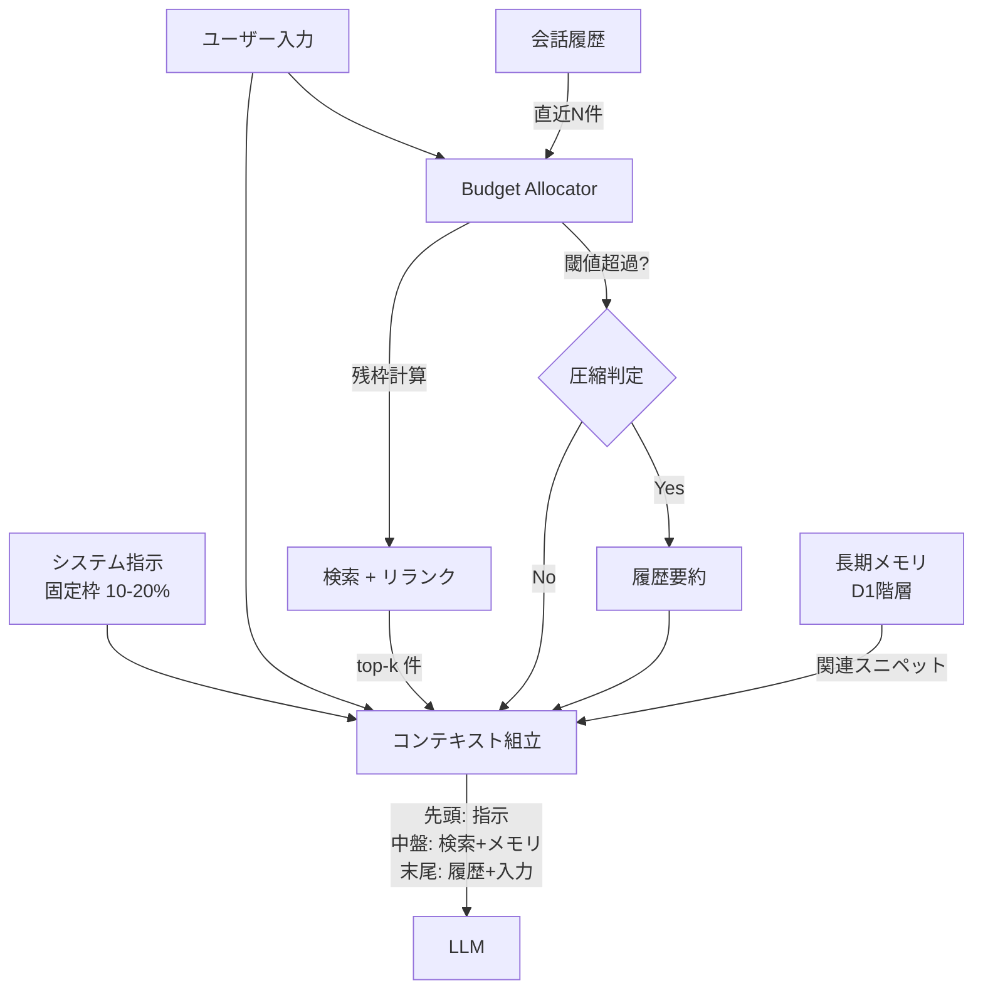

# Context Budget Allocator｜コンテキスト予算配分

## 一言で（TL;DR）

LLM のコンテキスト窓は有限のトークン予算です。システム指示・ユーザー入力・検索結果・会話履歴・長期メモリといった投入候補に対して**枠（スロット）ごとの配分比率を決め、各スロット内でリランク・圧縮・切り捨てを行う**ことで、限られた窓のなかの信号密度を最大化します。

## 解決する問題

コンテキスト窓に投入できる情報が増えるほど「全部入れれば精度が上がる」と考えがちですが、実際には逆効果が起きます。

- [コストが文脈長で増える（F11）](../../concepts/design-forces.md)：トークン課金モデルでは投入量がそのままコストに直結します。検索結果を20件入れれば精度が上がるとは限らないのにコストは確実に増えます。
- [コンテキスト/メモリで状態を跨ぐ（F6）](../../concepts/design-forces.md)：会話履歴・メモリ・検索結果・システム指示が同じ窓を奪い合います。ある種類の情報が膨らむと別の種類が押し出されます。とくに会話が長くなるとシステム指示や検索結果の割合が相対的に縮み、振る舞いが劣化します。

加えて "Lost in the Middle" 問題（窓の中盤に置かれた情報は注意が薄れ、先頭と末尾の情報が優先される）があります。予算配分なしに情報を詰め込むと、重要な情報が中盤に埋もれて実質的に無視されてしまいます。

## 選定条件（When to use / When NOT）

- **使う条件**
    - RAG やメモリを使っており、投入候補のトークン数がモデルの窓サイズの概ね 50% を超えうる場合です。
    - `[cost_sensitivity]` が中以上で、投入トークンの増加がコストや推論時間に無視できない影響を持ちます。
    - 会話が複数ターンに渡り、履歴が蓄積してシステム指示や検索結果のスペースを圧迫しうる場合です。
- **使わない条件**
    - 投入情報がシステム指示＋単発ユーザー入力のみで、窓の 30% 未満に収まる場合 → 配分ロジックのオーバーヘッドが見合いません。
    - ロングコンテキストモデル（100k+ トークン）を使い、投入量が窓の 20% 未満の場合 → 単純な連結で十分です。ただし `[cost_sensitivity]` が高い場合は窓に余裕があっても圧縮の価値があります。

## 駆動変数とチューニング（程度）

| 目盛り | 効かなすぎ ⇔ 効きすぎ | 決め方 `[駆動変数]` | 目安（出発点） |
|---|---|---|---|
| 検索 top-k（リランク後） | 関連情報の欠落 ⇔ ノイズ混入・コスト増 | `[cost_sensitivity]` が高いほど絞る | 3–8 件。リランクスコア閾値で動的に切る |
| 検索スロットの窓占有率 | 根拠不足で幻覚 ⇔ 履歴・指示を圧迫 | `[cost_sensitivity]` と精度要求のバランス | 窓の 20–40%。50% を超えたら圧縮を検討 |
| 履歴保持ターン数 | 文脈喪失 ⇔ コスト増・古い情報が干渉 | `[cost_sensitivity]` が高いほど短く | 直近 5–15 ターン。古い部分は要約圧縮 |
| 圧縮トリガー閾値 | 圧縮しなさすぎで窓溢れ ⇔ 圧縮しすぎで情報損失 | 窓使用率で判定 `[cost_sensitivity]` | 窓の 60–70% 使用で圧縮開始 |
| システム指示の固定枠 | 指示不足で振る舞い劣化 ⇔ 残枠が少なく応答品質低下 | システム指示の複雑さに依存 | 窓の 10–20%。この枠は圧縮対象外にする |

値はすべて `[cost_sensitivity]` の関数です。コスト感度が高い環境ほど top-k を絞り、圧縮閾値を下げ、履歴を短く保ちます。

## 相反における立ち位置（相反）

本パターンは [F-7: RAG vs FT vs ロングコンテキスト](../../forks/index.md) において **RAG 側**に立ちます。RAG では外部知識を検索して窓に投入するため、窓の配分管理が不可欠になります。FT（ファインチューニング）で知識をモデルに焼き込む場合は窓を消費しないため、本パターンの必要性は下がります。ロングコンテキストは窓自体を広げるアプローチですが、`[cost_sensitivity]` が高い場合は広い窓を埋めるコストが問題になり、結局配分管理が必要になります。

判定基準としては、知識が頻繁に更新される、出典の提示が求められる（`[accountability]` が高い）→ RAG → D2 が必要、という流れになります。

## 構造



配置順序は "Lost in the Middle" 対策として、最重要の情報（システム指示）を先頭に、直近のユーザー入力と会話コンテキストを末尾に置きます。検索結果はリランクスコア順に並べ、高スコアのものを先頭寄りに配置します。

## 実装メモ

予算配分の最小構造を示します：

```python
@dataclass
class ContextSlot:
    name: str           # "system", "retrieval", "history", "memory"
    max_ratio: float    # 窓に対する最大占有率 (0.0–1.0)
    priority: int       # 溢れたとき切り捨てる優先度（低=先に切る）
    compressible: bool  # 要約圧縮の対象か

SLOTS = [
    ContextSlot("system",    max_ratio=0.15, priority=10, compressible=False),
    ContextSlot("user",      max_ratio=0.10, priority=9,  compressible=False),
    ContextSlot("retrieval", max_ratio=0.35, priority=7,  compressible=True),
    ContextSlot("history",   max_ratio=0.30, priority=5,  compressible=True),
    ContextSlot("memory",    max_ratio=0.10, priority=6,  compressible=True),
]

def allocate(window_size: int, slots: list[ContextSlot],
             contents: dict[str, str], tokenizer) -> dict[str, str]:
    """各スロットの内容を予算内に収める。"""
    result = {}
    used = 0
    # priority 降順（高優先を先に確保）
    for slot in sorted(slots, key=lambda s: -s.priority):
        budget = int(window_size * slot.max_ratio)
        text = contents.get(slot.name, "")
        tokens = tokenizer.count(text)
        if tokens > budget and slot.compressible:
            text = summarize(text, target_tokens=budget)
        elif tokens > budget:
            text = truncate(text, budget, tokenizer)
        result[slot.name] = text
        used += tokenizer.count(text)
    return result
```

落とし穴：

- **システム指示を圧縮対象にしない**ことが重要です。ツール定義・安全指示・出力形式指定はトークンを消費しますが削れません。これを固定枠として先に確保し、残りを他スロットに配分します。
- **リランクなしの top-k は信号密度が低い**点にも注意してください。ベクトル検索の上位 20 件を取得し、クロスエンコーダや LLM ベースのリランカーで 3–8 件に絞るのが実用的な出発点です。リランクのコスト自体も予算に含めて考えます。
- **要約圧縮は非可逆**です。圧縮した履歴から元の発話は復元できません。重要な決定事項や固有名詞が落ちるリスクがあります。圧縮前にキーワード抽出し、要約に含めるよう制約をかけてください。
- **トークンカウントはモデル依存**です。同じテキストでもモデルによってトークン数が異なります。[B7 モデルルーター](../b-orchestration/b7-model-router-adaptive-effort.md)でモデルを切り替える場合は、対象モデルのトークナイザで再計算してください。

## 効かせる力学（forces）

- **F6（コンテキスト/メモリで状態を跨ぐ）**：メモリ・履歴・検索結果という異種の状態情報が同じ窓を共有する問題に対し、スロットごとの配分と優先度で公平かつ制御可能な共存を実現します。
- **F11（コストが文脈長で増える）**：投入トークン数に比例するコストを、圧縮と top-k 制限で抑制します。`[cost_sensitivity]` が高い環境では圧縮閾値を積極的に下げてコストを律速できます。

## 関連・代替

- [D1 階層化メモリ](d1-tiered-memory.md)：D1 が「何をどの階層に保存するか」を決め、D2 が「保存された情報のうち何をどれだけ窓に載せるか」を決めます。D1 の出力が D2 の入力です。D1 の記憶の減衰とバージョン管理機能で古い記憶を要約・統合して容量を減らし、D2 の圧縮トリガーが減衰プロセスを起動する関係です。
- [D6 セマンティックキャッシュ](d6-semantic-cache-nocache-zones.md)：類似クエリのキャッシュヒットで検索・LLM 呼び出しをスキップし、窓の配分計算自体を省略できます。
- [A7 期限・予算カスケード](../a-execution/a7-deadline-budget-cascade.md)：A7 がコスト・時間の全体予算を管理し、D2 はそのうち「コンテキスト窓」という特定リソースの配分を担います。A7 の残コスト予算が D2 の圧縮閾値に影響します。
- [B7 モデルルーター](../b-orchestration/b7-model-router-adaptive-effort.md)：モデル選択によって窓サイズとトークン単価が変わるため、D2 の配分比率を再計算する必要があります。

代替パターンは特にありません。コンテキスト窓を使う限り配分の問題は発生します。窓を使わないアプローチ（FT で知識を内在化）は代替というより前提の変更です。

## コーディングエージェント向け指示（machine-actionable）

このパターンを人間に提案するなら、同時に以下を提案/確認してください：

- [ ] 各スロット（システム指示・検索・履歴・メモリ）の配分比率を `[cost_sensitivity]` から導き、**根拠を添えて**提示したか
- [ ] リランク後の top-k 件数を設定し、リランク手法（クロスエンコーダ / LLM / ルールベース）を選定したか
- [ ] 圧縮トリガー閾値（窓使用率 60–70%）を設定し、圧縮手法（要約 / 切り捨て / キーワード保持要約）を決めたか
- [ ] [D1 階層化メモリ](d1-tiered-memory.md)と組み合わせ、どの階層の情報を窓に載せるか整理したか
- [ ] "Lost in the Middle" 対策として情報の配置順序（先頭=指示、末尾=直近入力）を設計に含めたか
- [ ] [A7 期限・予算カスケード](../a-execution/a7-deadline-budget-cascade.md)のコスト予算と連動させ、残予算が少ないときに圧縮を強化する仕組みを検討したか
- [ ] モデル切替時（[B7](../b-orchestration/b7-model-router-adaptive-effort.md)）に窓サイズとトークナイザが変わることを考慮したか
