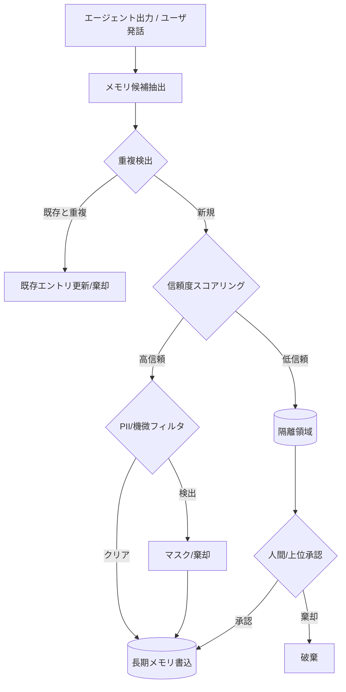

# Memory Write Gate / Quarantine｜メモリ書込ゲート

## 一言で（TL;DR）

長期メモリへの書込を無条件に許可せず、信頼度スコアリング・重複検出・PII/機微情報フィルタ・ソース検証を経て、基準を満たさない候補は隔離（quarantine）領域に留め置きます。メモリ汚染は沈黙のうちに蓄積し全ての将来の応答を歪めるため、**書込経路にゲートを設けて低品質な記憶の混入を防ぎます**。

## 解決する問題

エージェントが[メモリで状態を跨ぐ（F6）](../../concepts/design-forces.md)とき、長期メモリへの書込は「一度入ったら長く残る」不可逆に近い操作になります。書込ゲートが無い場合、次の問題が連鎖的に起きます。

1. **ハルシネーションの永続化（F4）**。エージェントが生成した誤情報がそのまま長期メモリに保存されると、以降のセッションで「過去に自分が記録した事実」として参照され、誤りが自己強化します。一度メモリに入った幻覚は、通常のグラウンディング検証をすり抜けてしまいます。
2. **インジェクション経由のメモリ汚染（F14）**。ユーザ入力や外部ドキュメントに埋め込まれた悪意ある指示がメモリに書き込まれると、攻撃者は将来のセッションにまで影響を及ぼせます。これはプロンプトインジェクションの持続化（persistent injection）として知られる攻撃面です。
3. **重複・矛盾の蓄積**。同じ事実が微妙に異なる表現で何度も書き込まれると、検索時に矛盾する記憶が返り、エージェントの応答品質が劣化します。

メモリ汚染はログやトレースに明示的なエラーを残さないため発見が遅れやすいです。データベースへの書込に入力バリデーションを掛けるのと同じ原則を、自然言語メモリにも適用する必要があります。

## 選定条件（When to use / When NOT）

- **使う条件**
    - エージェントがセッションを跨いで持続する長期メモリ（ベクトルストア、KVストア、ナレッジグラフ等）を持っています。
    - `[input_trust]` が中〜低で、エンドユーザの自由入力や外部ドキュメントからメモリ候補を抽出します。
    - `[failure_cost]` が中〜高で、誤った記憶が残ると、金銭的判断・医療助言・法的回答など後続の意思決定に影響します。
- **使わない条件（＝代替に倒す）**
    - メモリがセッション内スクラッチパッドのみで、セッション終了時に破棄される場合 → ゲートのオーバーヘッドに見合いません。書込検証は不要で、[D2 コンテキスト予算配分](d2-context-budget-allocator.md)で読込側を制御すれば十分です。
    - メモリが完全に管理者管理（エージェントは読取専用）の場合 → [C2 Read-Free / Write-Gated](../c-tools-security/c2-read-free-write-gated.md) のツール権限レベルで書込を禁止する方が単純です。

## 駆動変数とチューニング（程度）

| 目盛り | 効かなすぎ ⇔ 効きすぎ | 決め方 `[駆動変数]` | 目安（出発点） |
|---|---|---|---|
| 信頼度閾値 | 低すぎ：ハルシネーションが通過 ⇔ 高すぎ：有用な記憶が棄却され学習しない | `[input_trust]` が低いほど閾値を上げる。`[failure_cost]` が高い領域ではさらに厳格に | 明示的事実（ユーザが直接述べた）=自動承認、推測・要約=隔離、外部ソース未検証=棄却 |
| 重複検出の類似度閾値 | 低すぎ：重複が蓄積 ⇔ 高すぎ：関連する別事実を誤って重複判定 | `[failure_cost]` が高いほど矛盾排除を優先し閾値を下げる（広く重複判定） | コサイン類似度 概ね0.90〜0.95。同一エンティティ×同一属性なら上書き |
| 隔離→承認のフロー | 全自動：汚染リスク ⇔ 全承認：運用負荷で破綻 | `[input_trust]` × `[failure_cost]` の積が大きいほど人間承認寄り | 低リスク嗜好=自動、高リスク事実=人間承認、機微情報=棄却 |
| PII/機微情報フィルタの厳格度 | 緩い：個人情報がメモリに残留 ⇔ 厳しい：正当な固有名詞まで除去 | 規制要件と `[failure_cost]` に従う | 医療・金融=厳格（検出即棄却）、社内ツール=中程度（マスク後保存） |

## 相反における立ち位置（相反）

- **[F-16 自動メモリ vs 承認型メモリ](../../forks/index.md) → ハイブリッド**です。D3は「全自動で何でも書く」と「全件人間承認」の中間を構造化します。書込候補をまず自動フィルタ（信頼度・重複・PII）に通し、通過したもののうち低リスクは自動永続化、高リスクは隔離領域に置いて人間または上位エージェントの承認を待ちます。推測や未検証の属性は保存しない、という原則がハイブリッドの軸になります。判定基準は `[input_trust]` と `[failure_cost]` の組み合わせで決まります。

## 構造



## 実装メモ

書込ゲートの最小構造（擬似コード）を示します：

```python
def write_gate(candidate: MemoryCandidate, config: GateConfig) -> WriteDecision:
    # 1. 重複検出
    similar = vector_store.search(candidate.embedding, top_k=3)
    if any(s.score > config.dedup_threshold for s in similar):
        if same_entity_same_attribute(candidate, similar[0]):
            return WriteDecision.UPDATE(similar[0].id, candidate)
        return WriteDecision.SKIP(reason="duplicate")

    # 2. 信頼度スコアリング
    trust = score_trust(
        source=candidate.source,        # user_explicit / agent_inferred / external
        grounding=candidate.grounding,   # cited / uncited
        confirmation_count=candidate.confirmations,
    )
    if trust < config.trust_threshold:
        return WriteDecision.QUARANTINE(candidate, trust)

    # 3. PII/機微情報フィルタ
    pii_result = pii_detector.scan(candidate.text)
    if pii_result.has_pii:
        if config.pii_policy == "reject":
            return WriteDecision.SKIP(reason="pii_detected")
        candidate.text = pii_result.masked_text

    return WriteDecision.WRITE(candidate)
```

信頼度スコアリングの分類例を以下に示します：

| ソース | グラウンディング | 信頼度 | 処理 |
|---|---|---|---|
| ユーザが直接述べた事実 | 明示的 | 高 | 自動書込 |
| ユーザ発話からの推測 | エージェント推論 | 低 | 隔離 |
| 外部ドキュメント（検証済） | 引用あり | 中〜高 | 自動書込 |
| 外部ドキュメント（未検証） | 引用なし | 低 | 隔離または棄却 |
| エージェント自身の要約 | 推論 | 中 | 反復確認後に書込 |

落とし穴：

- **隔離領域の肥大化**に注意が必要です。承認フローが回らないと隔離が溜まり続けます。TTL（概ね7〜30日）を設け、未承認のまま期限を過ぎた候補は自動破棄してください。
- **重複検出の粒度**にも配慮が必要です。エンベディングの類似度だけでは「同じ人物の異なる属性」と「同じ属性の更新」を区別できません。エンティティID＋属性キーによる構造化メタデータを併用してください。
- **書込ゲートの迂回**も見落としがちなポイントです。エージェントがツール経由で直接ストアに書き込むパスが残っていると、ゲートが無意味になります。メモリストアへの書込APIは必ずゲートを経由させ、直接書込を禁止するアーキテクチャ制約を置いてください。

## 効かせる力学（forces）

- **F6（メモリで状態を跨ぐ）**：長期メモリの品質を書込時点で制御することで、セッション間で引き継がれる状態の信頼性を担保します。
- **F4（ハルシネーション）**：エージェントが生成した未検証の情報を長期メモリに永続化させません。ハルシネーションの自己強化ループを書込段階で断ちます。
- **F14（プロンプトインジェクション）**：外部入力経由の悪意あるメモリ書込（persistent injection）を信頼度スコアリングとソース検証で検出し、隔離または棄却します。

## 関連・代替

- 関連：[D1 階層化メモリ](d1-tiered-memory.md)（D3は長期メモリ層への書込ゲートであり、D1が定義する階層の境界を守る門番です）、[D4 メモリ減衰](d4-memory-decay-versioned-truth.md)（書込後に古くなった記憶を減衰させます。D3が入口、D4が経年管理です）、[C2 Read-Free / Write-Gated](../c-tools-security/c2-read-free-write-gated.md)（ツール呼出の読み書き分離と同じ原則をメモリに適用したものです）、[E1 リスクベース承認](../e-safety-hitl/e1-risk-based-approval.md)（隔離→承認フローの実装に利用します）、[E2 Policy as Code](../e-safety-hitl/e2-policy-as-code.md)（書込ポリシーをコードで強制する手段です）。
- 代替：なし。長期メモリを持つエージェントには原則として書込ゲートを設けるべきであり、「ゲート無しで全書込を許可する」選択は `[failure_cost]` が極めて低くかつ `[input_trust]` が十分高い場合にのみ正当化されます。

## コーディングエージェント向け指示（machine-actionable）

このパターンを人間に提案するなら、同時に以下を提案/確認してください：

- [ ] 書込先のメモリ階層を [D1 階層化メモリ](d1-tiered-memory.md) で定義し、どの層にゲートを掛けるか明示したか
- [ ] 信頼度閾値を `[input_trust]` と `[failure_cost]` から導き、**なぜその値か**を添えて提示したか
- [ ] 隔離領域のTTLと承認フローを設計し、[E1 リスクベース承認](../e-safety-hitl/e1-risk-based-approval.md) との連携を検討したか
- [ ] PII/機微情報フィルタの要否と厳格度を規制要件から判断したか
- [ ] メモリストアへの直接書込パスが残っていないか（ゲート迂回の防止）を確認したか
- [ ] 古い記憶の管理として [D4 メモリ減衰](d4-memory-decay-versioned-truth.md) を併せて検討したか
- [ ] 書込ポリシーを [E2 Policy as Code](../e-safety-hitl/e2-policy-as-code.md) でコード化し、プロンプトだけに依存しない強制を計画したか
