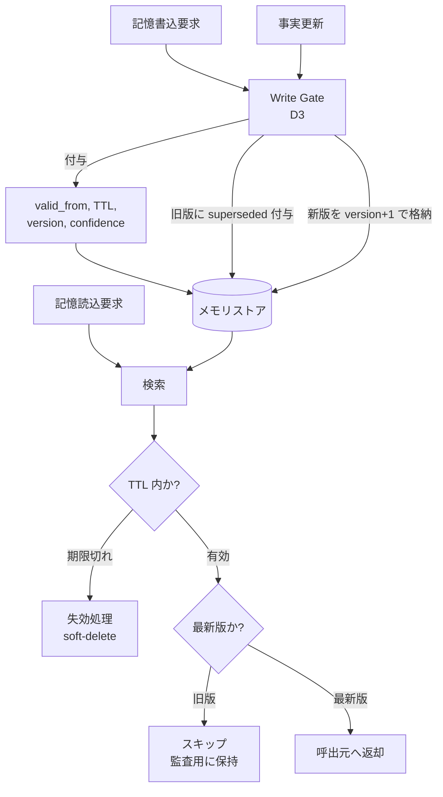

# Memory Decay & Versioned Truth｜記憶の減衰とバージョン管理

## 一言で（TL;DR）

記憶エントリに TTL（Time-To-Live）と版番号（version）を付与し、古い情報を自動的に失効させるとともに、事実が更新された際は旧版を `superseded` タイムスタンプ付きで保持する。テンポラルデータベースの `valid_from / valid_to` と同じ発想で、エージェントの記憶の鮮度と監査追跡性を両立させる。

## 解決する問題

エージェントが[メモリで状態を跨いで渡す（F6）](../../concepts/design-forces.md)とき、記憶の中身には鮮度の異なる情報が混在する。為替レートや在庫数のように分単位で変わるデータ、ユーザの嗜好のように週〜月単位で変わるデータ、法人番号のように実質不変のデータが同列に保存されると、古くなった情報をエージェントが「最新の事実」として利用してしまう。

TTL も版管理もない記憶ストアでは次の問題が起きる。

- **陳腐化した事実による誤判断**。3 時間前の在庫数をもとに「在庫あり」と回答し、実際は欠品だった。`[failure_cost]` が高い領域（金融・医療・EC の在庫確約）ではこの誤りが直接的な損害につながる。
- **矛盾する複数バージョンの共存**。同じ事実の旧版と新版が両方残り、検索のタイミングで異なる答えが返る。デバッグや監査で「なぜその判断をしたか」を再現できない。
- **ストレージの肥大化**。期限切れの記憶が蓄積し、検索のノイズが増え、コンテキスト予算を圧迫する。

## 選定条件（When to use / When NOT）

- **使う条件**
    - 記憶する事実に寿命の差がある（価格は分単位、嗜好は月単位、ID は不変、など）。
    - `[failure_cost]` が中〜高：古い記憶に基づく判断が金銭的・法的・安全上の損害を引き起こしうる。
    - セッションが長時間、あるいはセッション跨ぎで記憶を再利用する設計。
    - 監査要件がある：「いつ時点でどの事実を参照したか」を後から検証する必要がある。
- **使わない条件（＝代替に倒す）**
    - セッションが短命（数分以内）で記憶の陳腐化が起きない → TTL のオーバーヘッドが見合わない。セッション終了時に記憶を破棄すれば十分。
    - 記憶する情報がすべて不変（ドキュメント ID、定数マスタなど） → 版管理の必要がない。
    - `[failure_cost]` が低い：古い情報で判断しても影響が軽微 → 単純な LRU 追い出しで十分。[D6 Semantic Cache](d6-semantic-cache-nocache-zones.md) のキャッシュ TTL に寄せる。

## 駆動変数とチューニング（程度）

| 目盛り | 効かなすぎ ⇔ 効きすぎ | 決め方 `[駆動変数]` | 目安（出発点） |
|---|---|---|---|
| TTL（失効期間） | 長すぎて陳腐化した記憶で誤判断 ⇔ 短すぎて有効な記憶を再取得するコスト増 | `[failure_cost]` が高いほど短めに設定。情報の変化速度に合わせる | 価格/在庫: 5〜30 分、嗜好: 7〜30 日、不変属性: 無期限 |
| 版保持数 | 少なすぎて監査証跡が不十分 ⇔ 多すぎてストレージ圧迫・検索ノイズ | `[failure_cost]` が高いほど多く保持（監査のため） | 概ね 3〜10 版。規制領域では法定保持期間に合わせる |
| 確信度閾値（confidence） | 低すぎて不確かな記憶を採用 ⇔ 高すぎて有用な記憶を棄却 | `[failure_cost]` が高いほど閾値を上げる | 0.7〜0.9。金融・医療は 0.85 以上を出発点とする |
| 競合解決ポリシー | 新版を無条件採用で誤更新が混入 ⇔ 全件手動レビューで遅延 | `[failure_cost]` と更新頻度のバランス | 確信度が旧版より低い場合はフラグ付きレビュー、それ以外は新版自動採用 |

## 相反における立ち位置（相反）

このパターンは特定のフォークの一方に明確に倒すものではなく、記憶階層（[D1](d1-tiered-memory.md)）の各層に対して TTL と版管理のポリシーを横断的に適用する補助パターンである。ただし、記憶の書き込み経路では [D3 Memory Write Gate](d3-memory-write-gate.md) と連携し、書き込み時に `valid_from` と初期 TTL を付与する設計が自然になる。

## 構造



## 実装メモ

記憶エントリの最小スキーマ：

```json
{
  "memory_id": "mem-price-USD-JPY",
  "version": 3,
  "value": {"rate": 149.82, "source": "market-feed"},
  "confidence": 0.95,
  "valid_from": "2025-01-15T10:00:00Z",
  "valid_to": null,
  "ttl_seconds": 300,
  "expires_at": "2025-01-15T10:05:00Z",
  "superseded_by": null,
  "tags": ["price", "fx"]
}
```

事実更新時の擬似コード：

```python
def update_memory(store, memory_id: str, new_value, confidence: float):
    now = datetime.utcnow()
    current = store.get_latest(memory_id)

    if current and confidence < current.confidence:
        # 確信度が下がった場合はフラグを立ててレビュー待ち
        store.flag_for_review(memory_id, new_value, confidence)
        return

    if current:
        current.valid_to = now
        current.superseded_by = current.version + 1
        store.save(current)

    new_entry = MemoryEntry(
        memory_id=memory_id,
        version=(current.version + 1) if current else 1,
        value=new_value,
        confidence=confidence,
        valid_from=now,
        ttl_seconds=get_ttl_for_type(memory_id),
        expires_at=now + timedelta(seconds=get_ttl_for_type(memory_id)),
    )
    store.save(new_entry)
```

TTL 分類の目安：

| 記憶の種類 | TTL の出発点 | 根拠 |
|---|---|---|
| リアルタイム価格・在庫 | 5〜30 分 | データソースの更新頻度に合わせる |
| ユーザ嗜好・設定 | 7〜30 日 | 行動変化の時間スケール |
| マスタ属性（ID・名前） | 無期限（TTL なし） | 変更頻度が極めて低い。変更時は版更新で対応 |
| 会話中の一時的事実 | セッション終了まで | セッション外に持ち出さない |

落とし穴：

- **TTL と外部データソースの更新頻度の乖離**。TTL をデータソースの更新間隔より短くすると、毎回取り直すことになりキャッシュ効果がなくなる。逆に長すぎると陳腐化する。データソースの公称更新間隔の 1〜2 倍を出発点とし、`[failure_cost]` が高いほど短い側に寄せる。
- **soft-delete と hard-delete の使い分け**。監査要件がある場合は期限切れエントリを即座に削除せず `soft-delete`（`valid_to` を付けて検索対象外にする）にする。ストレージ圧迫を防ぐため、法定保持期間を過ぎた分は定期バッチで `hard-delete` する。
- **タイムゾーンと時刻同期**。`valid_from / valid_to` は UTC で統一する。ノード間の時刻ずれが TTL より大きいと、あるノードでは有効・別のノードでは失効という不整合が起きる。

## 効かせる力学（forces）

- **F6（メモリで状態を跨ぐ）**：記憶エントリに TTL と版番号を付けることで、セッション跨ぎ・長時間セッションでも「いつ時点の事実か」が明確になる。陳腐化した記憶が自動的に失効し、最新版のみが参照されるため、メモリ経由の情報伝達の信頼性が構造的に担保される。版履歴を保持することで、過去の判断に使われた事実を事後に再現でき、監査にも対応する。

## 関連・代替

- [D1 Tiered Memory](d1-tiered-memory.md)：階層ごとに異なる TTL ポリシーを設定する。作業メモリは短い TTL、長期メモリは長い TTL というように、本パターンの TTL 設計は D1 の階層設計と直接対応する。
- [D3 Memory Write Gate](d3-memory-write-gate.md)：書込ゲートが記憶エントリに `valid_from`・TTL・`confidence` を付与する入口となる。本パターンのメタデータ付与は Write Gate の検査パイプラインの一部として実装するのが自然。
- [D6 Semantic Cache with No-Cache Zones](d6-semantic-cache-nocache-zones.md)：キャッシュの TTL と記憶の TTL を整合させる必要がある。記憶の TTL がキャッシュの TTL より短い場合、キャッシュが陳腐化した記憶を返す事故が起きる。
- [G1 Tiered Observability](../g-observability-ops/g1-tiered-observability.md)：記憶の失効率・版更新頻度・確信度低下フラグの発生率を観測メトリクスとして公開し、TTL 設定の適正さをモニタリングする。

## コーディングエージェント向け指示（machine-actionable）

このパターンを人間に提案するなら、同時に以下を提案/確認する：

- [ ] 記憶する事実を種類別に分類し、種類ごとの TTL を `[failure_cost]` から導いて**理由を添えて**提示したか
- [ ] [D1 Tiered Memory](d1-tiered-memory.md) の各階層と TTL ポリシーを対応づけたか
- [ ] [D3 Memory Write Gate](d3-memory-write-gate.md) のパイプラインに `valid_from`・TTL・`confidence` の付与ステップを組み込んだか
- [ ] [D6 Semantic Cache](d6-semantic-cache-nocache-zones.md) のキャッシュ TTL と記憶 TTL の整合を確認したか
- [ ] 版保持数と削除ポリシー（soft-delete / hard-delete）を監査要件に照らして定めたか
- [ ] 確信度が低下する更新に対するレビューフロー（自動採用 vs フラグ付き）を設計したか
- [ ] [G1 Tiered Observability](../g-observability-ops/g1-tiered-observability.md) で失効率・版更新頻度のメトリクスを公開する設計を示したか
- [ ] 目盛り（上表）の値を `[駆動変数]` から導き、**理由を添えて**提示したか
