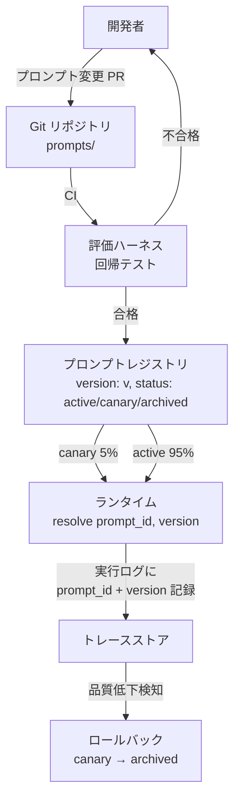

# Prompt Registry / Prompt Artifact｜プロンプトの成果物化

## 一言で（TL;DR）

プロンプトをアプリケーションコードに埋め込まれた文字列定数ではなく、バージョン管理・レビュー・テスト・段階的デプロイの対象となる**独立した成果物**として扱う。プロンプトの変更は実質的にモデルの挙動変更であり、コード変更と同等以上のリスクを持つという前提に立つ。

## 解決する問題

LLM ベースのシステムでは、プロンプトの一文字の変更がモデル出力を大きく変えうる。[LLM が変わると挙動が変わる（F9）](../../concepts/design-forces.md)という力学は、モデルバージョンのアップデートだけでなくプロンプト自体の変更にも当てはまる。プロンプトをコード中のリテラル文字列として管理していると、以下の問題が発生する。

1. **変更追跡の困難**：誰がいつ何を変えたのか分からない。大きなコミットに紛れ込んだプロンプト変更が本番障害の原因になっても切り分けが難しい。
2. **回帰テスト不能**：プロンプト変更前後で出力品質がどう変わったかを定量評価する仕組みがない。
3. **ロールバック不能**：問題が起きても「前のプロンプトに戻す」操作にコードデプロイが必要になる。
4. **監査不能**：[監査対象となるシステム（F16）](../../concepts/design-forces.md)では、どのバージョンのプロンプトでどの判断がなされたかを事後に示せなければならないが、プロンプトがコード内に散在しているとこの紐づけが困難になる。

## 選定条件（When to use / When NOT）

- **使う条件**
    - `[accountability]` が中〜高で、プロンプトの変更履歴と実行時バージョンの記録が求められる（金融・医療・法務など規制領域、または社内の品質管理基準がある場合）。
    - プロンプトが複数箇所から参照され、一元管理しないと不整合が生じるリスクがある。
    - 本番環境でプロンプトの A/B テストや段階的ロールアウトを行いたい。
    - チームが複数人でプロンプトを編集し、レビュープロセスが必要。
- **使わない条件（＝代替に倒す）**
    - プロンプトが1〜2個しかなく、変更頻度も低い個人プロジェクトや PoC → コード内のリテラル文字列で十分。Git の diff で管理できる。
    - `[accountability]` が低く、出力品質の変動が許容される探索的用途 → プロンプトの厳格管理は過剰投資。

## 駆動変数とチューニング（程度）

| 目盛り | 効かなすぎ ⇔ 効きすぎ | 決め方 `[駆動変数]` | 目安（出発点） |
|---|---|---|---|
| バージョン管理の粒度 | 変更追跡できず回帰原因不明 ⇔ 些細な空白修正にもレビュー必須で開発停滞 | `[accountability]` が高いほど厳格に。低ければ Git 管理で十分 | 規制領域＝専用レジストリ、社内ツール＝Git ファイル管理 |
| テスト必須度 | プロンプト変更が回帰を引き起こす ⇔ 全変更に大規模 eval を要求し速度低下 | `[accountability]` × プロンプト変更の影響範囲 | 顧客対面出力＝eval 必須、内部ログ用＝目視確認で可 |
| デプロイ戦略 | 全量即時反映で障害時の爆風が大きい ⇔ カナリア比率が小さすぎて検証に時間がかかる | `[accountability]` が高いほど段階的に | 高 accountability＝カナリア5-10%→段階拡大、低＝即時反映 |
| ロールバック即応性 | 旧バージョンに戻せず障害長期化 ⇔ 自動ロールバック閾値が敏感すぎて安定しない | `[accountability]` が高いほど即時ロールバック可能に | 概ね5分以内にロールバック完了できる設計を出発点とする |

## 相反における立ち位置（相反）

本パターンは特定のフォークに直接対応しないが、設計判断として以下の立場をとる。

- **プロンプトの管理方式**については「コードと同等の成果物」側に倒す。プロンプトを「気軽に変えられる設定値」と見なす立場とは対立する。ただし `[accountability]` が低い領域では管理の厳格さを下げてよい。
- [B1 決定論的な殻](../b-orchestration/b1-deterministic-shell.md) の「殻」に含まれるプロンプトテンプレートもコード管理対象とすることで、殻の決定論性を補強する。

## 構造



## 実装メモ

プロンプトレジストリの最小構造：

```python
# prompts/order_classify.yaml
prompt_id: order_classify
version: 3
template: |
  あなたは注文分類アシスタントです。
  以下の注文内容を {categories} のいずれかに分類してください。
  注文内容: {order_text}
variables:
  - categories
  - order_text
model_constraint: "gpt-4o >= 2024-08-06"  # モデル互換性の明示
eval_baseline: "eval/order_classify_v3.jsonl"
```

ランタイムでの解決：

```python
def resolve_prompt(prompt_id: str, context: dict) -> str:
    entry = registry.get_active(prompt_id)  # canary 対象なら確率で canary 版を返す
    template = entry.template
    rendered = template.format(**context)
    # 実行ログにバージョンを記録（監査用）
    logger.info("prompt_resolved", prompt_id=prompt_id, version=entry.version)
    return rendered
```

落とし穴：

- **テンプレート変数の型を定義する**。`{order_text}` にユーザ入力が入る場合、インジェクション対策としてエスケープやサニタイズが必要。変数の由来（ユーザ入力 vs システム値）を区別する。
- **モデルとプロンプトの互換性を記録する**。プロンプト v3 が gpt-4o-2024-08-06 で検証済みなら、その紐づけを明示する。モデル更新時に再評価が必要なプロンプトを特定できる。
- **レジストリを外部サービスにしすぎない**。プロンプト解決が外部 API 依存になると可用性リスクが増す。起動時にフェッチしてローカルキャッシュする、Git ファイルから直接読む等の方式も検討する。
- **プロンプトの差分レビューを可能にする**。diff が見やすいよう、プロンプトは YAML/Markdown 等の行指向フォーマットで保存する。巨大な1行 JSON は避ける。

## 効かせる力学（forces）

- **F9（LLM が変わると挙動が変わる）**：プロンプトをバージョン管理し、変更時に評価ハーネスで回帰テストを実施することで、意図しない挙動変化を検知できる。モデル更新時にも、どのプロンプトが影響を受けるかをプロンプト-モデル互換性の記録から特定し、再評価の対象を絞れる。
- **F16（監査対象）**：実行時にどのバージョンのプロンプトが使われたかをトレースに記録することで、事後監査で「この判断はどのプロンプトに基づくか」を示せる。変更履歴・レビュー記録・評価結果が紐づくため、変更の正当性も説明できる。

## 関連・代替

- [B1 決定論的な殻](../b-orchestration/b1-deterministic-shell.md)：殻のプロンプトテンプレートもバージョン管理対象。本パターンはその具体的な管理方法を提供する。
- [D2 コンテキスト予算配分](d2-context-budget-allocator.md)：プロンプトテンプレートのトークン消費量は予算配分の固定枠として計上する。テンプレート変更時に予算配分の再計算が必要。
- [G3 シャドウ・カナリア](../g-observability-ops/g3-shadow-canary.md)：プロンプト変更のカナリアデプロイに利用する。新バージョンのプロンプトを少量トラフィックで検証し、品質指標を比較する。
- [G4 評価ハーネス](../g-observability-ops/g4-eval-harness.md)：プロンプト変更の回帰テストを実施する基盤。CI でプロンプト変更を検知し、自動的に eval を実行する。
- [E2 Policy-as-Code](../e-safety-hitl/e2-policy-as-code.md)：ポリシー定義もプロンプトと同様にバージョン管理対象。両者を同じレジストリで管理することで、プロンプトとポリシーの組み合わせの整合性を保てる。

## コーディングエージェント向け指示（machine-actionable）

このパターンを人間に提案するなら、同時に以下を提案/確認する：

- [ ] プロンプトの保存形式（YAML/Markdown/専用レジストリ）を `[accountability]` の水準から選定し、**理由を添えて**提示したか
- [ ] [G4 評価ハーネス](../g-observability-ops/g4-eval-harness.md) をプロンプト変更の CI に組み込む設計を併せて提案したか
- [ ] `[accountability]` が高いなら [G3 シャドウ・カナリア](../g-observability-ops/g3-shadow-canary.md) によるプロンプト変更の段階的デプロイを提案したか
- [ ] 実行時ログにプロンプト ID とバージョンを記録する設計を含めたか
- [ ] プロンプトテンプレートの変数にユーザ入力が含まれる場合、インジェクション対策を確認したか
- [ ] [D2 コンテキスト予算配分](d2-context-budget-allocator.md) との連携（テンプレートのトークン消費量の計上）を説明したか
- [ ] 目盛り（上表）の値を `[駆動変数]` から導き、**理由を添えて**提示したか
