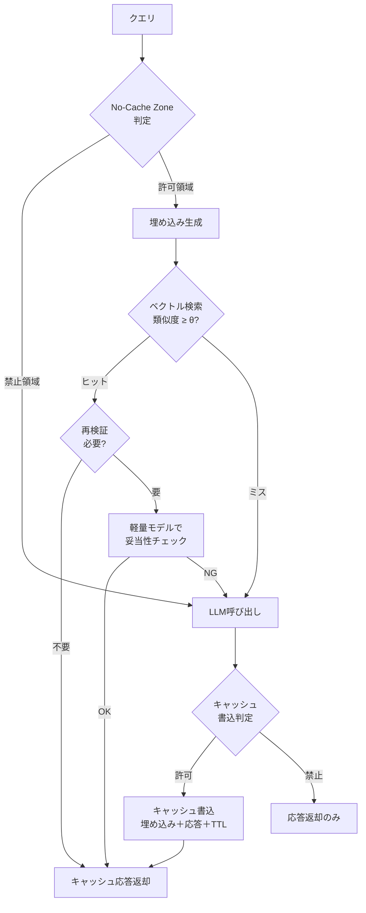

# Semantic Cache with No-Cache Zones｜禁止領域付きキャッシュ

## 一言で（TL;DR）

意味的類似度でクエリをマッチし、過去の応答をキャッシュから再利用する。ただし**キャッシュしてはいけない領域（No-Cache Zone）をポリシーで先に切り出し**、残りの安全領域でのみ類似度閾値を適用する。閾値は `[failure_cost]` の関数であり、禁止領域の範囲は `[cost_sensitivity]` とのバランスで決まる。

## 解決する問題

エージェントへのリクエストは[1回あたりのコストが高く（F2）](../../concepts/design-forces.md)、[コンテキスト長で費用が増大する（F11）](../../concepts/design-forces.md)。同じ意図のクエリが繰り返し到着する環境では、毎回LLMを呼び出すと不要なトークン消費が積み上がる。

一方で、完全一致キャッシュはクエリの表記揺れに対応できず、ヒット率が極端に低い。そこで**ベクトル埋め込みによる意味的類似度**でマッチングすれば、表記揺れを吸収してヒット率を上げられる。

しかし意味的キャッシュを無差別に適用すると次の問題が生じる。

1. **個人情報依存の応答が他ユーザに返る** — 「私の注文履歴を教えて」への応答を別ユーザに返せば重大なプライバシー侵害になる。
2. **リアルタイム性の喪失** — 株価・在庫・フライト状況など時刻で変わるデータのキャッシュは誤情報になる。
3. **安全判断の固定化** — 医療・法務・コンプライアンスなど、毎回最新の知識と文脈で判断すべき領域をキャッシュすると、誤判断が大量に複製される。

本パターンは「**相反は先に切る**」の原則に従い、まず No-Cache Zone をポリシーで定義し、残りの安全領域にのみセマンティックキャッシュを適用することでコスト削減とリスク回避を両立する。

## 選定条件（When to use / When NOT）

- **使う条件**
    - 同一・類似クエリの繰り返し率が高い（目安：全リクエストの概ね20%以上が類似クエリ）。
    - 1リクエストあたりのLLMコストが無視できない。
    - クエリの意味的分類が可能で、キャッシュ禁止領域を明確にポリシー定義できる。
- **使わない条件**
    - ほぼ全クエリがユーザ固有のコンテキストに依存し、汎用キャッシュのヒットが見込めない → キャッシュ層を入れてもオーバーヘッドのみ。
    - `[failure_cost]` が全領域で極めて高く、どの応答もキャッシュ再利用が許容されない → 毎回LLM呼び出し＋検証を行い、コスト削減は[B7 モデルルーター](../b-orchestration/b7-model-router-adaptive-effort.md)で対処する。
    - クエリの繰り返し率が低く、埋め込み計算＋ベクトル検索のコストがLLM呼び出し削減分を上回る → 完全一致キャッシュで十分。

## 駆動変数とチューニング（程度）

| 目盛り | 効かなすぎ ⇔ 効きすぎ | 決め方 `[駆動変数]` | 目安（出発点） |
|---|---|---|---|
| 類似度閾値 | ヒット率ゼロでコスト削減なし ⇔ 異なる意図にキャッシュが当たり誤回答 | `[failure_cost]` が高い領域ほど閾値を上げる | コサイン類似度 0.92–0.97。低リスク FAQ 向けは 0.92、中リスクは 0.95、高リスクは 0.97 または No-Cache |
| No-Cache Zone の広さ | 禁止が狭すぎてリスクのある応答がキャッシュされる ⇔ 広すぎてヒット率が下がりコスト削減できない | `[cost_sensitivity]` が高いほど Zone を狭く絞りたいが、`[failure_cost]` が高い領域は広げる | PII依存・リアルタイムデータ・安全判断の3分類を最低限カバー |
| キャッシュ TTL | 短すぎてヒット率低下 ⇔ 長すぎて陳腐化した応答を返す | 情報の変化頻度に連動。`[failure_cost]` が高いほど短くする | 静的知識は概ね24–72時間、半動的は1–6時間、動的は No-Cache |
| 再検証併用 | 再検証なしでキャッシュ直返し ⇔ 毎回再検証でキャッシュの意味がない | `[failure_cost]` が中程度の領域で、キャッシュヒット後に軽量モデルで妥当性チェック | 高リスク隣接領域で軽量モデル（概ね入力の1/10コスト）による再検証 |

## 相反における立ち位置（相反）

本パターンは特定のフォークに直接対応しないが、**「相反は先に切る」**の原則を体現している。キャッシュ可否という二値判定を領域ごとに先に行い（No-Cache Zone の分類）、その内側で初めて類似度閾値という程度の調整を行う。

[F-9 インライン検証 vs 事後検証](../../forks/index.md)との接点がある。No-Cache Zone に分類されたクエリは毎回LLMを呼び出すため、そこでインライン検証を適用するコストは許容しやすい。一方キャッシュヒットした応答に対しては、`[failure_cost]` が中程度の領域では軽量な事後検証（再検証併用）を挟む折衷が有効になる。

## 構造



## 実装メモ

No-Cache Zone の判定は、分類器またはルールベースで行う。最小構成はルールベース：

```python
NOCACHE_RULES = [
    {"type": "pii_dependent",   "patterns": ["私の", "my account", "注文履歴"]},
    {"type": "realtime",        "patterns": ["今の", "現在の", "stock price", "在庫"]},
    {"type": "safety_critical", "patterns": ["診断", "法的助言", "コンプライアンス"]},
]

def is_nocache_zone(query: str, metadata: dict) -> bool:
    # ルールベース判定
    for rule in NOCACHE_RULES:
        if any(p in query for p in rule["patterns"]):
            return True
    # メタデータベース判定（ユーザ固有セッション等）
    if metadata.get("user_specific", False):
        return True
    return False
```

類似度検索とキャッシュの最小構成：

```python
SIMILARITY_THRESHOLD = {
    "low_risk":  0.92,
    "mid_risk":  0.95,
    "high_risk": 0.97,
}

def semantic_cache_lookup(query: str, risk_level: str) -> str | None:
    embedding = embed(query)
    threshold = SIMILARITY_THRESHOLD[risk_level]
    results = vector_store.search(embedding, top_k=1)
    if results and results[0].score >= threshold:
        if risk_level == "mid_risk":
            # 再検証: 軽量モデルで妥当性チェック
            if not revalidate(query, results[0].response):
                return None
        return results[0].response
    return None
```

落とし穴：

- **埋め込みモデルの変更でキャッシュが無効化される** — 埋め込みモデルのバージョンをキャッシュのメタデータに記録し、モデル更新時は段階的に再埋め込みするかキャッシュをフラッシュする。
- **No-Cache Zone のパターンマッチが甘いと漏れる** — ルールベースだけでは表記揺れに弱い。本番では意図分類器（軽量モデルまたはファインチューニング済み分類器）を併用する。分類器自体のコストがLLM呼び出しより十分小さいことを確認する。
- **キャッシュポイズニング** — 攻撃者が意図的に誤った応答をキャッシュに載せる可能性がある。書込時に品質スコアの閾値を設け、低品質応答はキャッシュしない。
- **TTL切れの一斉ミス（サンダリングハード）** — 同一TTLのキャッシュが一斉に失効すると、LLMに負荷が集中する。TTLにジッタ（概ね10–20%のランダム幅）を加える。

## 効かせる力学（forces）

- **F2（高コスト）** — 類似クエリをキャッシュ再利用することで、LLM呼び出し回数を削減し、トークン課金を抑える。ヒット率が概ね30%でも月間コストに大きく効く。
- **F11（コンテキスト長コスト）** — キャッシュヒット時はLLM呼び出し自体をスキップするため、長いコンテキストの組立・送信コストもゼロになる。[D2 コンテキスト予算配分](d2-context-budget-allocator.md)と組み合わせると、キャッシュミス時のコンテキスト予算も最適化できる。

## 関連・代替

- [A6 適応タイムアウト](../a-execution/a6-adaptive-timeout-retry.md) — キャッシュヒット時はLLM呼び出しとリトライが不要になるため、タイムアウト・リトライ予算の消費を回避できる。キャッシュミス時のフォールバックとして A6 のリトライ戦略が働く。
- [B7 モデルルーター](../b-orchestration/b7-model-router-adaptive-effort.md) — キャッシュミス時にどのモデルを使うかの選択と組み合わせる。キャッシュ＋ルーターの二段階でコスト最適化が可能。No-Cache Zone で毎回LLMを呼ぶ領域では、ルーターが適切なモデルを選ぶことでコストを抑える。
- [D2 コンテキスト予算配分](d2-context-budget-allocator.md) — キャッシュミス時のLLM呼び出しで、コンテキストに何をどれだけ入れるかを D2 が管理する。キャッシュヒット時はコンテキスト組立自体をスキップできるため、D2 の予算計算も不要になる。
- [D4 記憶減衰](d4-memory-decay-versioned-truth.md) — キャッシュの TTL と長期メモリの減衰ポリシーを整合させる。キャッシュ TTL を D4 の記憶減衰より短く設定しないと、長期メモリでは消えた情報がキャッシュに残る矛盾が生じる。
- [G1 二層観測](../g-observability-ops/g1-tiered-observability.md) — キャッシュヒット率・No-Cache Zone 分類精度・類似度分布・TTL 失効率を計測し、閾値と Zone 定義のチューニングにフィードバックする。

## コーディングエージェント向け指示（machine-actionable）

このパターンを人間に提案するなら、同時に以下を提案/確認する：

- [ ] No-Cache Zone の分類基準（PII依存・リアルタイム・安全判断）を当該ユースケースに具体化し、**漏れがないか**人間に確認したか
- [ ] 類似度閾値を `[failure_cost]` から導き、リスクレベル別の値を**理由を添えて**提示したか
- [ ] キャッシュ TTL を情報の変化頻度から設定し、[D4 記憶減衰](d4-memory-decay-versioned-truth.md)の減衰ポリシーと整合しているか確認したか
- [ ] キャッシュミス時の経路で [B7 モデルルーター](../b-orchestration/b7-model-router-adaptive-effort.md) や [D2 コンテキスト予算配分](d2-context-budget-allocator.md) との連携を設計したか
- [ ] [G1 二層観測](../g-observability-ops/g1-tiered-observability.md) でヒット率・Zone分類精度・類似度分布を計測する方針を示したか
- [ ] 埋め込みモデルのバージョン管理とキャッシュ無効化戦略を定義したか
- [ ] TTL のジッタ設定によるサンダリングハード対策を含めたか
