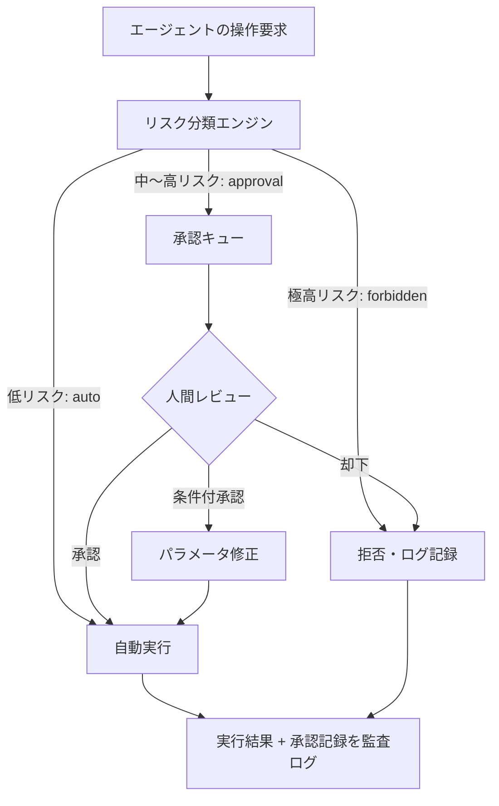

# Risk-based Human Approval｜リスクベース人間承認

## 一言で（TL;DR）

エージェントが実行しようとする操作を**リスクスコア（不可逆性 × 失敗コスト）**で3層に分類し、低リスクは自動実行、中〜高リスクは人間承認を経由、極高リスクは禁止とします。承認の要否を操作ごとに動的に判定することで、安全性とスループットを両立させます。

## 解決する問題

エージェントが外部システムに副作用を持つ操作を実行できる場合（[F8](../../concepts/design-forces.md)）、すべてを自動実行すれば不可逆な損害が発生しえますし、すべてに人間承認を求めれば待ち時間で業務が止まります。LLM はハルシネーションにより誤った操作を選択する可能性があり（[F4](../../concepts/design-forces.md)）、かつエージェントシステムは本質的に人間との協働が前提です（[F17](../../concepts/design-forces.md)）。

このパターンが無いと、以下のいずれかに陥ります：

- **全件承認**：低リスクの読取操作にまで人間を介在させ、エージェントの価値（自動化による時短）が消失します。
- **全件自動**：本番DBの削除やメール送信など取り消せない操作まで自動実行し、障害発生時の影響が甚大になります。
- **承認判断がプロンプト任せ**：LLM に「危険だと思ったら聞いて」と指示しても、どの操作が危険かの判断自体が確率的でありすり抜けます。

## 選定条件（When to use / When NOT）

- **使う条件**
    - エージェントが書込・更新・削除・送信など**副作用を伴う操作**を実行できます。
    - `[reversibility]` が操作によって異なります（読取は可逆だが送信は不可逆、など）。
    - `[failure_cost]` が中〜高の操作が混在しており、一律のポリシーでは過剰か不足になります。
    - 人間がレビューに関与できる運用体制があり、`[latency_budget]` に承認待ち時間を組み込めます。
- **使わない条件（＝代替に倒す）**
    - すべての操作が読取専用で副作用がない → [C2 Read-Free / Write-Gated](../c-tools-security/c2-read-free-write-gated.md) の Read-Free 側だけで十分です。
    - `[failure_cost]` が一律に低く、すべての操作が容易にロールバック可能 → 承認なしの自動実行＋事後監査で済みます。
    - `[latency_budget]` が極めて短く（数秒以内）人間介在を許容できない → ドライラン＋自動検証（[C3](../c-tools-security/c3-dry-run-commit.md)）に倒します。

## 駆動変数とチューニング（程度）

| 目盛り | 効かなすぎ ⇔ 効きすぎ | 決め方 `[駆動変数]` | 目安（出発点） |
|---|---|---|---|
| リスク層の閾値（auto/approval/forbidden の境界） | 危険な操作が自動実行される ⇔ 安全な操作にも承認を要求しスループット低下 | `[reversibility]` × `[failure_cost]` のマトリクスで機械的に分類 | 可逆＋低コスト=auto、不可逆 or 高コスト=approval、不可逆＋高コスト=forbidden |
| 承認タイムアウト | 無期限待ちでタスクが滞留 ⇔ 短すぎて承認者が間に合わない | `[latency_budget]` から逆算。SLA の概ね 50-70% を承認待ちに割り当て | 対話型: 2-5分、バッチ型: 1-24時間 |
| リスク評価の粒度 | 操作単位が粗すぎて高リスク操作を見逃す ⇔ 細かすぎて分類の維持コスト過大 | `[failure_cost]` が高い領域ほど細かく分類する | ツール名 × パラメータの組み合わせ（例：delete は approval、read は auto） |
| 承認者の多重度（何人に聞くか） | 1人承認で見落とし ⇔ 多人数承認で待ち時間膨張 | `[failure_cost]` が極めて高い操作ほど多重度を上げる | 通常1人、金銭移動・本番変更は2人以上 |

## 相反における立ち位置（相反）

- **[F-15 読取専用 vs 書込可能](../../forks/index.md) → hybrid（Read自由・Writeはゲート）**。本パターンはまさにこのハイブリッド戦略の実装であり、Read 操作は承認なしに自動実行し、Write 操作をリスクスコアで auto/approval/forbidden に仕分けます。`[reversibility]` が低い操作ほどゲートを厳しくします。

## 構造



## 実装メモ

リスク分類の最小実装（擬似コード）：

```python
from enum import Enum
from dataclasses import dataclass

class RiskTier(Enum):
    AUTO = "auto"
    APPROVAL = "approval"
    FORBIDDEN = "forbidden"

@dataclass
class RiskPolicy:
    tool: str
    action: str
    reversibility: float   # 0.0（不可逆）〜 1.0（完全可逆）
    failure_cost: float     # 0.0（無害）〜 1.0（致命的）

def classify_risk(policy: RiskPolicy) -> RiskTier:
    risk_score = (1 - policy.reversibility) * policy.failure_cost
    if risk_score >= 0.7:
        return RiskTier.FORBIDDEN
    elif risk_score >= 0.3:
        return RiskTier.APPROVAL
    else:
        return RiskTier.AUTO
```

リスクポリシーの設定例（YAML）：

```yaml
risk_policies:
  - tool: database
    action: select
    reversibility: 1.0
    failure_cost: 0.0
    tier: auto
  - tool: database
    action: update
    reversibility: 0.6      # WHERE句次第で部分復旧可能
    failure_cost: 0.5
    tier: approval
  - tool: database
    action: drop_table
    reversibility: 0.0
    failure_cost: 1.0
    tier: forbidden
  - tool: email
    action: send
    reversibility: 0.0      # 送信後の取消不能
    failure_cost: 0.4
    tier: approval
```

落とし穴：

- **リスク分類自体を LLM に任せないでください**。分類は[決定論的な殻（B1）](../b-orchestration/b1-deterministic-shell.md)の責務です。ツール名×アクション名の静的テーブルか、ポリシーエンジン（[E2](e2-policy-as-code.md)）で判定します。
- **承認待ちの状態を永続化してください**。承認キューに入った操作は[耐久的な非同期セッション（A2）](../a-execution/a2-durable-async-agent.md)で状態を保持し、プロセス再起動でも消失しないようにします。
- **承認タイムアウト後のデフォルトを安全側に倒してください**。タイムアウトしたら自動承認ではなく自動却下にします。
- **条件付き承認を設計に含めてください**。承認者が「金額を1万円以下に修正して実行」のようにパラメータを変更して承認できると、却下→再提案のラウンドトリップを減らせます。

## 効かせる力学（forces）

- **F4（ハルシネーション）**：LLM が誤った操作を選択しても、高リスク操作は必ず人間承認を経由するため、ハルシネーションによる不可逆な損害を防止できます。
- **F8（ツール副作用）**：副作用の危険度をリスクスコアで定量化し、ゲートの厳しさを段階的に制御します。すべての副作用を一律に扱うのではなく、影響度に応じた最小限の摩擦を入れます。
- **F17（人間協働）**：人間の関与を「全件」でも「ゼロ」でもなく、リスクに応じて適切な頻度に調整します。人間は高リスク判断に集中でき、低リスク作業はエージェントに任せられます。

## 関連・代替

- [A2 耐久非同期エージェント](../a-execution/a2-durable-async-agent.md)：承認待ちの間セッション状態を永続化します。本パターンの承認キューは A2 の中断・再開メカニズムに依存します。
- [B1 決定論的な殻](../b-orchestration/b1-deterministic-shell.md)：リスク分類エンジンは殻の一部として実装します。分類ロジックに LLM を使いません。
- [C2 Read-Free / Write-Gated](../c-tools-security/c2-read-free-write-gated.md)：本パターンの基盤となる Read/Write の分離です。Write 側のゲートをリスクスコアでさらに細分化したものが本パターンです。
- [C3 ドライラン/コミット](../c-tools-security/c3-dry-run-commit.md)：approval 層の操作に対し、承認前にドライラン結果を人間に提示する補強策です。
- [E5 自律性のはしご](e5-autonomy-ladder.md)：エージェントの実績に応じてリスク閾値を動的に調整する上位パターンです。本パターンの閾値を固定ではなく昇格・降格可能にします。
- [G1 二層観測](../g-observability-ops/g1-tiered-observability.md)：承認・却下・自動実行の記録を監査ログとして観測基盤に流します。

## コーディングエージェント向け指示（machine-actionable）

このパターンを人間に提案するなら、同時に以下を提案/確認してください：

- [ ] `[reversibility]` と `[failure_cost]` を操作ごとに評価し、**3層（auto/approval/forbidden）のマッピング表**を具体化したか
- [ ] 承認待ちの状態保持に [A2 耐久非同期エージェント](../a-execution/a2-durable-async-agent.md) を併置したか
- [ ] リスク分類を決定論的コード（[B1](../b-orchestration/b1-deterministic-shell.md) の殻）で実装し、LLM に分類判断を委ねていないか
- [ ] approval 層に [C3 ドライラン](../c-tools-security/c3-dry-run-commit.md) を組み合わせ、承認者に予測結果を提示する設計にしたか
- [ ] 承認タイムアウト後のデフォルト動作を安全側（自動却下）に設定したか
- [ ] 監査ログを [G1 二層観測](../g-observability-ops/g1-tiered-observability.md) に流す設計を含めたか
- [ ] 目盛り（上表）の値を `[駆動変数]` から導き、**理由を添えて**提示したか
- [ ] 将来的な閾値の動的調整が必要なら [E5 自律性のはしご](e5-autonomy-ladder.md) の採用を検討したか
