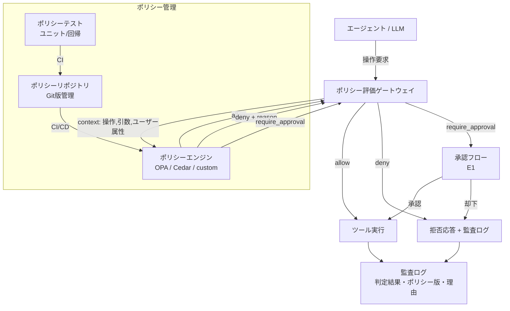

# Policy-as-Code Guardrail｜ポリシーのコード化

## 一言で（TL;DR）

安全制約・コンプライアンス要件・ビジネスルールを「プロンプトでお願いする」のではなく、実行可能なコードまたはポリシーエンジン（OPA/Rego、Cedar など）で**強制**する。プロンプトは行動を誘導し、コードは境界を強制する――この分離がエージェントシステムの安全設計の基盤になる。

## 解決する問題

LLM に対して「個人情報を出力しないでください」「上限10万円を超える操作は行わないでください」とプロンプトで指示しても、その遵守は確率的でしかない。プロンプトインジェクション（[F14](../../concepts/design-forces.md)）によって制約が上書きされる可能性があり、モデルのバージョン変更やコンテキストの膨張で制約の効力が揺らぐこともある。さらに、監査対象のシステム（[F16](../../concepts/design-forces.md)）では「ルールが守られていた証拠」を提示する必要があるが、プロンプトの中に埋め込まれた制約は検証もテストも版管理も困難である。

このパターンが無いと以下の問題が生じる：

- プロンプトインジェクションで安全制約が迂回される。
- モデル更新やプロンプト変更のたびに制約の効力が変わるが、それを検出する手段がない。
- 監査時に「どのルールが、いつの版で、どの操作に適用されたか」を証跡として示せない。
- 同じルールが複数のプロンプトに散在し、変更漏れや矛盾が発生する。

## 選定条件（When to use / When NOT）

- **使う条件**
    - `[failure_cost]` が中〜高で、ルール違反が法的リスク・金銭損失・安全上の問題を引き起こす。
    - `[accountability]` が高く、ルールの適用履歴を版管理・監査証跡として残す必要がある。
    - 制約が**判定可能**（条件→許可/拒否/要承認として定式化できる）である。
    - 複数のエージェントやモデルに同一のルールを一貫して適用したい。
- **使わない条件（＝代替に倒す）**
    - 制約が「丁寧な口調で応答する」「ユーザーの気持ちに寄り添う」のように行動の質や様式に関するもので、条件→判定に還元できない → プロンプト制御で十分。
    - `[failure_cost]` が低く、違反しても容易にリカバリできる → プロンプトでの誘導＋事後監査で済む。
    - ルール数が極少（1-2個）で変更頻度も低い → [B1 決定論的な殻](../b-orchestration/b1-deterministic-shell.md)のハードコードされた条件分岐で足りる。

## 駆動変数とチューニング（程度）

| 目盛り | 効かなすぎ ⇔ 効きすぎ | 決め方 `[駆動変数]` | 目安（出発点） |
|---|---|---|---|
| ポリシー粒度（ルール数・条件の細かさ） | 粗すぎて違反がすり抜ける ⇔ 細かすぎてルール管理コスト・偽拒否が増大 | `[failure_cost]` が高い領域ほど粒度を細かくする | 高リスク操作: 操作×パラメータ単位、低リスク操作: カテゴリ単位 |
| 判定モード（allow/deny/require_approval） | deny のみだとエージェントの柔軟性が消失 ⇔ allow 寄りだと安全網が薄い | `[failure_cost]` × 可逆性で3層に分類。高コスト＋不可逆は deny または require_approval | deny: 禁止操作、require_approval: 高額・不可逆、allow: それ以外 |
| ポリシー評価の実行位置（インライン vs サイドカー） | サイドカーだと遅延が増える ⇔ インラインだとデプロイ結合度が上がる | `[accountability]` が高ければ独立サービスとして分離し監査を容易にする | 概ね独立サービス（サイドカー/ゲートウェイ）を推奨 |
| ポリシー更新頻度（デプロイ vs 動的リロード） | デプロイ必須だと緊急ルール追加に遅れる ⇔ 動的リロードは未テストルール混入リスク | `[failure_cost]` が高ければ CI/CD 経由のデプロイを基本とし、緊急時のみ動的リロード | 通常は CI/CD 経由。緊急拒否ルールのみホットリロード可 |

## 相反における立ち位置（相反）

- **[F-6 プロンプト制御 vs コード/ポリシー制御](../../forks/index.md) → code**。本パターンはこのフォークの「コード側」を体系化したもの。判断基準は明確で、`[failure_cost]` が高い制約や `[accountability]` が求められる制約はコードで強制し、行動の質や様式に関する柔軟な誘導はプロンプトに残す。両者は排他ではなく**補完関係**にある：ポリシーエンジンが境界（やってはいけないこと）を強制し、プロンプトが望ましい振る舞い（やってほしいこと）を誘導する。

## 構造



## 実装メモ

ポリシールールの最小構造（擬似 JSON）：

```json
{
  "rules": [
    {
      "id": "deny-pii-output",
      "condition": "output contains PII pattern",
      "action": "deny",
      "reason": "個人情報の出力は社内規程 §4.2 により禁止"
    },
    {
      "id": "approve-high-value-tx",
      "condition": "tool == 'payment' AND amount > 100000",
      "action": "require_approval",
      "reason": "10万円超の決済は管理者承認が必要"
    },
    {
      "id": "allow-read-ops",
      "condition": "tool.category == 'read'",
      "action": "allow",
      "reason": "読取操作は自動許可"
    }
  ]
}
```

OPA/Rego での実装例：

```rego
package agent.policy

default allow = false

allow {
    input.tool.category == "read"
}

deny[msg] {
    input.tool.name == "payment"
    input.args.amount > 100000
    msg := "10万円超の決済は管理者承認が必要"
}

deny[msg] {
    regex.match(`\d{3}-\d{4}-\d{4}`, input.output)
    msg := "電話番号パターンの出力は禁止"
}
```

落とし穴：

- **ポリシー評価を LLM に委譲しない**。「この操作はポリシーに違反していますか?」と LLM に聞くのは本パターンの趣旨に反する。判定は決定論的コード（[B1](../b-orchestration/b1-deterministic-shell.md)）の責務。
- **deny の理由を必ず返す**。エージェントに「なぜ拒否されたか」を伝えないと、同じ操作を繰り返すループに陥る。理由はエージェントへのフィードバックと監査証跡の両方に使う。
- **出力側のポリシーも忘れない**。入力（操作要求）のゲートだけでなく、LLM の出力に対するポリシー（PII 検出、禁止語句など）も [E3 ガードレールサンドイッチ](e3-guardrail-sandwich.md) と組み合わせて適用する。
- **ポリシーの衝突解決規則を定める**。複数ルールが同一操作にマッチした場合の優先順位（deny > require_approval > allow が一般的）を明文化する。
- **テストを書く**。ポリシーは通常のコードと同様にユニットテスト・回帰テストの対象にする。「この条件で deny になること」「この条件で allow になること」の両方を検証する。

## 効かせる力学（forces）

- **F14（プロンプトインジェクション）**：安全制約をプロンプトから分離しコードで強制することで、インジェクション攻撃による制約の迂回を構造的に防止する。プロンプトがどのように書き換えられても、ポリシーエンジンの判定は変わらない。
- **F16（監査）**：ポリシーが Git で版管理され、各判定に「どのルール版で、なぜ allow/deny したか」が記録されるため、事後監査で「いつ・どのルールに基づいて・何を許可/拒否したか」を完全に再現できる。

## 関連・代替

- [B1 決定論的な殻](../b-orchestration/b1-deterministic-shell.md)：ポリシー評価は殻の一部として実装する。本パターンは B1 の「コードで制御する」原則をポリシー領域に特化させたもの。
- [C1 ツールゲートウェイ](../c-tools-security/c1-tool-gateway-mcp-broker.md)：ポリシー評価の実行位置としてゲートウェイを使う。ゲートウェイが本パターンのポリシーエンジンを呼び出す構成が典型的。
- [C6 Confused Deputy 防御](../c-tools-security/c6-confused-deputy-defense.md)：権限の委譲・昇格に関するポリシーを本パターンで定義する。「誰の権限で実行するか」のルールをコードで強制する。
- [E1 リスクベース承認](e1-risk-based-approval.md)：ポリシー判定の結果が require_approval の場合、承認フローに引き渡す。本パターンが「いつ承認が必要か」を判定し、E1 が承認プロセスを実行する。
- [E3 ガードレールサンドイッチ](e3-guardrail-sandwich.md)：入力側・出力側の両方にポリシーを適用する構成。本パターンのポリシーエンジンが E3 の各層で評価される。
- [D5 プロンプト版管理](../d-memory-context/d5-prompt-registry.md)：プロンプトとポリシーを同様に版管理する。プロンプトの版とポリシーの版を紐づけて管理することで、どの組み合わせで運用していたかを追跡できる。

## コーディングエージェント向け指示（machine-actionable）

このパターンを人間に提案するなら、同時に以下を提案/確認する：

- [ ] プロンプトに埋め込まれている制約を洗い出し、**判定可能な制約はポリシーコードに移行**したか（移行対象: 金額上限、禁止操作、PII 出力制限など）
- [ ] ポリシーの判定結果が deny の場合に**理由文をエージェントに返す**設計にしたか（ループ防止）
- [ ] ポリシーを [C1 ツールゲートウェイ](../c-tools-security/c1-tool-gateway-mcp-broker.md) に組み込み、全ツール呼び出しに一貫して適用する設計にしたか
- [ ] require_approval の判定を [E1 リスクベース承認](e1-risk-based-approval.md) に連携させたか
- [ ] 出力側のポリシー（PII 検出など）を [E3 ガードレールサンドイッチ](e3-guardrail-sandwich.md) と組み合わせて適用したか
- [ ] ポリシーの版管理・ユニットテスト・CI パイプラインを設計に含めたか
- [ ] 監査ログに判定結果・適用ルール ID・ポリシー版を記録する設計にしたか
- [ ] 目盛り（上表）の値を `[駆動変数]` から導き、**理由を添えて**提示したか
