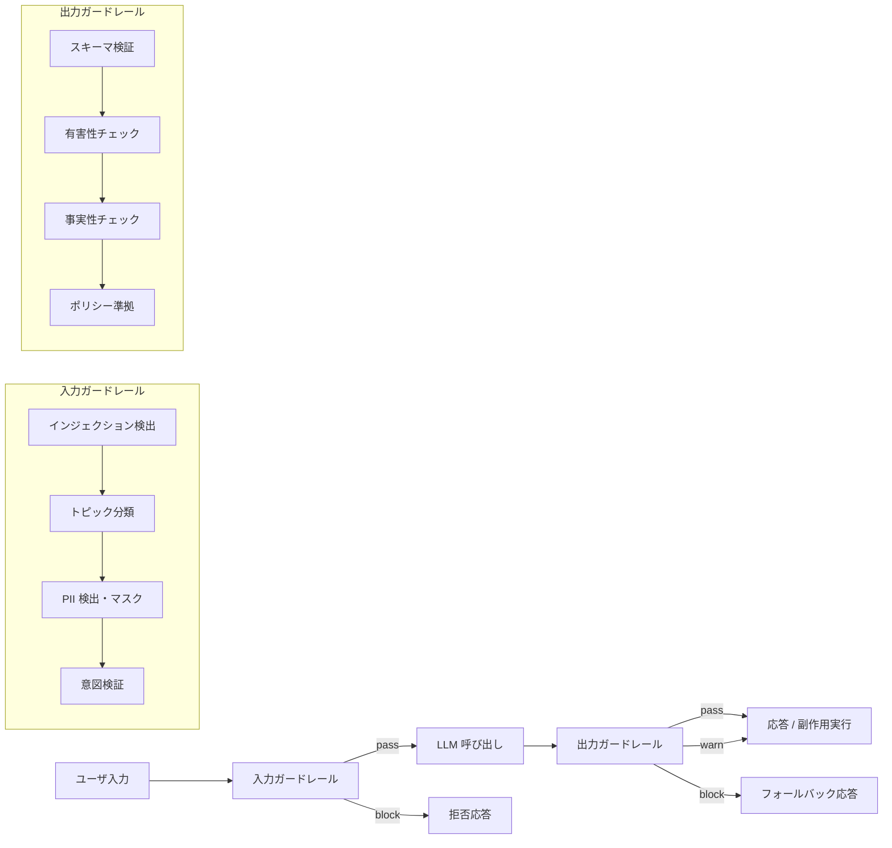

# Input/Output Guardrail Sandwich｜入出力ガードレール

## 一言で（TL;DR）

LLM 呼び出しの**前**に入力ガードレール（プロンプトインジェクション検出・トピック分類・PII 検出・意図検証）を、**後**に出力ガードレール（有害性チェック・事実性チェック・スキーマ検証・ポリシー準拠）を配置し、不正な入力と不適切な出力の両方を遮断する「挟み込み」構造。各チェックの厳しさ（block / warn / log）は経路ごとの `[failure_cost]` で決定する。

## 解決する問題

LLM は[自然言語を攻撃面として持ち（F14）](../../concepts/design-forces.md)、悪意ある入力がそのまま通れば権限昇格や情報漏洩につながる。また[自然言語インターフェイスは曖昧で（F5）](../../concepts/design-forces.md)、想定外のトピックや形式の入力がシステムの前提を崩す。出力側では[ハルシネーション（F4）](../../concepts/design-forces.md)による誤情報生成や、[スキーマ不適合（F10）](../../concepts/design-forces.md)による下流システムの障害が起きる。

入力側だけ守っても出力が有害になる可能性は残り、出力側だけ守っても注入攻撃で検証自体を回避される恐れがある。**両面を挟む**ことで、確率的な障害の表面積を最小化する。

## 選定条件（When to use / When NOT）

- **使う条件**
    - エンドユーザや外部システムからの入力を LLM に渡す経路がある（`[input_trust]` が低い）。
    - LLM の出力が外部に公開される、または副作用を伴う操作のトリガーになる。
    - `[failure_cost]` が中〜高で、有害出力・インジェクション成功が実害を生む。
- **使わない条件（＝代替に倒す）**
    - 入力が完全に内部生成で信頼でき、かつ出力が人間の目視確認を経る開発ツール用途 → ガードレールを省略し、ログのみで運用コストを下げる。
    - `[latency_budget]` が極めて短く（概ね 200ms 以下）、検証レイテンシを許容できない → 入力は軽量ルールのみ、出力検証は事後の標本検査に倒す。
    - ポリシー制御を宣言的に一元管理したい → [E2 ポリシーのコード化](e2-policy-as-code.md) をガードレールのバックエンドとして採用し、本パターンと組み合わせる。

## 駆動変数とチューニング（程度）

| 目盛り | 効かなすぎ ⇔ 効きすぎ | 決め方 `[駆動変数]` | 目安（出発点） |
|---|---|---|---|
| チェックのアクション（block / warn / log） | 脅威を見逃す ⇔ 正常リクエストも棄却しUX悪化 | `[failure_cost]` が高い経路は block、低い経路は warn/log | 副作用あり・外部公開 = block、内部補助 = warn |
| 入力検証の深さ（ルールベース / 分類モデル / LLM判定） | 単純な攻撃しか防げない ⇔ レイテンシ増大・コスト増 | `[failure_cost]` が高いほど多層化、`[latency_budget]` が短いほど軽量に | 正規表現 + 軽量分類器を基本とし、高リスク経路のみ LLM 判定を追加 |
| 出力検証の範囲（スキーマのみ / 有害性 / 事実性） | スキーマは通るが意味的に不正 ⇔ 検証コスト・レイテンシ過多 | `[failure_cost]` が高いほどチェック項目を増やす | スキーマ検証は常時、有害性は外部公開時、事実性は高リスク判断時 |
| 標本検査率（全量 / 標本 / オフのみ） | 品質劣化に気づけない ⇔ 計算資源の浪費 | `[failure_cost]` × スループットで決める | 高リスク = 全量インライン、低リスク = 概ね 5-10% 標本 |

## 相反における立ち位置（相反）

本パターンは [F-9 インライン検証 vs 事後・標本検証](../../forks/index.md) において **hybrid** を採る。

判定基準は `[failure_cost]` と `[latency_budget]` の組み合わせ。`[failure_cost]` が高い経路（金銭移動のトリガー、外部公開テキスト、医療・法務情報など）ではインラインで block し、低い経路（社内チャットの補助、ログ要約など）では標本検査に留める。`[latency_budget]` が厳しい場合はインライン検証の手法を軽量なもの（正規表現・ルールベース）に絞り、重い検証（LLM による事実性チェックなど）を非同期の標本検査に回す。

## 構造

## 実装メモ

**入力ガードレールの実装パターン**

- **インジェクション検出**: 既知の攻撃パターン（`ignore previous instructions` 等）の正規表現マッチに加え、軽量分類モデル（概ね数十 ms）で未知パターンを補足する。OpenAI Moderation API や専用のインジェクション検出モデルが利用可能。
- **PII 検出・マスク**: 正規表現（メールアドレス・電話番号等）と NER モデルの組み合わせ。検出した PII はマスクしてから LLM に渡し、出力時に復元する方式が一般的。
- **トピック分類**: 許可トピックのホワイトリストに対して分類し、範囲外を早期拒否する。

**出力ガードレールの実装パターン**

- **スキーマ検証**: JSON Schema や Pydantic モデルでの構造検証。失敗時は概ね 1-2 回のリトライで回復可能（[E4 検証済み構造化出力](e4-verified-structured-output.md) と組み合わせる）。
- **有害性チェック**: 分類モデルまたは Moderation API でスコアリングし、閾値超過で block。閾値は `[failure_cost]` に応じて調整する。
- **事実性チェック**: RAG のソース文書との照合、または別の LLM による Critic 判定（[B6 Critic/Judge](../b-orchestration/b6-critic-judge-sampling.md)）。レイテンシが大きいため高リスク経路に限定する。

**落とし穴**

- 入力ガードレールと出力ガードレールの両方で同じ LLM を使うと、インジェクションがガードレール自体を回避する共通モード故障になる。検証系統は生成系統と分離するのが望ましい（[F-10 生成と検証を同一 vs 別系統](../../forks/index.md)）。
- ガードレールの誤検知率が高いと正常リクエストを大量に棄却し、UX を損なう。本番投入前に代表的な正常入力で偽陽性率を測定し、概ね 1% 以下を目標とする。
- 全チェックを直列にするとレイテンシが積み上がる。独立したチェック（インジェクション検出と PII 検出など）は並列実行する。

## 効かせる力学（forces）

- **F4（ハルシネーション）**: 出力ガードレールの事実性チェック・有害性チェックで、根拠のない生成を検出・遮断する。
- **F5（自然言語の曖昧さ）**: 入力ガードレールのトピック分類・意図検証で、想定外の入力を早期に弾き、LLM への入力品質を担保する。
- **F10（スキーマ不適合）**: 出力ガードレールのスキーマ検証で、下流が期待する構造に適合しない出力をリトライまたは棄却する。
- **F14（プロンプトインジェクション）**: 入力ガードレールのインジェクション検出で、攻撃的な入力を LLM 到達前に遮断する。

## 関連・代替

- **関連**
    - [B1 決定論的な殻](../b-orchestration/b1-deterministic-shell.md) -- 殻の「検証」部分がこのパターンの出力ガードレールに相当する。B1 の殻にガードレールを組み込む形で併用する。
    - [B6 Critic/Judge サンプリング](../b-orchestration/b6-critic-judge-sampling.md) -- 出力ガードレールの事実性チェックを別 LLM（Judge）に委ねる場合の具体手法。
    - [E2 ポリシーのコード化](e2-policy-as-code.md) -- ガードレールの判定ロジックをポリシーエンジンに外部化することで、ルール変更をデプロイなしに反映できる。
    - [E4 検証済み構造化出力](e4-verified-structured-output.md) -- 出力ガードレールのスキーマ検証部分を深掘りしたパターン。構造化出力の強制と多段検証を扱う。
    - [C1 ツールゲートウェイ](../c-tools-security/c1-tool-gateway-mcp-broker.md) -- 入力ガードレールの一部（権限検証・レート制限）をゲートウェイ層で担うことで、エージェント内のガードレールと二重防御を構成する。

## コーディングエージェント向け指示（machine-actionable）

- [ ] このパターンを採用するなら、入力ガードレールと出力ガードレールの**両方**を設計に含めたか（片方だけでは不十分）
- [ ] 各チェックのアクション（block / warn / log）を `[failure_cost]` から導出し、**経路ごとに**理由を添えて提示したか
- [ ] 高リスク経路でインジェクション検出を設けたか。検出モデルと生成モデルを分離しているか
- [ ] 出力が外部公開される経路に有害性チェックを配置したか
- [ ] `[latency_budget]` が厳しい場合、検証手法を軽量化（正規表現・ルールベース）し、重い検証を標本検査に回す設計にしたか
- [ ] スキーマ検証には [E4 検証済み構造化出力](e4-verified-structured-output.md) の併用を提案したか
- [ ] 不可逆な副作用がガードレール通過後に実行される場合、[E1 リスクベース承認](e1-risk-based-approval.md) の併置を検討したか
- [ ] 目盛り（上表）の値を `[failure_cost]` と `[latency_budget]` から導き、**理由を添えて**提示したか
