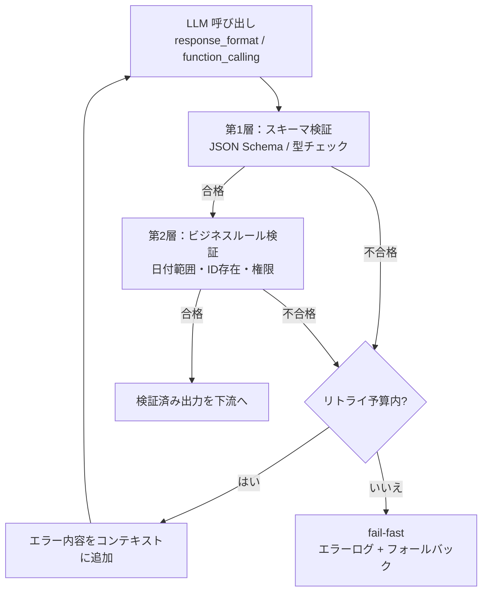

# Verified Structured Output｜検証済み構造化出力

## 一言で（TL;DR）

LLM の出力を `response_format` や `function_calling` で JSON Schema に準拠させ（第1層：スキーマ検証）、さらに決定論的コードでビジネスルール制約を検証します（第2層：意味的検証）。違反時はエラーをコンテキストに追加して自己修正リトライを行い、予算内で収束しなければ fail-fast します。

## 解決する問題

LLM の出力は自然言語であり曖昧です（[F5](../../concepts/design-forces.md)）。下流システムが期待する型やフィールドに従わない出力が返ることがあり（[F10](../../concepts/design-forces.md)）、パース失敗・型エラー・無効な値の混入がサイレントに後続処理を破壊します。

このパターンが無いと、以下の問題が起きます：

- **構文レベルの破損**：JSON が閉じていない、フィールド名が揺れる、型が合わないといった不具合が下流のデシリアライズで例外を起こします。
- **意味レベルの逸脱**：フォーマットは正しいが「過去の日付を未来として返す」「存在しない商品IDを含める」「許可されていない操作を指定する」など、ビジネスルールに反する値が通過します。
- **黙って壊れる**：構造化されていない出力を正規表現やアドホックなパーサで抽出すると、境界ケースでの失敗が検知されず本番障害になります。

## 選定条件（When to use / When NOT）

- **使う条件**
    - LLM の出力を**下流のコード・API・データベース**が消費します（人間が読むだけではありません）。
    - 出力が従うべき**スキーマ（型・必須フィールド・値域）が定義可能**です。
    - `[failure_cost]` が中〜高で、不正な出力が後続処理を壊すと業務影響があります。
- **使わない条件（＝代替に倒す）**
    - 出力が自由形式のテキスト（要約・対話応答など）で、構造化する必要がない → [E3 ガードレールサンドイッチ](e3-guardrail-sandwich.md) の出力ガードレール（有害性チェック等）で十分です。
    - 出力スキーマが頻繁に変わり、スキーマ定義の維持コストが利益を上回る → 自由出力＋後段での抽出パイプラインに倒します。
    - `[failure_cost]` が極めて低く、不正出力をそのまま捨てても問題ない → リトライなしのベストエフォートで済ませます。

## 駆動変数とチューニング（程度）

| 目盛り | 効かなすぎ ⇔ 効きすぎ | 決め方 `[駆動変数]` | 目安（出発点） |
|---|---|---|---|
| 温度（temperature） | 高すぎるとスキーマ違反率が上がる ⇔ 低すぎると多様性が失われ創造的な補完ができない | 構造化出力では多様性より正確性が優先。`[failure_cost]` が高いほど低温に倒す | 0.0–0.3（構造化出力の出発点）。自由テキストフィールドを含む場合でも 0.5 を上限とする |
| 自己修正リトライ回数 | 0回だと修正可能なエラーでも即失敗 ⇔ 多すぎるとトークンコストとレイテンシが膨張 | `[failure_cost]` が高いほどリトライを許容する。ただしリトライごとにコンテキストが増えるので予算と相談 | 1–3回。概ね2回目で収束しなければ構造的な問題がある |
| ビジネスルール検証の厳格度 | 緩すぎると無効な値が通過 ⇔ 厳しすぎると正当な出力まで弾く | `[failure_cost]` が高い領域（金銭・法務・医療）ほど厳格に。低リスク領域は警告レベルに留める | 高リスク：全制約を hard error、低リスク：一部を warning + ログ |

## 相反における立ち位置（相反）

- **[F-17 構造化出力強制 vs 自由出力＋抽出](../../forks/index.md) → structured（構造化出力強制）**。本パターンは下流システムとの連携において構造化出力を強制する側に立ちます。LLM の `response_format` / `function_calling` で出力形式を制約し、さらにコードで意味的検証を加えます。`[failure_cost]` が高く下流が厳格な型を期待する場合にこちらに倒します。逆に、出力が人間向けの自由テキストであれば自由出力＋抽出に倒してよいでしょう。

## 構造



## 実装メモ

第1層（スキーマ検証）の最小実装：

```python
from pydantic import BaseModel, Field
from openai import OpenAI

class OrderExtraction(BaseModel):
    product_id: str = Field(..., pattern=r"^PRD-\d{6}$")
    quantity: int = Field(..., ge=1, le=1000)
    delivery_date: str = Field(..., description="ISO 8601 date")

client = OpenAI()
response = client.beta.chat.completions.parse(
    model="gpt-4o",
    temperature=0.1,
    messages=[{"role": "user", "content": user_input}],
    response_format=OrderExtraction,
)
order = response.choices[0].message.parsed  # Pydantic モデルとして返る
```

第2層（ビジネスルール検証）の例：

```python
from datetime import date

def validate_business_rules(order: OrderExtraction) -> list[str]:
    errors = []
    # 日付が未来であること
    if date.fromisoformat(order.delivery_date) <= date.today():
        errors.append(f"delivery_date must be in the future, got {order.delivery_date}")
    # 商品IDが存在すること
    if not product_exists(order.product_id):
        errors.append(f"product_id {order.product_id} does not exist")
    return errors
```

自己修正リトライの骨格：

```python
MAX_RETRIES = 2

for attempt in range(MAX_RETRIES + 1):
    result = call_llm_with_schema(messages)
    schema_errors = validate_schema(result)
    if schema_errors:
        messages.append({"role": "user",
            "content": f"出力がスキーマに違反しています: {schema_errors}。修正してください。"})
        continue
    biz_errors = validate_business_rules(result)
    if biz_errors:
        messages.append({"role": "user",
            "content": f"ビジネスルール違反: {biz_errors}。修正してください。"})
        continue
    return result  # 検証通過

raise StructuredOutputError(f"{MAX_RETRIES+1}回の試行で検証を通過しませんでした")
```

落とし穴：

- **リトライ時のコンテキスト肥大**。エラーメッセージを毎回追加するとトークン消費が増えます。直前のエラーだけを渡すか、要約する工夫が必要です。
- **スキーマの過剰定義**。フィールド数が多すぎる・ネストが深すぎると LLM の従順率が下がります。1回の呼び出しで返すスキーマは概ね 10-15 フィールド以内に収めるのが出発点です。
- **`response_format` の provider 依存**。OpenAI の Structured Outputs、Anthropic の tool use 等は API が異なります。スキーマ定義を provider に依存しない中間表現（Pydantic モデルや JSON Schema）で管理し、呼び出し時に変換してください。
- **部分的な検証失敗の扱い**。全フィールドが不正なら再生成ですが、1フィールドだけ不正なら部分修正（パッチ）の方が効率的な場合があります。

## 効かせる力学（forces）

- **F5（自然言語が曖昧）**：`response_format` / `function_calling` で出力形式を明示的に制約し、曖昧な自然言語出力をパース可能な構造に変換します。第2層の検証で値域・参照整合性まで担保します。
- **F10（出力がスキーマに従わない）**：JSON Schema 準拠を API レベルで強制し、違反があっても自己修正リトライで収束させます。リトライ予算を超えたら fail-fast で明示的に失敗させ、不正な出力がサイレントに下流へ流れることを防ぎます。

## 関連・代替

- [B1 決定論的な殻](../b-orchestration/b1-deterministic-shell.md)：殻がスキーマ検証とビジネスルール検証を実行する責務を担います。LLM は確率的なノードとして殻の中で動き、出力は殻が検証します。
- [B6 Critic / Judge / Sampling](../b-orchestration/b6-critic-judge-sampling.md)：第2層のビジネスルール検証を超えて、別の LLM による意味的妥当性の評価（事実整合性、トーン、完全性など）を加えたい場合に併用します。
- [E3 ガードレールサンドイッチ](e3-guardrail-sandwich.md)：本パターンは E3 の出力ガードレールの一部として組み込まれます。E3 が入力側（インジェクション防御・PII除去）と出力側（安全性・グラウンディング）の両面を扱うのに対し、本パターンは出力の構造的正しさに特化します。
- [A6 適応タイムアウト/リトライ](../a-execution/a6-adaptive-timeout-retry.md)：本パターンの自己修正リトライは A6 のリトライ機構の特殊ケース（検証失敗→エラーフィードバック→再生成）です。リトライ上限やタイムアウト設計の詳細は A6 を参照してください。

## コーディングエージェント向け指示（machine-actionable）

このパターンを人間に提案するなら、同時に以下を提案/確認してください：

- [ ] 出力スキーマを **JSON Schema または Pydantic モデル**として定義し、パターン型・値域・必須フィールドを明示したか
- [ ] 第2層のビジネスルール検証を**決定論的コード**（[B1 決定論的な殻](../b-orchestration/b1-deterministic-shell.md)）で実装し、検証ロジック自体を LLM に任せていないか
- [ ] 自己修正リトライの上限（目安 1–3回）を `[failure_cost]` から導き、**理由を添えて**提示したか
- [ ] リトライ予算超過時のフォールバック（fail-fast・デフォルト値・人間エスカレーション）を設計に含めたか
- [ ] 温度を 0.0–0.3 の範囲で設定し、構造化出力の従順率を確保したか
- [ ] スキーマが大きい場合に分割呼び出しを検討したか（概ね 10–15 フィールド超で分割を検討）
- [ ] 意味的妥当性の検証が必要なら [B6 Critic / Judge](../b-orchestration/b6-critic-judge-sampling.md) の併用を検討したか
- [ ] 目盛り（上表）の値を `[駆動変数]` から導き、**理由を添えて**提示したか
