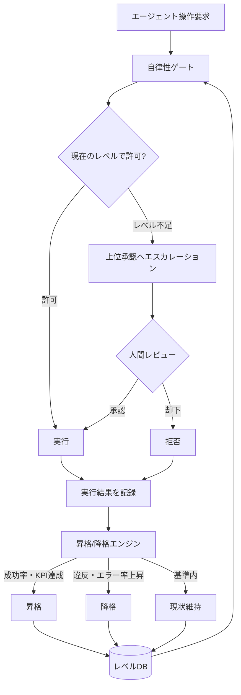

# Autonomy Ladder / Progressive Autonomy｜自律性のはしご

## 一言で（TL;DR）

エージェントの自律性を「ある/なし」の二値で決めず、L0（提案のみ）から L6（完全自律）までの7段階で定義する。運転免許のように実績で信頼を獲得し昇格する一方、ポリシー違反やモデル変更時には降格する。各段階が許可するツールクラスと承認要件を明示することで、安全性と自動化の恩恵を段階的に両立させる。

## 解決する問題

エージェントに副作用を伴う操作を許可する際（[F8](../../concepts/design-forces.md)）、「全自動か全手動か」の二択は現実に合わない。全自動にすれば LLM のハルシネーション（[F4](../../concepts/design-forces.md)）が不可逆な損害を引き起こし、全手動にすれば人間との協働（[F17](../../concepts/design-forces.md)）の効率が消失する。

このパターンが無いと、以下の問題が発生する：

- **信頼が蓄積されない**。エージェントが何千回正しく動作しても、初日と同じ承認頻度を要求し続ける。
- **新規エージェント／新モデルへの移行が怖い**。段階的に権限を広げる仕組みがないため、「全権を与えるか、与えないか」の判断を迫られる。
- **ドメイン横断の権限管理が曖昧になる**。「このエージェントにどこまで任せてよいか」が属人的な判断に留まり、監査に耐えない。

## 選定条件（When to use / When NOT）

- **使う条件**
    - エージェントが長期間にわたって運用され、操作実績が蓄積される。
    - `[failure_cost]` が操作カテゴリによって大きく異なり、段階的な権限移譲が合理的。
    - 組織として「エージェントの信頼度を定量的に管理したい」という要件がある（`[accountability]` が高い環境）。
    - [E1 リスクベース承認](e1-risk-based-approval.md) の静的な閾値では硬直的すぎると感じる場面がある。
- **使わない条件（＝代替に倒す）**
    - エージェントの用途がすべて読取専用で副作用がない → [C2 Read-Free / Write-Gated](../c-tools-security/c2-read-free-write-gated.md) の Read-Free 側で十分。
    - 単発バッチで実績の蓄積が見込めない → [E1 リスクベース承認](e1-risk-based-approval.md) の静的リスク分類で対応する。
    - `[failure_cost]` が一律に低く、すべての操作が容易にロールバック可能 → 固定の自動実行ポリシーで済む。

## 駆動変数とチューニング（程度）

自律性は [程度カタログ](../../degrees/index.md) で定義された L0〜L6 の7段階を基盤とする。

| Lv | 名前 | できること | 許可するツールクラス例 |
|---|---|---|---|
| L0 | Suggest only | 提案のみ、実行なし | なし |
| L1 | Read-only | 読み取りツールのみ | DB SELECT、ファイル読取、API GET |
| L2 | Draft | 下書き作成（保存は人間） | ドキュメント下書き、差分生成 |
| L3 | Dry-run | 実行計画と差分提示 | dry-run API、プレビュー |
| L4 | Approval required | 人間承認後に実行 | 書込・更新・送信（承認経由） |
| L5 | Bounded auto-execute | 低リスク範囲で自動実行 | 金額上限内の操作、可逆な更新 |
| L6 | Full autonomous | 広範な自動実行 | 原則すべて（限定環境のみ推奨） |

| 目盛り | 効かなすぎ ⇔ 効きすぎ | 決め方 `[駆動変数]` | 目安（出発点） |
|---|---|---|---|
| 初期レベル | 価値が出ない（L0固定） ⇔ 未検証のまま高権限 | `[failure_cost]` が高い領域ほど低いレベルから開始 `[failure_cost, reversibility]` | 読取系タスク=L1、書込系=L0〜L2 |
| 昇格閾値（成功率） | 昇格が遅すぎて運用負荷が下がらない ⇔ 早すぎて未成熟なまま高権限へ | `[failure_cost]` が高いほど厳しく設定 `[failure_cost]` | 成功率 95〜99%、かつ最低評価回数 50〜200回 |
| 降格トリガー感度 | 問題を見逃す ⇔ 一時的なエラーで過剰に降格 | `[reversibility]` が低いほど敏感に設定 `[reversibility]` | ポリシー違反=即時1段階降格、エラー率上昇=猶予期間後に降格 |
| レベル別の操作境界（金額上限等） | 制約が緩すぎて被害拡大 ⇔ 厳しすぎて業務停滞 | `[failure_cost]` の実際の損害額から逆算 `[failure_cost]` | L5 の金額上限: 1件あたり失敗コストの概ね 1〜5% |

## 相反における立ち位置（相反）

- **[F-15 読取専用 vs 書込可能](../../forks/index.md) → hybrid**。本パターンは F-15 のハイブリッド戦略を時間軸に沿って展開する。初期は Read-Free 側（L0〜L1）に倒し、実績に応じて Write-Gated（L4）、さらに Bounded Auto（L5）へ段階的に移行する。`[reversibility]` が低い操作カテゴリほど、上位レベルへの昇格条件を厳しくする。

## 構造



## 実装メモ

レベル管理の最小実装（擬似コード）：

```python
from dataclasses import dataclass, field
from datetime import datetime, timedelta

@dataclass
class AgentLevel:
    agent_id: str
    current_level: int = 0          # L0〜L6
    success_count: int = 0
    failure_count: int = 0
    policy_violations: int = 0
    last_promotion: datetime = field(default_factory=datetime.now)
    model_version: str = ""

    @property
    def success_rate(self) -> float:
        total = self.success_count + self.failure_count
        return self.success_count / total if total > 0 else 0.0

    def evaluate_promotion(self, config: "LadderConfig") -> int:
        """昇格/降格を判定し、新レベルを返す。"""
        total = self.success_count + self.failure_count

        # 降格条件: ポリシー違反は即時
        if self.policy_violations > 0:
            return max(0, self.current_level - 1)

        # 降格条件: エラー率が閾値を超過
        if total >= config.min_eval_count and self.success_rate < config.min_success_rate:
            return max(0, self.current_level - 1)

        # 昇格条件: 十分な実績 + 高い成功率 + 冷却期間経過
        cooldown_ok = (datetime.now() - self.last_promotion) > config.promotion_cooldown
        if (total >= config.min_eval_count
                and self.success_rate >= config.promotion_threshold
                and cooldown_ok
                and self.current_level < 6):
            return self.current_level + 1

        return self.current_level  # 現状維持

@dataclass
class LadderConfig:
    min_eval_count: int = 100           # 最低評価回数
    min_success_rate: float = 0.90      # これを下回ると降格
    promotion_threshold: float = 0.97   # 昇格に必要な成功率
    promotion_cooldown: timedelta = timedelta(days=7)  # 昇格間の冷却期間
```

レベル定義の設定例（YAML）：

```yaml
autonomy_ladder:
  levels:
    0: { name: "suggest-only", allowed_tools: [], requires_approval: true }
    1: { name: "read-only", allowed_tools: ["db.select", "file.read", "api.get"], requires_approval: false }
    2: { name: "draft", allowed_tools: ["doc.draft", "diff.generate"], requires_approval: true }
    3: { name: "dry-run", allowed_tools: ["*.dry_run", "*.preview"], requires_approval: true }
    4: { name: "approval-required", allowed_tools: ["db.update", "email.send"], requires_approval: true }
    5: { name: "bounded-auto", allowed_tools: ["db.update", "email.send"], requires_approval: false, constraints: { max_amount: 10000, max_records: 100 } }
    6: { name: "full-autonomous", allowed_tools: ["*"], requires_approval: false }
  promotion:
    min_evaluations: 100
    success_rate_threshold: 0.97
    cooldown_days: 7
  demotion:
    policy_violation: immediate       # 即時降格
    error_rate_threshold: 0.10        # 10%超過で降格検討
    model_change: reset_to_initial    # モデル変更時は初期レベルに戻す
```

落とし穴：

- **モデル変更時のリセットを忘れない**。新モデルは挙動が異なる可能性があるため（[F9](../../concepts/design-forces.md)）、信頼度を初期レベルに戻すか、少なくとも1段階降格する。昇格実績は旧モデル版に紐づくものであり、新モデルには引き継がない。
- **昇格/降格の判定を LLM に任せない**。判定は決定論的なルールエンジンで行う。成功率やポリシー違反数は定量的に計測可能であり、LLM の主観を挟む必要がない。
- **ドメイン別にレベルを分離する**。「メール送信は L5 だがDB操作は L2」のように、操作カテゴリごとに独立したレベルを持たせる。ひとつのカテゴリでの高実績が、別カテゴリの信頼を保証しない。
- **冷却期間を設ける**。短期間に連続昇格すると、十分な検証なく高権限に到達するリスクがある。昇格間には概ね 7〜14日の冷却期間を置く。

## 効かせる力学（forces）

- **F4（ハルシネーション）**：LLM がハルシネーションにより誤った操作を生成しても、低レベルのエージェントは実行権限を持たず被害が限定される。実績が十分に蓄積された（＝ハルシネーション頻度が低い）エージェントだけが高い自律性を得る。
- **F8（ツール副作用）**：副作用を伴うツールへのアクセスを段階ごとに制御する。L0〜L1 では副作用なし、L2〜L4 では承認付き、L5〜L6 で初めて自動実行を許可する。これにより、段階的にツールの被害半径を広げる。
- **F17（人間協働）**：信頼が低い段階では人間の関与を密にし、信頼が蓄積されるにつれて関与を減らす。人間は初期のガイド役から、例外時の監督者へと役割が自然に変化する。

## 関連・代替

- [B3 自律ループ](../b-orchestration/b3-agentic-loop-budget.md)：自律ループが許可する自律度の範囲を本パターンが決定する。B3 の `max_steps` や許可ツールセットは、現在の自律性レベルから導出する。
- [C2 Read-Free / Write-Gated](../c-tools-security/c2-read-free-write-gated.md)：C2 の Read-Free / Write-Gated は本パターンの L1〜L2 に相当する静的な権限分離。本パターンはこれを動的に昇降格する仕組みに拡張する。
- [E1 リスクベース承認](e1-risk-based-approval.md)：E1 の承認閾値を固定ではなく、本パターンの現在レベルに応じて動的に調整する。L4 では全書込に承認を要求するが、L5 に昇格すれば低リスク書込は自動化される。
- [E2 ポリシーのコード化](e2-policy-as-code.md)：昇格・降格の条件をポリシーとしてコード化する。属人的な判断ではなく、ポリシーエンジンがレベル遷移を管理する。
- [G4 評価ハーネス](../g-observability-ops/g4-eval-harness.md)：昇格判定に必要な成功率・エラー率・品質スコアの入力源。G4 の評価結果が昇格/降格エンジンにフィードバックされる。

## コーディングエージェント向け指示（machine-actionable）

このパターンを人間に提案するなら、同時に以下を提案/確認する：

- [ ] `[failure_cost]` と `[reversibility]` を操作カテゴリごとに評価し、**初期レベルの割り当て表**を具体化したか
- [ ] 昇格閾値（成功率・最低評価回数・冷却期間）を `[failure_cost]` から導出し、**理由を添えて**提示したか
- [ ] モデル変更時のレベルリセットポリシーを明示したか（リセット or 1段階降格）
- [ ] 降格トリガー（ポリシー違反=即時、エラー率上昇=猶予後）を `[reversibility]` に応じて設計したか
- [ ] 操作カテゴリ別にレベルを分離する設計にしたか（1エージェント＝1レベルにしない）
- [ ] [E1 リスクベース承認](e1-risk-based-approval.md) との連携（レベルに応じた閾値動的調整）を設計に含めたか
- [ ] 昇格/降格の判定ログを [G4 評価ハーネス](../g-observability-ops/g4-eval-harness.md) に流す設計を含めたか
- [ ] 目盛り（上表）の値を `[駆動変数]` から導き、**理由を添えて**提示したか
