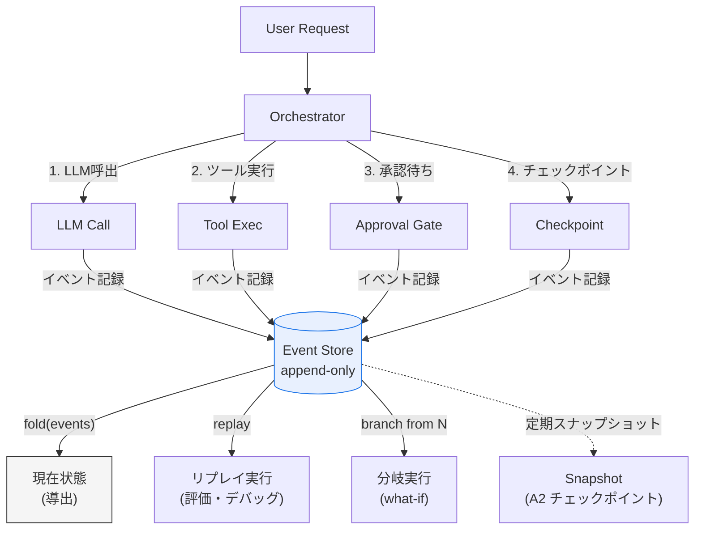

# Event-sourced / Replayable Runs｜イベントソーシングとリプレイ

## 一言で（TL;DR）

エージェントが実行する全アクション（LLM 呼び出し、ツール実行、承認応答、チェックポイント保存）を不変のイベントとして追記専用ログに記録します。現在の状態は「イベント列の左畳み込み（fold）」として導出されます。これにより完全な監査証跡、タイムトラベルデバッグ、評価用リプレイ、任意の時点からの分岐（what-if 分析）が可能になります。

## 解決する問題

AIエージェントは[確率的に動作し（F3）](../../concepts/design-forces.md)、同じ入力に対して同じ出力を返しません[（F15）](../../concepts/design-forces.md)。さらに[監査対象になりやすく（F16）](../../concepts/design-forces.md)、「なぜこの結論に至ったか」を事後に説明する責任を負います。

イベントソーシングを導入しない場合、以下の問題が生じます。

1. **監査証跡の欠如** — 最終状態のスナップショットしか残らず、途中経過（どのモデルがどの入力で何を返し、どのツールをどの引数で呼んだか）を復元できません。規制やコンプライアンスで「判断根拠の全量提示」を求められた際に応えられません。
2. **デバッグの困難** — 確率的な障害（特定の入力パターンでのみ起きるハルシネーションやツール呼び出し失敗）を再現する手段がありません。最終結果だけのログでは原因箇所を特定できず、MTTR が膨張します。
3. **評価・改善サイクルの欠如** — 過去の実行を再生して新しいプロンプトやモデルの効果を比較できないため、改善が「本番トラフィックでの勘」に頼ります。[G4 評価ハーネス](../g-observability-ops/g4-eval-harness.md)に供給するデータが不足します。
4. **分岐・巻き戻し不能** — 途中ステップから別の判断を試す what-if 分析ができず、計画変更時にセッション全体をやり直す必要があります。

## 選定条件（When to use / When NOT）

- **使う条件**
    - `[accountability]` が中以上で、実行の全過程を事後に第三者へ説明する必要があります（規制対応・社内監査・顧客説明）。
    - エージェントが複数ステップ（3ステップ以上が目安）を跨ぐ処理を行い、途中経過の記録に意味があります。
    - 過去の実行をリプレイして評価・回帰テストに使いたい場合です。
    - 任意の時点からの分岐（what-if）やタイムトラベルデバッグが運用上必要です。
- **使わない条件**
    - 1回のLLM呼び出しで完結する単発推論 → ログ1行と[G2 トレース](../g-observability-ops/g2-end-to-end-tracing.md)で十分です。イベントストアの管理コストが見合いません。
    - プロトタイプ段階で永続化基盤への投資が正当化できない → まず構造化ログで始め、本番移行時に導入します。
    - イベント保存のストレージ・I/O コストがエージェント処理コストを大幅に上回る極高 QPS 環境 → [G1 二層観測](../g-observability-ops/g1-tiered-observability.md)でサンプリングし、全量記録は規制対象パスに限定します。

## 駆動変数とチューニング（程度）

| 目盛り | 効かなすぎ ⇔ 効きすぎ | 決め方 `[駆動変数]` | 目安（出発点） |
|---|---|---|---|
| イベント粒度 | 粗すぎて判断過程が欠落 ⇔ 細かすぎてストレージ爆発・ノイズ化 | `[accountability]` が高いほど細粒度に。規制対象はトークンレベルまで | LLM呼出・ツール実行・承認応答・チェックポイントは必須。プロンプト組立の中間ステップは任意 |
| イベント保持期間 | 短すぎて監査時に消失 ⇔ 長すぎてコスト肥大 | 規制・監査要件から逆算 `[accountability]` | 規制対象 3-7年 / 一般業務 90日-1年 / 開発 30日 |
| スナップショット頻度 | なし→リプレイが常に先頭から（遅い） ⇔ 毎イベント→スナップショットのストレージ過多 | イベント列の平均長に応じて調整。長セッションほど頻度を上げる | 概ね 50-100 イベントごと、または承認ゲート通過時に取得 |
| 記録対象の入出力本文量 | ハッシュのみ→デバッグ時に内容が分からない ⇔ 全文→機密漏洩・容量膨張 | `[accountability]` が高く機密度が低い領域は全文。機密が含まれる場合はハッシュ＋コールド層退避 | LLM 入出力はコールド層に全文、ホット層にはハッシュとトークン数 |

## 相反における立ち位置（相反）

本パターンは特定のフォークに排他的に依存しない横断的なデータ基盤ですが、以下のフォーク選択がイベント設計に影響します。

- **F-14（インコンテキスト vs 外部ステートストア）**：イベントソーシングは本質的に外部ステートストア（追記専用ログ）を前提とします。インコンテキストのみで状態を持つ設計ではイベント列を永続化できないため、本パターンを採用する場合は外部ストアへの書き出しが必須になります。
- **F-3（オーケストレーション vs コレオグラフィ）**：中央集権型オーケストレーションではオーケストレータが全イベントを1箇所に書き込めます。コレオグラフィ型ではイベントが各サービスに分散するため、相関 ID による統合ビューの構築が必要になります。

## 構造



イベントストアが唯一の情報源（source of truth）であり、現在状態はイベント列からの導出物です。スナップショットはリプレイ高速化のための最適化に過ぎません。

## 実装メモ

イベントの最小スキーマを示します。

```json
{
  "event_id": "evt_20250115_103000_001",
  "run_id": "run_abc123",
  "trace_id": "tr_xyz789",
  "seq": 5,
  "timestamp": "2025-01-15T10:30:00.123Z",
  "type": "llm_call_completed",
  "payload": {
    "model": "claude-sonnet-4-20250514",
    "model_snapshot": "20250514",
    "temperature": 0.0,
    "seed": 42,
    "input_hash": "sha256:abc...",
    "output_hash": "sha256:def...",
    "tokens_input": 1200,
    "tokens_output": 350,
    "latency_ms": 2100
  },
  "metadata": {
    "step_index": 3,
    "budget_remaining_usd": 0.42
  }
}
```

イベントストアへの書き込みと状態導出の擬似コードを示します。

```python
class EventStore:
    def append(self, run_id: str, event: dict) -> int:
        """追記専用。seq を自動採番して返す。"""
        event["seq"] = self._next_seq(run_id)
        self._storage.append(run_id, event)  # 不変・追記のみ
        return event["seq"]

    def replay(self, run_id: str, up_to_seq: int | None = None) -> State:
        """イベント列を左畳み込みして状態を復元する。"""
        events = self._storage.read(run_id, up_to_seq=up_to_seq)
        state = State.initial()
        for e in events:
            state = state.apply(e)
        return state

    def branch(self, run_id: str, from_seq: int, new_run_id: str) -> str:
        """from_seq までのイベントを新しい run_id にコピーして分岐点を作る。"""
        events = self._storage.read(run_id, up_to_seq=from_seq)
        for e in events:
            self.append(new_run_id, {**e, "run_id": new_run_id})
        return new_run_id
```

落とし穴：

- **LLM の非決定性とリプレイ** — 同じプロンプト・同じ温度でも LLM は異なる出力を返します。リプレイで「再現」を目指す場合、イベントに記録された出力をそのまま差し込む（replay モード）か、新しい出力で再実行する（re-execute モード）かを明示的に使い分けます。再現性を最大化するには、モデルバージョン（スナップショット ID）、temperature、seed を全て記録しておきます。
- **イベントストアのスキーマ進化** — イベントの payload スキーマはシステムの進化とともに変わります。`schema_version` フィールドを各イベントに含め、リプレイ時にバージョンに応じたデシリアライザを適用します。破壊的変更は避け、フィールドの追加のみで進化させるのが原則です。
- **ストレージの成長管理** — 長時間セッションではイベント数が数百〜数千に達します。定期的なスナップショット取得でリプレイ起点を短縮し、古いイベントはコールド層（S3/GCS 等）にアーカイブします。[G1 二層観測](../g-observability-ops/g1-tiered-observability.md)の層分離戦略と合わせて設計します。
- **冪等キーとの連携** — リプレイ時に副作用を持つツール呼び出しが再実行されると二重実行になります。[C4 冪等コマンド包装](../c-tools-security/c4-idempotent-command-envelope.md)と組み合わせ、リプレイモードでは記録済みの結果を返すか、冪等キーで二重実行を防ぎます。
- **機密情報の取り扱い** — イベントに入出力全文を含めると機密漏洩リスクがあります。本文はハッシュに置換してイベントに記録し、全文は暗号化してコールド層に退避します。アクセス制御はイベントストアとコールド層で独立に設定します。

## 効かせる力学（forces）

- **F3（確率的）** — 確率的な出力を「その実行で実際に何が起きたか」としてイベントに固定することで、事後検証やデバッグにおける再現性の代替手段を提供します。リプレイ時に記録済み出力を差し込めば、確率的揺らぎを排除した決定論的な再生が可能になります。
- **F15（再現性の低さ）** — 同じ入力から同じ出力を得られない問題に対し、実際の出力をイベントとして記録することで「その実行の真実」を保全します。モデルバージョン・seed・temperature を付帯情報として残すことで、再現性を最大限に高める手がかりも確保します。
- **F16（監査対象）** — エージェントの判断過程を全量イベントとして保持することで、「なぜこの結論に至ったか」を任意の時点から追跡できます。規制当局やコンプライアンス監査での説明責任（`[accountability]`）を構造的に果たします。

## 関連・代替

- [A2 耐久非同期](../a-execution/a2-durable-async-agent.md) — A2 のチェックポイントは「ある時点のスナップショット」であり、F2 のイベント列に対する最適化（リプレイ起点の短縮）として位置づけられます。A2 のチェックポイントにイベントの seq 番号を含めると、スナップショットとイベント列の対応が明確になります。
- [C4 冪等コマンド包装](../c-tools-security/c4-idempotent-command-envelope.md) — リプレイ時に副作用を持つツール呼び出しが再実行される場合、冪等キーが二重実行を防ぎます。イベントソーシングとリプレイ安全性の組み合わせの要です。
- [C8 サーガ補償](../c-tools-security/c8-saga-compensation.md) — サーガの各ステップ（実行・補償とも）をイベントとして記録することで、補償漏れの検出やサーガ全体の再生が可能になります。
- [G1 二層観測](../g-observability-ops/g1-tiered-observability.md) — イベントのメタデータ（type, seq, timestamp, トークン数）はホット層に、入出力本文はコールド層に分離して格納します。G1 のコールド層がイベントストアのアーカイブ先になります。
- [G2 全ホップトレース](../g-observability-ops/g2-end-to-end-tracing.md) — 各イベントに trace_id を付与することで、トレースとイベントログの双方向参照が成立します。障害分析で「トレースからイベントへ」「イベントからトレースへ」の両方向に辿れます。
- [G4 評価ハーネス](../g-observability-ops/g4-eval-harness.md) — 過去のイベント列を re-execute モードでリプレイし、新旧モデル・プロンプトの出力を比較する回帰テストのデータソースとして機能します。

## コーディングエージェント向け指示（machine-actionable）

このパターンを人間に提案するなら、同時に以下を提案/確認します。

- [ ] `[accountability]` の水準を確認し、イベント粒度と保持期間を**根拠を添えて**提示したか
- [ ] イベントストアの永続化先（RDB / イベントストア専用DB / オブジェクトストレージ）を選定し、耐久性要件と照合したか
- [ ] [G1 二層観測](../g-observability-ops/g1-tiered-observability.md)と組み合わせ、メタデータはホット層・本文はコールド層に分離する設計にしたか
- [ ] [G2 全ホップトレース](../g-observability-ops/g2-end-to-end-tracing.md)との相互参照のため、各イベントに trace_id を含める設計にしたか
- [ ] リプレイ時の副作用防止のため、[C4 冪等コマンド包装](../c-tools-security/c4-idempotent-command-envelope.md)との併用を提案したか
- [ ] リプレイモード（記録済み出力を差し込む replay vs 新規出力で再実行する re-execute）の使い分けを明示したか
- [ ] スナップショット頻度をセッションの平均イベント数から導き、**理由を添えて**提示したか
- [ ] イベントスキーマに `schema_version` を含め、将来のスキーマ進化に備えているか
- [ ] [G4 評価ハーネス](../g-observability-ops/g4-eval-harness.md)にリプレイデータを供給する連携を設計に含めたか
- [ ] 目盛り（上表）の値を `[accountability]` から導き、**理由を添えて**提示したか
