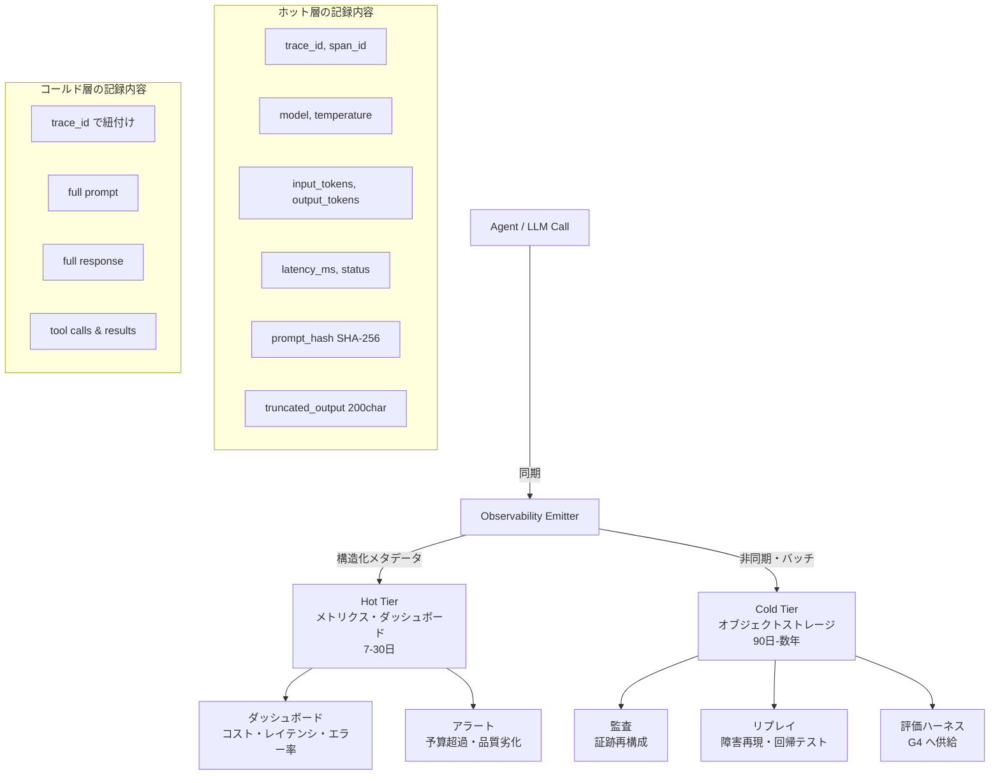

# Tiered (Hot/Cold) Observability｜二層観測

## 一言で（TL;DR）

LLM呼び出しの観測データを**ホット層**（構造化メタデータ・メトリクス・トランケートされた入出力ハッシュ）と**コールド層**（生プロンプト・出力本文をオブジェクトストレージに保管）に分離する。リアルタイムのダッシュボード・アラートはホット層で回し、監査・リプレイ・評価はコールド層から引く。サンプリングを層ごとに制御することで、観測の網羅性とコストを駆動変数の関数として調整する。

## 解決する問題

AIエージェントの観測データは従来のWebサービスと質的に異なる。[1リクエストが高コスト（F2）](../../concepts/design-forces.md)なため、コスト・レイテンシ・トークン消費を常時監視しなければ請求事故を見逃す。[確率的（F3）](../../concepts/design-forces.md)な出力は同一入力でも結果が変わるため、事後に品質を検証するにはプロンプトと出力の全文が必要になる。さらに[コンテキスト長でコスト増（F11）](../../concepts/design-forces.md)という特性上、観測基盤自体にプロンプト全文を投入すると基盤のストレージ・転送コストが本番LLM呼び出しに匹敵する規模に膨れる。

加えて[再現性が低い（F15）](../../concepts/design-forces.md)ため、障害調査ではイベント単位の記録（どのモデル・どのバージョン・どの温度で何を返したか）が不可欠になり、[監査対象（F16）](../../concepts/design-forces.md)であれば「なぜその判断に至ったか」を後から証跡として再構成できなければならない。

これらを単一のログ基盤で賄おうとすると、PII混入リスク・ストレージ肥大・クエリ性能劣化が同時に発生する。ホット/コールドの二層に分離することで、リアルタイム監視と長期監査を構造的に両立させる。

## 選定条件（When to use / When NOT）

- **使う条件**
    - LLM呼び出しを含む本番システムで、コスト・品質・レイテンシのいずれかを継続的に監視する必要がある。
    - `[accountability]` が中以上――監査・コンプライアンス上、プロンプトと出力の原文を一定期間保存する義務がある。
    - `[cost_sensitivity]` が中以上――観測基盤のコストをプロダクションLLMコストの数%以内に抑えたい。
    - プロンプトや出力にPII・機密情報が含まれうるため、アクセス制御を本番ログ基盤と分離したい。
- **使わない条件**
    - 開発・プロトタイプ段階で呼び出し量が少なく、全量を単一ログストアに収めてもコストが問題にならない → 単層のフルログで十分。
    - LLM呼び出しが読取専用の補助機能のみで、監査要件がなく、障害時はリトライすれば済む → メトリクスのみで本文保存は不要。

## 駆動変数とチューニング（程度）

| 目盛り | 効かなすぎ ⇔ 効きすぎ | 決め方 `[駆動変数]` | 目安（出発点） |
|---|---|---|---|
| トレース・サンプリング率 | 障害を再現できない ⇔ 観測コスト爆発 | エラー・HITL・高リスク操作は全量、成功は標本。`[accountability]` が高いほど成功サンプル率を上げる `[accountability]` `[cost_sensitivity]` | エラー/HITL = 100%、成功 = 1–10% |
| プロンプト/出力の保存粒度 | 監査・デバッグ不能 ⇔ 観測基盤の肥大・PII混入 | ホット層にはメタ＋truncate＋hash、コールド層に本文全文 `[accountability]` `[cost_sensitivity]` | ホット: model, tokens, latency, truncated(200char), SHA-256 / コールド: 全文 |
| ログ保持期間 | 監査要件を満たせない ⇔ 保管コスト・法的リスク（不要データの保持） | ホットは短期、コールドは規制要件に合わせる `[accountability]` | ホット 7–30日 / コールド 90日–数年 |
| PII マスキング強度 | 機密漏洩 ⇔ デバッグ不能（過剰マスキング） | PIIの種類と規制に応じ段階的に適用 `[accountability]` | ホット層は常時マスキング、コールド層は暗号化＋アクセス制御で原文保持 |

## 相反における立ち位置（相反）

本パターンは特定のフォークの片側に強く倒れるものではなく、観測の基盤層として他パターンを横断的に支える。ただし以下の傾向がある：

- **F-9（インライン検証 vs 事後検証）**：G1 は事後検証のデータソースを提供する。インライン検証（ガードレール）で防いだ事象もコールド層に記録することで、ガードレールの精度を継続的に評価できる。`[failure_cost]` が高い領域ではインライン検証と事後検証の両方にG1のデータが必要になる。
- **F-3（オーケストレーション vs コレオグラフィ）**：中央集権型のオーケストレーションではトレース伝播が容易だが、イベント駆動のコレオグラフィではcorrelation IDの設計が重要になる。どちらの場合もG1のホット/コールド分離は同じ構造で適用できる。

## 構造



## 実装メモ

ホット層のイベント構造の最小例：

```json
{
  "trace_id": "abc-123",
  "span_id": "span-456",
  "timestamp": "2025-01-15T10:30:00Z",
  "model": "claude-sonnet-4-20250514",
  "temperature": 0.3,
  "input_tokens": 1520,
  "output_tokens": 340,
  "latency_ms": 2100,
  "status": "ok",
  "prompt_hash": "sha256:e3b0c44298...",
  "output_truncated": "お客様のご注文は正常に処理されました。注文番号...",
  "cold_ref": "s3://obs-cold/2025/01/15/abc-123/span-456.jsonl"
}
```

コールド層への書き出し：

```python
import hashlib, json, gzip
from datetime import datetime

def emit_observation(trace_id: str, span_id: str, prompt: str,
                     response: str, meta: dict, cold_store, hot_store):
    # ホット層：メタ＋ハッシュ＋トランケート
    hot_record = {
        "trace_id": trace_id,
        "span_id": span_id,
        "timestamp": datetime.utcnow().isoformat(),
        **meta,  # model, tokens, latency, status
        "prompt_hash": hashlib.sha256(prompt.encode()).hexdigest(),
        "output_truncated": response[:200],
        "cold_ref": f"s3://obs-cold/{datetime.utcnow():%Y/%m/%d}/{trace_id}/{span_id}.jsonl.gz",
    }
    hot_store.put(hot_record)  # 同期（メトリクス基盤へ）

    # コールド層：全文を非同期・バッチ・圧縮で書き出し
    cold_record = {
        "trace_id": trace_id,
        "span_id": span_id,
        "prompt": prompt,
        "response": response,
    }
    cold_store.put_async(
        key=hot_record["cold_ref"],
        body=gzip.compress(json.dumps(cold_record).encode()),
    )
```

落とし穴：

- **ホット層に本文を入れない**。「truncateしているから大丈夫」と考えてホット層のフィールドを徐々に拡張すると、結局単層ログと同じ肥大に陥る。ホット層は厳格にスキーマを固定し、フィールド追加にはレビューを必須にする。
- **`cold_ref`（ホットからコールドへのポインタ）を必ず含める**。ホット層だけで障害調査を始め、深掘りが必要になったときにコールド層の原文へ1クリックで到達できる導線が運用の鍵。
- **コールド層の書き出しは非同期かつバッチ化する**。同期書き出しにすると本番レイテンシに観測コストが上乗せされる。ただし書き出しキューが詰まった場合のドロップポリシー（エラーイベントは絶対に落とさない等）を事前に決めておく。
- **PII処理のタイミング**。ホット層に流す前にマスキングを適用する。コールド層には原文を保存するが、暗号化とアクセス制御（監査担当者のみ復号可能）で保護する。規制によってはコールド層でもマスキングが必要な場合がある。
- **ハッシュの用途**。`prompt_hash` はキャッシュヒット判定（[D6](../d-memory-context/d6-semantic-cache-nocache-zones.md)との連携）や、同一プロンプトの出力ドリフト検知に使う。ハッシュの衝突確率は実用上無視できるが、完全一致の検証が必要ならコールド層の原文を引く。

## 効かせる力学（forces）

- **F2（高コスト）**：観測基盤自体のコストを二層分離で抑制する。ホット層は構造化メタデータのみなのでストレージ・クエリコストが桁違いに小さい。コールド層はオブジェクトストレージの低単価と圧縮で長期保存コストを最小化する。
- **F3（確率的）**：同一プロンプトに対する出力のばらつきを、ハッシュとコールド層の全文記録で事後検証可能にする。品質回帰の検知（[G4](g4-eval-harness.md)）にデータを供給する。
- **F11（コンテキスト長コスト増）**：プロンプトが数万トークンに達しても、ホット層にはトークン数とハッシュだけが入るため観測コストがプロンプト長に比例しない。
- **F15（再現性低）**：イベントソーシング的にプロンプト・出力・モデルバージョン・温度をコールド層に記録し、障害時のリプレイを可能にする。
- **F16（監査対象）**：「なぜその判断に至ったか」をコールド層の原文とホット層のメタデータを組み合わせて再構成できる。trace_id による紐付けが監査証跡の背骨になる。

## 関連・代替

- [A2 耐久非同期](../a-execution/a2-durable-async-agent.md)：チェックポイントの保存粒度とG1が連携する。チェックポイントに `trace_id` を埋め込むことで、再開後のスパンも同一トレースに紐付けられる。
- [A7 予算カスケード](../a-execution/a7-deadline-budget-cascade.md)：予算消費メトリクス（consumed/limit比）はG1のホット層に流し、閾値超過でアラートを発火する。
- [G2 全ホップトレース](g2-end-to-end-tracing.md)：G2がトレースの伝播構造（trace_id / span_id）を担い、G1がその各スパンに何を記録しどこに保存するかを担う。G1とG2は補完関係。
- [G3 シャドウ・カナリア](g3-shadow-canary.md)：シャドウテストの結果比較にはコールド層の出力全文が必要。G1がデータソースを提供する。
- [G4 評価ハーネス](g4-eval-harness.md)：定期的な品質評価にコールド層のプロンプト/出力ペアをサンプリングして供給する。G1の `cold_ref` 経由でデータを引く。
- [E1 リスクベース承認](../e-safety-hitl/e1-risk-based-approval.md)：HITL承認イベントは全量（サンプリング率100%）でホット・コールド両層に記録する。承認ログの欠損は監査上許されない。

代替パターンは特にない。G1は観測の基盤層であり、他の観測パターン（G2–G5）の前提として機能する。

## コーディングエージェント向け指示（machine-actionable）

このパターンを人間に提案するなら、同時に以下を提案/確認する：

- [ ] ホット層に記録するフィールドを列挙し、本文やPIIが混入しない設計にしたか
- [ ] コールド層の保存先（オブジェクトストレージ）と保持期間を `[accountability]` の規制要件から導き、**根拠を添えて**提示したか
- [ ] サンプリング率を `[accountability]` と `[cost_sensitivity]` から決定したか（エラー/HITL=100%は必須、成功の率を調整）
- [ ] `cold_ref`（ホット→コールドのポインタ）を設計に含め、障害調査時の導線を確保したか
- [ ] [G2 全ホップトレース](g2-end-to-end-tracing.md)を併置し、trace_id / span_id の伝播設計を含めたか
- [ ] PII処理方針（ホット層マスキング・コールド層暗号化）を明示したか
- [ ] コールド層の非同期書き出しにおけるドロップポリシー（エラーイベントは落とさない等）を定めたか
- [ ] [G4 評価ハーネス](g4-eval-harness.md)へのデータ供給パスを設計に含めたか
