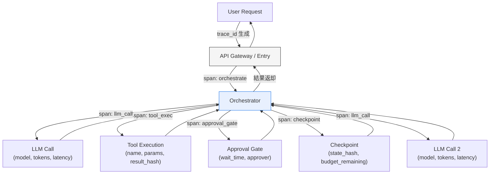

# End-to-End Tracing｜全ホップ分散トレース

## 一言で（TL;DR）

ユーザーリクエストの到着からLLM呼び出し・ツール実行・承認ゲート待機・チェックポイント書込みまで、すべてのホップを**単一の trace_id で貫通**します。各ステップを OpenTelemetry 互換の span として記録し、エージェント固有の属性（残予算・ステップ番号・モデルバージョン）をカスタム属性に載せることで、事後の障害分析・監査・コスト帰属を可能にします。

## 解決する問題

エージェントの処理は複数のLLM呼び出し・ツール実行・人間の承認待ちを跨ぎ、[1リクエストが秒〜数十分に及びます（F1）](../../concepts/design-forces.md)。従来のリクエスト/レスポンス型ログでは「どの段階で何が起きたか」を復元できません。さらに[同入力に対して同出力が返らない（F15）](../../concepts/design-forces.md)ため、バグ報告時に「その実行で実際に何が起きたか」を入力だけから再現することが不可能に近いです。

トレースが無い、あるいは途切れていると、以下の問題が起きます。

- 障害時に「どのステップで失敗したか」が分からず、平均復旧時間（MTTR）が数十分〜数時間に膨れます。
- コスト帰属ができず、どのツール呼び出しがトークンを浪費したか特定できません。
- 監査で「なぜこの結果に至ったか」を説明できず、`[accountability]` 要件を満たせません。

## 選定条件（When to use / When NOT）

- **使う条件**
    - エージェントが2ホップ以上（LLM → ツール → LLM など）の処理連鎖を持ちます。
    - 事後に「なぜこの出力になったか」を第三者に説明する必要があります（`[accountability]` が中以上）。
    - 障害分析やコスト帰属を構造的に行いたい場合です。
- **使わない条件**
    - 1回のLLM呼び出しで完結する単発推論（ログ1行で十分です）。
    - プロトタイプ段階で観測基盤への投資が見合わない → まずリクエストログだけで始め、本番移行時に導入します。
    - トレースの保存・転送コストが処理コストを上回るほど QPS が極端に高い → [G1 二層観測](g1-tiered-observability.md)のサンプリングと組み合わせて量を制御します。

## 駆動変数とチューニング（程度）

| 目盛り | 効かなすぎ ⇔ 効きすぎ | 決め方 `[駆動変数]` | 目安（出発点） |
|---|---|---|---|
| サンプリング率 | 障害の手がかりが欠落 ⇔ ストレージ・転送コスト爆発 | `[accountability]` が高い領域ほど全量（100%）に寄せる | 規制対象 100% / 一般 10–50% / 開発 100% |
| span 粒度 | 粗すぎてボトルネック不明 ⇔ 細かすぎてノイズ化 | `[accountability]` が高いほど細粒度。コスト感度が高ければ要所だけ | LLM呼出・ツール実行・承認ゲートは必須。プロンプト組立は任意 |
| カスタム属性の量 | 属性不足で事後分析不能 ⇔ 機密情報の漏洩リスク | `[accountability]` に応じて載せる情報を増やす。入出力本文は hash 化を検討 | model_version, tokens_used, step_number, budget_remaining は標準。入出力本文はコールド層へ |
| 保持期間 | 古い障害を調査できない ⇔ ストレージ費用の肥大 | 規制・監査要件から逆算 `[accountability]` | ホット層 7–30日 / コールド層 1–7年 |

## 相反における立ち位置（相反）

本パターンは特定のフォークに排他的に依存しない横断的な観測基盤ですが、以下のフォークの選択がトレース設計に影響します。

- **F-1（同期 vs 非同期）**：非同期実行ではトレースが承認待ちやキュー越しに分断されやすくなります。trace_id をメッセージヘッダやチェックポイントに明示的に伝播する設計が必須になります。
- **F-14（インコンテキスト vs 外部ステートストア）**：外部ステートストアを使う場合、チェックポイントに trace_id / span_id を記録することで、プロセス再起動後もトレースを継続できます。

## 構造



すべての span は同一の `trace_id` を共有し、`parent_span_id` で親子関係を保ちます。各 span にエージェント固有のカスタム属性を付与します。

## 実装メモ

OpenTelemetry SDK を用いた最小実装の骨格です：

```python
from opentelemetry import trace
from opentelemetry.trace import StatusCode

tracer = trace.get_tracer("agent-service")

def handle_request(request):
    with tracer.start_as_current_span("orchestrate") as root:
        root.set_attribute("agent.step_total", 0)
        root.set_attribute("agent.budget_usd", request.budget)

        # LLM 呼び出し
        with tracer.start_as_current_span("llm_call") as llm_span:
            llm_span.set_attribute("llm.model", "gpt-4o")
            llm_span.set_attribute("llm.temperature", 0.0)
            result = call_llm(request.prompt)
            llm_span.set_attribute("llm.tokens_input", result.usage.input)
            llm_span.set_attribute("llm.tokens_output", result.usage.output)

        # ツール実行
        with tracer.start_as_current_span("tool_exec") as tool_span:
            tool_span.set_attribute("tool.name", "search_db")
            tool_span.set_attribute("tool.params_hash", hash(params))
            tool_result = execute_tool("search_db", params)
            tool_span.set_attribute("tool.result_hash", hash(tool_result))
```

落とし穴：

- **非同期境界でのコンテキスト伝播**：キューやWebhookを介する場合、trace_id / span_id をメッセージヘッダに明示的に載せます。OpenTelemetry の `propagate.inject()` / `propagate.extract()` を使います。自前でヘッダを組むと形式不一致で途切れます。
- **承認ゲートの長時間 span**：人間の承認待ちは数分〜数時間に及びます。span の duration が極端に長くなるため、「待機開始」と「承認完了」を別 span にし、待機時間を属性として記録する方が分析しやすくなります。
- **入出力本文の記録**：プロンプトやレスポンス全文を span 属性に載せるとストレージが膨張し、機密漏洩リスクも高まります。本文は [G1 二層観測](g1-tiered-observability.md)のコールド層に退避し、span にはハッシュとトークン数だけを残します。
- **モデルバージョンの記録**：`llm.model` 属性にモデル名だけでなくスナップショットIDやデプロイ日時を含めます。[G3 シャドウ・カナリア](g3-shadow-canary.md)でA/B比較する際、どのモデルバージョンの実行かを特定できなければ分析が成り立ちません。

## 効かせる力学（forces）

- **F1（長時間処理）**：長時間の処理を span の連鎖として構造化することで、「どのステップに何秒かかったか」を可視化し、ボトルネック特定と MTTR 短縮を実現します。
- **F15（再現性の低さ）**：同じ入力でも異なる出力が出るため、「その実行で実際に何が起きたか」を trace として記録しておくことが唯一の事後検証手段になります。モデルバージョン・温度・トークン数を span 属性に残すことで、再現困難な問題の原因切り分けが可能になります。

## 関連・代替

- [A2 耐久非同期](../a-execution/a2-durable-async-agent.md)：チェックポイントに `trace_id` / `span_id` を記録し、プロセス再起動後もトレースを継続します。
- [A3 同期ファサード](../a-execution/a3-sync-facade-async-core.md)：同期から非同期への昇格時に trace コンテキストを引き継ぐ設計が必要です。昇格の切れ目でトレースが途切れる事故が頻発するため、伝播テストを書きます。
- [A7 予算カスケード](../a-execution/a7-deadline-budget-cascade.md)：予算の消費量（consumed / limit 比）を各 span の属性に記録し、コスト帰属分析に使います。
- [G1 二層観測](g1-tiered-observability.md)：トレースメタデータ（trace_id, span 名, duration, トークン数）はホット層に、入出力本文はコールド層に分離します。G2 が「何を記録するか」を定め、G1 が「どこに置くか」を定めます。
- [G3 シャドウ・カナリア](g3-shadow-canary.md)：シャドウ実行とカナリア実行の A/B 比較は、両者のトレースを trace_id で突合することで成り立ちます。モデルバージョン属性が比較の軸になります。
- [F2 イベントソーシング](../f-data-integrity/f2-event-sourced-replayable.md)：イベントストアの各イベントに trace_id を付与すると、トレースとイベントログの双方向参照が可能になります。障害分析で「トレースからイベントへ」「イベントからトレースへ」の両方向に辿れます。

## コーディングエージェント向け指示（machine-actionable）

このパターンを人間に提案するなら、同時に以下を提案/確認します：

- [ ] `[accountability]` の水準を確認し、サンプリング率と保持期間を**根拠を添えて**提示したか
- [ ] [G1 二層観測](g1-tiered-observability.md)を併置し、トレースメタはホット層・本文はコールド層に分離する設計にしたか
- [ ] 非同期境界（キュー・Webhook・承認ゲート）で trace コンテキストが途切れない伝播設計を示したか
- [ ] [A2 耐久非同期](../a-execution/a2-durable-async-agent.md)を使う場合、チェックポイントに trace_id / span_id を含めたか
- [ ] [A7 予算カスケード](../a-execution/a7-deadline-budget-cascade.md)と連携し、各 span に budget_remaining を記録する設計にしたか
- [ ] span 属性にプロンプト/レスポンス全文を載せず、ハッシュ化またはコールド層退避としたか（機密漏洩防止）
- [ ] `llm.model` 属性にモデルバージョン（スナップショットID）を含め、[G3 シャドウ・カナリア](g3-shadow-canary.md)での比較に使えるようにしたか
