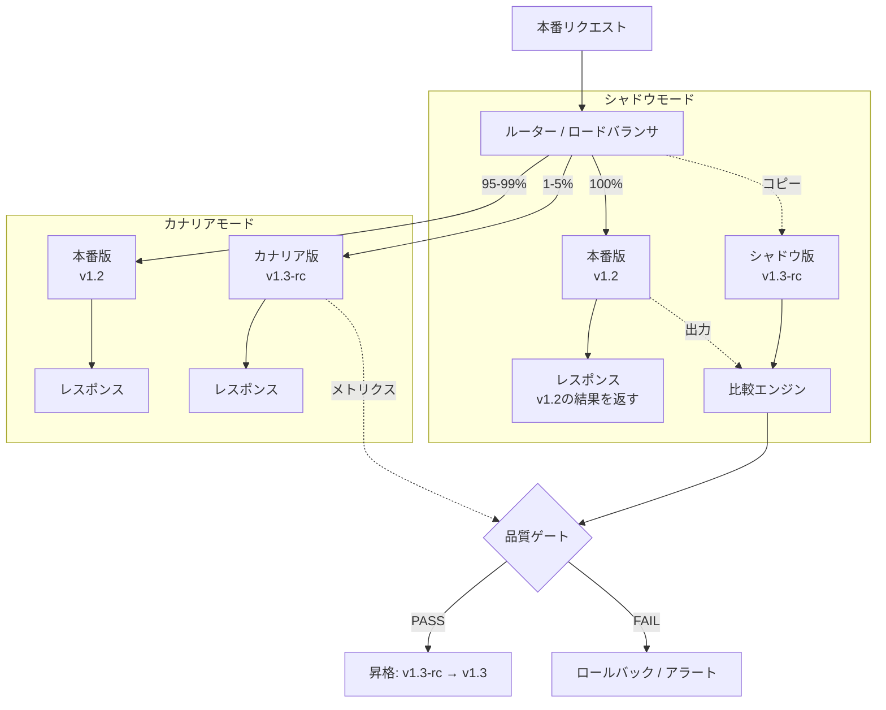

# Shadow & Canary｜影武者とカナリア

## 一言で（TL;DR）

モデルバージョン変更・プロンプト改訂・パイプライン構成変更を本番に反映する前に、**シャドウ実行**（本番トラフィックを新旧両方に流し、旧版の結果のみ返す）または**カナリアデプロイ**（トラフィックの一部だけを新版に流す）で挙動劣化を検出する。LLMの確率的特性により「単体テストを通ったから安全」とは言えないため、本番分布のリクエストで統計的に検証する仕組みが不可欠になる。

## 解決する問題

LLMを含むシステムでは、従来のソフトウェアとは異なる2つの力学がデプロイを危険にする。

[LLMが変わると挙動が変わる（F9）](../../concepts/design-forces.md)――プロバイダ側のモデル更新、自チームのプロンプト修正、ガードレール閾値の調整など、いずれも出力分布を変える。変更前後でユニットテストが通っても、本番トラフィックの長い裾（エッジケース）で品質が劣化していることに気づけない。

[確率的（F3）](../../concepts/design-forces.md)――同一プロンプトでも出力が毎回変わるため、数件のサンプルでは統計的に有意な比較ができない。本番規模のトラフィックを流して初めて品質回帰を検出できる。

これらを放置すると、「プロンプトを少し直しただけ」の変更が特定ユースケースで致命的な品質低下を引き起こし、ユーザーからの報告で初めて気づくことになる。シャドウとカナリアはこの問題を構造的に防ぐ。

## 選定条件（When to use / When NOT）

- **使う条件**
    - `[accountability]` が中以上――モデルやプロンプトの変更に対して「品質が劣化しなかったこと」のエビデンスを求められる。
    - 本番トラフィックが統計的に有意な検証に十分な量（目安：数百〜数千リクエスト/日以上）ある。
    - モデルバージョン、プロンプト、パイプライン構成のいずれかを定期的に更新する運用がある。
- **使わない条件**
    - トラフィックが少なく、統計的比較に必要なサンプル数を確保できない → オフライン評価セット（[G4 評価ハーネス](g4-eval-harness.md)）で代替する。
    - LLM呼び出しコストが極めて高く、シャドウ（2倍呼び出し）の追加コストが許容できない → カナリアのみに絞るか、オフライン評価に倒す。
    - 変更頻度が年数回程度で、手動の回帰テストで十分カバーできる → 評価ハーネスの手動実行で足りる。

## 駆動変数とチューニング（程度）

| 目盛り | 効かなすぎ ⇔ 効きすぎ | 決め方 `[駆動変数]` | 目安（出発点） |
|---|---|---|---|
| シャドウ対象の割合 | 劣化を検出できない ⇔ LLMコスト2倍 | シャドウは本番結果に影響しないのでコスト次第 `[accountability]` | `[accountability]` 高→100%、中→10–30% |
| カナリア初期トラフィック比率 | 統計的検出力不足 ⇔ 劣化の影響範囲が大きい | `[accountability]` が高いほど初期比率を絞り慎重に拡大 `[accountability]` | 1–5%（高accountability時は1%から段階的に） |
| 昇格判定に必要なサンプル数 | 偶然の変動を見逃す ⇔ デプロイが遅すぎる | 品質スコアの分散と許容劣化幅から統計的検出力を算出 `[accountability]` | 概ね500–2,000リクエスト（効果量0.1–0.2、検出力80%） |
| 自動ロールバック閾値 | 劣化を見逃す ⇔ 偽陽性でロールバック頻発 | `[accountability]` が高いほど閾値を厳しく `[accountability]` | 品質スコア低下 > 2%、エラー率増加 > 1%、レイテンシp95増加 > 20% |

## 相反における立ち位置（相反）

本パターンは特定のフォークの片側に強く倒れるものではなく、デプロイ戦略の安全網として他パターンを横断的に支える。ただし以下の傾向がある：

- **F-9（インライン検証 vs 事後検証）**：シャドウは本質的に事後検証（本番結果を返した後に比較する）であり、カナリアはインライン検証（ルーティング段階でリスクを限定する）の性質を持つ。`[accountability]` が高い領域ではシャドウで事前に確認してからカナリアに進む二段階が望ましい。

## 構造



## 実装メモ

シャドウ実行の最小構成（ルーター側の擬似コード）：

```python
async def handle_request(request):
    # 本番版を同期で実行し、結果を返す
    prod_response = await call_llm(request, version="prod")

    # シャドウ版を非同期で実行（レスポンスには含めない）
    if should_shadow(request, rate=0.1):
        asyncio.create_task(
            run_shadow(request, prod_response, version="shadow")
        )

    return prod_response


async def run_shadow(request, prod_response, version):
    shadow_response = await call_llm(request, version=version)
    comparison = compare_outputs(prod_response, shadow_response)
    # G1のコールド層に比較結果を記録
    emit_shadow_result(
        request_id=request.id,
        prod_output=prod_response,
        shadow_output=shadow_response,
        quality_delta=comparison.score_delta,
        latency_delta=comparison.latency_delta,
    )
```

カナリアのルーティング設定例：

```yaml
# トラフィック分割設定
canary:
  enabled: true
  traffic_percent: 5
  sticky_session: true  # 同一ユーザーは同一バージョンへ
  promotion_criteria:
    min_samples: 1000
    max_quality_drop: 0.02   # 品質スコア2%低下で不合格
    max_error_rate_increase: 0.01
    max_latency_p95_increase_ms: 500
  auto_rollback: true
  rollback_on:
    - error_rate_spike
    - quality_score_drop
    - safety_violation_detected
```

落とし穴：

- **シャドウの副作用に注意**。LLM呼び出しが副作用を持つツール実行を含む場合、シャドウ版でツールを実行してはならない。シャドウではツール呼び出しをドライラン（呼び出し内容の記録のみ）にするか、LLM応答の生成部分だけを比較対象にする。
- **カナリアのsticky session**。同一ユーザーが本番版とカナリア版を行き来すると、品質のばらつきがユーザー体験を損なう。セッション単位またはユーザー単位でルーティングを固定する。
- **比較関数の設計が肝**。自然言語出力の「同等性」は単純な文字列一致では判定できない。意味的類似度（embeddings cosine）、構造化出力のスキーマ一致率、品質スコア（[G4](g4-eval-harness.md)の評価基準を流用）など、タスクに応じた比較関数を設計する。
- **コスト管理**。シャドウ実行は本番トラフィック全量に対してLLM呼び出しを追加するため、最大でコストが2倍になる。サンプリング率で制御するか、シャドウ期間を限定する（例：新バージョンの最初の24時間のみ）。

## 効かせる力学（forces）

- **F9（LLMが変わると挙動が変わる）**：モデル更新・プロンプト変更・パイプライン修正がもたらす出力分布の変化を、本番トラフィックの統計的比較で検出する。「変えたら壊れた」を本番反映前に捕捉する直接的な対策。
- **F3（確率的）**：単発のテストでは検出できない品質回帰を、多数のリクエストにわたる統計的な品質スコア比較で検出する。サンプル数と検出力の関係を明示することで、「十分に試した」ことのエビデンスを提供する。

## 関連・代替

- [B7 モデルルーター](../b-orchestration/b7-model-router-adaptive-effort.md)：カナリアのトラフィック分割はモデルルーターの機能として実装できる。ルーターがバージョン別のルーティングテーブルを持ち、カナリア比率を動的に制御する。
- [D5 プロンプトレジストリ](../d-memory-context/d5-prompt-registry.md)：プロンプトのバージョン管理がシャドウ/カナリアの「何を比較しているか」の根拠になる。プロンプトIDとバージョンをトレースに含めることで、どの変更が品質差を生んだかを特定できる。
- [G1 二層観測](g1-tiered-observability.md)：シャドウの比較結果やカナリアのメトリクスはG1のホット層に流し、出力全文の比較にはコールド層を用いる。G1がデータ基盤を提供する。
- [G2 全ホップトレース](g2-end-to-end-tracing.md)：シャドウ/カナリアのリクエストにトレースIDを付与し、本番版との対応関係を追跡可能にする。A/B比較の粒度をスパン単位に落とせる。
- [G4 評価ハーネス](g4-eval-harness.md)：シャドウ/カナリアの「品質ゲート」の判定基準は評価ハーネスの評価関数を流用する。オフライン評価→シャドウ→カナリア→全量展開という段階的パイプラインの中核。

## コーディングエージェント向け指示（machine-actionable）

このパターンを人間に提案するなら、同時に以下を提案/確認する：

- [ ] シャドウとカナリアのどちらを使うか（または両方の段階的パイプライン）を、トラフィック量とコスト制約から判断したか
- [ ] カナリアの初期トラフィック比率と昇格条件を `[accountability]` から導き、**根拠を添えて**提示したか
- [ ] 比較関数（品質スコア、レイテンシ、エラー率、安全性違反）の定義を明示したか
- [ ] シャドウ実行時の副作用（ツール呼び出し）の制御方針を定めたか（ドライラン化等）
- [ ] [G1 二層観測](g1-tiered-observability.md)によるメトリクス収集基盤を併置したか
- [ ] [G4 評価ハーネス](g4-eval-harness.md)の評価関数を品質ゲートの判定基準として連携させたか
- [ ] [D5 プロンプトレジストリ](../d-memory-context/d5-prompt-registry.md)でプロンプトバージョンを管理し、変更の追跡可能性を確保したか
- [ ] 自動ロールバック条件とアラート先を定義したか
