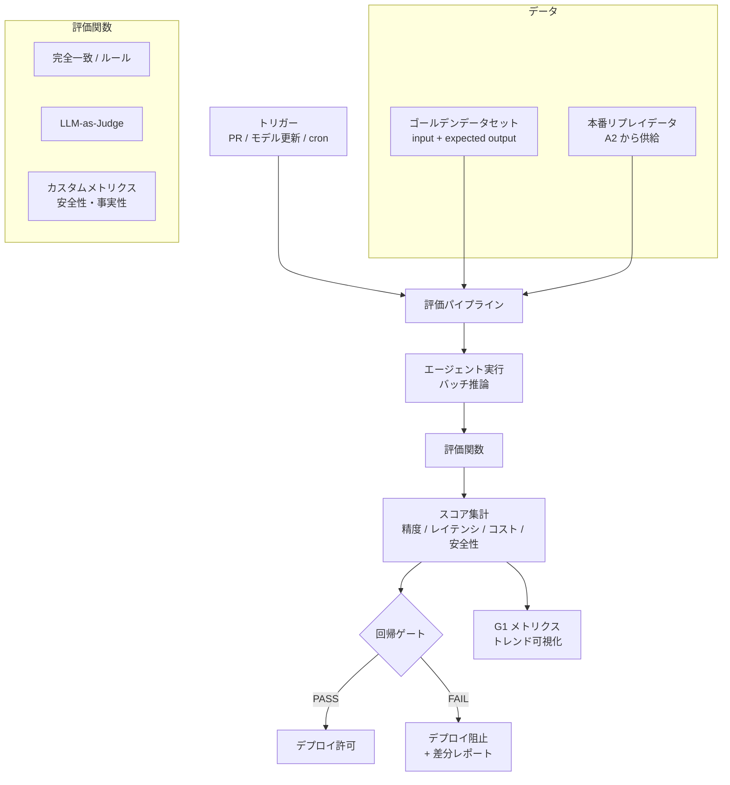

# Eval Harness｜評価ハーネス

## 一言で（TL;DR）

ゴールデンデータセット（入力と期待出力のペア）と自動評価関数（完全一致・LLM-as-Judge・カスタムメトリクス）を組み合わせた評価パイプラインを構築し、プロンプト・モデル・コードの変更ごとにCIで回帰検知を行います。評価はオフライン（デプロイ前バッチ）、オンライン（本番サンプリング）、シャドウ（A/B比較）の3層で実施し、精度・レイテンシ・コスト・安全性をカテゴリ別に追跡します。

## 解決する問題

AIエージェントは[確率的（F3）](../../concepts/design-forces.md)であるため、コードの単体テストのように「全入力に対して正解が決定論的に定まる」前提が成り立ちません。従来のassertベースのテストだけでは品質の変化を捕捉できず、リリース後に品質劣化が判明するまでの時間が長くなります。

[ハルシネーション（F4）](../../concepts/design-forces.md)は個別入力への目視確認では検出しきれません。数百件のゴールデンデータに対して自動評価を回すことで、ハルシネーション率の統計的な変動を検知できます。

[LLMドリフト（F9）](../../concepts/design-forces.md)は、プロバイダ側のモデル更新やAPIの挙動変更によって、自チームが何も変更していなくても品質が変わる現象を指します。評価ハーネスを定期実行することで、外部起因の回帰も検知できます。

評価ハーネスがなければ、品質の変化は本番のユーザークレームや障害として初めて顕在化します。

## 選定条件（When to use / When NOT）

- **使う条件**
    - エージェントが本番トラフィックを処理しており、プロンプト・モデル・コードのいずれかを継続的に変更する開発体制があります。
    - `[accountability]` が中以上で、品質の変化を定量的に示す必要があります（社内レビュー、規制報告、SLA遵守など）。
    - ゴールデンデータを作成・維持できるドメイン知識を持つチームメンバーがいます。
- **使わない条件**
    - プロトタイプ段階でプロンプトが日単位で大幅に変わり、ゴールデンデータの維持コストが評価の価値を上回る場合 → 手動スポット確認で十分です。
    - 出力が自由形式のクリエイティブ生成（小説、詩など）で、正解の定義が困難な場合 → LLM-as-Judgeの基準設計に過大な工数がかかるため、ユーザーフィードバックによる定性評価を優先します。
    - LLM呼び出しが補助的で、後段に決定論的な検証ロジックがあり誤りが自動修正される場合 → 検証ロジック自体がテスト対象であり、評価ハーネスの優先度は低くなります。

## 駆動変数とチューニング（程度）

| 目盛り | 効かなすぎ ⇔ 効きすぎ | 決め方 `[駆動変数]` | 目安（出発点） |
|---|---|---|---|
| ゴールデンデータ件数 | 統計的に有意差を検出できない ⇔ 維持コスト・実行時間が過大 | カテゴリごとに最低30件。`[accountability]` が高い領域ほど件数を増やす `[accountability]` | 全体100〜500件、重要カテゴリ各30件以上 |
| 評価関数のコスト | 安価だが精度が低い（完全一致のみ） ⇔ 高精度だが実行コストが高い（LLM-as-Judge全件） | 安価な関数でフィルタし、不合格のみLLM-as-Judgeに回す。`[cost_sensitivity]` が高いほどサンプリング率を下げる `[cost_sensitivity]` | 完全一致/ルール: 全件、LLM-as-Judge: 10〜30%サンプル |
| 回帰ゲートの閾値 | 緩すぎて品質劣化を見逃す ⇔ 厳しすぎてデプロイが頻繁にブロックされる | `[accountability]` が高いほど閾値を厳しく。ベースラインスコアの95%信頼区間を基準にする `[accountability]` | 精度: ベースライン-2%以内、安全性: 劣化0件 |
| 定期実行頻度 | ドリフト検知が遅れる ⇔ 評価コストが膨らむ | 変更がなくてもモデルドリフト（F9）検知のため定期実行が必要 `[cost_sensitivity]` | CI: 変更ごと、定期: 日次〜週次 |

## 相反における立ち位置（相反）

本パターンは特定のフォークの片側に強く倒れるものではなく、品質ゲートの基盤として他パターンを横断的に支えます。

- **F-9（インライン検証 vs 事後検証）**：評価ハーネスは事後検証の仕組みですが、その結果はインライン検証（[E3 ガードレール](../e-safety-hitl/e3-guardrail-sandwich.md)）の閾値チューニングにフィードバックします。ガードレールの偽陽性率・偽陰性率を評価ハーネスで定量測定し、閾値を駆動変数の関数として調整します。
- **F-12（中央モデルレジストリ vs 分散）**：プロンプトとモデルバージョンが[D5 プロンプトレジストリ](../d-memory-context/d5-prompt-registry.md)で管理されている場合、レジストリの変更をトリガーに評価パイプラインを自動実行できます。分散管理の場合は変更検知の仕組みを別途設計する必要があります。

## 構造



## 実装メモ

評価データセットの最小構造は以下のとおりです：

```yaml
# golden_dataset.yml
- id: "order-happy-path-001"
  category: "order_processing"
  input: "注文番号12345のステータスを教えてください"
  context:
    order_id: "12345"
    status: "shipped"
    tracking: "JP1234567890"
  expected:
    contains: ["発送済み", "JP1234567890"]
    not_contains: ["キャンセル", "返金"]
    eval_fn: "factual_accuracy"
```

評価パイプラインの最小実装は以下のとおりです：

```python
import statistics

def run_eval(agent, dataset, eval_fns, baseline_scores):
    results = []
    for case in dataset:
        output = agent.run(case["input"], context=case.get("context"))
        scores = {}
        for fn_name, fn in eval_fns.items():
            scores[fn_name] = fn(output, case["expected"])
        results.append({"id": case["id"], "category": case["category"], **scores})

    # カテゴリ別集計
    by_category = {}
    for r in results:
        by_category.setdefault(r["category"], []).append(r)

    # 回帰ゲート判定
    for category, items in by_category.items():
        accuracy = statistics.mean([i["factual_accuracy"] for i in items])
        baseline = baseline_scores.get(category, {}).get("factual_accuracy", 0)
        if accuracy < baseline - 0.02:  # 2%劣化で阻止
            raise RegressionError(f"{category}: {accuracy:.3f} < {baseline:.3f} - 0.02")
    return results
```

LLM-as-Judge の評価プロンプト例は以下のとおりです：

```text
あなたは品質評価者です。以下のエージェント出力を評価してください。

【入力】{input}
【期待される内容】{expected}
【エージェント出力】{output}

以下の基準で1-5のスコアをつけてください：
- 事実の正確性（hallucination がないか）
- 質問への回答の完全性
- 不要な情報の有無

JSON形式で回答: {"accuracy": N, "completeness": N, "conciseness": N, "reasoning": "..."}
```

落とし穴：

- **ゴールデンデータの腐敗**。プロダクトの仕様変更に伴い期待出力が古くなると、正しい出力が「回帰」と判定されます。ゴールデンデータにオーナーと最終更新日を付与し、定期的な棚卸しを仕組み化します。
- **LLM-as-Judgeの自己矛盾**。評価用LLMも確率的であるため、同じ入力に対してスコアが揺れます。温度を0に設定し、判定が分かれるケースでは3回実行の多数決を取るなどの安定化策を講じます。ただし評価コストが3倍になるため、`[cost_sensitivity]` とのバランスを取ります。
- **過剰な完全一致依存**。自然言語の出力に完全一致テストを多用すると、表現の揺れだけで偽陰性が多発します。キーワード包含、正規表現、意味的類似度など、出力の性質に合った評価関数を選びます。
- **ベースラインの固定忘れ**。評価スコアは「前回の安定版」との相対比較が基本です。ベースラインを更新するタイミング（デプロイ成功後に自動更新など）を明示的に定めておきます。

## シャドウ実行とカナリアリリース

評価ハーネスのオフライン評価だけでは、本番トラフィックの長い裾（エッジケース）での品質変化を捕捉しきれません。シャドウ実行とカナリアリリースは、評価ハーネスの評価関数を本番トラフィックに対して適用し、デプロイの安全性を段階的に検証する仕組みです。

### シャドウモード

シャドウモードでは、本番トラフィックの一部または全量を新バージョンにも並列で流し、旧バージョンの結果のみをユーザーに返します。新旧の出力を比較エンジンで突合し、品質スコアの差分を記録します。ユーザーへの影響はゼロですが、LLM 呼び出しコストが最大2倍になるため、サンプリング率で制御します。副作用を持つツール実行はシャドウ側ではドライランにしてください。

### カナリアデプロイ

カナリアデプロイでは、トラフィックの一部（概ね 1-5%）を新バージョンにルーティングし、実際にユーザーへ結果を返します。同一ユーザーは sticky session で同一バージョンに固定し、体験のばらつきを防ぎます。メトリクスが品質ゲートを通過すればトラフィック比率を段階的に拡大し、最終的に全量を新バージョンに切り替えます。

### 統計的品質ゲート

品質ゲートの判定には十分なサンプル数が必要です。効果量 0.1-0.2、検出力 80% を目安にすると、概ね 500-2,000 リクエストが判定に必要になります。`[accountability]` が高いほどサンプル数を増やし、信頼度を上げてください。自動ロールバック閾値の目安は、品質スコア低下 > 2%、エラー率増加 > 1%、レイテンシ p95 増加 > 20% です。

### 評価ハーネスとの統合

シャドウ/カナリアの品質ゲートには、本パターンで定義した評価関数（完全一致・LLM-as-Judge・カスタムメトリクス）をそのまま流用します。オフライン評価 → シャドウ → カナリア → 全量展開という段階的パイプラインを構成し、各段階で同一の評価基準を適用することで判定の一貫性を保ちます。シャドウでの比較結果は [G1 二層観測](g1-tiered-observability.md) のコールド層に蓄積し、傾向分析に活用します。

## 効かせる力学（forces）

- **F3（確率的）**：決定論的テストでは捕捉できない品質のばらつきを、統計的な評価スコアとして定量化します。カテゴリ別のスコアトレンドを追跡することで、特定ドメインでの品質変化を早期に検知します。
- **F4（ハルシネーション）**：事実性評価関数（ゴールデンデータとの照合、LLM-as-Judge による事実チェック）をパイプラインに組み込み、ハルシネーション率の統計的な増減を自動検知します。
- **F9（LLMドリフト）**：CIでの変更時実行に加え、変更がなくても定期実行（日次〜週次）することで、プロバイダ側のモデル更新による品質変動を検知します。スコアの時系列推移を[G1 二層観測](g1-tiered-observability.md)のダッシュボードに統合します。

## 関連・代替

- [D5 プロンプトレジストリ](../d-memory-context/d5-prompt-registry.md)：プロンプトのバージョン管理とCIトリガーの連携先です。レジストリへのマージをトリガーに評価パイプラインを自動実行し、スコアが回帰ゲートを通過したバージョンのみ昇格させます。
- [E3 ガードレール](../e-safety-hitl/e3-guardrail-sandwich.md)：ガードレールの偽陽性率・偽陰性率を評価ハーネスで定量測定します。評価結果をもとにガードレールの閾値を調整し、精度と安全性のバランスを取ります。
- [G1 二層観測](g1-tiered-observability.md)：本番メトリクス（レイテンシ、コスト、エラー率）と評価スコアを同一ダッシュボードで突合します。評価スコアの劣化と本番メトリクスの異常が同時期に発生していればモデルドリフトの裏付けになります。
- 本パターンのシャドウ実行・カナリアリリースセクション：シャドウテストやカナリアリリースの「合否判定基準」を評価ハーネスのスコアが供給します。昇格ゲートに評価関数を再利用することで、判定基準の一貫性を保ちます。
- [A2 耐久非同期](../a-execution/a2-durable-async-agent.md)：イベントソーシング機能による本番のリプレイデータを評価入力として再利用します。ゴールデンデータだけでは網羅できないエッジケースを、実トラフィックから補完します。

## コーディングエージェント向け指示（machine-actionable）

このパターンを人間に提案するなら、同時に以下を提案/確認します：

- [ ] ゴールデンデータセットの初期件数とカテゴリ分類を設計し、`[accountability]` から件数の根拠を添えて提示したか
- [ ] 評価関数の構成（完全一致 / LLM-as-Judge / カスタム）を決め、`[cost_sensitivity]` に応じたサンプリング戦略を提示したか
- [ ] 回帰ゲートの閾値を `[accountability]` から導出し、カテゴリ別に設定したか（安全性カテゴリは劣化0件を推奨）
- [ ] [D5 プロンプトレジストリ](../d-memory-context/d5-prompt-registry.md)との連携を設計し、プロンプト変更時のCI自動実行を含めたか
- [ ] [G1 二層観測](g1-tiered-observability.md)のダッシュボードにスコアトレンドを統合する設計を含めたか
- [ ] ゴールデンデータの棚卸し頻度とオーナーシップを定めたか
- [ ] LLM-as-Judgeを使う場合、評価用モデルの温度・再実行回数・コストを見積もったか
- [ ] 定期実行（cron）の頻度を `[cost_sensitivity]` から決定し、モデルドリフト検知の遅延許容度と合わせて根拠を提示したか
