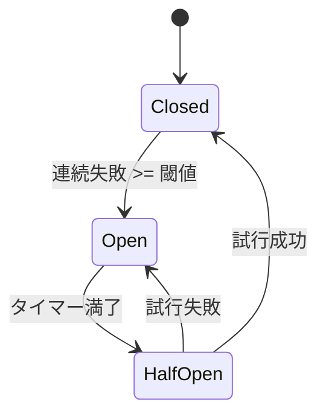
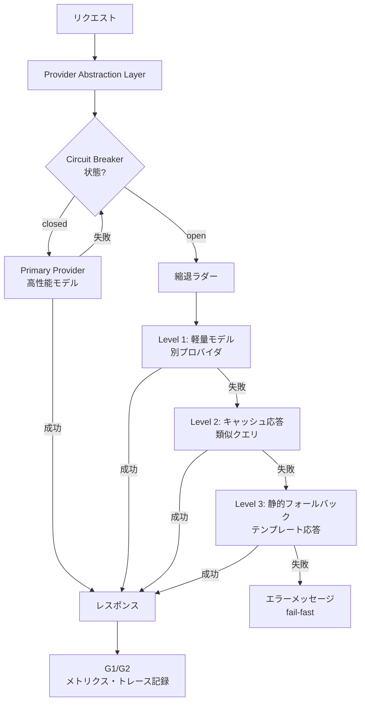

# Circuit Breaker, Graded Degradation & Provider Abstraction｜遮断・縮退・抽象化

## 一言で（TL;DR）

LLMプロバイダの障害・遅延に対し、サーキットブレーカで障害を遮断し、縮退ラダーで段階的にフォールバックし、プロバイダ抽象化層で差し替えを透過的に行います。3つの仕組みが連動することで、プロバイダ起因のカスケード障害を防ぎ、部分的にでもサービスを継続します。

## 解決する問題

LLMプロバイダは従来のSaaSと比較して[可用性が不安定（F7）](../../concepts/design-forces.md)であり、レートリミット・リージョン障害・モデルのデプリケーションが予告なく発生します。障害時にリトライを繰り返すとタイムアウトが連鎖し、呼び出し元のサービス全体が巻き込まれます。さらに[LLMが変わると挙動が変わる（F9）](../../concepts/design-forces.md)ため、フォールバック先のモデルに切り替えた瞬間にプロンプトの解釈やトーンが変化し、品質回帰が起きます。加えて[レイテンシのばらつきが大きい（F12）](../../concepts/design-forces.md)ことから、静的なタイムアウト設定では正常なリクエストを誤って切断するか、障害を検知するまでに時間がかかりすぎるかのどちらかに倒れます。

これらの力学が重なると、プロバイダ障害がアプリケーション全体の可用性を直撃します。サーキットブレーカ・縮退ラダー・プロバイダ抽象化を統合的に設計することで、障害の影響範囲を局所化し、利用者にとって許容可能な水準でサービスを継続します。

## 選定条件（When to use / When NOT）

- **使う条件**
    - `[provider_trust]` が低い、またはSLAが定量的に保証されていないプロバイダに依存しています。
    - プロバイダ障害時にもサービスを完全停止させたくない――部分的な機能低下は許容しますが、エラー画面を返すのは避けたい場合です。
    - 複数のLLMプロバイダまたはモデルを利用している、あるいは将来的に切り替えの可能性があります。
    - `[cost_sensitivity]` が高く、プライマリモデルの障害時にコストの低いモデルへ自動的に縮退したい場合です。
- **使わない条件**
    - LLM呼び出しがベストエフォートの補助機能であり、障害時は単にスキップすれば済む場合 → 単純な try/catch とフィーチャーフラグで十分です。
    - 単一プロバイダ・単一モデルのプロトタイプ段階で、可用性要件がまだ定まっていない場合 → 抽象化層のオーバーヘッドが設計を複雑にするだけになります。
    - フォールバック先のモデルでは品質が許容水準を下回り、誤った回答を返すほうが返さないより危険な場合（`[failure_cost]` が極めて高い）→ fail-fast に倒します。

## 駆動変数とチューニング（程度）

| 目盛り | 効かなすぎ ⇔ 効きすぎ | 決め方 `[駆動変数]` | 目安（出発点） |
|---|---|---|---|
| 遮断閾値（連続失敗数） | 検知が遅く障害が伝播 ⇔ 一時的エラーで過剰遮断 | `[provider_trust]` が低いほど閾値を下げ早期遮断 | 連続3〜5回失敗でopen |
| half-open 試行間隔 | 復旧検知が遅い ⇔ 未復旧のプロバイダに負荷をかけ続ける | `[latency_budget]` が短いほど試行間隔を短く | 概ね15〜60秒、指数バックオフ |
| 縮退ラダーの段数 | 即座にエラー（段数0） ⇔ 低品質な応答を返し続ける | `[cost_sensitivity]` が高いほど段数を増やしコスト最適化、`[failure_cost]` が高いほど段数を減らし早期停止 | 3〜4段（プライマリ→軽量モデル→キャッシュ→静的応答） |
| 適応タイムアウト（p99ベース） | 正常リクエスト切断 ⇔ 障害検知の遅延 | `[latency_budget]` から逆算。直近のp99に係数を掛ける | p99 x 1.5〜2.0、最低でもp50 x 3 |

## 相反における立ち位置（相反）

- **F-8（単一プロバイダ vs マルチプロバイダ）→ hybrid**：本パターンはマルチプロバイダを前提としますが、「最初から全プロバイダを等価に使う」のではなく、プライマリを固定しつつ抽象化層越しにフォールバック先を保持する折衷を採ります。`[provider_trust]` が十分高い場合はプライマリのみで運用し、抽象化層は将来の切り替えに備えた薄いラッパーとして維持します。
- **F-12（fail-fast vs 縮退継続）→ hybrid**：段階的な縮退ラダーで「縮退継続」側に倒しつつ、ラダーの最終段を超えたら fail-fast に切り替えます。部分結果が有用か危険かは `[failure_cost]` で判定します。医療・金融など誤った応答のリスクが高い領域ではラダーを浅くし、早い段階で人間にエスカレーションします。

## 構造





## 実装メモ

サーキットブレーカの最小実装は以下のとおりです：

```python
import time
from enum import Enum
from dataclasses import dataclass, field

class State(Enum):
    CLOSED = "closed"
    OPEN = "open"
    HALF_OPEN = "half_open"

@dataclass
class CircuitBreaker:
    failure_threshold: int = 5
    recovery_timeout: float = 30.0
    state: State = State.CLOSED
    failure_count: int = 0
    last_failure_time: float = 0.0

    def allow_request(self) -> bool:
        if self.state == State.CLOSED:
            return True
        if self.state == State.OPEN:
            if time.time() - self.last_failure_time >= self.recovery_timeout:
                self.state = State.HALF_OPEN
                return True  # 試行1回のみ許可
            return False
        return True  # HALF_OPEN: 試行中

    def record_success(self):
        self.failure_count = 0
        self.state = State.CLOSED

    def record_failure(self):
        self.failure_count += 1
        self.last_failure_time = time.time()
        if self.failure_count >= self.failure_threshold:
            self.state = State.OPEN
```

プロバイダ抽象化層の設計指針は以下のとおりです：

```python
class LLMProvider:
    """全プロバイダが実装する薄いインターフェース。"""
    def complete(self, messages: list, **kwargs) -> str: ...
    def health_check(self) -> bool: ...

class ProviderRouter:
    def __init__(self, providers: list[tuple[LLMProvider, CircuitBreaker]]):
        self.providers = providers  # 優先度順

    def call(self, messages: list, **kwargs) -> str:
        for provider, breaker in self.providers:
            if not breaker.allow_request():
                continue
            try:
                result = provider.complete(messages, **kwargs)
                breaker.record_success()
                return result
            except Exception:
                breaker.record_failure()
        # 全プロバイダ遮断 → キャッシュ or 静的応答へ
        return self._fallback_static(messages)
```

落とし穴：

- **プロバイダごとにブレーカを分離します**。共有ブレーカにすると、1プロバイダの障害で全プロバイダが遮断されます。モデル単位・リージョン単位でブレーカを分けるとさらに細かく制御できます。
- **half-open 状態での同時試行を制限します**。half-open で大量のリクエストを流すと、回復途上のプロバイダに再び負荷が集中します。試行は1〜数リクエストに絞ります。
- **縮退時のモデル差異を意識します**。フォールバック先のモデルではプロンプトの解釈が異なる場合があります。縮退用のプロンプトテンプレートを別途用意するか、出力の構造化（JSON Schemaなど）でばらつきを抑えます。
- **適応タイムアウトは直近のウィンドウで計算します**。過去24時間のp99ではなく、直近5〜15分のスライディングウィンドウで計算しないとレイテンシの急変に追従できません。

## 効かせる力学（forces）

- **F7（可用性が不安定）**：サーキットブレーカが障害プロバイダへのリクエストを遮断し、カスケード障害を防ぎます。縮退ラダーが「全か無か」ではない段階的なフォールバックを提供します。
- **F9（LLMが変わると挙動が変わる）**：プロバイダ抽象化層が統一インターフェースを提供し、フォールバック時のモデル差異を呼び出し元から隠蔽します。ただし出力品質の差異は隠蔽できないため、縮退レベルをレスポンスに付与し、呼び出し元が品質期待値を調整できるようにします。
- **F12（レイテンシのばらつき）**：適応タイムアウトが直近のレイテンシ分布に基づいて動的に閾値を調整し、正常リクエストの誤切断と障害検知の遅延のバランスを取ります。

## 関連・代替

- [A6 適応タイムアウト・リトライ](../a-execution/a6-adaptive-timeout-retry.md)：A6 がリトライ上限を超えたとき、G5 のサーキットブレーカが open に遷移します。A6 は個別リクエストの回復を試み、G5 はプロバイダ単位の障害を管理します。
- [B7 モデルルーター](../b-orchestration/b7-model-router-adaptive-effort.md)：B7 がタスク難度に応じてモデルを選択し、G5 が障害時のフォールバック先を決定します。平常時は B7 のルーティング、障害時は G5 の縮退ラダーが優先されます。
- [G1 二層観測](g1-tiered-observability.md)：サーキットブレーカの状態遷移（open/closed/half-open）と縮退レベルを G1 のホット層にメトリクスとして記録します。遮断頻度の推移がプロバイダの信頼性評価に直結します。
- [G2 全ホップトレース](g2-end-to-end-tracing.md)：縮退が発生したリクエストのトレースに縮退レベルをスパン属性として付与し、事後分析で「どの段階まで落ちたか」を追跡可能にします。

## コーディングエージェント向け指示（machine-actionable）

- [ ] プロバイダごとに独立したサーキットブレーカを設計し、遮断閾値を `[provider_trust]` から導いて**理由を添えて**提示したか
- [ ] 縮退ラダーの段数と各段の内容を `[failure_cost]` と `[cost_sensitivity]` から決定し、最終段（fail-fast）の条件を明示したか
- [ ] プロバイダ抽象化層のインターフェースを定義し、フォールバック先のモデルでプロンプト互換性を検証する手順を含めたか
- [ ] [A6 適応タイムアウト・リトライ](../a-execution/a6-adaptive-timeout-retry.md)を併置し、リトライ上限超過からサーキットブレーカ遷移への接続を設計したか
- [ ] [G1 二層観測](g1-tiered-observability.md)にサーキットブレーカの状態遷移と縮退レベルのメトリクスを含めたか
- [ ] [G2 全ホップトレース](g2-end-to-end-tracing.md)のスパン属性に縮退レベルを追加し、障害影響の事後分析を可能にしたか
- [ ] 目盛り（上表）の各値を `[provider_trust]` `[cost_sensitivity]` から導き、**理由を添えて**提示したか
