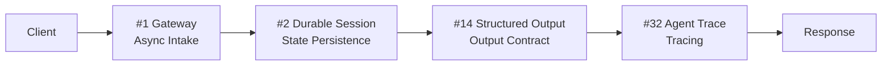

# 1. Minimal Configuration (MVP)

!!! abstract "TL;DR"
    A 4-layer configuration for getting a working agent up and running as quickly as possible when failure cost is low.

## When This Architecture Is Needed

You want to validate a new product idea. You want to try it as an internal productivity tool with a small team first. This minimal configuration is what you need first in these situations.

What's distinctive is the intentional omission of layers like guardrails, security, and cost optimization — "necessary in production but excessive initially." It's used in situations where `[F2]` failure cost is low and `[F8]` accountability is not required — such as internal tools or hackathon prototypes.

However, "minimal" doesn't mean "sloppy." The four layers — async processing, suspend/resume, structured output, and minimal tracing — form the foundation for adding layers later. Without this foundation, you'll likely need a complete rewrite when moving to production.

## Force Assessment

| Force | Rating | Meaning in This Configuration |
|---------|------|----------------|
| `[F1]` Reversibility | High | Operations are primarily retry-friendly |
| `[F2]` Failure Cost | Low | Incorrect output causes minimal damage |
| `[F3]` Per-Request Value | Low-Medium | Individual requests don't carry high value |
| `[F4]` Latency Budget | Medium | A few seconds to tens of seconds of wait is tolerable |
| `[F5]` Input Trust | High | Input from internal users or developers |
| `[F6]` Task Variability | Medium | Balance of routine and exploratory tasks |
| `[F7]` Cost Sensitivity | Low | Low request volume, relaxed cost constraints |
| `[F8]` Accountability | Low | No audit or regulatory requirements |
| `[F9]` Provider Reliability | — | A single provider is sufficient |

## Architecture Diagram

## Configuration Pattern List

| Layer | Pattern | Role | Why It's Needed |
|---|---------|------|-----------|
| Intake | [#1 Request-to-Job Gateway](../patterns/01-execution/01-request-to-job-gateway.md) | Async processing to avoid timeouts | LLM calls take seconds to minutes, so sync HTTP connections will drop |
| State | [#2 Durable Agent Session](../patterns/01-execution/02-durable-agent-session.md) | Suspend/resume | When sessions are lost on process restart or scale-in, users must start over |
| Output | [#14 Structured Output Contract](../patterns/03-io-contract/14-structured-output-contract.md) | Downstream system integration | Natural language output causes downstream parse failures |
| Observability | [#32 Agent Trace](../patterns/07-observability/32-agent-trace.md) | Minimal debugging info | Without traces, there's no way to post-hoc verify "why that answer was given" |

## Layer Details

### Intake Layer — Request-to-Job Gateway

Immediately responds to client requests with a job ID and runs LLM processing in the background. Without this layer, LLM inference time hits HTTP timeouts, returning errors to the frontend. Retries especially risk duplicate execution of the same request.

### State Layer — Durable Agent Session

Persists agent session state. Multi-turn conversations and in-progress step execution can be preserved. Without this layer, conversations reset on every server restart, severely degrading user experience.

### Output Layer — Structured Output Contract

Structures LLM output with JSON schemas and similar formats. Downstream systems and UIs can reliably receive data. Without this layer, the frontend breaks whenever LLM output format varies.

### Observability Layer — Agent Trace

Records all LLM calls and tool executions as traces. Even at the MVP stage, traces dramatically speed up debugging. Without this layer, investigating issues devolves into repeatedly re-querying the LLM — highly inefficient.

## What Can Be Omitted / What to Consider Adding

- **Can omit**: Guardrails (output inspection can be skipped while `[F2]` is low), multi-agent architecture (single agent is sufficient), cost optimization (unnecessary while request volume is low)
- **Consider adding**: If input is unstructured, add [#13 Natural Language Boundary Adapter](../patterns/03-io-contract/13-natural-language-boundary-adapter.md). If streaming display is needed, add [#7 Streaming Progress](../patterns/01-execution/07-streaming-progress.md)

## Concrete Scenario

Consider building a Q&A chatbot for an internal knowledge base. Users are about 20 internal engineers. The bot searches internal Wiki content via RAG and returns answers.

When the client (Slack bot) receives a user's question, it sends a request to the Request-to-Job Gateway. The Gateway enqueues the job and immediately returns "Generating answer..." to Slack. A background worker processes the question as a Durable Session, executing RAG search followed by LLM inference. Output is structured per the Structured Output Contract into JSON format and formatted as Slack message blocks. All LLM calls are recorded in the Agent Trace, allowing post-hoc review of "why this answer was given."

With this configuration, you can have a working prototype in 1-2 days. Collect user feedback and add layers as needed.

## Evolution Path

- If `[F2]` increases -> Add [Side-Effect-First Configuration](02-side-effect-first.md) elements (Agent Saga, Human Approval)
- If `[F5]` decreases -> Add [Untrusted Input Configuration](03-untrusted-input.md) security layers
- If `[F7]` increases -> Add [Cost-First Configuration](05-cost-first.md) caching and routing layers
- If `[F8]` increases -> Add [Continuous Improvement Configuration](06-continuous-improvement.md) evaluation and deployment layers

## Related Configurations

- [Side-Effect-First Configuration](02-side-effect-first.md) — The most common next evolution from MVP
- [Cost-First Configuration](05-cost-first.md) — Combined when user count grows
