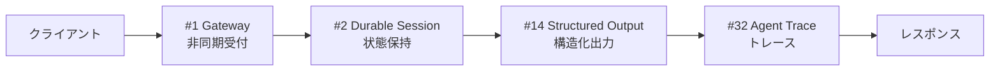

# 1. 最小構成（MVP）

!!! abstract "一言"
    失敗コストが低い状況で、最短で動くエージェントを立ち上げるための4層構成。

## このアーキテクチャが必要になるとき

新しいプロダクトのアイデアを検証したい。社内の業務改善ツールとして、まずは小さなチームで試したい。こうした場面で最初に必要になるのがこの最小構成です。

特徴的なのは、ガードレール・セキュリティ・コスト最適化といった「本番で必要だが初期には過剰な層」を意図的に省略している点です。`[F2]` 失敗コストが低く、`[F8]` 説明責任も求められない状況——たとえば社内ツールやハッカソンのプロトタイプ——で使います。

ただし「最小」は「雑」ではありません。非同期化・中断再開・構造化出力・最低限のトレースという4層は、後から層を追加するときの土台になります。この土台がないと、本番化のタイミングで全面作り直しになりやすいです。

## フォース評価

| フォース | 評価 | この構成での意味 |
|---------|------|----------------|
| `[F1]` 可逆性 | 高 | 失敗してもやり直せる操作が中心 |
| `[F2]` 失敗コスト | 低 | 誤った出力があっても被害が軽微 |
| `[F3]` 1リクエストの価値 | 低〜中 | 個々のリクエストに高い価値はない |
| `[F4]` レイテンシ予算 | 中 | 数秒〜数十秒の待ちは許容される |
| `[F5]` 入力の信頼度 | 高 | 社内ユーザーや開発者からの入力 |
| `[F6]` タスクの変動性 | 中 | 定型と探索のバランス |
| `[F7]` コスト感度 | 低 | リクエスト量が少なくコスト制約は緩い |
| `[F8]` 説明責任 | 低 | 監査・規制要件なし |
| `[F9]` プロバイダ信頼度 | — | 単一プロバイダで十分 |

## 構成図

## 構成パターン一覧

| 層 | パターン | 役割 | なぜ必要か |
|---|---------|------|-----------|
| 受付 | [#1 Request-to-Job Gateway](../glossary.md) | 非同期化でタイムアウト回避 | LLM呼び出しは数秒〜数分かかるため、同期HTTPでは接続が切れます |
| 状態 | [#2 Durable Agent Session](../glossary.md) | 中断・再開 | プロセス再起動やスケールイン時にセッションが消えると、ユーザーが最初からやり直しになります |
| 出力 | [#14 Structured Output Contract](../glossary.md) | 下流システムとの接続 | 自然言語出力のままでは後続処理がパースに失敗します |
| 観測 | [#32 Agent Trace](../glossary.md) | 最低限のデバッグ情報 | トレースがないと「なぜその回答になったか」を事後検証できません |

## 各層の詳細

### 受付層 — Request-to-Job Gateway

クライアントからのリクエストを即座にジョブIDで応答し、LLM処理をバックグラウンドで実行します。この層がないと、LLMの推論時間がHTTPタイムアウトに引っかかり、フロントエンドにエラーが返ります。とくにリトライが走ると同じリクエストが多重実行されるリスクがあります。

### 状態層 — Durable Agent Session

エージェントのセッション状態を永続化します。マルチターンの会話やステップ実行の途中経過を保持できます。この層がないと、サーバー再起動のたびに会話がリセットされ、ユーザー体験が著しく劣化します。

### 出力層 — Structured Output Contract

LLMの出力をJSONスキーマなどで構造化します。下流のシステムやUIが安定してデータを受け取れるようになります。この層がないと、LLMの出力フォーマットが揺れるたびにフロントエンドが壊れます。

### 観測層 — Agent Trace

全てのLLM呼び出し・ツール実行をトレースとして記録します。MVPの段階でも、トレースがあるとデバッグの速度が桁違いに変わります。この層がないと、不具合の原因調査がLLMへの再質問の繰り返しになり、非効率になります。

## 省略してよいもの・追加を検討するもの

- **省略可**: ガードレール（`[F2]` が低い間は出力検査を省略できます）、マルチエージェント構成（単一エージェントで十分です）、コスト最適化（リクエスト量が少ない間は不要です）
- **追加検討**: 入力が構造化されていない場合は [#13 Natural Language Boundary Adapter](../glossary.md) を追加します。ストリーミング表示が必要なら [#7 Streaming Progress](../glossary.md) を足します

## 具体的なシナリオ

社内のナレッジベースに対するQ&Aチャットボットを作るケースを考えます。ユーザーは社内のエンジニア20名程度です。社内Wikiの内容をRAGで検索し、回答を返します。

クライアント（Slackボット）がユーザーの質問を受け取ると、Request-to-Job Gatewayにリクエストを投げます。Gatewayはジョブを非同期キューに入れ、Slackには「回答を生成中です」と即座に返します。バックグラウンドのワーカーがDurable Sessionとして質問を処理し、RAG検索→LLM推論を実行します。出力はStructured Output Contractに従ってJSON形式で構造化され、Slackのメッセージブロックとして整形されます。すべてのLLM呼び出しはAgent Traceに記録され、「なぜこの回答になったか」を後から確認できます。

この構成なら、1〜2日で動くプロトタイプを立ち上げられます。ユーザーからフィードバックを集め、必要に応じて層を追加していきます。

## 発展パス

- `[F2]` が高まったら → [副作用重視構成](02-side-effect-first.md)の要素（Agent Saga、Human Approval）を追加します
- `[F5]` が低下したら → [信頼できない入力構成](03-untrusted-input.md)のセキュリティ層を追加します
- `[F7]` が高まったら → [コスト重視構成](05-cost-first.md)のキャッシュ・ルーティング層を追加します
- `[F8]` が高まったら → [継続改善運用構成](06-continuous-improvement.md)の評価・デプロイ層を追加します

## 関連する構成

- [副作用重視構成](02-side-effect-first.md) — MVPから最初に進化する先として多い構成です
- [コスト重視構成](05-cost-first.md) — ユーザー数が増えたときに組み合わせます
