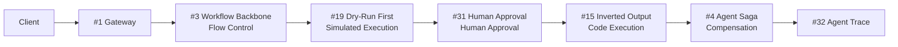

# 2. Side-Effect-First Configuration

!!! abstract "TL;DR"
    A 7-layer configuration for systems with irreversible operations, incorporating rollback on failure and human approval.

## When This Architecture Is Needed

The agent sends emails, executes payments, updates database records — when a system includes these "irreversible operations," LLM judgment errors lead directly to tangible damage.

Typical scenarios include e-commerce order processing agents, customer support bots that automate refund processing, and sales support tools that update CRM data. All are situations where `[F1]` reversibility is low and `[F2]` failure cost is high.

The key principle of this configuration is "let the LLM make decisions, but code handles execution." Additionally, high-risk operations are preceded by human approval, and failures trigger compensating transactions via the Saga pattern. It may seem defensive, but this level of safeguarding is essential when dealing with irreversible operations.

## Force Assessment

| Force | Rating | Meaning in This Configuration |
|---------|------|----------------|
| `[F1]` Reversibility | Low | Irreversible operations like email sending and payment |
| `[F2]` Failure Cost | High | Incorrect operations lead to financial damage or trust loss |
| `[F3]` Per-Request Value | Medium-High | Each processing item directly relates to actual business |
| `[F4]` Latency Budget | Medium-High | Includes approval wait, so safety is prioritized over responsiveness |
| `[F5]` Input Trust | Medium | Mostly from internal operators, but input error risk exists |
| `[F6]` Task Variability | Low-Medium | Business flows are relatively fixed |
| `[F7]` Cost Sensitivity | Medium | Additional calls for safety take priority over cost |
| `[F8]` Accountability | Medium-High | Operation recording and tracking are required |
| `[F9]` Provider Reliability | Medium | Fallback is reassuring but not mandatory |

## Architecture Diagram

## Configuration Pattern List

| Layer | Pattern | Role | Why It's Needed |
|---|---------|------|-----------|
| Intake | [#1 Request-to-Job Gateway](../glossary.md) | Async intake | Processing can take minutes to hours including approval wait |
| Backbone | [#3 Workflow Backbone + Agent Node](../glossary.md) | Deterministic flow control | Side-effect execution order can't be left to LLM whims |
| Compensation | [#4 Agent Saga](../glossary.md) | Rollback on failure | Without compensation for already-executed operations on mid-process failure, data becomes inconsistent |
| Approval | [#31 Human Approval Checkpoint](../glossary.md) | Human approval before high-risk operations | Letting machines alone execute irreversible operations is too risky |
| Tool | [#19 Dry-Run First Tool Execution](../glossary.md) | Simulated execution of side effects | Without previewing "what will happen" before execution, approvers can't make informed decisions |
| Output | [#15 Inverted Structured Output](../glossary.md) | LLM decides only, code executes | If the LLM directly calls APIs, parameter errors can't be prevented |
| Observability | [#32 Agent Trace](../glossary.md) | Full operation tracking | Without audit trails of what was executed, root cause identification during incidents is impossible |

## Layer Details

### Intake Layer — Request-to-Job Gateway

Processing with side effects can take minutes to hours, including human approval wait and Saga compensation. Synchronous HTTP connections can't sustain this, so processing is managed as async jobs. Clients receive a job ID, with progress reported via polling or webhooks.

### Backbone Layer — Workflow Backbone + Agent Node

Business flows like "inventory check -> quote creation -> approval -> payment -> notification" are controlled by a deterministic workflow engine. LLMs may be called at each node, but flow branching and ordering are determined by code. Without this layer, the LLM risks skipping steps or getting the order wrong.

### Compensation Layer — Agent Saga

When multi-step processing fails midway, compensating operations (reverse operations equivalent to cancellation) are executed for already-completed operations. For example, if inventory allocation fails after payment succeeds, a refund is processed. Without this layer, data inconsistencies are left unresolved.

### Approval Layer — Human Approval Checkpoint

Human approval is inserted before high-risk operations like payments exceeding a threshold or external information transmission. Dry-Run First results are presented to the approver with "Should this operation be executed?" Without this layer, LLM misjudgments directly lead to damage.

### Tool Layer — Dry-Run First Tool Execution

Before performing actual operations, a simulated execution (dry-run) previews "what will happen." Approvers can make decisions based on dry-run results. Without this layer, the only information available to approvers is "the LLM says so," making approval a rubber stamp.

### Output Layer — Inverted Structured Output

What the LLM outputs is a "declaration of operations to execute" — actual API calls are made by code. If the LLM directly calls external APIs, parameter type errors or out-of-range values can't be caught. Code-side validation ensures safety.

### Observability Layer — Agent Trace

All LLM calls, tool executions, approval decisions, and Saga compensations are recorded as traces. During incidents, "when, who approved what, and what was executed" can be tracked. Without this layer, incident response relies on guesswork and memory.

## What Can Be Omitted / What to Consider Adding

- **Can omit**: If all operations are low-risk, Human Approval Checkpoint can be relaxed to threshold-based. Agent Saga can also be omitted if only idempotent operations are involved
- **Consider adding**: If `[F5]` is low, layer [Untrusted Input Configuration](03-untrusted-input.md) security layers. If `[F8]` increases, ensure reproducibility with [#33 Version Pinning](../glossary.md)

## Concrete Scenario

Consider an e-commerce order processing agent. A customer support representative instructs: "Cancel customer A's order #1234 and process a refund."

The Request-to-Job Gateway accepts the job, and Workflow Backbone initiates the flow: "retrieve order info -> determine cancellation eligibility -> calculate refund amount -> approval -> execute refund -> notify customer." The LLM cross-references order information with the return policy to determine cancellation eligibility and declares the refund amount as Inverted Structured Output.

Dry-Run First previews "Refund amount: 12,800 yen, refund to: credit card ending 1234," and Human Approval Checkpoint requests approval from the representative. After approval, code calls the payment API's refund endpoint and sends a notification email. If the refund API fails, Agent Saga executes compensation to restore the cancellation status. The entire process is recorded in Agent Trace for later auditing.

## Evolution Path

- If `[F5]` decreases -> Add [Untrusted Input Configuration](03-untrusted-input.md) Data Boundary Firewall, Dual-LLM separation
- If `[F7]` increases -> Use [Cost-First Configuration](05-cost-first.md) routing to direct low-risk operations to lightweight models
- If `[F8]` increases -> Introduce [Continuous Improvement Configuration](06-continuous-improvement.md) Evaluation CI/CD for regression detection
- To increase autonomy -> Gradually omit approval with [#57 Autonomy Ladder](../glossary.md)

## Related Configurations

- [Minimal Configuration (MVP)](01-mvp.md) — The foundation of this configuration. MVP layers plus side-effect guards
- [Untrusted Input Configuration](03-untrusted-input.md) — Layer when accepting input from external users
- [Factuality-First Configuration](04-factuality-first.md) — Combine when judgment accuracy is also required
