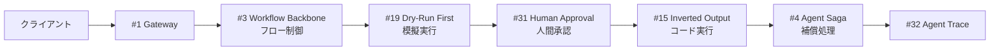

# 2. 副作用重視構成

!!! abstract "一言"
    不可逆な操作を含むシステムで、失敗時の巻き戻しと人間承認を組み込んだ7層構成。

## このアーキテクチャが必要になるとき

エージェントがメールを送信する、決済を実行する、データベースのレコードを更新する——こうした「取り消せない操作」を含むシステムでは、LLMの判断ミスが直接的な損害につながります。

典型的な場面としては、ECサイトの注文処理エージェント、顧客対応で返金処理を自動化するカスタマーサポートbot、CRMのデータを更新する営業支援ツールなどが挙げられます。いずれも `[F1]` 可逆性が低く、`[F2]` 失敗コストが高い状況です。

この構成の要は「LLMには判断させるが、実行はコードが行う」という分離原則です。さらに、高リスク操作の前には人間の承認を挟み、失敗時にはSagaパターンで補償処理を走らせます。防御的に見えますが、不可逆な操作を扱う以上、この程度のガードは必須です。

## フォース評価

| フォース | 評価 | この構成での意味 |
|---------|------|----------------|
| `[F1]` 可逆性 | 低 | メール送信・決済など取り消せない操作がある |
| `[F2]` 失敗コスト | 高 | 誤った操作が金銭的損害や信頼喪失につながる |
| `[F3]` 1リクエストの価値 | 中〜高 | 1件の処理が実際の業務に直結する |
| `[F4]` レイテンシ予算 | 中〜高 | 承認待ちを含むため、即応性よりも安全性を優先 |
| `[F5]` 入力の信頼度 | 中 | 社内オペレーターからの入力が多いが、誤入力のリスクはある |
| `[F6]` タスクの変動性 | 低〜中 | 業務フローが比較的固定されている |
| `[F7]` コスト感度 | 中 | 安全のための追加呼び出しはコストより優先 |
| `[F8]` 説明責任 | 中〜高 | 操作の記録と追跡が求められる |
| `[F9]` プロバイダ信頼度 | 中 | フォールバックがあると安心だが必須ではない |

## 構成図

## 構成パターン一覧

| 層 | パターン | 役割 | なぜ必要か |
|---|---------|------|-----------|
| 受付 | [#1 Request-to-Job Gateway](../patterns/01-execution/01-request-to-job-gateway.md) | 非同期受付 | 承認待ちを含むため処理が長時間になります |
| 骨格 | [#3 Workflow Backbone + Agent Node](../patterns/01-execution/03-workflow-backbone-agent-node.md) | 決定論的なフロー制御 | 副作用の実行順序をLLMの気まぐれに任せられません |
| 補償 | [#4 Agent Saga](../patterns/01-execution/04-agent-saga.md) | 失敗時の巻き戻し | 途中で失敗したとき、実行済みの操作を補償する手段がないとデータが不整合になります |
| 承認 | [#31 Human Approval Checkpoint](../patterns/06-reliability/31-human-approval-checkpoint.md) | 高リスク操作前の人間承認 | 不可逆な操作を機械だけで実行させるのはリスクが高すぎます |
| ツール | [#19 Dry-Run First Tool Execution](../patterns/04-tools-mcp/19-dry-run-first-tool-execution.md) | 副作用の模擬実行 | 実行前に「何が起きるか」を確認できないと、承認者も判断できません |
| 出力 | [#15 Inverted Structured Output](../patterns/03-io-contract/15-inverted-structured-output.md) | LLMは判断のみ、実行はコード | LLMが直接APIを叩く構成だと、パラメータの誤りを防げません |
| 観測 | [#32 Agent Trace](../patterns/07-observability/32-agent-trace.md) | 全操作の追跡 | 何を実行したかの監査証跡がないと、問題発生時に原因を特定できません |

## 各層の詳細

### 受付層 — Request-to-Job Gateway

副作用を含む処理は、人間の承認待ちやSaga補償を含むため、数分〜数時間かかることがあります。同期的なHTTP接続では持たないため、非同期ジョブとして管理します。クライアントにはジョブIDを返し、進捗をポーリングまたはWebhookで通知します。

### 骨格層 — Workflow Backbone + Agent Node

「在庫確認→見積作成→承認→決済→通知」のような業務フローを、決定論的なワークフローエンジンで制御します。各ノードでLLMを呼ぶことはあっても、フローの分岐や順序はコードが決めます。この層がないと、LLMがステップを飛ばしたり順序を間違えたりするリスクがあります。

### 補償層 — Agent Saga

マルチステップの処理が途中で失敗したとき、既に実行した操作の補償（取り消しに相当する逆操作）を実行します。たとえば、決済が成功した後に在庫引当が失敗した場合、決済の返金処理を走らせます。この層がないと、データの不整合が放置されます。

### 承認層 — Human Approval Checkpoint

金額が閾値を超える決済や、外部への情報送信など、高リスクと判定された操作の前に人間の承認を挟みます。Dry-Run Firstの結果を承認者に提示し、「この操作を実行してよいか」を確認します。この層がないと、LLMの誤判断が直接損害につながります。

### ツール層 — Dry-Run First Tool Execution

実際の操作を行う前に、模擬実行（dry-run）で「何が起きるか」をプレビューします。承認者はdry-runの結果を見て判断できます。この層がないと、承認者に提示できる情報が「LLMがこう言っている」だけになり、承認が形骸化します。

### 出力層 — Inverted Structured Output

LLMが出力するのは「実行すべき操作の宣言」であり、実際のAPI呼び出しはコードが行います。LLMが直接外部APIを叩く構成だと、パラメータの型ミスや値域外の値を防げません。コード側でバリデーションをかけることで安全性を担保します。

### 観測層 — Agent Trace

全てのLLM呼び出し、ツール実行、承認判断、Saga補償をトレースとして記録します。問題発生時に「いつ・誰が・何を承認し・何が実行されたか」を追跡できます。この層がないと、インシデント対応が勘と記憶に頼ることになります。

## 省略してよいもの・追加を検討するもの

- **省略可**: 全操作が低リスクの場合はHuman Approval Checkpointを閾値ベースに緩められます。補償が不要な冪等操作のみならAgent Sagaも省略可能です
- **追加検討**: `[F5]` が低い場合は[信頼できない入力構成](03-untrusted-input.md)のセキュリティ層を重ねます。`[F8]` が高まったら [#33 Version Pinning](../patterns/07-observability/33-version-pinning.md) で再現性を確保します

## 具体的なシナリオ

ECサイトの注文処理エージェントを考えます。カスタマーサポート担当者が「顧客Aの注文#1234をキャンセルし、返金処理を行う」と指示します。

Request-to-Job Gatewayがジョブを受け付け、Workflow Backboneが「注文情報取得→キャンセル可否判定→返金額計算→承認→返金実行→顧客通知」のフローを開始します。LLMは注文情報と返品ポリシーを照合してキャンセル可否を判定し、返金額をInverted Structured Outputとして宣言します。

Dry-Run Firstが「返金額: 12,800円、返金先: クレジットカード末尾1234」をプレビューし、Human Approval Checkpointが担当者に承認を求めます。承認後、コードが決済APIの返金エンドポイントを叩き、通知メールを送信します。もし返金APIが失敗した場合、Agent Sagaがキャンセルステータスを元に戻す補償処理を実行します。全工程はAgent Traceに記録され、後から監査できます。

## 発展パス

- `[F5]` が低下したら → [信頼できない入力構成](03-untrusted-input.md)のData Boundary Firewall、Dual-LLM分離を追加します
- `[F7]` が高まったら → [コスト重視構成](05-cost-first.md)のルーティングで低リスク操作を軽量モデルに振り分けます
- `[F8]` が高まったら → [継続改善運用構成](06-continuous-improvement.md)のEvaluation CI/CDで回帰検知を導入します
- 自律度を上げたい場合 → [#57 Autonomy Ladder](../patterns/06-reliability/57-autonomy-ladder.md) で段階的に承認を省略します

## 関連する構成

- [最小構成（MVP）](01-mvp.md) — この構成の土台です。MVP層に副作用ガードを追加した形です
- [信頼できない入力構成](03-untrusted-input.md) — 外部ユーザーからの入力を受ける場合に重ねます
- [事実性重視構成](04-factuality-first.md) — 判断の正確性も求められる場合に組み合わせます
