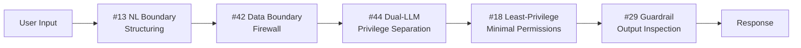

# 3. Untrusted Input Configuration

!!! abstract "TL;DR"
    A 6-layer configuration centered on boundary defense and privilege separation for safely processing input from untrusted users.

## When This Architecture Is Needed

The agent is exposed to the public. Any number of end users can freely input natural language. In this case, inputs may include prompt injection, PII (personally identifiable information), and intentional abuse.

This applies broadly to situations where `[F5]` input trust is low — SaaS chat support, AI assistants offered as public APIs, and AI features in consumer-facing apps. Even for internal tools, once the user base exceeds several hundred, input diversity increases dramatically and should effectively be treated as "untrusted input."

The core of this configuration is operating from the premise that "input is not to be trusted." While accepting untrusted input, it minimizes impact on the overall system by combining boundary inspection, LLM privilege separation, and blast radius limitation in multiple layers.

## Force Assessment

| Force | Rating | Meaning in This Configuration |
|---------|------|----------------|
| `[F1]` Reversibility | Medium | Input-caused damage needs to be contained |
| `[F2]` Failure Cost | Medium-High | Successful injection attacks can lead to data leakage |
| `[F3]` Per-Request Value | Low-Medium | Often a high-volume processing scenario |
| `[F4]` Latency Budget | Medium | Some overhead from inspection layers is tolerable |
| `[F5]` Input Trust | Low | Natural language input from untrusted users |
| `[F6]` Task Variability | Medium-High | Diverse user intents |
| `[F7]` Cost Sensitivity | Medium | Additional calls for security take priority over cost |
| `[F8]` Accountability | Medium | Tracking during security incidents is needed |
| `[F9]` Provider Reliability | — | Not directly related to security |

## Architecture Diagram

## Configuration Pattern List

| Layer | Pattern | Role | Why It's Needed |
|---|---------|------|-----------|
| Boundary | [#13 Natural Language Boundary Adapter](../glossary.md) | Input structuring | Passing natural language directly to the LLM blurs the boundary between instructions and input, making injection easier |
| Inspection | [#42 Data Boundary Firewall](../glossary.md) | PII/injection inspection | Without pre-detecting and removing PII or malicious prompts from input, leakage and malfunction occur downstream |
| Separation | [#44 Dual-LLM Privilege Separation](../glossary.md) | Isolated LLM and privileged LLM separation | Without separating the LLM handling user input from the LLM with tool execution privileges, injection can directly manipulate tools |
| Permissions | [#18 Least-Privilege Tool Binding](../glossary.md) | Least privilege | Granting full access to all tools allows unlimited damage |
| Blast Radius | [#43 Confused-Deputy Damage Limitation](../glossary.md) | Blast radius limitation | Even with minimum privileges, damage can occur within the remaining permission scope. Set caps on operation rates, affected record counts, and amounts |
| Guardrail | [#29 Guardrail Sidecar + Self-Correction](../glossary.md) | Output inspection | Both input and output need inspection. Attackers have techniques to extract information through output |

## Layer Details

### Boundary Layer — Natural Language Boundary Adapter

Converts the user's natural language input into a structured format (intent, entities, parameters). This clarifies the boundary between "data" and "instructions" passed to downstream LLMs. Without this layer, user input mixes with system prompts, creating a primary attack surface for injection.

### Inspection Layer — Data Boundary Firewall

Inspects both input and output for PII leakage, known injection patterns, and sensitive data contamination. Detection rules typically combine pattern matching and classification models. Without this layer, credit card numbers unintentionally included by users or injection strings planted by attackers reach the LLM directly.

### Separation Layer — Dual-LLM Privilege Separation

Separates the "isolated LLM" that directly handles user input from the "privileged LLM" with tool execution authority. The isolated LLM only interprets user intent and has no access to external APIs or databases. The privileged LLM receives only structured output from the isolated LLM. Without this layer, sophisticated injection could allow attackers to directly manipulate tools.

### Permissions Layer — Least-Privilege Tool Binding

Limits tools exposed to the agent to the bare minimum required for the task. For example, an agent that only needs "customer data lookup" is not given "customer data deletion" permission. Without this layer, in the event of a breach, the scope of tools available to an attacker is unnecessarily broad.

### Blast Radius Layer — Confused-Deputy Damage Limitation

Even with minimum privileges, damage can still occur within the remaining permission scope. This layer sets operation rate limits, caps on affected record counts per operation, and amount limits. Without this layer, mass data deletion or high-value payments could be executed at once, even within authorized permissions.

### Guardrail Layer — Guardrail Sidecar + Self-Correction

Inspects LLM output for sensitive information leakage, inappropriate content, and policy violations. When violations are detected, the output is replaced or self-correction is attempted. Without this layer, there's no last line of defense if input-side protection is breached.

## What Can Be Omitted / What to Consider Adding

- **Can omit**: If the input source is limited to authenticated internal users only, Dual-LLM separation can be simplified (though complete omission is not recommended)
- **Consider adding**: In multi-tenant environments, add [#41 Tenant-Isolated Agent Runtime](../glossary.md) for tenant isolation. When side effects are involved, layer [Side-Effect-First Configuration](02-side-effect-first.md) Saga and approval layers

## Concrete Scenario

Consider AI chat support provided by a BtoC SaaS. End users number in the tens of thousands per month. They ask product questions, request contract changes, and report issues in natural language.

User input is first structured by the Natural Language Boundary Adapter. Input like "I want to cancel my contract. My credit card number is 1234-5678-..." is decomposed into intent="cancellation," PII detected="credit card number present." The Data Boundary Firewall masks the credit card number and runs injection checks.

The structured intent passes to the Dual-LLM isolated LLM. The isolated LLM determines it's a "cancellation request" and sends structured output to the privileged LLM. The privileged LLM is bound via Least-Privilege to only "contract lookup" and "cancellation request creation" tools — it has no access to tools like "bulk delete all contracts." Confused-Deputy Damage Limitation restricts processing to 1 cancellation per session. The final response is inspected by the Guardrail Sidecar to confirm no internal system information is leaked before being returned to the user.

## Evolution Path

- If `[F2]` increases -> Add [Side-Effect-First Configuration](02-side-effect-first.md) Human Approval and Agent Saga
- If `[F7]` increases -> Reuse inspected queries with [Cost-First Configuration](05-cost-first.md) Semantic Cache
- If `[F8]` increases -> Automate security-related regression tests with [Continuous Improvement Configuration](06-continuous-improvement.md)
- As attack patterns evolve -> Manage rules as code with [#30 Policy-as-Code Guardrail](../glossary.md) for rapid updates

## Related Configurations

- [Side-Effect-First Configuration](02-side-effect-first.md) — Layer when irreversible operations are involved
- [Factuality-First Configuration](04-factuality-first.md) — Combine when there's risk of attackers inducing misinformation
- [Minimal Configuration (MVP)](01-mvp.md) — MVP is sufficient for internal-only, trusted-user scenarios
