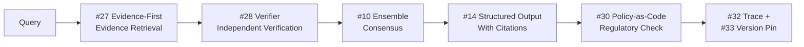

# 4. Factuality-First Configuration

!!! abstract "TL;DR"
    A 6-layer configuration combining evidence retrieval, independent verification, and ensemble consensus for domains where hallucination is unacceptable.

## When This Architecture Is Needed

Medical information provision, legal document review, financial product explanations — in these domains, an LLM generating "plausible but incorrect information" can lead to catastrophic consequences. Beyond regulated industries, this configuration is a candidate whenever "you are held accountable for answer accuracy."

When `[F2]` failure cost is high and `[F8]` accountability is required, LLM output cannot be trusted at face value. Evidence is retrieved first, an independent verifier agent cross-checks, and when necessary, multiple models reach consensus. It may appear excessive, but in domains where a single piece of misinformation can lead to lawsuits or health risks, this multi-layered defense is justified.

## Force Assessment

| Force | Rating | Meaning in This Configuration |
|---------|------|----------------|
| `[F1]` Reversibility | Medium | Information can be retracted, but actions based on misinformation cannot |
| `[F2]` Failure Cost | High | Incorrect information can lead to lawsuits, health damage, or financial loss |
| `[F3]` Per-Request Value | High | Each answer is used for important decision-making |
| `[F4]` Latency Budget | High | Tens of seconds to minutes of wait is tolerable for accuracy |
| `[F5]` Input Trust | Medium-High | Often from domain experts, but ambiguous questions exist |
| `[F6]` Task Variability | Medium | Domain-specific but with a broad range of questions |
| `[F7]` Cost Sensitivity | Low-Medium | Additional costs for accuracy are tolerable |
| `[F8]` Accountability | High | Disclosure of evidence and reasoning process is required |
| `[F9]` Provider Reliability | Medium | Multi-provider may be prerequisite when using ensemble with multiple models |

## Architecture Diagram

## Configuration Pattern List

| Layer | Pattern | Role | Why It's Needed |
|---|---------|------|-----------|
| Evidence | [#27 Evidence-First Answer](../decisions/tradeoffs-catalog/rag-vs-finetuning.md) | Retrieve evidence before answering | Answers without evidence are a breeding ground for hallucination |
| Verification | [#28 Verifier Agent / Critic](../decisions/tradeoffs-catalog/inline-vs-post-verification.md) | Independent fact verification | The generating agent cannot be expected to catch its own errors |
| Consensus | [#10 Agent Ensemble & Debate](../decisions/tradeoffs-catalog/same-vs-different-model.md) | Multi-model consensus | Mutual cross-checking mitigates single-model biases |
| Contract | [#14 Structured Output Contract](../decisions/tradeoffs-catalog/structured-vs-freeform.md) | Structured output with citations | Without structurally separating evidence from answers, citations can't be verified |
| Policy | [#30 Policy-as-Code Guardrail](../decisions/tradeoffs-catalog/prompt-vs-code.md) | Automated regulatory compliance check | Manual compliance verification doesn't scale |
| Observability | [#32 Agent Trace](../decisions/dials/trace-sampling-rate.md) + [#33 Version Pinning](../decisions/dials/prompt-storage.md) | Complete audit trail | Being able to reproduce "why that answer was generated" after the fact is required |

## Layer Details

### Evidence Layer — Evidence-First Answer

Before having the LLM generate an answer, relevant evidence (documents, database records, external sources) is retrieved first. The LLM constructs its answer based solely on retrieved evidence. Without this layer, outdated or incorrect information from the LLM's training data becomes the answer directly. RAG (Retrieval-Augmented Generation) is the typical implementation of this layer.

### Verification Layer — Verifier Agent / Critic

The generated answer is verified by a separate agent independent from the generating agent. It checks consistency between evidence and answer, logical coherence, and factual accuracy. Without this layer, the LLM's "confidently wrong" outputs go directly to output. Since the same biases apply when the same LLM handles both generation and verification, independence is crucial.

### Consensus Layer — Agent Ensemble & Debate

Multiple models (different providers or different prompt strategies) answer the same question, and answer consistency is checked. When disagreements exist, a Debate process cross-references evidence and adopts the answer with the strongest supporting evidence. Without this layer, systematic biases of a single model cannot be detected. This layer trades cost for reliability and is especially effective when `[F3]` is high.

### Contract Layer — Structured Output Contract

Answers are structured into "conclusion," "evidence (citation locations)," "confidence level," and "caveats." Users and downstream systems can independently verify the evidence. Without this layer, LLM answers remain as "plausible text" where fact and inference can't be distinguished.

### Policy Layer — Policy-as-Code Guardrail

Automatically checks compliance with industry regulations and internal policies. For example, detecting "whether definitive language is used about drug efficacy" or "whether expressions constitute investment advice" via rule-based checks. Without this layer, compliance verification depends on manual effort and doesn't scale.

### Observability Layer — Agent Trace + Version Pinning

All LLM calls, evidence retrieval, verification results, and consensus processes are recorded as traces. Version Pinning fixes model version, prompt version, and evidence data version, ensuring answer reproducibility. Without this layer, "regenerating the same answer under the same conditions from 3 months ago" is impossible, and audit requirements can't be met.

## What Can Be Omitted / What to Consider Adding

- **Can omit**: When `[F3]` is low (high volume, low value per request), the consensus layer cost may not be justified. Verifier Agent alone may suffice
- **Consider adding**: When accepting input from untrusted users, layer [Untrusted Input Configuration](03-untrusted-input.md) security layers. For high-risk answers, insert expert review with [#31 Human Approval Checkpoint](../decisions/dials/autonomy-level.md)

## Concrete Scenario

Consider a contract review support agent for a legal department. A lawyer uploads a contract and asks: "Are there any risky clauses in this contract?"

Evidence-First Answer first searches the internal case law database and regulatory guidelines to retrieve relevant evidence. The generating agent produces an answer based on the evidence: "Article 5's liability cap clause has the following risks." The Verifier Agent independently verifies whether cited case law exists and whether the clause interpretation is correct.

Agent Ensemble submits the same question to another model and checks answer consistency. For clauses with disagreement, evidence is cross-referenced and the answer with higher confidence is adopted. Output follows the Structured Output Contract, structured into "Risk clauses," "Evidence (case law/guideline citations)," "Confidence level," and "Recommended actions." The Policy-as-Code Guardrail checks for "definitive expressions that constitute legal advice" and softens language if issues are found. The entire process is recorded in the Agent Trace, and Version Pinning enables re-verification under the same conditions.

## Evolution Path

- If `[F1]` decreases -> Add [Side-Effect-First Configuration](02-side-effect-first.md) approval and Saga (e.g., when auto-correcting contracts based on answers)
- If `[F7]` increases -> Reuse similar question answers with [Cost-First Configuration](05-cost-first.md) Semantic Cache to reduce consensus costs
- If `[F5]` decreases -> Layer [Untrusted Input Configuration](03-untrusted-input.md) security layers
- Once operations stabilize -> Auto-detect answer quality regression with [Continuous Improvement Configuration](06-continuous-improvement.md) Evaluation CI/CD

## Related Configurations

- [Side-Effect-First Configuration](02-side-effect-first.md) — Combine when automated actions based on answers are included
- [Continuous Improvement Configuration](06-continuous-improvement.md) — Essential for continuous monitoring of answer quality
- [Cost-First Configuration](05-cost-first.md) — Reference when optimizing consensus layer costs
