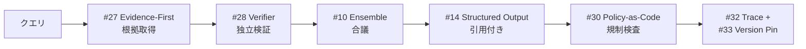

# 4. 事実性重視構成

!!! abstract "一言"
    ハルシネーションが許されない領域で、根拠取得・独立検証・合議を組み合わせた6層構成。

## このアーキテクチャが必要になるとき

医療情報の提供、法務文書のレビュー、金融商品の説明——これらの領域では、LLMが「もっともらしいが誤った情報」を生成することが致命的な結果を招きます。規制業種に限らず、「回答の正確性について責任を問われる」場面では全てこの構成が候補になります。

`[F2]` 失敗コストが高く、`[F8]` 説明責任が求められる状況では、LLMの出力をそのまま信頼できません。根拠を先に取得し、独立した検証エージェントでクロスチェックし、必要に応じて複数モデルの合議で判断します。一見すると過剰に見えますが、1件の誤情報が訴訟や健康被害につながりうる領域では、この多重防御が合理的です。

## フォース評価

| フォース | 評価 | この構成での意味 |
|---------|------|----------------|
| `[F1]` 可逆性 | 中 | 情報提供自体は取り消せるが、誤情報に基づく行動は取り消せない |
| `[F2]` 失敗コスト | 高 | 誤った情報が訴訟・健康被害・金銭損害につながる |
| `[F3]` 1リクエストの価値 | 高 | 1件の回答が重要な意思決定に使われる |
| `[F4]` レイテンシ予算 | 高 | 正確性のためなら数十秒〜数分の待ちは許容される |
| `[F5]` 入力の信頼度 | 中〜高 | 専門家からの入力が多いが、曖昧な質問もある |
| `[F6]` タスクの変動性 | 中 | ドメイン固有だが質問の範囲は広い |
| `[F7]` コスト感度 | 低〜中 | 正確性のための追加コストは許容される |
| `[F8]` 説明責任 | 高 | 回答の根拠と判断過程の開示が求められる |
| `[F9]` プロバイダ信頼度 | 中 | 合議で複数モデルを使う場合、多プロバイダが前提になりうる |

## 構成図

## 構成パターン一覧

| 層 | パターン | 役割 | なぜ必要か |
|---|---------|------|-----------|
| 根拠 | [#27 Evidence-First Answer](../glossary.md) | 回答前に根拠取得 | 根拠なしの回答はハルシネーションの温床になります |
| 検証 | [#28 Verifier Agent / Critic](../glossary.md) | 独立した事実検証 | 生成エージェントが自分の誤りに気づくことは期待できません |
| 合議 | [#10 Agent Ensemble & Debate](../glossary.md) | 複数モデルの合議 | 単一モデルのバイアスを相互チェックで緩和します |
| 契約 | [#14 Structured Output Contract](../glossary.md) | 出力の構造化・引用付き | 根拠と回答を構造的に分離しないと、引用の検証ができません |
| ポリシー | [#30 Policy-as-Code Guardrail](../glossary.md) | 規制準拠の自動検査 | 人手での準拠確認はスケールしません |
| 観測 | [#32 Agent Trace](../glossary.md) + [#33 Version Pinning](../glossary.md) | 完全な監査証跡 | 「あの回答はなぜ生成されたか」を後から再現できる必要があります |

## 各層の詳細

### 根拠層 — Evidence-First Answer

LLMに回答を生成させる前に、まず関連する根拠（ドキュメント、データベースレコード、外部ソース）を取得します。LLMは取得された根拠に基づいてのみ回答を構成します。この層がないと、LLMの学習データに含まれる古い情報や誤った情報がそのまま回答になります。RAG（Retrieval-Augmented Generation）はこの層の代表的な実装です。

### 検証層 — Verifier Agent / Critic

生成された回答を、生成エージェントとは独立した別のエージェントが検証します。根拠と回答の整合性、論理の一貫性、事実の正確性をチェックします。この層がないと、LLMの「自信満々な誤り」がそのまま出力されます。生成と検証を同一のLLMが行うと、同じバイアスで検証をスキップしやすいため、独立性が重要です。

### 合議層 — Agent Ensemble & Debate

複数のモデル（異なるプロバイダや異なるプロンプト戦略）で同じ質問に回答させ、回答の一致度を確認します。不一致がある場合はDebateプロセスで根拠を突き合わせ、最も根拠の強い回答を採用します。この層がないと、単一モデルの系統的バイアスを検出できません。コストと引き換えに信頼性を得る層であり、`[F3]` が高い場面で特に有効です。

### 契約層 — Structured Output Contract

回答を「結論」「根拠（引用箇所）」「確信度」「注意事項」に構造化して出力します。ユーザーや下流システムが根拠を独立に検証できるようになります。この層がないと、LLMの回答が「もっともらしい文章」のままで、どこが事実でどこが推論かを区別できません。

### ポリシー層 — Policy-as-Code Guardrail

業界規制や社内ポリシーへの準拠を自動で検査します。たとえば「医薬品の効能について断定的表現を使っていないか」「投資助言に該当する表現がないか」をルールベースで検出します。この層がないと、規制準拠の確認が人手に依存し、スケールしません。

### 観測層 — Agent Trace + Version Pinning

全てのLLM呼び出し、根拠取得、検証結果、合議過程をトレースとして記録します。Version Pinningにより、モデルバージョン・プロンプトバージョン・根拠データのバージョンを固定し、回答の再現性を確保します。この層がないと、「3ヶ月前の回答を同じ条件で再生成する」ことができず、監査要件を満たせません。

## 省略してよいもの・追加を検討するもの

- **省略可**: `[F3]` が低い（大量・低単価のリクエスト）場合、合議層のコストが見合いません。Verifier Agentのみで十分なケースもあります
- **追加検討**: 不特定ユーザーからの入力を受ける場合は[信頼できない入力構成](03-untrusted-input.md)のセキュリティ層を重ねます。高リスクな回答には [#31 Human Approval Checkpoint](../glossary.md) で専門家レビューを挟みます

## 具体的なシナリオ

法務部門向けの契約レビュー支援エージェントを考えます。弁護士が契約書をアップロードし、「この契約にリスクのある条項はあるか」と質問します。

Evidence-First Answerがまず社内の判例データベースと規制ガイドラインを検索し、関連する根拠を取得します。生成エージェントが根拠に基づいて「第5条の損害賠償上限条項に以下のリスクがある」と回答を生成します。Verifier Agentが、引用された判例が実在するか、条文の解釈が正しいかを独立に検証します。

Agent Ensembleが別のモデルにも同じ質問を投げ、回答の一致度を確認します。不一致がある条項については、根拠を突き合わせたうえで、確信度が高い方を採用します。出力はStructured Output Contractに従い、「リスク条項」「根拠（判例・ガイドライン引用）」「確信度」「推奨アクション」に構造化されます。Policy-as-Code Guardrailが「法的助言に該当する断定的表現がないか」を検査し、問題があれば表現を緩和します。全過程はAgent Traceに記録され、Version Pinningにより同じ条件での再検証が可能です。

## 発展パス

- `[F1]` が低下したら → [副作用重視構成](02-side-effect-first.md)の承認・Sagaを追加します（回答に基づいて契約を自動修正する場合など）
- `[F7]` が高まったら → [コスト重視構成](05-cost-first.md)のSemantic Cacheで類似質問の回答を再利用し、合議のコストを抑えます
- `[F5]` が低下したら → [信頼できない入力構成](03-untrusted-input.md)のセキュリティ層を重ねます
- 運用が安定したら → [継続改善運用構成](06-continuous-improvement.md)のEvaluation CI/CDで回答品質の回帰を自動検知します

## 関連する構成

- [副作用重視構成](02-side-effect-first.md) — 回答に基づく自動アクションを含む場合に組み合わせます
- [継続改善運用構成](06-continuous-improvement.md) — 回答品質の継続的なモニタリングに不可欠です
- [コスト重視構成](05-cost-first.md) — 合議のコストを最適化する場合に参照します
