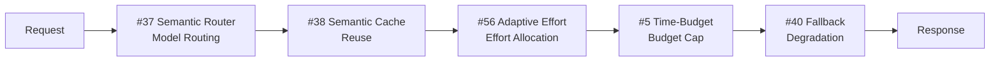

# 5. Cost-First Configuration

!!! abstract "TL;DR"
    A 6-layer configuration combining routing, caching, and effort allocation for processing high-volume requests at low cost.

## When This Architecture Is Needed

At the prototype stage, there was no need to worry about LLM API costs. But as user count grows and you're processing tens to hundreds of thousands of requests per month, the situation changes. Even if per-request cost is small, the accumulation causes monthly costs to spike rapidly.

Typical scenarios include AI chat features in BtoC apps, company-wide knowledge search for all employees, and batch jobs processing large document volumes. All are situations where `[F7]` cost sensitivity is high and per-request value (`[F3]`) is relatively low.

The philosophy of this configuration is "don't invest the same compute resources in every request." Simple questions go to lightweight models, similar questions are served from cache, and only difficult questions get the high-performance model. By adaptively allocating effort, costs are reduced without significantly compromising quality.

## Force Assessment

| Force | Rating | Meaning in This Configuration |
|---------|------|----------------|
| `[F1]` Reversibility | High | Answer errors can be addressed by regeneration |
| `[F2]` Failure Cost | Low-Medium | Individual request failures are not critical |
| `[F3]` Per-Request Value | Low | High-volume processing at low unit price |
| `[F4]` Latency Budget | Medium | Fast on cache hit, some delay tolerable on miss |
| `[F5]` Input Trust | Medium-High | Cost optimization and security are orthogonal |
| `[F6]` Task Variability | Low-Medium | Similar requests are repeated |
| `[F7]` Cost Sensitivity | High | Strict monthly cost cap, or high request volume |
| `[F8]` Accountability | Low | Cost optimization is the primary goal, low audit requirements |
| `[F9]` Provider Reliability | Medium-High | Fallback targets need to be secured since multiple models are used |

## Architecture Diagram

## Configuration Pattern List

| Layer | Pattern | Role | Why It's Needed |
|---|---------|------|-----------|
| Routing | [#37 Semantic Gateway & Cost-Aware Router](../patterns/08-cost-scaling/37-semantic-gateway-cost-aware-router.md) | Difficulty-based model routing | Processing all requests with a high-performance model causes linear cost growth |
| Cache | [#38 Semantic Result Cache](../patterns/08-cost-scaling/38-semantic-result-cache.md) | Similar query reuse | When the same types of questions repeat, there's no need to call the LLM |
| Prompt | [#39 Prompt Cache Optimized Context](../patterns/08-cost-scaling/39-prompt-cache-optimized-context.md) | Prefix sharing for cache | Cache common portions of system prompts and context to reduce input token charges |
| Effort Allocation | [#56 Adaptive Effort](../patterns/08-cost-scaling/56-adaptive-effort.md) | Difficulty-based compute adjustment | Running long Chain-of-Thought for easy questions is wasteful |
| Budget | [#5 Time-Budgeted Agent Loop](../patterns/01-execution/05-time-budgeted-agent-loop.md) | Per-request caps | Without budgets, a runaway request can consume the entire monthly budget |
| Fallback | [#40 Fallback & Graceful Degradation](../patterns/08-cost-scaling/40-fallback-graceful-degradation.md) | Degradation during failures | Prevent all requests from failing when the high-performance model goes down |

## Layer Details

### Routing Layer — Semantic Gateway & Cost-Aware Router

Analyzes request content and routes to appropriate models based on difficulty and type. FAQ-like questions go to lightweight, inexpensive models, while questions requiring complex reasoning go to high-performance models. Without this layer, even "What's the weather today?" uses the most powerful model, resulting in extremely poor cost efficiency.

### Cache Layer — Semantic Result Cache

Returns answers for semantically similar queries from cache. Since it uses embedding vector similarity rather than exact match, questions with only different phrasing still hit. Without this layer, "How to install Python" and "How do I install Python" each trigger separate LLM calls. Balancing cache TTL (expiration) and hit rate is the key operational consideration.

### Prompt Layer — Prompt Cache Optimized Context

Reuses common portions of system prompts and RAG-retrieved context through the LLM provider's prompt cache feature. By fixing the prefix portion and varying only the user-specific part, input token charges are significantly reduced. Without this layer, the same system prompt token charges occur on every request.

### Effort Allocation Layer — Adaptive Effort

Pre-estimates request difficulty and adaptively adjusts compute effort (reasoning steps, tool call count, etc.). Easy questions get zero-shot instant answers, and only difficult questions trigger Chain-of-Thought or ReAct loops. Without this layer, the same compute is invested in every request, wasting resources on easy questions.

### Budget Layer — Time-Budgeted Agent Loop

Sets per-request caps on LLM call count, token count, and execution time. When approaching the budget limit, partial results are returned or the system falls back to a lower-cost model. Without this layer, a single runaway request can consume most of the monthly budget.

### Fallback Layer — Fallback & Graceful Degradation

During high-performance model API outages or rate limit exhaustion, falls back to alternative models or rule-based answers. Even if a complete answer can't be provided, returning a partial answer with "Answer quality may be lower than usual" is a better user experience than an error screen. Without this layer, provider outages directly cause complete service stoppage.

## What Can Be Omitted / What to Consider Adding

- **Can omit**: At low request volumes (under a few thousand per month), Semantic Cache and Prompt Cache Optimized Context have limited impact. The routing layer alone can be deployed first
- **Consider adding**: If `[F2]` increases, layer [Side-Effect-First Configuration](02-side-effect-first.md) safety layers. If `[F9]` increases, ease provider switching with [#45 Agent Runtime Abstraction](../patterns/10-deployment/45-agent-runtime-abstraction.md)

## Concrete Scenario

Consider a knowledge search AI used by 1,000 internal employees. Monthly request volume is 100,000. Content from internal Wiki, Confluence, and Google Drive is searched via RAG to return answers. Monthly LLM API budget is 500,000 yen.

The Semantic Gateway receives requests and classifies them. Routine questions like "What are the cafeteria hours?" (40% of total) are routed to a lightweight model (GPT-4o mini class). The Semantic Result Cache checks for similar past answers, with a 30% hit rate returning instant responses. This alone handles 58% of all requests without full LLM calls.

For the remaining 42% of requests, Adaptive Effort estimates difficulty. Questions answerable with simple RAG search (25%) get zero-shot answers, while those requiring cross-document analysis (17%) undergo multi-step reasoning. Time-Budgeted Agent Loop sets caps on each request to prevent runaway processing. During high-performance model API outages, Fallback substitutes with a lightweight model plus a note: "Answer quality may be lower than usual."

With this configuration, monthly costs can be reduced by 60-70% compared to processing all requests with a high-performance model.

## Evolution Path

- If `[F2]` increases -> Add [Side-Effect-First Configuration](02-side-effect-first.md) safety layers (when evolving from knowledge search to action execution)
- If `[F8]` increases -> Evaluate whether cost reduction is impacting quality with [Continuous Improvement Configuration](06-continuous-improvement.md)
- If `[F9]` increases -> Strengthen multi-provider operations with [#45 Agent Runtime Abstraction](../patterns/10-deployment/45-agent-runtime-abstraction.md) and [#46 Model Behavior Compatibility Layer](../patterns/10-deployment/46-model-behavior-compatibility-layer.md)
- If cache hit rate drops -> Optimize context structure with [#24 Context Pack / Assembly](../patterns/05-memory-context/24-context-pack-assembly.md)

## Related Configurations

- [Minimal Configuration (MVP)](01-mvp.md) — The MVP foundation is needed before cost optimization
- [Factuality-First Configuration](04-factuality-first.md) — This configuration's techniques can optimize consensus layer costs
- [Continuous Improvement Configuration](06-continuous-improvement.md) — Monitor whether cost reduction is causing quality degradation
