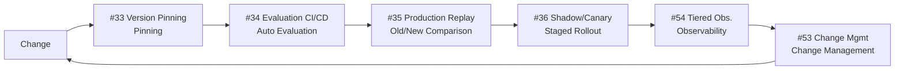

# 6. Continuous Improvement Configuration

!!! abstract "TL;DR"
    A 6-layer configuration combining version management, evaluation, and deployment for maintaining and improving quality after production launch.

## When This Architecture Is Needed

Once an agent starts running in production, new challenges emerge. Model version upgrades change answer quality. A prompt improvement intended to help causes degradation in other cases. Production traffic patterns differ from pre-launch testing.

This configuration addresses "problems that only become visible after production launch." In environments with high `[F8]` accountability — finance, healthcare, legal, or simply "products that can't compromise on quality" — equal or greater effort must be invested in operational improvement compared to initial construction.

The principle of this configuration is building "a system for making changes safely and continuously." Version-control all components, run automated evaluation on every change, and deploy incrementally. Achieve operations that "detect before breaking" rather than "fix after breaking."

## Force Assessment

| Force | Rating | Meaning in This Configuration |
|---------|------|----------------|
| `[F1]` Reversibility | Medium | Version management enables rollback |
| `[F2]` Failure Cost | Medium-High | Quality degradation directly impacts user experience and trust |
| `[F3]` Per-Request Value | Medium | Overall quality trends matter more than individual requests |
| `[F4]` Latency Budget | — | Operational layer doesn't directly affect latency |
| `[F5]` Input Trust | — | Orthogonal to operational improvement |
| `[F6]` Task Variability | Medium-High | Accommodate production traffic diversity |
| `[F7]` Cost Sensitivity | Medium | Observability costs themselves need optimization |
| `[F8]` Accountability | High | Quality maintenance and improvement must be demonstrated quantitatively |
| `[F9]` Provider Reliability | Medium | Prepare for quality fluctuations from model updates |

## Architecture Diagram

## Configuration Pattern List

| Layer | Pattern | Role | Why It's Needed |
|---|---------|------|-----------|
| Pinning | [#33 Version Pinning](../patterns/07-observability/33-version-pinning.md) | Reproducibility assurance | Without fixed model, prompt, and data versions, "when quality changed" can't be identified |
| Evaluation | [#34 Evaluation CI/CD](../patterns/07-observability/34-evaluation-ci-cd.md) | Automated regression detection per change | Manual testing can't comprehensively verify change impact |
| Replay | [#35 Production Replay](../patterns/07-observability/35-production-replay.md) | Old/new comparison | Synthetic tests can't reproduce production traffic diversity |
| Deployment | [#36 Shadow / Canary Deployment](../patterns/07-observability/36-shadow-canary-deployment.md) | Staged rollout | Switching all traffic at once creates too large a blast radius when issues arise |
| Change Management | [#53 Agent Change Management](../patterns/12-governance/53-agent-change-management.md) | Change process discipline | Without records of who changed what, when, and why, root cause tracking for quality degradation is impossible |
| Observability | [#54 Tiered Observability](../patterns/07-observability/54-tiered-observability.md) | Cost-efficient observability | Retaining all traces at full volume causes storage cost explosion |

## Layer Details

### Pinning Layer — Version Pinning

Pin and tag model version, prompt version, and RAG data source snapshots. Enable complete reproduction of "the state from last Monday." Without this layer, when a model provider's silent update causes quality fluctuation, "what caused it" can't be identified. LLM output is non-deterministic, but fixing input conditions limits the range of variation.

### Evaluation Layer — Evaluation CI/CD

An automated evaluation pipeline runs whenever prompts or models are changed and committed. Scores are calculated against pre-defined evaluation sets (question-expected answer pairs), and changes are blocked if scores fall below thresholds. Without this layer, "changing a prompt with good intentions causes quality degradation in other cases" regressions are missed.

### Replay Layer — Production Replay

Actual production requests (anonymized) are re-executed against the new version, and output differences from the old version are compared. This discovers edge cases unique to production that synthetic tests can't cover. Without this layer, "no issues in test environment but degradation in production" — implicit regressions — can't be detected.

### Deployment Layer — Shadow / Canary Deployment

The new version is first validated in Shadow mode (production traffic is duplicated and processed, but results are not returned), then if no issues are found, proceeds to Canary (distributed to 5-10% of total traffic), gradually increasing traffic. Without this layer, all users are simultaneously impacted by the new version, and rollback on issue discovery is large-scale.

### Change Management Layer — Agent Change Management

Define and record the process for change proposals, reviews, approvals, deployments, and rollbacks. Logs capture "who changed what, when, and why." Without this layer, when multiple people simultaneously change prompts causing quality degradation, root cause isolation is impossible.

### Observability Layer — Tiered Observability

Trace storage uses hot (recent, full volume) and cold (historical, sampled) tiers. Recent traces are queryable at high speed, while older traces are moved to low-cost storage. Without this layer, either full-volume trace retention causes storage cost bloat, or early trace deletion prevents post-hoc analysis.

## What Can Be Omitted / What to Consider Adding

- **Can omit**: At the prototype stage or with few users, simple Blue/Green deployment suffices over Shadow/Canary Deployment. Production Replay is also less effective until sufficient production traffic accumulates
- **Consider adding**: If `[F2]` is high, incorporate [#28 Verifier Agent / Critic](../patterns/06-reliability/28-verifier-agent-critic.md) into the evaluation pipeline. If cost observability is important, integrate [#37 Semantic Gateway](../patterns/08-cost-scaling/37-semantic-gateway-cost-aware-router.md) metrics into Tiered Observability

## Concrete Scenario

Consider an investment information chatbot for a financial institution. There are reporting obligations to regulators, and maintaining answer quality is a mandatory requirement. Monthly request volume is 50,000.

Every time the development team improves prompts, Evaluation CI/CD runs automated tests against a 200-item evaluation set. If accuracy score falls below 95%, the PR cannot be merged. Changes that pass testing are tagged as a new version via Version Pinning.

Before deployment, Production Replay executes 1,000 recent production requests (anonymized) from the past week against both old and new versions, generating an output difference report. If there are 5 or more cases where "the old version was correct but the new version is wrong," deployment is rolled back.

If no issues are found, Shadow Deployment processes production traffic duplicates with the new version for 1 day. If the difference between shadow and production results is within acceptable range, the new version is distributed to 10% of traffic as Canary. After a 1-week canary period, traffic is switched entirely.

Agent Change Management records all changes and auto-generates reports for regulators. Tiered Observability maintains hot storage for the most recent 30 days of traces, moving older ones to cold storage. During audits, traces from the required period can be restored and submitted.

## Evolution Path

- If `[F2]` increases -> Incorporate [Factuality-First Configuration](04-factuality-first.md) Verifier Agent and Evidence-First into the evaluation pipeline
- If `[F7]` increases -> Optimize observability costs themselves using [Cost-First Configuration](05-cost-first.md) techniques
- As the team grows -> Define cross-organization quality standards with [#52 Agent Constitution](../patterns/12-governance/52-agent-constitution.md)
- To increase autonomy -> Link [#57 Autonomy Ladder](../patterns/06-reliability/57-autonomy-ladder.md) with Evaluation CI/CD to auto-adjust autonomy based on quality scores

## Related Configurations

- [Factuality-First Configuration](04-factuality-first.md) — Combine when quality maintenance is especially important
- [Cost-First Configuration](05-cost-first.md) — Borrow techniques for optimizing observability and evaluation costs
- [Minimal Configuration (MVP)](01-mvp.md) — Configuration added when moving from MVP to production
